# 全友·智绘家 QuanYou Smart HomeCanvas — 项目说明书

**内江市全友家居 · 户型多模态装修推荐系统**

| 文档属性 | 内容 |
|---|---|
| **项目名称** | 全友·智绘家 QuanYou Smart HomeCanvas |
| **所属企业** | 内江市全友家居 |
| **企业官网** | https://www.quanyou.com.cn/ |
| **文档版本** | **V3.1（验收后增补版）** |
| **更新日期** | 2026-09-28 |
| **文档性质** | 项目说明书（兼需求文档）。**所有技术结论以本机实测数据为依据**，不采信纸面推演 |
| **交付状态** | **已通过初步验收** — 43 项验收标准中 38 项达成、5 项经决策作废、0 项未实现；端到端清单 23/23；全量自动化测试 1191 通过、0 跳过 |
| **技术栈** | Windows 11 + Docker Desktop + Python 3.11 + FastAPI + LangGraph + Vue 3 + TypeScript + LangChain + MCP + PostgreSQL 15 + Redis 7 + ChromaDB（嵌入式）+ Ollama |
| **硬件环境** | Dell i7-11800H 8C/16T / RTX 3050 Laptop 4GB VRAM（可用 3.22GB）/ 15.74GB RAM / SSD |
| **适用场景** | 全友家居内部设计辅助工具 · AI 应用岗位作品项目 |

> **2026-09-28 增补（初步验收之后）。** 这一版把验收之后新做的东西补进文档，共四件：
>
> 1. **智友问答** —— 对话式 RAG 问答。依据来自四处（知识库检索 / 当前户型解析结果 / 屋主户型详情 / 选定的装修方案），
>    **四处的可用性逐项判断，缺哪处就在提示词里明说缺哪处**；回答**流式输出**，**引用清单在会话最后列出**且由代码从检索结果取。
> 2. **屋主户型详情** —— 平面图上看不出来的东西（层高/朝向/采光面/通风路径/承重墙/收纳尺寸/设备）由屋主补一份**文字**资料，
>    诊断以它为准；与「上传平面图」是两个分得清的入口，补完可以**重新诊断**。
> 3. **3D 通到户外的门不再被丢掉** —— 挂墙容差原先比解析自身的噪声还紧，把一扇门整扇丢了；容差按噪声量级改齐。
> 4. **界面文案清理** —— 界面上不许出现文件路径、命令行、环境变量名、异常类名、内部代号、英文枚举、依赖名与"这套系统怎么搭的"式自指说明。
>
> 这四件在 §14.2 里续编为 **AC-40～AC-43**（**39 → 43 条**，14.1 的计数表已同步）。
>
> 说明一点：本文档**不保留逐版修订的流水账**（理由见文末）。上面这段是"验收之后新增了什么"，
> 不是变更日志 —— 每条新东西的事实、数字与出处，都写在对应的正文小节与验收行里。

---

## 阅读约定

**本文档写给三类读者**，按需取用：

| 你是 | 读哪几章 |
|---|---|
| **业务/产品读者** | 卷一（第一～八章）—— 背景、价值、边界、功能、流程、界面、效果 |
| **技术评审** | 卷二（第九～十三章）—— 架构、选型、需求明细、接口契约、数据模型 |
| **验收/交付** | 卷三（第十四～十六章）与附录 —— 验收结论、风险登记册、决策记录 |

**标记含义**：

| 标记 | 含义 |
|---|---|
| ✅ / ☑ | 已实现并验证 —— 有代码、有自动化测试或已实测 |
| 🔶 | 部分实现 —— 主体可用，**降级点与局限已写明** |
| ⛔ | 已作废 —— 有决策记录，不算未完成项 |
| ⚠️ | 风险项或已知缺陷 —— 有明确失败可能，已登记 |
| ○ | 下一阶段 / 明确不做 —— **并写明为什么不做** |

**全文的一条纪律：凡是数字，都是本机量出来的。** 凡是没量过的，文档里会写"未标定"，
而不是给一个看起来合理的估计。

---

# 卷一 · 项目总述

## 一、项目背景

### 1.1 一个真实困境

2025 年秋，内江市民李先生拿到新房户型图后，面对 89㎡ 的三室两厅陷入了长达两个月的决策焦虑。
他先后咨询了 3 家装修公司，拿到 3 份报价差距高达 12 万元的方案；在社交平台收藏了 200+ 篇装修笔记，
却依然不确定"承重墙能不能拆""预算到底该花在哪里""这份报价单有没有坑"。
最终他凭感觉签了合同，施工过程中遭遇 4 次增项，**总支出超出初始预算 47%**。

这不是个案。中国建筑装饰协会数据显示，2025 年全国家装市场规模突破 5.2 万亿元，
但**超过 68% 的业主在装修后表示"预算超支"或"效果不及预期"**。

### 1.2 七类痛点

把李先生的困境拆开，得到的是七个具体问题，而不是一句笼统的"装修水很深"：

| 痛点维度 | 具体表现 | 影响程度 |
|---|---|---|
| 户型诊断难 | 业主看不懂户型图，无法判断采光、通风、动线、承重墙等关键信息 | 严重 |
| 方案对比困难 | 不同装修公司报价差异巨大，方案无法量化对比 | 严重 |
| 预算超支普遍 | 68% 的业主遭遇预算超支，平均超支幅度 35%–50% | 严重 |
| 报价单审查门槛高 | 增项、漏项、单价异常等隐蔽风险非专业人士难以识别 | 严重 |
| 材料价格不透明 | 同一材料在不同渠道价差可达 2–3 倍，业主缺乏基准参考 | 中等 |
| 效果图与实物脱节 | 装修公司效果图与实际落地差异大，缺乏可验证的参考 | 中等 |
| 用户表达受限 | 业主不敢说出真实需求和预算预期，被动接受企业推荐 | 严重 |

这七条里，前四条是**能力问题**（业主确实做不到），后三条是**信息不对称问题**
（业主做得到，但拿不到信息）。两类问题的解法不同，本项目也分别处理。

### 1.3 全友家居的回应

全友家居的使命是「创造美好家居生活」，品牌理念是「绿色全友，温馨世界」。
本项目是这个使命在数字化上的一次具体落地：

> **用户上传一张户型图，系统自动完成户型诊断、多套方案生成、预算估算、避坑审查，
> 并渲染出可交互的户型图 —— 鼠标悬停即可查看每件物品的价格与购买链接。**

**核心理念**（需求方原话）：

> 让用户可以可视化地看到装修图最后的成果样子，了解装修时的坑点、易踩坑的地方；
> 给用户装修方案的多种选择，让用户可以大胆说出自己心里所想和预期；
> 让用户能知道每个产品的具体价格情况、不同产品适用环境的情况。
> **不是让用户被企业牵着走，而是可以心安理得地认同方案、认同企业、认同该项目。**

**痛点 → 能力映射**：

| 痛点 | 对应解决方案 | 全友品牌结合 |
|---|---|---|
| 户型诊断难 | 户型图多模态解析 + 五维诊断报告 | 「免费量尺、免费设计、免费出图」线上化 |
| 方案对比困难 | 三套方案并行生成 + 横向对比矩阵 | 「一站式绿色、健康和个性化」方案选择 |
| 预算超支普遍 | 预算造价 Agent + 分项报价表（规则引擎算钱） | 全屋定制衣柜投影价 800–1200 元/㎡，价格透明 |
| 报价单审查门槛高 | 避坑 Agent + 合同/报价单审查（RAG 溯源） | 「幸福服务 365」服务品牌的信任延伸 |
| 用户表达受限 | 自由选项组合 + 预算档位自主选择 | 「创造美好生活」使命的落地 |
| 材料价格不透明 | 材料价格查询 + 电商搜索跳转 | 「成品+定制」全屋设计理念的数字化 |
| 效果图与实物脱节 | **矢量户型渲染图** + 物品热区交互（可悬停查价） | 「让用户看到装修后的真实样子」 |

---

## 二、项目定位与前景

### 2.1 一句话定位

**面向全友家居设计师与 C 端业主的多模态智能装修决策辅助平台。**

它不代替设计师做设计，也不代替业主做决定 —— 它做的是**把决策所需的信息摊开**：
这套户型有什么问题、三套方案各是什么、钱花在哪、这份报价里哪里有坑。

### 2.2 与常见"AI 装修工具"的区别

市面上的同类工具大多停在"生成一张好看的效果图"。本项目**刻意不走这条路**，
理由是实测出来的（见第四章 4.1）：输入是俯视平面图，让视觉模型生成人眼视角的
写实效果图是**任务错配**，本机 4GB 显存下产出的是灰块或噪声图。

本项目的差异化落在四件能验证的事上：

1. **多模态户型理解** —— 上传户型图即可获得结构化诊断，无需手动录入尺寸。
2. **多 Agent 并行研判** —— 空间规划、预算造价、材料选型三路并行，避坑审查汇聚串行。
   六个 Agent 分工明确，而不是一个 LLM 串行输出。
3. **可交互热区** —— 鼠标悬停即可查看物品的品目、价格与购买链接。
4. **RAG 防幻觉** —— 所有避坑结论都要求可溯源到知识库原文；**编造的引用会被代码剔除并单独列出**。

### 2.3 目标用户与使用场景

| 角色 | 场景 | 系统给他的东西 |
|---|---|---|
| **业主（user）** | 拿到户型图，想知道"这房子怎么样、装修要多少钱、这份报价有没有坑" | 诊断报告、三套方案对比、预算区间、报价单审查 |
| **设计师（designer）** | 给客户出方案时需要一个量化的起点 | 多套风格×档位方案、材料清单、造价区间 |
| **管理员（admin）** | 维护知识库语料、查看系统运行状况、管理账号 | 知识库管理、性能指标、账号与额度管理 |

三种角色的**功能可见性由后端强制**，不只是前端藏菜单 —— 见第七章 7.5 与第十四章 AC-01。

### 2.4 项目前景

**短期（已具备）**：作为全友家居门店设计辅助工具，把「免费设计」从一句服务承诺
变成一个能当场演示、当场出结果的系统。

**中期（路线图内）**：接入全友真实产品库与价格体系，替换当前的演示数据；
用真实门店户型图构建标注测试集，把识别准确率从"未标定"变成"有数字"。

**长期（明确不在本期范围）**：与 CRM / 订单系统打通、多用户 SaaS 化计费、
实时协作编辑。这些**写进路线图但不做**，理由在第十六章 16.4。

**这个项目真正的价值锚点**，是它记录了一条完整的「从纸面假设到本机实测」的路径：
每一项技术决策都带着实测数据，凡是实测推翻的，就写明推翻理由并改道。
在 AI 应用岗的语境里，**"我知道它在哪里会坏、以及我为什么不那样做"比"我用了什么框架"值钱得多。**

### 2.5 项目目标（可验证）

写一个能被证伪的数字，比写一个漂亮但永远不测的数字更有价值。全部目标均为本机实测口径：

| 目标维度 | 目标值 | 实现状态 |
|---|---|---|
| **户型解析接口 P95** | < 20s | ❌ **实测 67.5s，差 3.4 倍**（n=2，P50 59.2s）。**这条目标不成立** |
| **方案生成（三套并行）P95** | < 60s | ❌ **实测 112s**。**同样不成立**（见 R-20） |
| 矢量图渲染 P95 | < 3s | ✅ 实测 **0.5ms** |
| 热区悬停响应 | < 200ms | ✅ 纯前端查表 |
| API 响应 P95（排除 LLM） | < 2s | ✅ 实测 **7ms**（n=66） |
| 房间识别召回 | ≥ 85% | ⚠️ **无法判定** —— 没有标注测试集，就没有分母 |
| 全友产品覆盖率 | ≥ 60% | ✅ 代码兜底，分档位实测 52%–67% |
| 并发 | ≥ 10 QPS（单实例） | 未压测，保守值 |
| 单次分析成本 | 由埋点实测 | ✅ `/system/metrics` 可查 |

> ⚠️ **前两条是"不达标"，不是"待优化"。** `/system/metrics` 上线后第一次真实测量
> 就推翻了它们 —— 而处理方式是**如实记下"它不成立"**，不改目标值。
>
> 改目标要有依据（比如分阶段计时说明时间花在哪、有没有可压的余量），
> 否则就是拿测量结果去凑一个好看的数字 —— **那比留着一个不达标的目标更糟。**
>
> 解析那条的根因是清楚的：`/layout/parse` 跑的是**两次** LLM 调用
> （A-01 视觉解析 + A-02 诊断），而"20s"当初是按"单次调用 15–20s"写的，
> **等于漏算了第二次**。
>
> ⚠️ **n=2 这个样本量要说出来。** 67.5s 是两次测量里的 P95，
> 它足以证伪"< 20s"（差 3.4 倍不是抖动），但**不足以当成一个稳定的基线**。

---

## 三、设计理念

这一章是项目的**方法论**。四条原则贯穿全部代码、测试与界面文案，
每一条都对应一个真实踩过的坑，不是写在墙上的口号。

### 3.1 禁止编造

**LLM 不得生成任何金额。** 预算由 `services/budget/engine.py` 这个纯函数规则引擎计算，
LLM 只负责把算出来的数字包装成文字（ADR-07）。同样的纪律适用于：

- **环保结论**：只给风险档（低/中/高），**绝不输出甲醛、TVOC 的浓度数字** ——
  平面图推不出 mg/m³，那是编造。有一条测试专门扫描输出里是否出现浓度单位。
- **承重墙判断**：识别结果必须附人工复核提示，不允许系统替用户下结论。
- **材料价格**：材料 Agent 只能**指认候选**，价格由代码从目录回填（AC-18 / AC-21）。
- **家具坐标**：由规则计算（在房间里 / 不堵门 / 不压别的家具），**不问模型**
  —— 让模型给坐标，质量标准就只剩"看起来合理"。

### 3.2 降级必须显式

系统的能力是有边界的：视觉解析可能失败、云端模型可能断服。**降级本身不是缺陷，
静默降级才是。** 因此 `degraded` 标志贯穿 **API 响应 → 审计日志 → 前端 UI** 三处：

- **API**：所有响应体带 `degraded` 字段与 `degrade_reasons` 列表。
- **审计**：每一条审计记录带 `degraded`，可统计"昨天有几次降级"。
- **界面**：`DegradedNotice` 组件挂在模块子路由**之上**，切页也看得见，
  且**不提供关闭按钮、不可折叠**。降级户型上叠「需人工复核」水印。

**用户有权知道这次结果来自本地小模型，而不是云端主模型。**

### 3.3 不产出「看起来合理的错误」

这是本项目最独特的一条纪律。它有一个具体的起点：

> 3D 页面上显示「取不到家具数据 —— 可能是还没生成过、或数据库暂时不可用」，
> 而**方案就在库里**。根因是 `repository.load_plan` 的 SELECT 里写了一个
> 不存在的列名 `budget`。

这个错误之所以危险，是因为**链路上每一环都在按自己的契约正确工作**：
psycopg 抛 `UndefinedColumn` → 连接池按契约返回 `None` → 仓储层 `if not rows: return None`
→ 接口回业务码 4004，文案里列了两种可能。
**没有栈、没有 5xx、没有红色，而那句话语气笃定、位置合理。**

于是有了这条纪律，和它的三个具体落地：

**① 业务连续性守卫（`core/capabilities.py`）。**
降级结果 `total_area = 0` 时若放任流入下游：

```python
calc_budget(area=0)  →  {"total": 0, "breakdown": {...}}   # 不报错，但是垃圾
```

**一个 ¥0 的装修预算比"预算无法计算"糟糕得多** —— 用户会拿它去和装修公司谈。
所以守卫在**数据层**判断每份结果能支撑哪些操作，前后端双重拦截（AC-33 / AC-34）。

**② 拒绝必须说明缺什么、怎么修。** 所有业务错误走 `HTTP 200 + code != 0`，
文案里必须包含**缺什么**与**下一步怎么办**。例如房间号越界会说
「可选的是 0–8」，而不是只说"参数不合法"。

**③ 「没测成」与「不达标」必须分开。** 验收清单里有一条要实测任务执行中经历几个阶段，
它跑在一个可能抖动的本机模型服务上。实测真的遇到过观测任务超时只看到一个阶段，
清单当时报的是"该条未通过"。那是**测量失败，不是标准未达成** ——
把一次 API 抖动报成"某条验收不达标"，正是这条纪律的反面。现在它会重试一次，
两次都跑不完才报「本次未能测量」并说明原因。

### 3.4 先量再断言

**任何结论，先量。** 这条纪律在项目里有两个具体形态：

**① 变异验证（mutation testing）。** 写完一条测试，要把它守的那行代码改坏，
确认测试变红。如果改坏了测试还是绿的，那条测试守的不是它声称的东西。
项目里多处测试注释记录着"这个变异被抓住了 / 没被抓住"。

**② 承认并撤回错误结论。** 项目文档里保留着若干处
「我先前说 X，**那是错的**，实际是 Y」的记录。举两个真实的：

- 3D 家具的 ΔE 阈值一开始拍了个 12，按它调发现"六个角色根本排不下"，
  回头核实才发现大色块的恰可分辨差约 **2.3**，12 是凭空写的。
- 一条 WASD 方向探针在改了默认俯角后先变红，报"按 W 前进方向不对"。
  查下去是**探针的判据错了**：它拿相机视线当基准，而视线此时带着 38° 俯角，
  移动却是水平的。`0.788 = cos(38°)` —— 是探针要修，不是代码要修。

**没有被推翻过的假设，通常意味着没有被检验过。**

---

## 四、项目边界与已知局限

**本项目主动标注局限，而不是等评审发现。** 这一章是全文最该被认真读的一章。

### 4.1 交付物的边界：不做「装修效果图」

**本项目交付的是「3D 户型渲染图」，不是「装修实景效果图」。** 这个措辞差别必须守住。

原因不是显存不够，而是**任务错配** —— 输入是俯视平面图，让模型生成人眼视角的
写实实景是研究级任务。项目为此做过四组对照实验（俯视/等比/等轴测三种条件图 ×
不同 scale），最好的结果也只是**俯视家具平面图**。根因是结构性的：
`controlnet_sd15_canny` 会把条件图的结构逐边复刻，而条件图是俯视的，
输出必然是俯视。

因此交付物定义收窄为「3D 户型渲染图」，并且：

- 界面、README、API 字段中**不出现「装修效果图」字样**（`frontend/src` 全目录 0 处，有测试守着）。
- 方案卡上的参考实景图**明确标注「非本方案渲染图」**。
- 矢量户型图与 3D 场景由**真实几何**驱动，确定性、毫秒级、可复现。

### 4.2 能力边界

| 限制 | 原因 | 处理方式 |
|---|---|---|
| **只做 3D 户型渲染图，不做室内实景效果图** | 输入俯视平面图转人眼视角是任务错配，四组对照实验实测失败 | 交付物定义收窄；UI/文档措辞统一，有文本检索守着 |
| **3D 家具是体块，无 mesh 与贴图** | 无现成免费的中式家具模型库；自建工作量超出项目周期 | 明确标注；观感靠配色与比例，不靠贴图 |
| **3D 场景有约一半概率判为「不可贴地行走」** | 上游模型的门检出率不是 100%，漏一扇门就会让它背后的房间成为孤岛 | **把自由视角当默认**；不可达的房间在界面上标灰并写明是哪一间 |
| **家具摆放不做全局动线宽度** | 房间轮廓本就是 bbox 近似，在近似轮廓上算动线宽度是伪精度 | 已写在 `placement.py` 模块说明里；极小房间（如 1.9×1.1m 卫生间）只摆得下淋浴房 |
| **本地兜底模型只能读房间名** | 实测小模型结构化能力不足：产出越界 bbox、虚构墙体、JSON 语法本身是坏的 | 质量闸门（房间数 < 2 整条链失败）+ 能力守卫，**不假装完整** |
| **AI 图上不放热区** | 生成图几何非精确对齐，IoU 阈值未经标定 | 热区全部走矢量图；AI 图仅作视觉呈现，且该路径已随验收项作废 |
| **户型识别准确率未标定** | 尚无标注测试集 | 三项演示图实测正确（9 间房全识别），但**这是样本不是指标** |

### 4.3 数据边界

| 限制 | 说明 |
|---|---|
| **全友产品价格是演示数据** | 全友无公开结构化价格接口。目录文件与每次 API 响应的 `disclaimer` 字段都声明这一点，**前端必须原样展示** |
| **知识库语料是公开资料** | 装修避坑经验与国家标准摘要，非全友内部文档 |
| **用户仍是 JSON 种子文件** | 4 个演示账号在 `seed_data/users.json`，未搬进数据库（`house_layouts` 等表已落库，用户表未落） |
| **有版权的东西不进这个仓库** | 全友官网实拍图仅本地使用，通过 `.gitignore` 排除并回退到免版权素材 |

**演示用户型图是自己生成的**（`scripts/make_demo_floorplans.py`），
不涉及版权。自己画还有一个实际好处：把家具、指北针、水印、图例这些干扰项全去掉，
墙线干净、房间是纯矩形，视觉模型的解析成功率比任何真实扫描件都高。

### 4.4 明确不做的事

这些不是"以后再说"，而是**经过决策的"不做"**，理由写在这里以免被反复讨论：

| 功能 | 为什么不做 |
|---|---|
| **视频生成** | 5B–14B 级模型，4GB 显存一个都跑不了；且非核心 |
| **全自动 3D 建模 / 生成施工图** | 需专业 CAD 引擎，工作量与收益不成比例 |
| **对接真实 CRM / 供应商系统** | 无真实数据，做出来是假的 |
| **商品爬虫** | 合规风险，改用搜索关键词跳转替代 |
| **内网穿透（nps / frp）** | 需自备公网中转服务器；把跑着数据库、Redis、用户数据的开发机暴露公网，风险与价值不成比例。演示走现场黄金路径 |
| **多用户 SaaS 计费 / 实时协作编辑** | 第一版聚焦全友家居内部使用 |
| **ELK 日志监控** | 个人项目引入成本高于收益 |
| **大规模 clone 开源仓库** | github.com 实测直连 9.9s；参考项目只读不拉，设计思路手抄进文档 |

### 4.5 已知缺陷（未修复）

诚实地说，下面这些是**当前版本确实存在的问题**：

| 项 | 现象 | 影响 |
|---|---|---|
| **方案生成超出 P95 目标** | 实测约 100s，目标 < 60s | 主因是 A-06 避坑审查是汇聚节点，串行加在总时长上（约 39s 无影子可躲）。**这是"依赖关系决定架构"的代价**，也是下一步最值得优化的地方 |
| **房间识别准确率无指标** | 无标注测试集 | 无法回答"识别得准不准" |
| **前端没有测试框架** | 无 vitest、无 `*.spec.ts` | 所有以「前端测试」为验证方式的验收项，实际护栏都落在后端契约测试与 3D 数值探针上。这是一处**名实不符**，已在验收表里逐条标注 |
| **降级路径的演示波动** | 同一张演示图 6 次解析，3 次可贴地行走，可达率 33%–56% | 已通过"自由视角当默认"化解，但**根因在上游模型，不在本项目** |

---

## 五、功能总览

### 5.1 功能地图

系统按**四条业务线**组织（第四条「问答线」是初步验收之后补的，见 §5.5 与 §12.7）：

**图 1 · 功能地图与四条业务线**

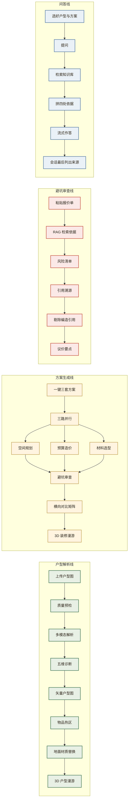

### 5.2 六个专业 Agent

| 编号 | 名称 | 职责 | 关键设计 |
|---|---|---|---|
| **A-01** | 户型解析 | 一张户型图 → 结构化 JSON（房间/墙体/门窗/尺寸/朝向） | 质量预检前置（零 Token）+ 能力匹配降级 + 质量闸门 |
| **A-02** | 户型诊断 | 采光 / 通风 / 动线 / 面积利用率 / 绿色环保 五维评分 | **数据不足时标"数据不足"，不渲染成 0 分** |
| **A-03** | 空间规划 | 功能分区 / 动线优化 / 收纳设计 | 幻觉房间由代码剔除 |
| **A-04** | 预算造价 | 分项预算（≥7 项）+ 总价区间 | **规则引擎算钱，LLM 只管文字**（ADR-07） |
| **A-05** | 材料选型 | 主材辅材选型，全友自有产品优先 | 模型只指认候选，**价格由代码回填** |
| **A-06** | 避坑审查 | 站业主立场质疑报价单/预算，引用知识库来源 | 8 类风险**逐类扫一遍**；编造引用被代码剔除 |

### 5.3 功能清单

| # | 功能 | 说明 | 状态 |
|---|---|---|---|
| 1 | 三角色登录与权限 | admin / designer / user，菜单与接口双重按角色显隐 | ✅ |
| 2 | 额度限流 | 普通用户超额度拒绝，设计师/管理员豁免；**付费 ≠ 无限** | ✅ |
| 3 | 图片质量预检 | 不合格图片在进入模型**之前**被拒，Token 消耗为 0 | ✅ |
| 4 | 户型图多模态解析 | 输出房间、墙体、门窗、尺寸、朝向的结构化 JSON | ✅ |
| 5 | 五维户型诊断 | 采光/通风/动线/利用率/环保，带置信度与数据缺口 | ✅ |
| 6 | **屋主户型详情与重诊断** | 层高/朝向/采光面/通风路径/承重墙/收纳/设备这些图上读不出来的，由屋主补一份**文字**资料；诊断以它为准，补完可**重新诊断**（与「上传平面图」是两个分得清的入口） | ✅ |
| 7 | 三套方案并行生成 | 风格 × 档位自由配对，三路并行生成 | ✅ |
| 8 | 空间规划 | 功能分区、动线优化、收纳设计 | ✅ |
| 9 | 预算造价 | ≥7 个分项 + 总价区间，纯规则引擎计算 | ✅ |
| 10 | 材料选型与价格回填 | 候选由模型指认，价格由目录回填，含竞品对照 | ✅ |
| 11 | 避坑审查（报价单） | ≥5 类风险 + 召回率可算（带标注样本两次复测 8 类 / 召回 93%–100%） | ✅ |
| 12 | 避坑审查（方案自审） | 三套方案各审一次，结论可溯源 | ✅ |
| 13 | 横向对比矩阵 | 三套方案的字段级差异对比，高亮与基准不同的值 | ✅ |
| 14 | 矢量户型图 | 后端按真实几何重画房间/墙体/门窗，SVG 交付 | ✅ |
| 15 | 物品热区交互 | 悬停显示品目、参考价、购买链接；标出精确度等级 | ✅ |
| 16 | **地面材质替换** | 点一块地面 → 换材料 → 图上换色 + 该房间造价区间 | ✅ |
| 17 | 3D 户型漫游 | 第一人称贴地行走（含碰撞）与自由视角俯瞰 | ✅ |
| 18 | 3D 装修漫游 | 选定方案后进入，同一份户型几何 + 该方案的家具 | ✅ |
| 19 | 绿色环保评估 | 环保评分 + 甲醛/TVOC 风险档（**绝不输出浓度**） | ✅ |
| 20 | 自由选项组合 | 风格/档位/业主需求/材料偏好（排除品类、排除品牌、偏好品牌） | ✅ |
| 21 | **智友问答** | 对话式 RAG：依据四处（知识库/本户型/屋主详情/选定方案）逐项判断，缺哪处说哪处；回答流式；引用清单在会话最后、**由代码取** | ✅ |
| 22 | 知识库管理 | 文档清单、语料入库、RAG 链路说明（仅管理员） | ✅ |
| 23 | 数据分析 | 各阶段 P50/P95、按 Agent 分的耗时与 Token | ✅ |
| 24 | 账号与额度管理 | 角色、档位、启停（仅管理员） | ✅ |
| 25 | 个人中心 | 我的账号/套餐/额度/权限/登录设备（全角色） | ✅ |
| 26 | 任务中断 | 取消权归**用户本人**，确认框提前写明额度不退 | ✅ |
| 27 | 语义化进度 | 阶段文案 + ETA 分档，**不采用时间驱动插值** | ✅ |
| 28 | 全链路 trace_id | API → Agent → LLM → MCP 工具 四层贯通 | ✅ |
| 29 | 审计日志 | 结构化事件，JSON 文件 + 数据库双写，含 `degraded` | ✅ |
| 30 | MCP 工具服务 | 三个 Server：解析 / 算预算 / 渲染矢量图 | ✅ |

### 5.4 三条贯穿全系统的纪律

功能之外，有三条横切所有模块的工程约定，它们定义了"企业级"与"玩具"的分界：

1. **业务失败一律 `HTTP 200 + code != 0`。** 用 4xx 表达"数据不支撑该操作"，
   会被前端 axios 拦截器当成服务错误弹通用报错，而用户需要看到的是**可操作的提示**。
2. **降级三处可见**（API / 审计 / 界面），见 3.2。
3. **拒绝必须说明缺什么以及如何修复**，见 3.3。

### 5.5 验收后新增的两个模块

**智友问答**（侧栏位置：方案生成 → **智友问答** → 知识库管理）。一句话说，就是：
业主用自然语言问，系统给出**能说出出处的**回答。依据来自四处 —— ① 知识库检索到的装修/报价/规范片段、
② 当前户型的解析结果（房间/墙体/门窗/面积，含诊断）、③ 屋主补的户型详情、④ 用户选定的那套装修方案。
**这四处的可用性是逐项判断的，不是"有就用、没有就算了"**：缺哪一处就在提示词里明说"这次没有该资料"，
并要求模型不要据此推测 —— 静默留个空段落的话，模型会自由发挥，而那正是本项目一路在防的事。
回答走 **SSE 流式**（首块实测 3.7s，等模型时先显示"正在检索知识库…"），
**引用清单放在会话最后**：正文由模型写，但"这次到底用了哪几份文档"**由代码从检索结果取** ——
模型爱提哪条都行，编一个不存在的文件名也进不了那份清单。
**边界**：它**只答疑，不改数据** —— 换材质、生成方案、重新诊断各自有各自的地方，问答不代劳。

**屋主户型详情**（属于户型解析模块的延伸，见 §11.2.1；**不是一个独立菜单项**）。
平面图是**二维**的 —— 层高、朝向、采光面、通风路径、承重墙、收纳尺寸、设备这些它一个都没有，
而五维诊断全都要用，这就是诊断长期写"数据不足、置信度下调"的原因。屋主补一份**文字**资料就补齐了，
而且这份说法比从图上推断更权威（承重墙尤其：平面图解析一律是 `unknown`，
而**拆改安全不能按"没识别出来"处理**）。
⚠️ **它与「上传平面图」是两个不同的入口，文案上必须一眼分得清** —— 一个收图、一个收字，
标题、图标、说明、按钮四处都要点明这件事，否则用户会把户型图传进那一栏。
补完详情后**强制重跑一次诊断**（`POST /layout/{id}/diagnose`），它**走的是同一条 A-02 诊断链、没有演示专用旁路**
—— 分数变高是因为依据齐了，不是因为走了别的路。
演示时这三份详情与三张演示图同名配对，后端按解析出的总面积推荐最接近的一份，
但**只填进输入框、仍要用户点保存**（数据在口径上是"屋主提供的"，得由人确认一次）。

---

## 六、典型使用流程

### 6.1 主流程

主流程共九步，从登录走到"走进选定的那套方案"：

| # | 步骤 | 做什么 | 附带说明 |
|---|---|---|---|
| ① | 登录 | 选择演示账号（管理员 / 设计师 / 普通用户） | 不同档位看到的菜单与可用操作确实不同 |
| ② | 工作台总览 | 看累计统计、最近任务、系统依赖状态 | — |
| ③ | 上传户型图 | 拖放 PNG/JPG/WebP（≤20MB），可选"本地隐私模式" | **本地质量预检：不合格当场拒绝，一次模型都不调** |
| ④ | 识别总览 | 房间数 / 总面积 / 门窗 / 入户朝向 + 房间清单 + 数据缺口 | 数据缺口逐条列出，不吞掉 |
| ⑤ | 户型矢量图 | 真实几何重画的 SVG，悬停查看物品热区与价格 | 点一块地面 → 换材料 → 图上换色 + 该房间造价区间 |
| ⑥ | 3D 漫游 | 开局俯瞰格局（自由视角），按 G 下到地面行走 | — |
| ⑦ | 生成方案 | 选风格 × 档位三组、填业主需求、设材料偏好 | 三套方案并行生成，进度按阶段实时显示 |
| ⑧ | 三方案对比 | 三张方案卡 + 横向对比矩阵，选定一套 | — |
| ⑨ | 3D 装修漫游 | 走进选定的那套方案 | 同一份户型几何 + 该方案家具 |

**图 15 · 主流程时序图**

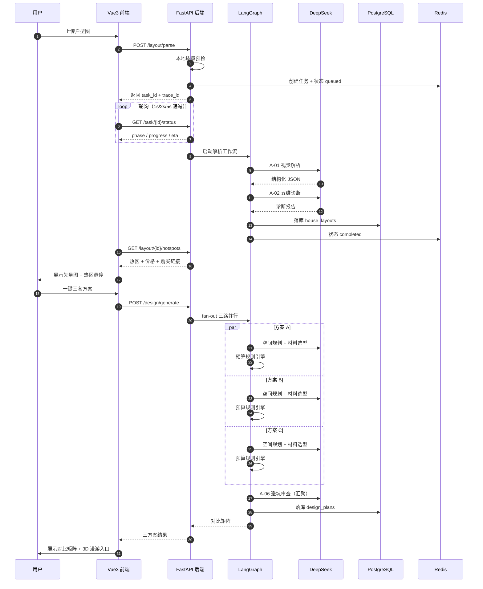

### 6.2 三条支线

**支线 A · 报价单避坑审查**（与户型无关，可独立使用）
左侧粘贴报价单或合同文本 → 提交 → 右侧给出风险清单（按严重度分级）、
每条结论的**知识库出处**、被剔除的编造引用、议价要点、数据缺口。

**支线 B · 材料价格查询**
按品类/品牌筛选 → 全友自有产品与市场对照并列展示 → 跳转电商搜索。
**页面顶部固定展示演示数据声明。**

**支线 C · 知识库与系统运维**（管理员）
查看知识库现状（按来源聚合的文档清单）→ 入库新语料 → 查看性能指标与账号额度。

### 6.3 耗时实测

一次完整的"解析 → 生成 → 审查 → 汇总"链路实测数据：

| 阶段 | 耗时 | 说明 |
|---|---|---|
| A-01 解析 | ~16s | 3 房间 / 2 窗 / 3 门 |
| A-02 诊断 | ~18s | 五维评分，部分维度标"数据不足" |
| **fan-out** | — | **9 个并发任务**（3 套方案 × 3 个产出者） |
| A-03 规划 | 22.5s | 三套并行 `[17684, 16287, 22478]ms` |
| A-04 预算 | 11.6s | **躲在 A-03 的影子里**，不增加墙钟 |
| A-05 选材 | 12.4s | 同上 |
| A-06 避坑 | 38.8s | **汇聚节点，串行，无影子可躲** |
| fan-in 汇总 | ~0s | 对比表 3/3 可用 |
| **总墙钟** | **111.3s** | |

> ⚠️ **A-06 是唯一拖慢墙钟的 Agent。** A-03/A-04/A-05 互相并行，
> 新加一个只要不慢过最慢的那个就"零成本"；但审查必须在产出之后，
> 它的 38.8s 直接加到总时间上。**这是依赖关系决定的，不是实现没优化。**

**三套方案的产出**（本轮实测，折合单价全部落在文档区间内）：

| 方案 | 档位 | 总价区间 | 折合单价 | 全友覆盖 | 避坑审查 |
|---|---|---|---|---|---|
| 现代简约 | 经济 | ¥33,100 – 46,783 | 828–1170 元/㎡ | 100% | 7 条 / 5 类 |
| 北欧 | 中档 | ¥60,155 – 79,488 | 1504–1987 元/㎡ | 100% | 5 条 / 3 类 |
| 中式 | 高端 | ¥101,962 – 139,261 | 2549–3482 元/㎡ | 100% | 6 条 / 4 类 |

---

## 七、界面设计

### 7.1 设计系统「Botanical Warmth」

界面语言取自**全友品牌调性**——自然、温润、家居感。所有设计令牌集中在
`frontend/tailwind.config.js` 一处，全项目不写魔法色值。

**色板**：

| 令牌 | 色值 | 用途 |
|---|---|---|
| `botanical` | `#4A7C59` | 主色·叶绿：主按钮、进度、热点、选中态 |
| `botanical-hover` | `#3F6D4D` | 主按钮 hover |
| `botanical-light` | `#E8F0E5` | 侧栏选中底、标签底 |
| `wood` | `#6B4F3A` | 栗棕：品牌与次要强调 |
| `wood-dark` | `#2C2418` | 正文与标题（**不是纯黑**） |
| `wood-muted` | `#7A6E5E` | 次级文字 |
| `warm-bg` | `#FAF8F3` | 蛋壳色画布 |
| `warm-sidebar` | `#F5F2EC` | 亚麻色：侧栏与卡片内嵌条 |
| `warm-border` | `#EDE8E0` | 边框 |
| `accent-gold` | `#C9A961` | 点缀·黄铜 |
| `accent-red` | `#C85A48` | 点缀·警示 |

**三条硬约束**：禁止纯黑、禁止霓虹渐变、禁止科技感冷灰；只做浅色阳光模式。
用暖棕代替黑色是有意的 —— 纯黑在居家语境里是"屏幕"的质感，不是"家"的质感。

**排版**：标题用衬线体（`Newsreader` / `Noto Serif SC`），正文用无衬线（`Manrope` / `Noto Sans SC`），
**所有数字用等宽体 + `tabular-nums`**（`.num` 类）—— 价格、面积、耗时在表格里要对齐。

**圆角与阴影**：`rounded-2xl` 卡片 + 极淡暖色阴影（`rgba(44,36,24,.04~.10)`）。
推荐方案卡用**叶绿专属阴影** `rgba(74,124,89,.12)`，与其他卡片拉开层级。

**缓动**：统一 `cubic-bezier(0.16, 1, 0.3, 1)`（先快后缓，收尾不生硬）。

### 7.2 模块化背景纹理

八个主模块**各有不同的背景纹理，但同属一个家族** —— 只用叶绿、栗棕、黄铜三个色相，
且 `background-attachment: fixed`：

| 模块 | 纹理 | 意象 |
|---|---|---|
| 工作台 | `.surface-glow` | 左上叶绿 + 右下黄铜两团柔光 |
| 户型解析 | `.surface-grid` | 22px 方格（坐标纸） |
| 方案生成 | `.surface-dots` | 16px 圆点阵 |
| 避坑审查 | `.surface-diagonal` | 135° 斜纹 |
| 知识库 | `.surface-arcs` | 同心弧 |
| 数据分析 | `.surface-grid-fine` | 46px 细网格 |
| 材料价格 | `.surface-wash` | 两道斜向色带 |
| 账号管理 | `.surface-cross` | 极淡十字交叉（纹样最少） |

纹理的密度按模块的"严肃度"递减 —— 工作台最轻柔，账号管理最克制。
它们的存在是为了让用户**切页时能感到"换了一个地方"**，而不是为了装饰。

### 7.3 页面地图

共 **19 条路由 / 18 个页面**，按三个角色分级可见：

| 路由 | 页面 | 回答什么问题 | 可见角色 |
|---|---|---|---|
| `/login` | 登录 | 我是谁、我能做什么 | 公开 |
| `/` | 工作台总览 | 我在哪、系统好不好、我最近做了什么 | 全部 |
| `/parse` | 上传解析 | 交一张户型图，出没出结果 | 全部 |
| `/parse/overview` | 识别总览 | 识别出了什么 | 全部 |
| `/parse/drawing` | 户型矢量图 | 长什么样、这块地面换成什么 | 全部 |
| `/parse/walkthrough` | 3D 户型漫游 | 这间房子（空房）长什么样 | 全部 |
| `/parse/diagnosis` | 户型诊断 | 这套户型好不好 | 全部 |
| `/generate` | 生成参数 | 要生成什么 | 会员 |
| `/generate/plans` | 三方案对比 | 三套各是什么、差在哪、我要哪套 | 会员 |
| `/generate/walkthrough` | 3D 装修漫游 | 选定那套走进去什么样 | 会员 |
| `/review` | 报价单避坑审查 | 这份报价哪里有坑、能不能溯源 | 会员 |
| `/materials` | 材料价格查询 | 这个材料多少钱、全友有没有 | 全部 |
| `/knowledge` | 知识库管理 | 这套 RAG 现在有什么语料、怎么加 | **仅管理员** |
| `/analytics` | 数据分析 | 系统跑得多快、哪里慢 | **管理员 / 设计师** |
| `/admin/users` | 账号管理 | 别人是什么角色、能不能用 | **仅管理员** |
| `/me` | 个人中心 | 我自己的账号/套餐/额度/权限 | 全部 |

**两条关于信息架构的说明**：

- `/parse` 与 `/generate` 拆成子页的判据是 **"这一页能不能独立回答一个问题"**，
  不是为了做子目录而做子目录。平铺一页会超过 3000px 高。
- 功能性前提：生成要跑 90 秒以上，而轮询是"谁卸载谁停"，所以**轮询由父路由组件持有**，
  切子页不中断；表单状态也放在会话里，切页不丢。

### 7.4 交互细节

以下几处是**刻意的设计决定**，不是随手写的：

| 位置 | 设计 | 为什么 |
|---|---|---|
| 降级提示条 | **不给关闭按钮、不可折叠** | 静默降级 = 欺骗用户 |
| 进度条 | 粗粒度阶段 + **独立的 ETA 文字行** | **不采用时间驱动的插值** —— 一个会自己爬但与实际脱节的进度条，正是本项目最忌讳的「看起来合理的错误」。ETA 分 3 档不精确到秒；实际超出时文案必须改口，**绝不停在 99%** |
| 会员门控 | 入口**在**、置灰、原因在旁、下一跳可点 | 藏起来用户不知道有这个功能 |
| 方案卡中间位 | `featured` 是**产品位，不是系统推荐** | 系统的推荐要说得出依据，说不出的位置就不该假装有 |
| 风险等级 `unknown` | 必须与 `low` **长得不一样** | 不知道和知道"没问题"是两回事 |
| 诊断维度"数据不足" | 不渲染成 0 分 | 0 分是"很差"，而"没测到"不是 |
| 全友品牌标签 | 材料偏好里全友**锁定不可排除** | 排除全友会让 AC-18 的覆盖率指标变成空话 |
| `.chip-toggle-locked` | 降不透明度 + 悬停不变色，**刻意不加删除线** | 删除线读起来像"这个坏了" |
| 中断按钮 | 确认框**提前写明额度不退** | 额度在建任务之前就已消耗 |
| 画不准的热区 | 界面上**明说**哪里画不准 | 宁可标注精度，也不假装精确 |
| 参考实景图 | 明确标注「非本方案渲染图」 | 用一张无关的好看图充当方案效果是虚假陈述 |
| 「快速前往」按钮 | 按当前模式判定可点性 | 自由视角是穿墙的，每间房都到得了 —— 一律置灰是错的 |

### 7.5 三条界面纪律

1. **不用界面说谎。** 没有的功能不放按钮；有的功能不藏起来；数字单位必须说对
   （本项目曾把 13.21㎡ 地面的**总价**标成"元/㎡"，是在截图里发现的 —— 一个把总额
   标成单价的界面在说谎）。
2. **降级要看得见。** 见 3.2。
3. **权限以前端藏菜单为辅、以后端拦截为主。** 菜单按角色过滤由 `config/nav.ts` 与
   路由 `meta.roles` **两处**驱动，且有契约测试盯着两者一致；
   但真正的判据在后端 `api/deps.py` —— **藏菜单不是防线**。

---

## 八、展示效果

### 8.1 端到端实测

一次完整链路的真实产出（`scripts/e2e_smoke.py`，逐条断言真实产物，不是"没报错就算过"）：

```
A-01 解析       ~16s    3 房间 / 2 窗 / 3 门
A-02 诊断       ~18s    五维评分，部分维度标记「数据不足」
  ↓ fan-out：9 个并发任务
A-03 规划      22.5s   [17684, 16287, 22478]ms   3 套方案
A-04 预算      11.6s   [11556,  9504,  8778]ms   3 份预算（规则引擎）
A-05 选材      12.4s   [ 8339, 12405,  8407]ms   3 份选材（代码回填价格）
  ↓ 汇聚
A-06 避坑      38.8s   1 次审查 × 3 套方案
fan-in          ~0s    对比表 3/3 可用
总墙钟         111.3s
```

**验收清单结果：23/23。**

避坑审查在**带标注的样本报价单**上的表现（`scripts/review_sample_quote.py`）：
样本里埋了 14 条已知问题并附答案，判据是 `match_keywords`，**可审计**。

⚠️ **这条指标跑在真实模型调用上，逐次有波动 —— 所以记的是两次复测，不是一个精确值。**
2026-09-26 连跑两次：

```
第一次   召回：13/14 = 93%    未对应到埋点的风险项：1 条   引用：11 条里 9 条带依据
第二次   召回：14/14 = 100%   未对应到埋点的风险项：1 条   引用：13 条里 9 条带依据

两次共同点：命中类型 8 类，8 类全部命中
            ['单价异常','合同条款风险','增项风险','模糊计量',
             '漏项','环保风险','营销话术','计价陷阱']
```

> **"未对应到埋点的风险项"为什么不叫"误报"**：脚本没法区分"模型报了答案里没有的"
> 与"答案本身不全"。它如实写成「可能是合理补充，也可能是误报」，**不替人下结论**。
> （两次各命中 1 条，内容不同：一次是「全篇以实际工程量结算为准」，一次是「乳胶漆未标环保等级」。）

### 8.2 3D 场景

3D 漫游由真实几何驱动 —— 墙体、门窗、碰撞、房间连通图全部来自
`GET /layout/{id}/walkable`，家具坐标由 `GET /layout/{id}/furniture` 按规则算出。
**前端不做第二次建模**，两个接口返回的是同一套场景坐标系。

**表面配色是搜出来的，不是调出来的。** 3D 场景里六个材质角色
（木/布艺/金属/石材/绿植/白）的颜色要同时满足两条约束：

1. 每个角色对地面 **≥ 2:1** 对比度（能从地面里分出家具）
2. 角色**两两之间** Lab ΔE ≥ 6.6（彼此分得出）

手工调了七轮，约束全过、画面一团黑 —— 六个角色里三个接近纯黑、一个接近纯白。
根因是**手工调参没有目标函数**。改为约束下的搜索之后（`scripts/derive_surface_palette.py`），
搜索过程还撞出三件事：原调色板擦着约束线过、两个中性色在现行地面下**数学上不可能**
拉开 6.6（这条是算出来的）、以及搜索引擎一定会用掉约束留下的余量
（石面被搜成淡绿白两次，最后把饱和度上限卡到 0.02 才真正中性）。

最终效果（现代简约风）：木 `#784729`、绿 `#2A5D3E`、金属 `#625858`、
布艺 `#D2CAB3`、石面 `#C6C6C8`、白 `#DCDDDA`。俯瞰时家具读得出材质，
不再是地上的黑洞。

### 8.3 界面截图索引

演示与评审时可现场复现的截图（存于 `logs/`，均为真实运行截图）：

| 文件 | 内容 |
|---|---|
| `u1-form-filled.png` / `u2-uploaded.png` | 上传解析页：填好的表单与上传后状态 |
| `f1-before.png` / `f2-after.png` | **地面材质替换前后对照** |
| `d1-walk-eye.png` | 3D 第一人称行走（贴地、有碰撞） |
| `p1-eye-level.png` / `p2-fly-topdown.png` | 自由视角开局：俯瞰格局，能越过高墙看到屋内 |
| `3d-furniture.png` / `3d-surface.png` | 3D 家具摆放与材质配色 |
| `v4-generate-plans.png` | 三方案对比页 |
| `k3-dashboard.png` | 工作台总览 |
| `k1-knowledge.png` / `k2-analytics.png` | 知识库管理与数据分析（管理员） |
| `v1-parse-empty.png` / `v3-walkthrough-no-plan.png` | 空状态：说清缺的是哪一步 |

### 8.4 可复现证据

评审现场可当场执行的验证脚本：

| 脚本 | 验证什么 |
|---|---|
| `python scripts/e2e_smoke.py` | 端到端 23 条对真实产物的断言 |
| `python scripts/review_sample_quote.py` | 避坑审查的召回率（带标注样本） |
| `python scripts/replay_golden_path.py` | 黄金路径连续重放一致性 |
| `python scripts/mcp_smoke.py` | MCP 三个工具走真实 stdio 协议 |
| `python -m pytest` | 全量自动化测试 **1191 通过、0 跳过**（约 2 分钟，全程不联网） |

**测试的一条硬约束**：`conftest.py` 里有网络绊线，**禁止测试打真实 API**。
测试必须能在断网环境下全绿。

---

# 卷二 · 系统设计

## 九、系统架构设计

### 9.1 整体架构

四层：接入层 / 服务层 / 数据层 / 模型层。**每一层都可单独替换** ——
换掉模型层不影响数据层，换掉向量库不影响业务路由。

**图 2 · 整体系统架构**

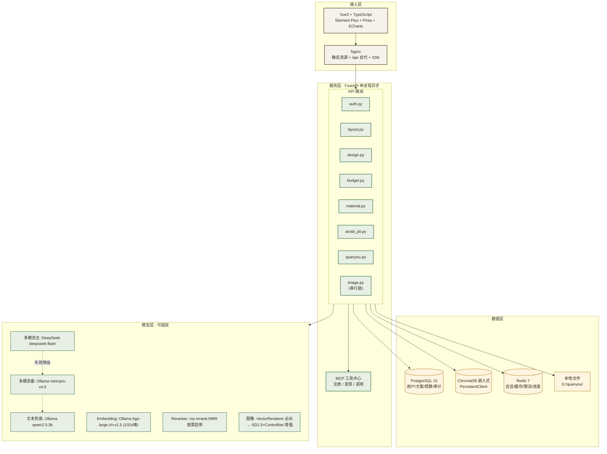

数据层各项的落地形态（与原图相比有两处已改）：ChromaDB 是**进程内**
`PersistentClient` 而非容器；本地文件走 E 盘，不进容器卷。
模型层的 `[未启用] 阿里云 Qwen3-VL` 不在图中 —— 无 key，画进去就是画一个不存在的链路。

### 9.2 Docker Compose 拓扑（4 容器，非 6）

**「6 服务全部 Healthy」在 7.63GB 的 Docker VM 上限下不可行。现精简为 4 容器。**

**图 3 · Docker Compose 拓扑**

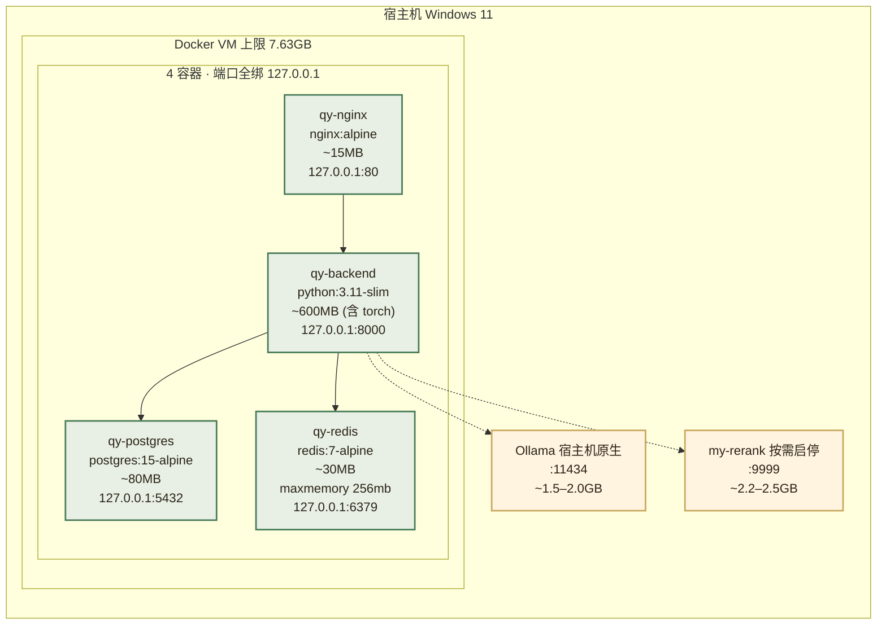

| # | 容器 | 镜像（**本地已存在**） | 内存预算 | 端口绑定 |
|---|---|---|---|---|
| 1 | `qy-postgres` | `postgres:15-alpine` | ~80 MB | **`127.0.0.1:5432:5432`** |
| 2 | `qy-redis` | `redis:7-alpine` | ~30 MB | **`127.0.0.1:6379:6379`**，`maxmemory 256mb` |
| 3 | `qy-backend` | 基于 `python:3.11-slim` 构建 | ~600 MB | **`127.0.0.1:8000:8000`**（含 torch，故偏大） |
| 4 | `qy-nginx` | `nginx:alpine` | ~15 MB | **`127.0.0.1:80:80`** |

> ⚠️ **端口一律绑回环地址，不用 `0.0.0.0`。** 本项目存用户上传的户型图，
> 而 `ports: ["5432:5432"]`（教程里的常见写法）会把数据库暴露给整个局域网。
> 理由详见第十章 10.6，验收项 AC-37。
| | **Docker 小计** | | **≈ 725 MB** | |
| 5 | Ollama | **宿主机原生（已在跑）** | ~1.5–2.0 GB | 不计入 Docker VM |
| 6 | my-rerank | **宿主机按需启停** | ~2.2–2.5 GB | 不计入 Docker VM，**用完即停** |
| | **系统总占用峰值** | | **≈ 5.5 GB** | 7.63GB VM + 宿主余量，**留出约 2GB 安全垫** |

**不在 Docker 里跑的组件（从最初的 6 服务中砍掉的）**：

- **ChromaDB** → 改为进程内 `chromadb.PersistentClient(path="E:/quanyou/data/chroma")`。省一个容器，省约 200MB，且省掉一次 HTTP 往返。
- **前端构建** → 在 CI/本地构建成静态产物，由 nginx 容器直接托管，不单独跑 node 容器。
- **Reranker** → 不新增容器，复用已部署的 `my-rerank`（即 bge-reranker-v2-m3），通过环境变量 `RERANK_URL` 开启/关闭。

**M0 前置动作**：`docker rm` 清理本机 40+ 历史容器后再启动，否则 7.63GB 预算无法保障。

### 9.3 LangGraph 状态图

**架构不变，补充降级与超时节点。**

**图 4 · LangGraph 全状态图**

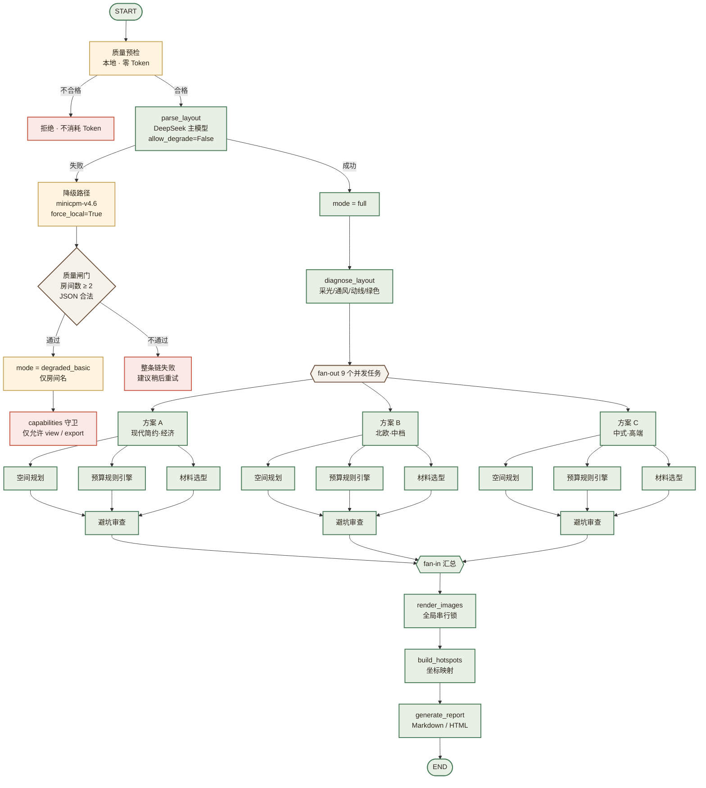

\* **预算 Agent 为规则引擎节点**，不调用 LLM 生成数字。

**关键设计说明**：

- **并行 fan-out**：3 套方案同时启动，每套内部 4 Agent 并行。总耗时 = max(分支耗时)，而非 sum。
- **fan-in 汇总**：所有分支完成后统一收集，生成对比表。
- **超时熔断**：单 Agent 超 30s 自动跳过并标记，主流程不卡死。
- **条件路由**：根据预算档位跳过不适用的 Agent（如经济档跳过高端材料推荐）。
- **Redis checkpointer**：每节点状态写 Redis，支持中断恢复。
- **图像节点串行**：`render_images` 受全局锁保护，且位于 fan-in **之后**（不在并行分支内），避免 3 路并发打爆显存。**这是相对初版设计的关键结构调整。**

### 9.4 技术栈选型（按本机实测校准）

| 技术领域 | 选型方案 | 选型依据 | 说明 |
|---|---|---|---|
| 后端运行时 | **Python 3.11.15（conda env `pytorch`）** | 本机唯一带可用 CUDA torch 的环境 | 🔴 **3.13 → 3.11** |
| 后端框架 | FastAPI + Uvicorn | 异步高性能，自动 OpenAPI 文档 | — |
| 前端框架 | Vue3 + TypeScript + Element Plus | 企业级组件生态 | — |
| 状态管理 | Pinia | TS 类型推导好 | — |
| Agent 编排 | LangGraph 1.2.11 | 状态图工作流，原生 fan-out/fan-in | 已装 |
| RAG 框架 | LangChain 1.3.17 | 文档加载、检索链、Prompt 模板 | 已装，注意与 0.x API 差异 |
| 工具协议 | MCP SDK (Python) | 标准化工具注册/发现/调用 | — |
| 关系数据库 | PostgreSQL 15 | 强一致数据；镜像本地已有 | — |
| 向量数据库 | **ChromaDB 1.5.9（嵌入式）** | 轻量，省一个容器 | 🔴 **独立容器 → 嵌入式** |
| 缓存 | Redis 7 | 会话/缓存/限流/进度 | 镜像本地已有 |
| 多模态 LLM | **DeepSeek `deepseek-flash`（主）→ Ollama `minicpm-v4.6`（备）** | 唯一可用 key + 本地视觉兜底 | 🔴 **主备对调** |
| 文本 LLM | DeepSeek `deepseek-flash` / `deepseek-v4-pro` → Ollama `qwen2.5:3b` | 可插拔 | — |
| Embedding | **Ollama `bge-large-zh-v1.5`（1024 维）** | 本地已就绪，已验证 | 🟡 **改为 Ollama 提供** |
| Reranker | bge-reranker-v2-m3（**复用 `my-rerank:9999`，按需启停**） | 已部署，不自建 | 🔴 **自建 → 复用** |
| 图像生成 | **VectorRenderer（Pillow）+ SD1.5 + LCM-LoRA + ControlNet(sd15)** | 实测可用 3.22GB；需按 L0–L3 分级降级（见 0.1） | 🔴 **SDXL → SD1.5** |
| 模型下载源 | `HF_ENDPOINT=https://hf-mirror.com` 或 ModelScope | **huggingface.co 直连不通** | 🔴 **新增约束** |
| 容器编排 | Docker Compose v5.5.1 | Windows 11 一键启动 | — |

---


## 十、开源项目与技术选型

> **说明**：本表早期是"看着仓库描述填的"，**没有逐条验证过**。
> 2026-09-22 用 GitHub API 逐条核实后，发现 **2 条死链、3 条内容与描述不符**。
> 下表为核实后的结果，**引用依据一律以本机实测为准，不采信未经验证的二手描述**。

### 10.1 本项目实际采纳（已核实）

| 项目 | 对应功能 | 采纳度 | 核实结果 | 链接 |
|---|---|---|---|---|
| **zhuangxiu-skills** | **避坑审查 / 报价审核 / 预算** | ✅ **主要知识库来源** | 实际 **38 个 Skill**，66 star，2026-09 仍活跃。含「装修报价审核」「装修预算计算器」「装修合同审核」「装修增项避雷」「装修方案诊断」「装修环保避坑」——**直接覆盖 AC-05 与 AC-06** | https://github.com/zx029w/zhuangxiu-skills |
| **ResPlan** | 演示户型库 / 测试集 | ✅ 演示数据来源 | **17,000 个矢量图户型**，17 star，2026-07 更新。代码库 285MB，**数据集本体在 Kaggle**（见 B.3） | https://github.com/m-agour/ResPlan |
| buildwatch-mcp | 材料价格 MCP | ✅ 接口设计参考 | 存在 | https://github.com/jeletor/buildwatch-mcp |
| house-type-decoration3D | 效果图生成 | ① 仅参考 FastAPI 接口设计与 ControlNet 集成思路 | 存在。技术栈 SDXL + YOLOv8，**本机跑不通** | https://github.com/heyangyi888-hyy/house-type-decoration3D |

### 10.2 经核实后**不采纳**（含纠正记录）

| 项目 | 清单/文档声称 | **核实结果** | 处置 |
|---|---|---|---|
| `olk/architecture-pattern-mcp` | 「40 种架构模式 MCP Server」 | ❌ **是软件架构**：README 明确写 "provides architecture design expertise to **AI coding agents**"，产出 API contracts / data models / 事件契约，评的是可维护性/可扩展性。**与住宅建筑装修毫无关系** | 🔴 **移出**。典型望文生义——见到 "architecture" 就当建筑师 |
| `SHAHID-AI-ROBOTICS/Stable-Diffusion-Setup` | 「SDXL 4GB 显存部署」 | ❌ 正文是 **AUTOMATIC1111 webui 的 README 原文**，`language: CSS`、0 star、2025-03 后未更新。其中 "4GB video card support" 是 **SD1.5 时代**的说明，**无任何 SDXL-4GB 的可复现证据** | 🔴 **移出**。曾被引为 ADR-01 依据，属引用不实 |
| `codeaudit/stable-diffusion-low-vram` | 「SD 低显存优化」 | ❌ **空壳仓库**：description=None、language=None、0 star、最后更新 **2022-09-04** | 🔴 **移出**。同样曾被引为 ADR-01 依据 |
| `soft-mcp-server` | 「软装预算 MCP」 | 预算部分已被 ADR-07（规则引擎算钱）替代 | ① 仅思路参考 |
| JCCDB | 「预算参考」 | 存在，但日本建筑成本数据，**币种/工法/地区均不匹配** | ① 仅方法论参考，**不参与数值校准** |
| Automated-Subspace-Matching | 「户型识别」 | 存在，需自行训练 | ○ 路线图 |
| `sceneview-tools/architecture-mcp` | 早期文档中列为 MCP 参考 | ❌ **404 死链** | 🔴 已从文档移除 |
| `chattylabs/resplan` | 早期文档中列为 ResPlan 地址 | ❌ **404 死链** | 🔴 正确地址为 `m-agour/ResPlan` |

> **教训记录**：ADR-01 曾把后两个空壳仓库列为"低显存优化依据"。
> ADR-01 的**结论本身没错**（本机实测 3.22GB 可用显存，SDXL 装不下），
> 但**依据引用不成立**——等于用两个不存在的来源支撑一个正确的结论。
> 这是很坏的习惯：结论对了不代表论证过程可以糊弄。
> 本版起，**本表所有条目均标注核实结果，未核实的不得列为依据**。

### 10.3 数据集与外部资源

| 资源 | 用途 | 体积/注意 |
|---|---|---|
| ResPlan Kaggle | 户型数据集（含连通图） | ⚠️ **解压后可能数十 GB**。E 盘现有 121GB，**只取子集**：M2 演示用 20 张、测试集 50 张足够 |
| ResPlan HF | 同上镜像 | 同上 |

### 10.4 不纳入本项目的类别

| 类别 | 项目 | 不纳入原因 |
|---|---|---|
| **内网穿透** | nps / frp / lanproxy | 🔴 **明确不做**。决策已定：**本项目全部演示在本地完成，不做任何公网暴露**。需求不存在，故不引入依赖、不保留备选。详见 10.6 |
| **视频生成** | LongCat-Video / SkyReels-V3 / Wan2.1 / CogVideo | 🔴 **4GB 显存一个都跑不了**（这些是 5B–14B 级模型）。且本文档 7.2 已明确「视频生成 → 路线图」。**列在此处只会制造"我可以做"的错觉** |

### 10.5 原清单「注意事项」的逐条落实

原 `开源项目链接.md` 第九节列了 4 条注意事项。逐条对照本机配置核实如下：

| 原清单注意事项 | 本机核实 | 落实为 |
|---|---|---|
| ① 不要直接 clone 大量仓库到项目里 | ✅ **github.com 直连实测 200 但耗时 9.9s**，clone 大仓库确实很慢 | 写进 7.2；参考项目只读不 clone，需要用到的设计思路手抄进本文档 |
| ② ResPlan 解压后可能数十 GB，建议只取子集 | ✅ **E 盘 121GB 可用，D 盘仅 29GB**。全量下载会吃掉可观空间 | **M2 只取 20 张演示图 + 50 张测试集**，从 Kaggle 按需取，不整包下载 |
| ③ house-type-decoration3D 的 SDXL+YOLOv8 在 4GB 跑不通，仅参考接口设计 | ✅ 与本机实测一致（3.22GB 可用显存） | 已在 2.2.5 / ADR-01 体现；采纳度标为「① 仅参考思路」 |
| ④ MCP 相关项目建议先跑通一个完整 Quickstart | ⚠️ **原清单推荐的 `olk/architecture-pattern-mcp` 与装修无关**（见 B.2） | 改为**先跑通本项目自己的 `parse_house_layout`**（已可运行，见 `mcp_servers/`），再参考 `buildwatch-mcp` 的接口设计 |

### 10.6 本地部署约束（由「全部本地演示」决策推导）

**决策：本项目全部演示在本地完成，不做任何形式的公网暴露。**

这条决策不只是"不用内网穿透"，它还**推导出一组具体的部署约束**——
这些约束现在就要写进配置，而不是等到某天发现服务在裸奔：

| 约束 | 具体做法 | 理由 |
|---|---|---|
| **端口绑定回环** | docker-compose 端口一律写 `127.0.0.1:5432:5432`，**不用 `0.0.0.0`** | 默认的 `0.0.0.0` 会把 PostgreSQL/Redis 暴露给同一 WiFi 下的任何设备 |
| **CORS 白名单** | 只允许 `http://localhost:5173`、`http://127.0.0.1:5173`、`http://localhost:80` | 不用 `allow_origins=["*"]` |
| **不引入反向代理隧道** | 无 nginx 公网入口、无 frp/nps/ngrok | 见 3.1 |
| **上传文件不落公网** | 图片存 `E:/quanyou/uploads`，仅本机文件系统 | 与 2.3.2 隐私条款一致 |
| **Docker 端口不冲突** | 启动前 `netstat` 核对 3306（本机 MySQL）、11434（Ollama）已被占用 | 见第十章 0.5 节 |

```yaml
# docker-compose.yml 片段 —— 注意 127.0.0.1 前缀
services:
  qy-postgres:
    ports: ["127.0.0.1:5432:5432"]     # ✅ 仅本机可访问
    # ports: ["5432:5432"]             # ❌ 等价于 0.0.0.0，局域网可见
  qy-redis:
    ports: ["127.0.0.1:6379:6379"]
  qy-backend:
    ports: ["127.0.0.1:8000:8000"]
  qy-nginx:
    ports: ["127.0.0.1:80:80"]
```

> **为什么值得单独写一节**：`ports: ["5432:5432"]` 是绝大多数教程的写法，
> 而它会把数据库暴露到整个局域网。本项目存的是**用户上传的户型图**（隐私数据），
> 这条一旦写错，隐私条款（2.3.2）在实现层就破了。
> 这与 ADR-12 是同一个道理：**安全约束必须在资源暴露的那一层强制，不能只写在文档里。**

---


## 十一、需求分析

### 11.1 业务需求清单（PO 级需求）

| 编号 | 需求名称 | 用户故事 | 验收标准 | 可行性 | 状态 |
|---|---|---|---|---|---|
| PO-01 | 户型图多模态解析 | 作为业主，我上传户型图后希望系统自动识别房间、墙体、门窗 | 识别房间类型、墙体、门窗位置，输出结构化 JSON | **A** | ○ |
| PO-02 | 户型诊断报告 | 希望获得采光、通风、动线、面积利用率的诊断 | 输出 ≥ 5 个维度的评分与建议 | **A** | ○ |
| PO-03 | 多套装修方案生成 | 希望一次看到 3 套不同风格和预算的方案 | 3 套方案并行生成，含风格、预算区间、材料清单 | **A** | ○ |
| PO-04 | 预算报价估算 | 希望获得分项预算明细 | 输出水电/瓦工/木工/油漆/主材/辅材/管理费分项 | **A** | ○ |
| PO-05 | 避坑审查 | 希望系统识别报价单中的增项、漏项、单价异常 | 识别 ≥ 5 类常见风险，引用知识库来源 | **A** | ○ |
| PO-06 | 效果图生成 | 希望看到装修后的效果图 | **矢量渲染图（必出）+ AI 效果图（尽力）** | **C** ⚠️ | ○ |
| PO-07 | 物品热区交互 | 鼠标悬停在效果图上的物品时看到价格和购买链接 | 悬停显示品目、参考价、电商搜索跳转链接 | **C** ⚠️ | ○ |
| PO-08 | 局部替换 | 希望替换效果图中的地板、墙纸等元素 | 框选区域 + 输入新描述 → 局部重绘 | **C** ⚠️ | ○ |
| PO-09 | 三角色权限 | 作为管理员，希望区分 admin / designer / user 三级权限 | RBAC 三级权限，菜单与 API 按角色显隐 | **A** | ○ |
| PO-10 | 知识库管理 | 作为设计师，希望上传装修规范、避坑文档到知识库 | 上传 PDF/TXT → 自动分块 → 向量化 → 可检索 | **B** | ○ |
| PO-11 | 全友产品推荐 | 希望系统优先推荐全友家居的产品 | 方案中全友产品覆盖率 ≥ 60% | **B** ⚠️ | ○ |
| PO-12 | 自由选项组合 | 希望自由搭配风格、材料、布局、预算档 | 支持多维度选项勾选，实时生成组合方案 | **A** | ○ |
| PO-13 | 绿色环保评估 | 希望了解装修方案的环保等级 | 输出环保评分，标注甲醛/TVOC 风险 | **A** | ○ |

### 11.2 功能性需求详细说明

#### 11.2.1 户型图解析模块

**输入**：JPG / PNG / PDF / 扫描件
**输出**：结构化 `HouseLayoutState` JSON + 户型诊断报告

**解析内容**：房间识别、墙体识别（承重/非承重）、门窗识别、尺寸 OCR、朝向判断——**解析内容自始至终不变。**

**技术实现（主备顺序与降级语义均经实测修正）**：

| 优先级 | 模型 | 端点 | 实测状态 |
|---|---|---|---|
| **主** | **DeepSeek `deepseek-flash`** | `https://api.deepseek.com/v1`（OpenAI 兼容，已验证读图） | ✅ 实测 6.1s / 约 1400 prompt tokens |
| **降级** | **Ollama `minicpm-v4.6`** | `http://localhost:11434/v1` | ⚠️ **仅能读房间名，不能做结构解析**（见下） |
| 文本兜底 | Ollama `qwen2.5:3b` | 同上 | ✅ 纯文本推理（诊断、报告等非视觉环节） |
| 未启用 | 阿里云 Qwen3-VL | DashScope | ❌ 无 key，保留 provider 插槽 |

##### ⚠️ 关键修正：本地兜底的能力边界一度被高估

早期设计把 minicpm-v4.6 描述为「精度下降的降级」。**实测证明这是错的 —— 它不是降级，是不可用。**

用一张**故意只有 2 个矩形、没有任何墙体粗细/窗/尺寸信息**的图做幻觉测试：

| 观察项 | 实测结果 |
|---|---|
| JSON 合法性 | ❌ 非法：`"orientation": north` 值未加引号，直接解析失败 |
| 房间 bbox | ❌ **编造且越界**：返回 `[500,0,1000,500]`，而图片只有 512×400 |
| 墙体 | ❌ 编造出 `non_load_bearing`（图中无任何墙体粗细信息） |
| 指令遵循 | ❌ 明确要求不加 markdown 围栏，仍然加了 |
| 房间名称 | ✅ 能读对（"Living room"、"Bedroom"） |

**这条结论直接改变了架构**：如果让 minicpm 拿着完整 Schema 硬上，用户在 DeepSeek 断服时
会拿到一坨**看起来像结果、连 JSON 都解析不了、坐标还越界**的编造数据。
这比"解析失败"危险得多——用户会基于错误的结构信息继续做决策。

##### 降级链设计：能力匹配 + 质量闸门

**图 5 · 户型解析降级链**

```mermaid
flowchart TB
    IMG[用户上传户型图] --> PRE{本地质量预检<br/>分辨率/模糊/长宽比/大小}
    PRE -->|不合格| R1[拒绝 · 0 Token<br/>建议重新上传]
    PRE -->|合格| MAIN[DeepSeek deepseek-flash<br/>全量 LayoutSchema<br/>allow_degrade=False]

    MAIN -->|成功 6.1s| OK[mode = full<br/>房间/墙/门/窗/尺寸/朝向]
    MAIN -->|超时/429/5xx| LOCAL[minicpm-v4.6<br/>force_local=True]

    LOCAL --> Q{质量闸门<br/>房间数 ≥ 2 且 JSON 合法}
    Q -->|通过| DM[mode = degraded_basic<br/>rooms[].name 真实<br/>其余字段留空]
    Q -->|不通过| FAIL[整条链失败]

    OK --> CAPA[capabilities 报告<br/>全部操作 allowed]
    DM --> CAPB[capabilities 报告<br/>仅 view/export allowed]
    FAIL --> REJ2[建议用户稍后重试]

    classDef okN fill:#E8F0E5,stroke:#4A7C59,stroke-width:2px,color:#2C2418
    classDef warnN fill:#FFF4E0,stroke:#C9A961,stroke-width:2px,color:#2C2418
    classDef failN fill:#FBE9E7,stroke:#C85A48,stroke-width:2px,color:#2C2418
    classDef gateN fill:#F5F2EC,stroke:#6B4F3A,stroke-width:2px,color:#2C2418

    class IMG,MAIN,OK,CAPA okN
    class LOCAL,DM,CAPB warnN
    class R1,FAIL,REJ2 failN
    class PRE,Q gateN
```

**两条硬约束（均有测试覆盖）**：

1. **全量解析禁止自动降级**（`allow_degrade=False`）——宁可显式失败，也不让弱模型硬编结构。
2. **降级路径强制本地**（`force_local=True`）——降级路径按定义就是本地路径，
   必须在**提供方选择层**强制，不能只在业务层"表示一下"（见修订说明第 14 条的真实教训）。

**降级结果的字段约束（`mode = "degraded_basic"`）**：

| 字段 | 取值 | 说明 |
|---|---|---|
| `rooms[].name` | 模型读到的名称 | 唯一由模型产生的内容 |
| `rooms[].type` | 固定 `"other"` | **不由模型推断** |
| `rooms[].area` / `bbox` | 固定 `0.0` / `[]` | **不由模型推断** |
| `walls` / `doors` / `windows` / `dimensions` | 固定空数组 | **严禁模型填任何值** |
| `total_area` | 固定 `0.0` | — |
| `confidence` | 由模型给出 | 通常 0.3–0.5，偏低是诚实的 |
| `safety_notice` | 「**无法判断承重墙**，拆改前必须现场复核」 | 强制非空 |

**前端呈现要求（低置信度遮罩）**：
`mode = "degraded_basic"` 时，结果区必须叠加半透明水印 + 「需人工复核」标签，
**不得与完整解析结果以相同的视觉权重呈现**。

##### ⚠️ 降级模式的业务连续性边界（本项目最重要的一处补充）

**早先只定义了降级结果长什么样，却没定义它能用来干什么。这是一个数据完整性缺口。**

下游的 `calc_budget`、空间规划、户型诊断**全部依赖面积与墙体数据**。
若放任降级结果流入，会发生：

```
calc_budget(area=0, grade="economy")  →  {"total": 0, "breakdown": {...全 0...}}
```

**它不报错。它返回 HTTP 200。它是一个 ¥0 的装修预算，而用户会当真。**

这与 ADR-07 是同一类问题：**凡是会产出"看起来合理的错误数字"的路径，都必须在入口堵死。**

**解决方案：`backend/app/core/capabilities.py` 业务连续性守卫**

守卫在**数据层**判断（不是看 `mode` 字符串），依据字段里到底有没有可用数据：

| 操作 | 数据前置条件 | `degraded_basic` 下 |
|---|---|---|
| `view_rooms` 查看房间列表 | 无 | ✅ **允许** |
| `export_room_list` 导出房间名清单 | 无 | ✅ **允许** |
| `diagnose` 户型诊断 | 房间 + 门窗 + 面积 | ❌ 缺：门窗位置、房间面积 |
| `generate_plan` 方案生成 | 房间 + 面积 + 墙体 | ❌ 缺：房间面积、墙体信息 |
| `estimate_budget` 预算估算 | 套内总面积 | ❌ 缺：套内总面积 |
| `generate_image` 效果图生成 | 房间 bbox | ❌ 缺：房间在图中位置 |
| `generate_hotspots` 物品热区 | 房间 bbox | ❌ 缺：房间在图中位置 |
| `edit_layout` 局部替换 | 房间 bbox + 面积 | ❌ 缺：房间在图中位置、房间面积 |

**图 6 · 业务连续性守卫**

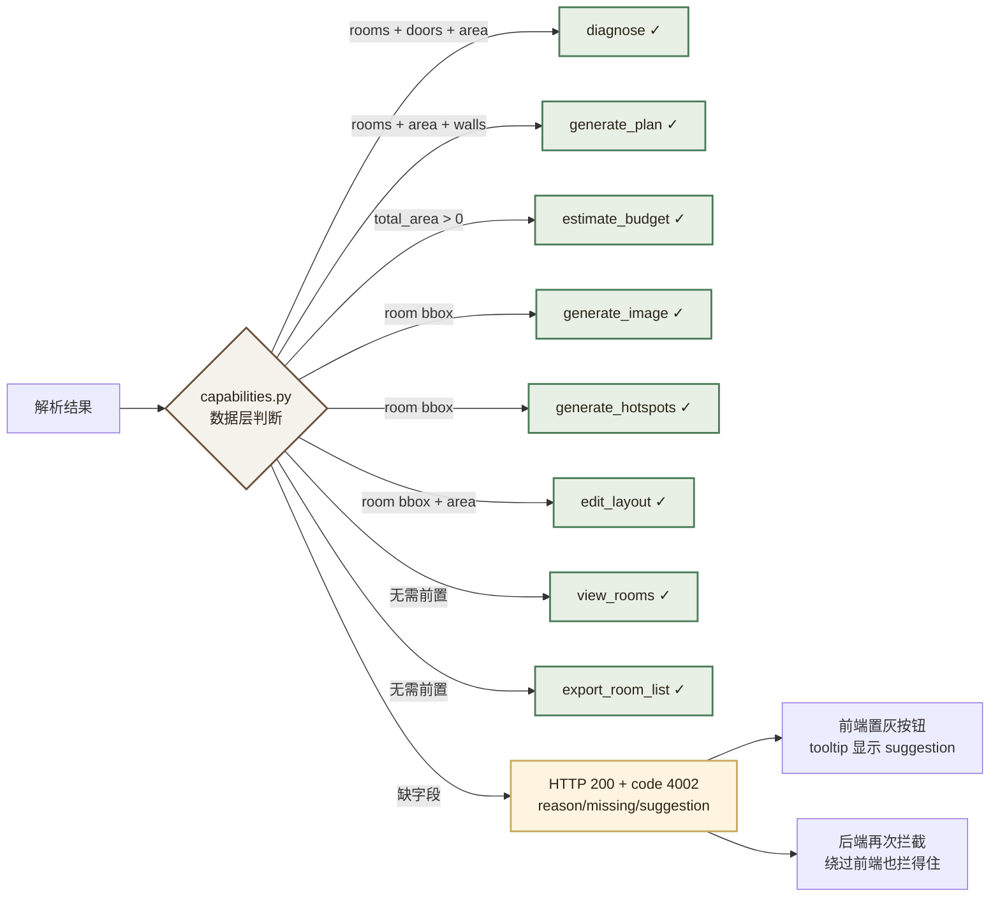

**三条实现约束**：

1. **前后端双重拦截**。前端置灰是体验，**后端必须返回 400 并附 `reason` / `missing` / `suggestion`**。
   只有前端拦截等于没有拦截——直接调 API 就绕过去了。
2. **数据驱动而非模式驱动**。判据是字段内容，不是 `mode` 字符串。
   这样即使某天完整模式也返回空面积（模型没估出来），守卫依然生效。
3. **拒绝时必须说清缺什么、怎么办**，不能只说"不允许"。
   `total_area` 为 0 但房间面积齐全时，会**回退到求和**——这是合理推导，不是编造。

**能力报告随解析结果一起返回**（见 12.2），前端不需要自己推断"现在能做什么"，后端直接告诉它。

> **这不是限制用户，是诚实地告诉用户当前能做什么。**
> UI 上明确显示「当前为降级模式，建议重新上传以获取完整解析」，
> 比让用户自己撞墙、或者更糟——拿到一个 ¥0 的预算——要好得多。

> **关键设计**：`degraded` 标志必须回传到 API、审计日志、前端 UI 三处。**静默降级 = 欺骗用户**，这是 AC-17 的核心。

##### 户型图质量预检

在调用任何 LLM 之前先做本地预检，**快速失败好过慢速幻觉**，同时省 Token：

```python
def precheck_layout_image(img) -> PrecheckResult:
    """
    纯本地检查，零 Token 消耗。不通过则直接拒绝，不进 LLM。
    注意：不引入 opencv 依赖（本机未安装），用 Pillow 实现模糊度估计。
    """
    return PrecheckResult(
        resolution_ok = min(img.size) >= 256,      # < 256 直接拒绝
        resolution_warn = min(img.size) < 512,     # < 512 仅告警，不阻断
        blur_score = laplacian_variance(img),      # 用 Pillow 近似，阈值 < 100 判为偏模糊
        aspect_ratio_ok = 0.3 <= w/h <= 3.0,       # 极端长宽比通常不是户型图
        file_size_ok = size_bytes <= 10 * 1024**2,
    )
```

| 预检结果 | 处理 |
|---|---|
| 硬性不合格（分辨率 < 256 / 文件 > 10MB / 长宽比异常） | **拒绝**，提示"图片质量不足，建议重新拍摄或上传"，**不消耗 Token** |
| 软性告警（分辨率 256–512 / 偏模糊） | 放行，但把警告写入结果 `warnings`，并降低期望置信度 |
| 全部通过 | 正常解析 |

> **为什么不直接阻断低分辨率**：实测 320×240 的示意图也能被正确解析出房间。
> 硬性门槛设太严会误杀可用输入，因此只对"明显不可用"的输入快速失败。

**参考项目**：`heyangyi888-hyy/house-type-decoration3D`

#### 11.2.2 多 Agent 并行方案生成模块 【可行性 A】

**架构**：LangGraph 状态机，fan-out / fan-in 模式。**架构设计保持不变，仅执行细节调整。**

**图 7 · 多 Agent 并行方案生成**

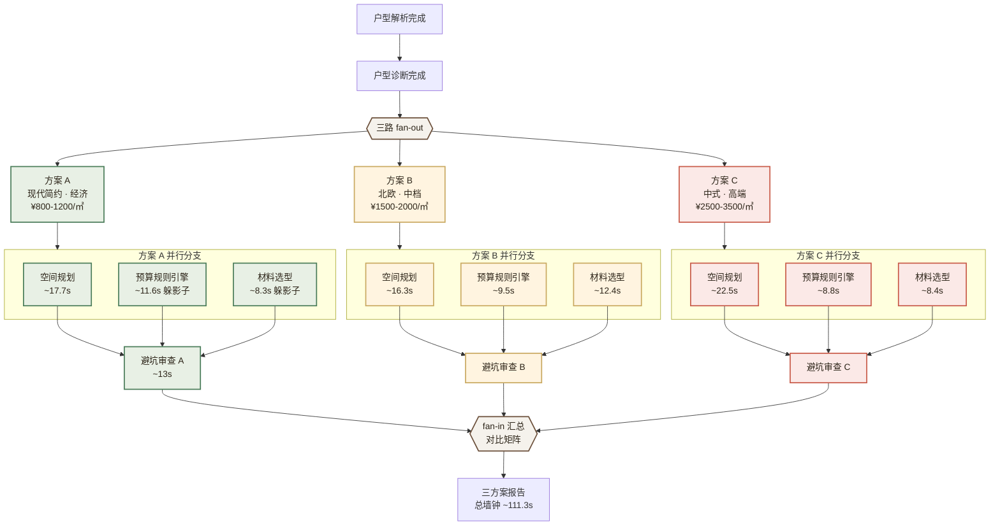

户型解析完成后，fan-out 到 **3 条并行分支**：

| 方案 | 风格 | 预算档 | 适用人群 |
|---|---|---|---|
| 方案 A | 现代简约 | 经济（¥800-1200/㎡） | 首次置业、预算敏感 |
| 方案 B | 北欧/奶油风 | 中档（¥1500-2000/㎡） | 年轻家庭、品质追求 |
| 方案 C | 现代中式/侘寂 | 高端（¥2500-3500/㎡） | 改善型需求、品质优先 |

每条分支内部再 fan-out 到 4 个专业 Agent 并行：

| Agent | 职责 | 技术实现 | 可行性 |
|---|---|---|---|
| 空间规划 Agent | 动线优化、功能分区、收纳设计 | LangGraph 节点 + LLM | A |
| 预算造价 Agent | 按面积、项目、工艺估算 | **Python 规则引擎 + 价格表**（LLM 仅做文字包装） | A |
| 材料选型 Agent | 主材辅材推荐、品牌替代 | RAG + 全友产品知识库 | B |
| 避坑审查 Agent | 站在业主立场质疑报价，找增项/漏项/隐性收费 | 对抗式 Agent + 避坑知识库 | A |

> **关键设计 — 预算造价 Agent 以规则引擎为主导。**
> 让 LLM 直接算钱是本项目最隐蔽的可行性地雷：它会产生**看起来合理但算术错误**的数字，而这恰恰是本项目最不可原谅的错误——用户是拿它去和装修公司砍价的。
> **正确分工**：Python 按面积 × 单价 × 系数做确定性计算 → LLM 只负责把这些数字组织成人话、补充说明和砍价话术。**数字必须由代码算出来，不能由模型"想"出来。** 这也让预算部分的单元测试成为可能。

**Redis checkpointer**：每个节点状态写入 Redis，支持中断恢复（LangGraph 1.2.x 配合 `langgraph-checkpoint-redis`）。

#### 11.2.3 MCP 工具层 【可行性 B】

所有装修领域专业能力封装为标准化 MCP Server：

| MCP 工具 | 功能 | 参数 | 可行性 |
|---|---|---|---|
| `parse_house_layout` | 户型图结构化解析 | `image_url`, `detail_level` | A |
| `search_material_price` | 材料价格查询（全友优先） | `category`, `spec`, `brand` | A |
| `check_compliance` | 装修规范校验 | `layout_json`, `modification_plan` | B |
| `calc_budget` | 预算估算（**纯函数，无 LLM**） | `area`, `items`, `grade` | A |
| `search_cases` | 案例检索 | `style`, `budget_range`, `area` | B |
| `quanyou_product_search` | 全友产品查询 | `category`, `style`, `budget` | B |
| `render_layout_svg` | **矢量户型图渲染** | `layout_json`, `theme`, `annotations` | A |

> **说明**：`generate_effect_image` 从 MCP 工具表中**移除**。图像生成是重量级、有状态、GPU 独占的操作，不适合作为可被 Agent 自由调用的 MCP 工具（会导致并发调用打爆 3.5GB 显存）。改为由图像服务统一排队串行处理，MCP 层只暴露轻量的 `render_layout_svg`。

MCP Server 通过 stdio / HTTP 协议注册，LangGraph Agent 通过 Function Calling 调用。

**参考项目**：`architecture-mcp`、`buildwatch-mcp`、`soft-mcp-server`

#### 11.2.4 Redis 的四个角色 【可行性 A】

| 角色 | 说明 | 技术实现 |
|---|---|---|
| 会话状态 | LangGraph checkpointer 存储对话/方案状态 | `langgraph-checkpoint-redis` |
| 语义缓存 | 相似户型解析、材料查询复用 LLM 响应 | 向量相似度 + TTL |
| 额度限流 | 用户每日解析/生成次数原子计数 | `INCR` + `EXPIRE` |
| 任务进度 | 异步生成任务状态与进度，前端轮询 | Hash + TTL |

> **注意**：Redis 内存也会计入 7.63GB VM 预算，需设 `maxmemory 256mb` + `allkeys-lru` 策略，避免缓存无限增长。

##### 异步任务的进度模型：`phase` 而非 `progress`

原设计只有 `progress: 0–100`。**但用户看到「60%」是不知道系统在干什么的。**
解析一个户型图要 15–20s，这中间让用户盯着一个数字干等，是很差的体验。

**改为语义化阶段字段**，每个节点完成时写入 Redis Hash。

> **🔴 本表按实际代码重写（2026-09-24）。**
>
> 原表列的是 `analyzing 15 → detecting_rooms 40 → extracting_dimensions 65
> → diagnosing 85` —— 一个"边解析边吐子阶段"的设计。**它从来没有被实现**：
> `detecting_rooms` / `extracting_dimensions` 没有任何代码产出过（A-01 是一次
> 调用返回整份户型），而 `diagnosing: 85` 用在方案生成链上是**错的** ——
> 方案链的第一个节点恰好就是 `diagnosing`，于是进度条一上来冲到 85%、
> 再倒回 `planning` 的 60%。用户看到进度先涨后退，从此不再相信它。
>
> 现在进度**按任务类型分开**（`core/progress.py`），且**不再手填百分比**：
> 每个阶段只声明期望耗时，百分比由耗时占比推出。两个数字不可能再漂移。

**三个任务类型各自的阶段序列**（`progress` 为进入该阶段时的百分比）：

| 链路 | 阶段序列（`phase` = 中文文案） |
|---|---|
| `parse`（4.2） | `queued` = 已接收，正在排队… → `prechecking` = 正在检查图片质量… → `analyzing` = 正在分析图片… → `diagnosing` = 正在生成户型诊断… |
| `generate`（4.3） | `queued` → `diagnosing` → `planning` = 正在生成装修方案… → `checking_risks` = 正在复核方案风险… → `finalizing` = 即将完成… |
| `review`（4.6） | `queued` → `reviewing` = 正在审查报价单… |

两条终态：`done` = 完成、`degraded` = 已完成（降级模式），均为 100%。

**图 8 · 异步任务进度模型**

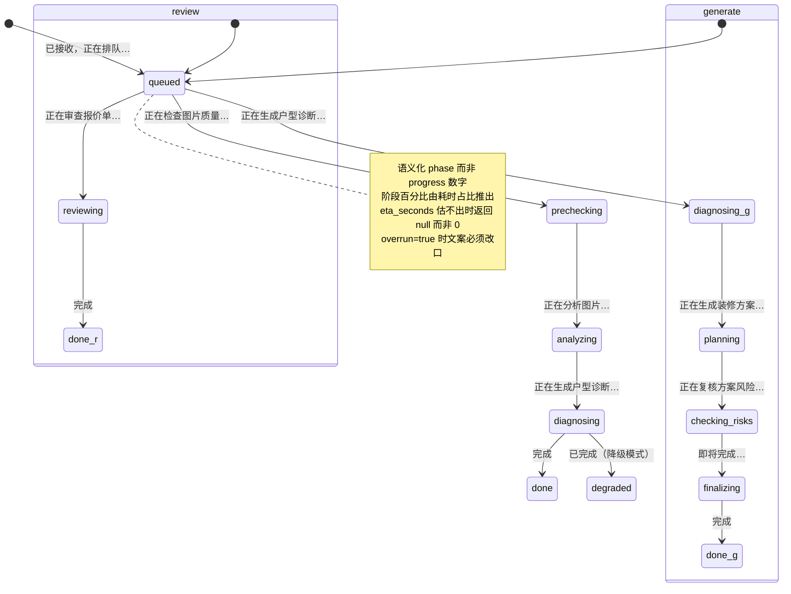

> ⚠️ `reviewing` 与 `checking_risks` 由**同一个节点** `review_risks` 触发，
> 但文案必须分开：前者用户面前是一份报价单，后者用户面前是三套方案。
> 实测踩过：走报价单审查时界面全程显示"正在生成装修方案…"。

> **用户体验设计要点**：用户看到的是**「正在做什么」**，而不是「百分之多少」。
> 这个细节在演示时价值极高——它体现的是产品思维，而不只是工程实现。

**剩余时间**：除了 `progress`，状态响应还带
`elapsed_seconds` / `eta_seconds` / `overrun`。实测用户反馈是
"我只看到已等待时间" —— 已用时间回答"我忍了多久"，剩余时间才回答
"我还要忍多久"。**估不出来时 `eta_seconds` 返回 `null` 而不是 0**：
模型被实际耗时追上时（`overrun=true`）继续报"预计还剩 3 秒"，
比不给数字更消耗信任。

**轮询节奏设计（避免打爆后端 / 更新不流畅的两难）**：

```
前端轮询策略：
  前 10 秒：每 1 秒一次   （解析前期阶段变化快，需要跟得上）
  10 秒后：每 2 秒一次     （进入长尾阶段，降低频率）
  60 秒后：每 5 秒一次     （接近超时，进一步降频）
  放弃时刻：max(120 秒, 后端估算 × 2)，提示超时并提供 trace_id
            ⚠️ 原来写死 120 秒，而实测方案生成链要 122.9 秒 ——
            "轮询先放弃、结果两秒后才好"。现在期限由后端自己的估算来定
            （同一套阶段模型算出来的），乘 2 是留给模型标定偏慢的余量。

后端配合：
  - 状态响应带 Cache-Control: no-store（避免中间层缓存导致进度不更新）
  - 任务未完成时返回 200（不用 202，避免前端 axios 拦截器误判）
  - 已结束的任务结果在 Redis 中保留 1 小时（TTL），支持页面刷新后重新获取
```

#### 11.2.5 图像生成与局部替换 ⛔ 已作废

> ⛔ **本模块已随 AC-08 作废**（2026-09-23）。复测推翻了"AI 图是主要交付物"这个前提：
> 显存与耗时达标，但**产出与命名不符** —— 是俯视家具平面图，不是「3D 等轴测户型渲染图」，
> 且根因是结构性的。**现行交付物是矢量户型图与 3D 场景（见 8.2）。**
>
> 下方内容**保留为技术记录**，用途只有一个：说明这条路为什么走不通，
> 以及将来若有人想复活它，需要先解决什么。**不要把它当作现行设计来读。**

> **🟢 后续实测：本模块从「最不可行」变成「显存与耗时实测通过」。**
>
> M0 基准实测（`scripts/bench_image.py`）：
> ```
> ✅ L0 级别（SD1.5 + ControlNet @512）直接跑通，无需任何降级
>    连续 10/10 张不 OOM | 峰值显存 0.968GB（阈值 3.2GB）| 均耗时 12.23s（目标 25s）
> ```
>
> **三条已被推翻的旧判断**（详见 ADR-01 与修订说明）：
> 1. ~~offload 会把单图拖到分钟级~~ → 实测**既省 3GB 又更快**
> 2. ~~用 SD1.5 生成室内效果图~~ → 任务错配，正确形态是 **3D 等轴测户型渲染图**
> 3. ~~LCM-LoRA 4–8 步是必须的~~ → **跨种子不稳定，默认关闭**，改标准采样 20 步
>
> 下方的分级降级设计**保留为故障预案**，日常路径已不需要。

**这是初版设计里最不可行、也是改动最大的模块。**

**方案变更**：

| 维度 | 原设计 | **现设计** | 理由 |
|---|---|---|---|
| 主方案 | SDXL + ControlNet | **SD 1.5 + LCM-LoRA + ControlNet(sd15)** | 显存 6.9GB → 2.9GB |
| 采样步数 | 20-30 步 | **4-8 步（LCM-LoRA）** | 3050 Laptop 算力约束 |
| 分辨率 | 512 / 768 | **512×512 固定** | 768 会溢出 3.5GB |
| 云端兜底 | 阿里云 wan2.5 | ❌ **移除** | 无 key + 隐私条款冲突 |
| **矢量兜底** | 无 | ✅ **新增，常驻可用** | 唯一 100% 可靠路径 |

**双轨设计（核心）**：

**图 9 · 图像生成双轨设计**

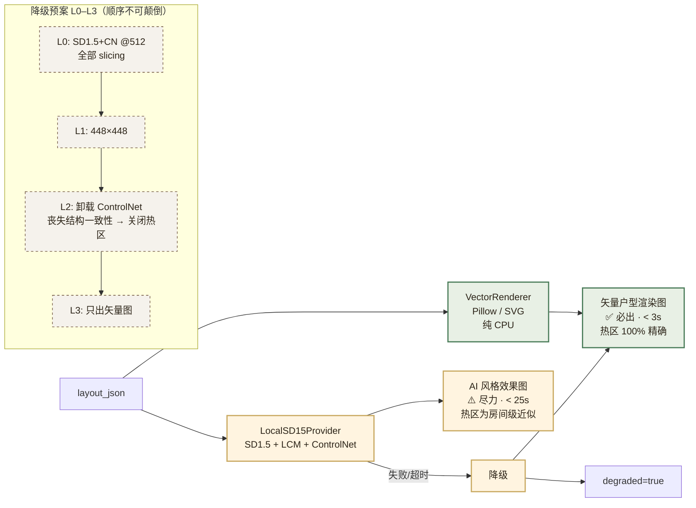

**ImageProvider 抽象层**（初版接口冻结，实现扩展）：

| 实现 | 状态 | 说明 |
|---|---|---|
| `VectorRenderer` | ✅ 本期实现 | 纯 CPU，无依赖，永不失败 |
| `LocalSD15Provider` | ✅ 本期实现 | SD1.5 + LCM-LoRA + ControlNet |
| ~~`SDXLProvider`~~ | ○ 路线图 | 4GB 显存不满足，需外接 GPU 或云主机 |
| ~~`CloudAPIProvider`~~ | ○ 路线图 | 需 DashScope key + 隐私条款放行 |

**4GB 显存工程约束（必须全部满足）**：

```python
pipe.enable_attention_slicing()          # 必须
pipe.enable_vae_slicing()                # 必须
pipe.enable_vae_tiling()                 # 必须（512 已在边界）
torch_dtype = torch.float16              # 必须
# 不启用 enable_model_cpu_offload()：SD1.5 能全量上卡，offload 反而拖慢到不可用
# 串行执行：全局 asyncio.Lock 保护，禁止并发调图（会 OOM）
```

##### ⚠️ M0 出图基准是本模块的放行门槛

显存重算（见附录 B 的 0.1）表明 **512px + ControlNet 大概率溢出**。因此在 M0 就把这件事测掉，
**不允许拖到 M5 才发现**。

`scripts/bench_image.py` 的产出不是"能不能出图"，而是**在哪个级别能稳住**：

```python
import torch

torch.cuda.empty_cache()
torch.cuda.reset_peak_memory_stats()

# 按 L0 → L3 逐级尝试，记录每级的峰值显存与单图耗时
for level in ("L0_sd15_cn_512", "L1_sd15_cn_448", "L2_sd15_no_cn_512", "L3_vector_only"):
    try:
        run_once(level)                       # 生成 1 张图
        torch.cuda.synchronize()
        peak = torch.cuda.max_memory_allocated() / 1024**3
        free, total = torch.cuda.mem_get_info()
        print(f"{level}: peak={peak:.2f}GB driver_free={free/1024**3:.2f}GB "
              f"elapsed={elapsed:.1f}s  {'PASS' if peak < 3.2 else 'FAIL'}")
    except torch.cuda.OutOfMemoryError:
        print(f"{level}: OOM")

# 最终断言：找到第一个稳定级别，且连续 10 张不 OOM（AC-22）
```

**M0 放行标准**：至少 L2 级别能连续出 10 张图不 OOM，峰值显存 < 3.2GB。
若只有 L3 通过，则**图像生成整体降为路线图**，本项目以矢量图交付——这仍然满足 AC-07。

> **为什么阈值定在 3.2GB 而不是 3.22GB**：留 0.5GB 以上余量给显存碎片与
> 其它进程波动。卡在边界上的方案在演示时最容易翻车。

##### 矢量图伪 3D 等轴测视图

纯平面俯视图的演示说服力有限。M5 给矢量图增加一个等轴测视角：

- 用 Pillow 的 `Image.transform` 做 30° 斜切变换，把 2D 平面图拉成等轴测投影
- 房间墙体做简单挤出（按固定墙高生成侧立面）+ 基础明暗
- **纯 CPU，零显存依赖，目标 < 1s**

> **诚实说明工作量**：一次变换 + 挤出的"看起来像产品"需要额外 2–3 天。
> 收益是即使 AI 图完全失败，兜底交付物仍具备演示价值。
> 若 M5 时间紧张，**优先保 AC-07（矢量图必出），伪 3D 可降为路线图**。

**首次加载开销**：模型冷启动约 20–40s（从 E: 盘读盘）。**必须做进程常驻 + 预热**，不能在每次请求时加载。

**局部替换（Inpainting）【可行性 C，风险最高，排期最后】**：

1. 前端 Canvas 框选/涂抹要替换的区域
2. 生成 Mask 图像
3. 后端调用 SD1.5 Inpainting 管线（复用同一 UNet 架构，额外约 +1.8GB 显存）
4. 结果与原图融合

> ⚠️ **风险提示**：SD1.5 Inpainting 模型与基础模型**不能同时驻留** 3.5GB 显存。实现上需要**卸载重载**，单次耗时可能达 60s+。此项排入 M6，**若 M5 结束时显存实测紧张，直接降级为路线图**，不要为了它拖垮整个项目。

#### 11.2.6 物品热区交互 【可行性 C ⚠️】

**原设计的错误**：用 YOLOv8 检测生成图中的地板、墙纸、空调。
**为什么不可行**：YOLOv8 通用权重基于 COCO 80 类，**其中没有"地板""墙纸"，甚至没有"空调"**。对 AI 生成图做开放词汇检测需要 GroundingDINO/OWL-ViT 类模型（又是 1-2GB 显存），且生成图的物体边界本身就不稳定。

**现方案：坐标映射，零检测模型。**

```
户型解析 JSON（已含每个房间的 bbox）
        │
        ├─▶ 矢量图路径：直接使用 room bbox，并按房间类型叠加物品热区
        │                 → 精确到具体物品（地板/墙面/天花区域可几何推导）
        │
        └─▶ AI 图路径：ControlNet 保持了几何结构，按 canvas 比例线性缩放
                          → 房间级近似区域 + 该类房间的标准物品清单
                          → hotspot.precision = "room_level"
```

**热区数据结构**：

```json
{
  "label": "客厅地面",
  "category": "floor",
  "bbox": [120, 400, 420, 480],
  "precision": "exact",
  "source": "vector_layer",
  "price_range": [89, 399],
  "unit": "元/㎡",
  "items": [
    {"brand": "全友", "name": "强化复合地板", "price": 129, "spec": "1210x165x12mm", "eco_level": "E0"},
    {"brand": "圣象", "name": "强化复合地板", "price": 99, "spec": "1210x165x12mm"}
  ],
  "search_url": "https://search.jd.com/Search?keyword=强化复合地板"
}
```

**新增必填字段**：

| 字段 | 取值 | 含义 |
|---|---|---|
| `precision` | `exact` / `room_level` | 热区精确度，**前端须以视觉样式区分**（如 room_level 用虚线框） |
| `source` | `vector_layer` / `layout_bbox_mapping` | 热区坐标来源，便于溯源 |

> **诚实性原则**：`room_level` 的热区悬停时，UI 必须显示"本区域整体参考价"，而不是假装精确到某一件家具。**用户可以接受近似，不能接受被骗。**

##### ⚠️ 几何一致性自检

早先的热区方案里有一处被低估的技术债：

> AI 图路径：ControlNet 保持了几何结构，按 canvas 比例线性缩放 → 房间级近似区域

**"按 canvas 比例线性缩放"只在 ControlNet 完美工作时成立。** 而 ControlNet 做的是**结构引导**，
不是**几何约束**——生成图相对输入户型图的墙体边缘漂移 5–15% 是常态。
若 AI 图把客厅整体画偏了 8%，热区就会落到错误的位置：用户悬停在"看起来像地板"的地方，
提示却说"这是主卧墙面"。**这种错误比没有热区更伤信任。**

**增加几何一致性自检，不达标就不放热区**：

**图 10 · 物品热区几何一致性自检**

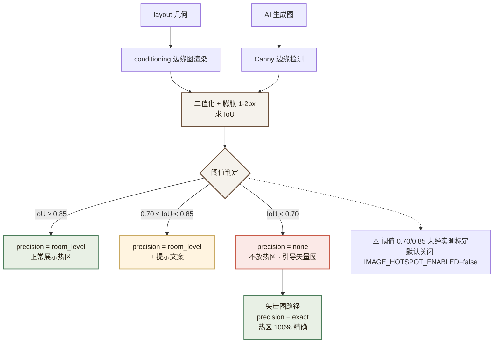

```python
def check_geometry_consistency(layout, generated_img) -> GeoCheck:
    """
    用 ControlNet 的 conditioning 图（由 layout 渲染而来）与生成图比对，
    估算几何漂移。两者都是边缘图，做二值化后求 IoU —— 这样 IoU 才有定义。

    注意：不能拿「房间 bbox（区域）」直接和「边缘检测结果（像素）」求 IoU，
    那两者量纲不同，算出来的数没有意义。必须两边都先转成边缘图再比。
    """
    edge_ref = render_edges_from_layout(layout)        # conditioning 侧
    edge_gen = canny(generated_img)                    # 生成图侧
    iou = binary_iou(dilate(edge_ref), dilate(edge_gen))   # 先膨胀容忍 1-2px 抖动

    if iou < 0.70:
        return GeoCheck(precision="none",
                        warning="AI 图与户型结构偏差较大，本图不提供热区，请参考矢量图")
    if iou < 0.85:
        return GeoCheck(precision="room_level",
                        warning="热区为房间级近似，仅供参考")
    return GeoCheck(precision="room_level")            # AI 图永远达不到 exact
```

**处置规则**：

| IoU | AI 图热区 | 说明 |
|---|---|---|
| ≥ 0.85 | `precision = room_level` | 正常展示房间级热区 |
| 0.70 – 0.85 | `precision = room_level` + 警告 | 展示但带提示文案 |
| **< 0.70** | **`precision = none`，不放热区** | 只展示矢量图热区 |

> **明确预期**：若 M5 实测 IoU 普遍低于 0.70，那就**只在矢量图上做热区，AI 图纯做风格示意**。
> 诚实优于假装精确——这与本文档反复强调的原则一致，也是 ADR-10 的决策依据。

**材料价格映射表**（JSON 格式，初版即如此）：

```json
{
  "地板": {
    "keywords": ["实木地板", "复合地板", "强化地板"],
    "search_url": "https://search.jd.com/Search?keyword={keyword}",
    "price_range": [89, 399],
    "unit": "元/㎡",
    "quanyou_products": [
      {"name": "全友强化复合地板", "price": 129, "spec": "1210x165x12mm"}
    ]
  },
  "墙纸": {
    "keywords": ["环保墙纸", "无纺布墙纸"],
    "search_url": "https://search.jd.com/Search?keyword={keyword}",
    "price_range": [30, 150],
    "unit": "元/卷",
    "quanyou_products": [
      {"name": "全友环保无纺布墙纸", "price": 89, "spec": "0.53x10m"}
    ]
  }
}
```

#### 11.2.7 三角色权限模型 【可行性 A】

**图 14 · 认证与权限**

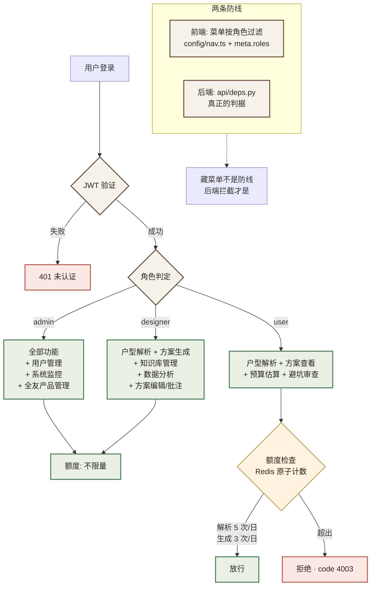

| 角色 | 权限范围 | 额度 |
|---|---|---|
| admin（超级管理员） | 全部功能 + 用户管理 + 系统监控 + 全友产品管理 | 不限量 |
| designer（设计师） | 户型解析 + 方案生成 + 知识库管理 + 数据分析 + 方案编辑/批注 + 全友产品推荐 | 不限量 |
| user（普通用户） | 户型解析 + 方案查看 + 预算估算 + 避坑审查 | 解析 5 次/日，生成 3 次/日 |

权限判定优先级：**超级管理员 > 设计师 > 普通用户 > 显式权限码**

#### 11.2.8 自由选项组合与方案生成 【可行性 A】

用户可自由勾选的维度：

| 维度 | 可选项 |
|---|---|
| 装修风格 | 现代简约 / 北欧 / 现代中式 / 奶油风 / 侘寂风 / 轻奢 |
| 预算档位 | 经济（¥800-1200/㎡）/ 中档（¥1500-2000/㎡）/ 高端（¥2500-3500/㎡） |
| 主材偏好 | 实木 / 复合 / 强化 / 瓷砖 / 大理石 |
| 功能需求 | 老人房 / 儿童房 / 宠物空间 / 智能家居 / 书房 / 衣帽间 |
| 环保等级 | E0 级 / ENF 级 / 无醛添加 |
| 全友产品优先 | 是 / 否 |

> **补充**：风格维度从 3 个扩到 6 个，但 **AI 出图仅支持已下载 LoRA 的风格**。未训练 LoRA 的风格（如侘寂风）在 AI 图路径上会退化为基础模型 + 提示词，效果不稳定——**这类风格应默认返回矢量图**。风格与图像能力的支持矩阵必须在 M5 明确成文。

### 11.3 非功能性需求

#### 11.3.1 性能需求（按本机实测校准）

> **🔴 `/system/metrics` 上线后第一次实测（2026-09-24）：两个目标不成立。**
>
> 接口本身按 2.3.1 的表格报"达标/未达标"。它跑起来后的第一次真实测量：
>
> | 指标 | 2.3.1 目标 | **实测 P95** | 结论 |
> |---|---|---|---|
> | 户型解析 | < 20s | **67.5s**（n=2，p50 59.2s） | ❌ **差 3.4 倍** |
> | API 响应（排除 LLM） | < 2s | **7 ms**（n=66） | ✅ 远超目标 |
>
> **20s 这个数是最初的估计，从来没有被实测校准过。** 解析链路是两次
> LLM 调用（A-01 视觉解析 + A-02 诊断），实测区间 33–68s —— 而"20s"当初
> 是按"单次调用 15–20s"写的，等于**漏算了第二次调用**。
>
> ⚠️ 这里**不改目标值**，只如实记下"它不成立"。改目标要有依据（比如
> 分阶段计时说明时间花在哪、以及有没有可压的余量），否则就是拿测量结果
> 去凑一个好看的数字 —— 那比留着一个不达标的目标更糟。
> 方案生成的目标（< 60s）同理：实测 112s，同样未达标。

| 指标 | 最初目标 | **现行目标** | 测量方法 | 校准依据 |
|---|---|---|---|---|
| 户型解析 P95 | < 15s | **< 20s** | 端到端计时 | 保守化，含降级重试 |
| 方案生成 P95 | < 60s | **< 60s** | 3 套方案并行完成 | 保留 |
| 矢量图渲染 | — | **< 3s** | 纯 CPU | **新增** |
| AI 效果图 P95 | < 30s | **< 25s** | 从请求到返回 | 4-8 步 LCM，512px |
| 热区悬停响应 | < 200ms | **< 200ms** | 前端 Performance API | 保留 |
| API 响应 P95 | < 2s | **< 2s** | 排除 LLM 调用的纯 API | 保留 |
| 并发支持 | ≥ 50 QPS | **≥ 10 QPS（单实例）** | 压测 | ⚠️ 原目标自认"未压测"，改为可验证值 |
| **图像生成并发** | — | **1（严格串行）** | 全局锁 | **新增**，3.5GB 显存不允许并发 |

#### 11.3.2 安全需求

| 需求项 | 具体要求 | 实现说明 | 说明 |
|---|---|---|---|
| 认证 | JWT（HS256）+ 双令牌（access/refresh） | bcrypt 口令散列 | — |
| 授权 | RBAC 三级权限 + API 级权限校验 | 越权归属校验 | — |
| 登录防爆破 | Redis 失败锁定（连续失败 5 次锁定 30 分钟） | 原子计数 | — |
| 上传校验 | 扩展名 + MIME + 大小五重校验 | 防止恶意文件 | — |
| XSS 防护 | 前端高亮不拼接 HTML（使用纯函数切分） | Vue 默认转义 | — |
| 隐私保护 | 户型图仅本地存储，**不上传第三方** | **架构级约束，须在提供方选择层强制** | ⚠️ **条款已修正**：解析默认走 DeepSeek 云端，户型图必然离开本机。**现行条款为**：「默认模式下户型图会发送至云端模型服务商用于当次解析，不落盘至第三方；`prefer_local=true` 时**完全不离开本机**」。<br>⚠️ **实现强制点**：隐私开关必须在 `LLMClient._chain(force_local=True)` 这一层生效，业务层"表示一下"无效——**本次编码阶段已因此发生过实际违约**（见 ADR-12）。<br>验证方式：**运行时抓包**（AC-24），不是代码审查 |
| 审计日志 | 记录登录、解析、生成、导出等操作，保留 180 天 | PostgreSQL + 结构化日志 | **补充**：须记录 `model_used` 与 `degraded` 标志 |

#### 11.3.3 可扩展性需求

- **模型可插拔**：`LLM_PROVIDER` 环境变量切换 `deepseek` / `ollama` / `dashscope`（预留）。
- **图像生成可插拔**：`ImageProvider` 抽象层支持 `vector` / `local_sd15` / （路线图）`sdxl` / `cloud`。
- **数据源可扩展**：新增材料数据源只需实现适配器并注册。
- **MCP 工具热插拔**：新工具封装为 MCP Server 即可接入，无需修改 Agent 代码。

---


## 十二、API 接口契约

所有接口统一前缀 `/api/v1`，统一响应信封 `{code, msg, data}`，`code = 0` 表示成功。**接口契约的权威来源是后端 OpenAPI 文档（`/openapi.json`，可视界面 `/docs`）。**

> **全链路 `trace_id`**
>
> 每个进入系统的请求生成一个 UUID `trace_id`，贯穿 **API 中间件 → Agent 节点 → LLM 调用 → 审计日志** 四层，
> 通过 loguru 的 `bind(trace_id=...)` 透传，并在**所有响应信封和所有错误提示中返回给前端**。
>
> 价值：用户报障时贴一个 `trace_id` 就能定位整条链路；面试中也体现工程完整度。成本极低（一个中间件 + 日志绑定）。
>
> ```python
> @app.middleware("http")
> async def trace_middleware(request, call_next):
>     trace_id = request.headers.get("X-Trace-Id") or str(uuid.uuid4())
>     with logger.contextualize(trace_id=trace_id):
>         response = await call_next(request)
>         response.headers["X-Trace-Id"] = trace_id
>         return response
> ```
>
> **长任务注意**：`/layout/parse`、`/design/generate` 改为异步后，`trace_id` 需随 `task_id` 一起
> 写入 `async_tasks` 表，后台任务从数据库取回并重新绑定上下文（异步上下文不会自动继承）。

### 12.1 认证接口

| 方法 | 路径 | 说明 |
|---|---|---|
| POST | `/auth/login` | 登录，返回 access + refresh token |
| POST | `/auth/register` | 注册（仅 admin 可创建用户） |
| POST | `/auth/refresh` | 刷新 access token |
| GET | `/auth/me` | 获取当前用户信息 |

### 12.2 户型解析接口（异步）

> **⚠️ `/layout/parse` 已由同步改为异步任务。**
>
> **理由**：解析 P95 目标 20s，已超出浏览器默认请求超时的舒适区。用户点了上传要干等 20 秒，
> 中途网络抖动就得重来，且无法展示进度。起初 `/layout/parse` 同步、`/design/generate` 异步，
> 两个接口风格还互相打架。
>
> **决策**：**统一为异步任务**（评审方案 A）。理由不只是"风格统一"——异步化后
> 未来要加"解析进度条"、重试、批量上传，都不需要再改接口契约。
> 前端用轮询（M2）/ SSE（M8 可选增强）获取进度。

**Endpoint**: `POST /api/v1/layout/parse` → 返回 `task_id`

**Request**：

```json
{
  "image_url": "https://...",
  "image_base64": "data:image/png;base64,...",
  "detail_level": "full",
  "prefer_local": false,
  "skip_precheck": false
}
```

| 字段 | 说明 |
|---|---|
| `prefer_local` | `true` 时**强制本地模型，户型图完全不出本机**（AC-24）。由 `LLMClient._chain(force_local=True)` 在提供方选择层强制，不是靠业务层"表示一下" |
| `skip_precheck` | `true` 时跳过本地质量预检直接进 LLM（调试用） |

**Response（立即返回）**：

```json
{
  "code": 0,
  "msg": "ok",
  "data": {
    "task_id": "task_20260922_001",
    "trace_id": "6f1c2a9e-3b47-4d18-9c05-8ae2f1b7d3c4",
    "status": "pending",
    "estimated_seconds": 12
  }
}
```

**预检未通过时的响应**（不创建任务，不消耗 Token）：

```json
{
  "code": 4001,
  "msg": "图片质量不足：分辨率过低（180×140）",
  "data": {
    "trace_id": "6f1c2a9e-...",
    "precheck": {
      "resolution_ok": false,
      "blur_score": 42.1,
      "suggestion": "建议重新拍摄或上传更清晰的户型图"
    }
  }
}
```

**任务完成后取结果**：`GET /api/v1/task/{task_id}/status`，`result` 字段见下方。

```json
{
  "code": 0,
  "msg": "ok",
  "data": {
    "layout_id": "layout_20260922_001",
    "rooms": [
      {"name": "客厅", "type": "living_room", "area": 28.5, "bbox": [120, 80, 420, 360]},
      {"name": "主卧", "type": "bedroom", "area": 16.2, "bbox": [440, 80, 680, 300]}
    ],
    "walls": [
      {"type": "load_bearing", "coords": [[100, 60], [700, 60]]},
      {"type": "non_load_bearing", "coords": [[100, 400], [700, 400]]}
    ],
    "doors": [{"position": [250, 380], "width": 0.9, "swing": "inward"}],
    "windows": [{"position": [600, 50], "width": 1.8, "orientation": "south"}],
    "dimensions": [{"label": "4200", "value": 4.2, "unit": "m"}],
    "diagnosis": {
      "lighting": {"score": 7.5, "issues": ["北侧卧室采光不足"]},
      "ventilation": {"score": 8.0, "issues": []},
      "circulation": {"score": 6.5, "issues": ["厨房到餐厅动线过长"]},
      "space_utilization": {"score": 7.0, "issues": ["玄关收纳空间不足"]},
      "green_score": {"score": 7.8, "issues": ["建议使用E0级板材"]}
    },
    "confidence": 0.87,
    "model_used": "deepseek-flash",
    "mode": "full",
    "degraded": false,
    "degrade_reason": null,
    "elapsed_ms": 8420,
    "precheck": {"resolution_ok": true, "resolution_warn": false, "blur_score": 412.7},
    "trace_id": "6f1c2a9e-3b47-4d18-9c05-8ae2f1b7d3c4"
  }
}
```

> `degraded`（是否降级）、`degrade_reason`（降级原因）、`elapsed_ms`（性能埋点，支撑 P95 验收）。
> **前端必须在 `degraded=true` 时显示可见提示。**
>
> **另有** `mode`、`precheck`、`trace_id`。
> `mode` 取值与前端行为强绑定，见下表。

**`mode` 字段与前端呈现约束**：

| `mode` | 含义 | 字段完整度 | **前端必须做什么** |
|---|---|---|---|
| `full` | 主模型完整解析 | 房间/墙体/门窗/尺寸/面积齐全 | 正常展示 |
| `degraded_basic` | 本地兜底，只识别房间名 | **仅 `rooms[].name` 有效**，其余结构字段全空 | ① 加半透明水印 + 「需人工复核」标签<br>② 禁用所有依赖墙体/面积的后续操作<br>③ 显著展示 `safety_notice` |

**`degraded_basic` 模式的响应示例**：

```json
{
  "code": 0,
  "msg": "ok",
  "data": {
    "layout_id": "layout_20260922_002",
    "mode": "degraded_basic",
    "rooms": [
      {"name": "Living room", "type": "other", "area": 0.0, "bbox": [], "orientation": "unknown"}
    ],
    "walls": [], "doors": [], "windows": [], "dimensions": [],
    "total_area": 0.0,
    "confidence": 0.45,
    "model_used": "minicpm-v4.6:latest",
    "degraded": true,
    "degrade_reason": "云端主模型当前不可用，已自动降级为本地处理，仅提供房间名称参考",
    "warning": "本结果未经完整解析，无法判断承重墙。任何拆改前必须由具备资质的专业人员现场复核。",
    "uncertain_points": [
      "本次由本地兜底模型完成，仅能识别房间名称",
      "墙体、门窗、尺寸、面积均未识别，请勿据此做拆改或预算决策"
    ]
  }
}
```

> ⚠️ **架构约束**：`degraded_basic` 模式**只有房间名是真的**，其余字段是**刻意的空值**，
> 不是"没识别出来"。让弱模型去填这些字段，得到的只会是编造数据（实测见 11.2.1）。

**`capabilities` 字段—— 每个解析结果都必须携带**

```json
{
  "layout_id": "layout_20260922_002",
  "mode": "degraded_basic",
  "rooms": [{"name": "Living room", "type": "other", "area": 0.0, "bbox": []}],
  "total_area": 0.0,
  "capabilities": {
    "mode": "degraded_basic",
    "reason": "当前为降级解析结果，仅房间名称可用",
    "operations": {
      "view_rooms":       {"allowed": true,  "reason": "", "missing": [], "suggestion": ""},
      "export_room_list": {"allowed": true,  "reason": "", "missing": [], "suggestion": ""},
      "estimate_budget":  {
        "allowed": false,
        "reason": "缺少套内总面积，无法执行该操作",
        "missing": ["套内总面积"],
        "suggestion": "当前结果缺少该操作所需的数据，建议重新上传更清晰的户型图以获取完整解析。"
      },
      "generate_plan": {"allowed": false, "reason": "缺少房间面积、墙体信息，无法执行该操作",
                        "missing": ["房间面积", "墙体信息"], "suggestion": "…"},
      "diagnose":      {"allowed": false, "reason": "缺少门窗位置、房间面积…", "missing": ["门窗位置", "房间面积"], "suggestion": "…"},
      "generate_image":     {"allowed": false, "reason": "缺少房间在图中位置…", "missing": ["房间在图中位置"], "suggestion": "…"},
      "generate_hotspots":  {"allowed": false, "reason": "缺少房间在图中位置…", "missing": ["房间在图中位置"], "suggestion": "…"},
      "edit_layout":        {"allowed": false, "reason": "缺少房间在图中位置、房间面积…", "missing": ["房间在图中位置", "房间面积"], "suggestion": "…"}
    }
  }
}
```

> **前端用法**：直接读 `capabilities.operations[op].allowed` 决定按钮是否置灰，
> `suggestion` 作为 tooltip 文案。**前端不需要自己写判断逻辑**——
> 判断逻辑放在后端，前端只负责展示，避免两端规则漂移。

**下游操作被拦截时的响应**：

以 `POST /api/v1/design/generate` 携带降级 `layout_id` 为例：

```json
{
  "code": 4002,
  "msg": "缺少房间面积、墙体信息，无法生成方案",
  "data": {
    "trace_id": "6f1c2a9e-...",
    "operation": "generate_plan",
    "missing": ["房间面积", "墙体信息"],
    "suggestion": "当前结果缺少该操作所需的数据，建议重新上传更清晰的户型图以获取完整解析。"
  }
}
```

> **错误码约定**：`4001` = 图片质量预检不通过；`4002` = 操作所需数据缺失（业务连续性守卫拦截）。
> 二者都**不消耗 LLM Token**。

### 12.3 方案生成接口

**Endpoint**: `POST /api/v1/design/generate`

```json
{
  "layout_id": "layout_20260922_001",
  "styles": ["modern", "nordic", "chinese"],
  "budget_grades": ["economy", "medium", "high"],
  "quanyou_priority": true,
  "requirements": {
    "family_size": 3,
    "has_elderly": false,
    "has_children": true,
    "pets": false,
    "smart_home": true,
    "eco_level": "E0"
  }
}
```

**Response**（异步任务）：

```json
{
  "code": 0,
  "msg": "ok",
  "data": {
    "task_id": "task_20260922_001",
    "status": "processing",
    "estimated_seconds": 45
  }
}
```

### 12.4 任务状态查询接口

**Endpoint**: `GET /api/v1/task/{task_id}/status`

> **另有** `elapsed_seconds` / `eta_seconds` / `overrun` / `cancelled` 四个字段。
> 进度与剩余时间现在由 `core/progress.py` 按**任务类型**建模推出（原先是一张全局表，
> 在方案链上会让进度条先冲到 85% 再倒回 60%）。详见 11.2.4。
>
> ⚠️ `eta_seconds` 为 `null` **表示估不出来**（含"已超出模型预期"），不是 0。
> ⚠️ `cancelled` 为真时 `status` 仍是 `failed` —— `status` 是前端的控制流通道，
> `cancelled` 才是措辞通道（用户自己按的按钮不该被显示成"失败"）。

**Endpoint**: `POST /api/v1/task/{task_id}/cancel` —— 中断在飞任务（AC-31）

```json
{ "code": 0, "msg": "ok",
  "data": { "task_id": "task_20260922_001", "status": "failed",
            "cancelled": true, "phase": "analyzing",
            "phase_text": "正在分析图片…",
            "error": "任务已被用户中断" } }
```

| 情况 | 响应 |
|---|---|
| 中断成功 | `code 0`，`cancelled: true`，`status: failed` |
| 任务刚好已跑完 / 重复点两次 / 早就不在服务端 | `code 0`，**`cancelled: false`** + 当前真实状态 |
| 任务不存在或已过期 | `4004` |
| 不是自己发起的任务 | `4005`（措辞刻意模糊，不确认该 id 是否存在） |
| 未登录 | `4003` |

> ⚠️ **额度不退，且确认框必须提前写明。** `consume_quota` 在建任务之前执行，
> 此时 token 已经产生。等用户按完再说"这次次数不退"是事后通知，不是知情同意。
>
> ⚠️ 后三种"什么都没发生"的情况一律 `code 0` —— 把它们做成错误，
> 界面就得为"其实状态一点没变"弹一个红框。

> **另有** `phase` / `phase_text` / `trace_id` 三个字段。
> `phase` 是语义化阶段（`analyzing` / `detecting_rooms` / …），
> `phase_text` 是可直接展示给用户的中文文案（前端不必自己维护映射表）。
> 各阶段取值与轮询节奏设计见 11.2.4。
>
> 未完成任务同样返回 `code: 0` 与 HTTP 200，仅 `status` / `phase` / `progress` 不同——
> 用 HTTP 状态码表示"还没好"会让前端拦截器误判为错误。

```json
{
  "code": 0,
  "msg": "ok",
  "data": {
    "task_id": "task_20260922_001",
    "trace_id": "6f1c2a9e-3b47-4d18-9c05-8ae2f1b7d3c4",
    "status": "completed",
    "progress": 100,
    "phase": "done",
    "phase_text": "完成",
    "result": {
      "plans": [
        {
          "plan_id": "plan_a",
          "style": "现代简约",
          "budget_grade": "经济",
          "total_budget": {"min": 71200, "max": 106800, "unit": "CNY"},
          "budget_computed_by": "rule_engine_v1",
          "breakdown": {
            "水电改造": {"min": 8000, "max": 12000},
            "瓦工": {"min": 12000, "max": 18000},
            "木工": {"min": 15000, "max": 22000},
            "油漆": {"min": 6000, "max": 9000},
            "主材": {"min": 20000, "max": 30000},
            "辅材": {"min": 5000, "max": 8000},
            "管理费": {"min": 5200, "max": 7800}
          },
          "risks": [
            {"level": "high", "item": "水电改造单价高于市场均价 42%", "source": "知识库-报价审查-第3章"}
          ],
          "quanyou_products": [
            {"name": "全友定制衣柜", "price": 899, "unit": "元/㎡", "category": "全屋定制"},
            {"name": "全友布艺沙发", "price": 3299, "unit": "元/件", "category": "沙发"}
          ],
          "images": {
            "vector": {
              "url": "/static/img/plan_a_vector.png",
              "status": "ready",
              "elapsed_ms": 1200
            },
            "ai": {
              "url": "/static/img/plan_a_ai.png",
              "status": "ready",
              "provider": "local_sd15_lcm",
              "elapsed_ms": 18400,
              "degraded": false
            }
          },
          "hotspots": [
            {
              "label": "客厅地面",
              "category": "floor",
              "bbox": [120, 400, 420, 480],
              "precision": "exact",
              "source": "vector_layer",
              "price_range": [89, 399],
              "unit": "元/㎡",
              "search_url": "https://search.jd.com/Search?keyword=实木地板"
            }
          ]
        }
      ],
      "comparison": {
        "dimensions": ["风格", "预算区间", "材料档次", "风险项数量", "全友产品覆盖率", "绿色评分", "推荐指数"],
        "plans": ["..."]
      }
    }
  }
}
```

> **结构说明**：
> 1. `effect_image_url`（单个字符串）→ `images: {vector, ai}`（双轨结构）。**`vector.status` 必须恒为 `ready`**——这是兜底承诺的接口级体现。
> 2. `hotspots[]` 每条新增 `precision` / `source` / `category`。
> 3. `breakdown` 旁新增 `budget_computed_by`，标明数字来自规则引擎版本。

### 12.5 材料价格查询接口

**Endpoint**: `GET /api/v1/material/price?category=floor&spec=实木&brand=大自然&quanyou_first=true`

```json
{
  "code": 0,
  "msg": "ok",
  "data": {
    "category": "地板",
    "quanyou_recommended": [
      {"brand": "全友", "spec": "强化复合地板 1210x165x12mm", "price_range": [89, 159], "unit": "元/㎡", "search_url": "https://www.quanyou.com.cn/search?keyword=强化地板"}
    ],
    "items": [
      {"brand": "大自然", "spec": "实木地板 910x125x18mm", "price_range": [299, 499], "unit": "元/㎡", "search_url": "https://search.jd.com/Search?keyword=大自然实木地板"},
      {"brand": "圣象", "spec": "强化复合地板 1210x165x12mm", "price_range": [89, 159], "unit": "元/㎡", "search_url": "https://search.jd.com/Search?keyword=圣象强化地板"}
    ]
  }
}
```

### 12.6 其他接口

> ⚠️ **本表在 2026-09-26 校正过一次。** 原来列了 9 条，而其中 **7 条在代码里
> 一条都没有** —— 没有占位、没有 stub、没有 501。后果是「知识库管理」页只能
> 做成只读的（页面上如实写着这件事，没有摆假按钮），工作台拿不到任何跨会话数字。
> 逐条处置见下表右列。

| 方法 | 路径 | 说明 | 状态（2026-09-26 校正） |
|---|---|---|---|
| POST | `/api/v1/avoid-pit/review` | 报价单/合同审查 | ☑ 早就实现 |
| GET | `/api/v1/knowledge/list` | 知识库文档列表 | ☑ **本轮补齐**（仅管理员） |
| POST | `/api/v1/knowledge/upload` | 知识库入库 | ☑ **本轮补齐**（仅管理员；收文本不收文件，见下） |
| GET | `/api/v1/dashboard/stats` | 工作台统计 | ☑ **本轮补齐** |
| GET | `/api/v1/users` | 用户列表（admin） | ☑ 早就实现 |
| ~~PUT~~ | ~~`/api/v1/users/{id}/role`~~ | 角色分配（admin） | 🔴 **不建**：与已有的 `POST /api/v1/users/{user_id}` **重复** —— 那一个已经能改角色/档位/启停，且带三条刻意的拒绝（不改自己 / 不设管理员 / 不封管理员）。再开一个 PUT 等于同一件事两处入口，而权限策略要写两遍 |
| ~~GET~~ | ~~`/api/v1/notifications`~~ | 通知列表 | 🔴 **不建**：**没有产品意图**。本项目没有任何"给用户发通知"的来源 —— 没有站内信、没有订阅、没有异步事件推送。凭这一行建出来的接口只能返回空数组，而空数组会被界面渲染成"没有新通知"，那是在说一件不存在的事 |
| ~~GET~~ | ~~`/api/v1/quanyou/products`~~ | 全友产品列表 | 🔴 **不建**：已由 `GET /api/v1/material/price` 覆盖（`brand=全友` 筛一下就是），而那个接口还带价格区间、环保等级与演示数据声明。两处产品清单迟早漂移 |
| ~~GET~~ | ~~`/api/v1/quanyou/products/recommend`~~ | 全友产品推荐 | 🔴 **不建**：推荐逻辑在 A-05 材料选型里（`services/material/` 的 `candidates` + `coverage`，含 AC-18 的覆盖率保底）。把它暴露成一个不带风格/档位/需求上下文的 GET，只会给出一个**没有依据的推荐** |

**知识库两条的三个设计取舍**（都在代码注释里写全了）：

1. **收文本，不收文件。** 收文件要处理 multipart、大小上限、编码嗅探、
   以及"传上来的到底是 md 还是伪装成 md 的二进制"—— 而这些与业务无关。
   让浏览器把文件读成文本再提交，前端一个 `FileReader` 就够了。
   单次上限 20 万字符；再大走离线脚本 `scripts/ingest_knowledge.py`。
2. **切块只有一份实现。** `chunk_files`（离线）与上传接口共用
   `chunking.chunk_text()` —— 两套切块逻辑只要有一处分块参数不同，
   检索出来的"来源"就不可比，而**没有任何东西会报错**。
3. **embedding 失败时不写任何东西。** 失败必须发生在写库**之前**：
   否则库里会留下一批没有向量的 chunk，Chroma 的检索靠向量，它们永远
   查不到却占着 `count`（清单里显得入库成功了）。报错里明确写
   "本次没有写入任何内容"。
| **GET** | **`/api/v1/system/health`** | **要点**：返回各依赖（PG/Redis/DeepSeek/Ollama/GPU/显存）健康状态与 `degraded` 汇总，供前端顶部状态条使用 |
| **GET** | **`/api/v1/system/metrics`** | **要点**：P95 延迟、Token 消耗、显存占用，直接支撑性能验收 |

**`/system/metrics` 的 Token 成本「预估 vs 实际」结构**：

> 评审建议采纳。只报"实际花了多少"体现不出成本控制意识；**报出"预估偏差率"才能**——
> 它说明系统在调用前对成本有预期，且能自我校准。

```json
{
  "code": 0,
  "msg": "ok",
  "data": {
    "vision_call": {
      "estimated_tokens": 240,
      "actual_tokens": 389,
      "estimated_cost_cny": 0.0012,
      "actual_cost_cny": 0.0019,
      "variance": "+62%",
      "samples": 128
    },
    "text_call": { "...": "同结构" },
    "by_mode": {
      "full":           {"count": 121, "avg_tokens": 1420, "avg_cost_cny": 0.0021},
      "degraded_basic": {"count": 7,   "avg_tokens": 356,  "avg_cost_cny": 0.0000}
    },
    "gpu": {
      "peak_vram_gb": 3.14,
      "level_in_use": "L1_sd15_cn_448",
      "oom_count_24h": 0
    },
    "latency_p95": {"parse": 18.4, "design": 52.1, "vector_image": 1.2, "ai_image": 21.7}
  }
}
```

**预估值的产生方式**：调用前按 `图片像素数 → 视觉 token 数` 的经验公式估算（M0 基准实测标定），
`estimated_cost_cny` 用配置里的单价计算。**单价必须在 M0 用真实账单校准后写入配置，不写死在代码里。**

**其中几个关键指标的用途**：

| 指标 | 支撑的验收项 | 面试价值 |
|---|---|---|
| `variance` 偏差率 | 成本控制 | 体现"会算账"，而非"跑通了" |
| `by_mode.degraded_basic.count` | AC-17 降级可观测 | 能量化"降级发生了多少次" |
| `gpu.level_in_use` | AC-22 显存安全 | 直接对应 L0–L3 分级降级策略 |
| `latency_p95.*` | AC-23 性能基线 | 各环节耗时分解 |

### 12.7 智友问答与屋主户型详情（验收后新增）

两个模块的接口**都要求登录**；会话类接口上还多一层**归属校验** —— 改/读别人的会话拿到的是 4002，
那**不是"用不到的功能"，是越权**（只靠猜 id 就能改，才是真问题）。

| 方法 | 路径 | 说明 |
|---|---|---|
| GET | `/api/v1/chat/conversations` | 我的会话列表（置顶优先、其次最近更新） |
| POST | `/api/v1/chat/conversations` | 新建会话（标题可空 —— 第一条提问自动成为标题） |
| PATCH | `/api/v1/chat/conversations/{id}` | 重命名 / 置顶 / 取消置顶 |
| DELETE | `/api/v1/chat/conversations/{id}` | 删除会话（消息随外键级联删除） |
| GET | `/api/v1/chat/conversations/{id}/messages` | 一条会话的全部消息（含每条回答**当时的**引用来源） |
| POST | `/api/v1/chat/ask` | 提问，**SSE 流式**返回（见下） |
| GET | `/api/v1/layout/{id}/house-detail` | 读取屋主补的户型详情 |
| POST | `/api/v1/layout/{id}/house-detail` | 保存户型详情（空串拒收） |
| GET | `/api/v1/layout/{id}/house-detail/sample` | 按解析出的**总面积**推荐最接近的一份演示资料 |
| GET | `/api/v1/layout/{id}/diagnosis` | 取五维诊断：**有存下来的直接给，没有就现跑一次** |
| POST | `/api/v1/layout/{id}/diagnose` | **强制重跑**一次五维诊断（补完详情后用） |

> ⚠️ 会话列表在**库不通时返回 5003，不返回空列表**。空列表在界面上就是"你还没有对话"，
> 用户会以为历史丢了，而其实只是连不上 —— 这是"不产出看起来合理的错误"那条纪律在接口上的落点。

**`POST /api/v1/chat/ask` —— SSE 流式。** 这条路由**不用 `ApiResponse` 信封**：
SSE 是一行行的 `data:`，不是一次性 JSON；**错误也走同一条流报**（`{"type":"error",…}`），
这样前端只需要一种解析路径。

**Request**：

```json
{
  "question": "这个户型的动线怎么样？",
  "conversation_id": "",
  "layout_id": "layout_20260927_001",
  "plan_id": "plan_20260927_001",
  "prefer_local": false
}
```

| 字段 | 说明 |
|---|---|
| `conversation_id` | 空 = 后端**自动建一个新会话**（前端第一次提问不必先调一次创建） |
| `layout_id` / `plan_id` | 本次带上哪台户型 / 哪套方案。**两个为空时会回落到会话上记着的那两个** —— 这就是"做过解析再进问答页，顶部提示「已带上你的户型与方案」"背后的那条链路 |
| `prefer_local` | 与解析链同一个语义：只用本地模型（隐私模式），**在提供方选择那一层生效**，不只是提示词 |

**事件顺序（固定）**：

```
{"type":"meta",    "conversation_id":"…", "knowledge_available":true, "has_layout":true,
                   "has_house_detail":true, "has_plan":true, "knowledge_count":6}
{"type":"delta",   "text":"…"} × N
{"type":"sources", "sources":[{"kind":"knowledge","citation":"…","source":"…","headings":"…"},
                              {"kind":"layout","citation":"本户型的解析结果（房间/墙体/门窗/面积）"}]}
{"type":"done",    "conversation_id":"…", "chars":812}
出错时：{"type":"error", "message":"这次回答没能生成出来：…"}
```

三点必须写清楚：

- **`sources` 由代码给，不由模型写。** 清单从检索结果派生 —— 模型想引用哪条都可以，
  但它**编一个不存在的文件名也进不了那份清单**。
- **`meta` 排在 `delta` 之前**，里面的四个布尔量就是"这次看到了哪些资料" ——
  界面据此如实告诉用户哪几处依据参与了、哪几处没有，而不是让用户猜。
- 响应头带 **`Cache-Control: no-cache, no-transform`**（中间层缓存住第一条事件，界面就永远不动）
  与 **`X-Accel-Buffering: no`**：后者是给 nginx 的 —— **nginx 默认会缓冲 SSE**，
  不显式关掉的话整段流会被攒成一坨再吐出来，流式就白做了。

**流式下的降级规则**：提供方切换**只允许发生在吐出第一个 chunk 之前**。
已经吐了半句再换提供方，用户会看到两段拼接的回答；所以只有首块之前抛的错才继续试下一个提供方。

**`GET/POST /layout/{id}/house-detail`**：详情存在户型记录里（`layout["house_detail"]`），
**与户型同寿命（1 小时）**，并随户型一起落库 —— 不需要第二套存储。
正文上限 12000 字符（提示词侧只取前 6000）；超了只回"太长、请精简到多少字符"，
不解释提示词那回事（那是给开发者的说明，用户不需要知道）。

**`GET /layout/{id}/house-detail/sample`**：**这是演示辅助，不是产品能力。**
它按解析出的总面积挑最接近的一份演示详情（`matched_by` 里写明"本户型 xx㎡ / 该样例 xx㎡"），
前端把它**填进输入框、由用户点保存** —— 不是后端替他填上。区别很重要：
数据在口径上是"屋主提供的"，得由人确认一次。

**`POST /layout/{id}/diagnose`**：补完详情后**强制重跑**，与首次取用诊断**共用同一份实现**（`_run_diagnosis`）
和同一个 agent（A-02），**输入只多了那份详情** —— 免得两条路走出两个结果。

---


## 十三、数据模型

**数据库统一为 PostgreSQL 15。本节只列核心表，完整 DDL 见 `db/migrations/`。**

### 13.1 用户与权限

```sql
CREATE TABLE users (
    id SERIAL PRIMARY KEY,
    username VARCHAR(64) NOT NULL UNIQUE,
    email VARCHAR(128) NOT NULL UNIQUE,
    password_hash VARCHAR(256) NOT NULL,
    role VARCHAR(20) NOT NULL DEFAULT 'user',  -- admin / designer / user
    avatar VARCHAR(256),
    is_active BOOLEAN DEFAULT TRUE,
    created_at TIMESTAMP DEFAULT NOW(),
    updated_at TIMESTAMP DEFAULT NOW()
);

CREATE TABLE role_permissions (
    id SERIAL PRIMARY KEY,
    role VARCHAR(20) NOT NULL,
    permission_code VARCHAR(64) NOT NULL,
    UNIQUE(role, permission_code)
);
```

### 13.2 户型与方案

```sql
CREATE TABLE house_layouts (
    id VARCHAR(64) PRIMARY KEY,               -- layout_20260922_001
    user_id INTEGER REFERENCES users(id),
    original_image_url VARCHAR(512) NOT NULL,
    parsed_data JSONB,
    diagnosis_data JSONB,
    confidence FLOAT,
    model_used VARCHAR(32),
    -- 降级可见性（AC-17：降级必须在 API / 审计 / 界面三处可见）
    degraded BOOLEAN DEFAULT FALSE,
    degrade_reason VARCHAR(128),
    parse_elapsed_ms INTEGER,
    created_at TIMESTAMP DEFAULT NOW()
);

CREATE TABLE design_plans (
    id VARCHAR(64) PRIMARY KEY,
    layout_id VARCHAR(64) REFERENCES house_layouts(id),
    style VARCHAR(32) NOT NULL,
    budget_grade VARCHAR(16) NOT NULL,
    total_budget_min DECIMAL(12,2),
    total_budget_max DECIMAL(12,2),
    breakdown JSONB,
    -- 标明预算数字来源，规则引擎版本可追溯
    budget_computed_by VARCHAR(32) DEFAULT 'rule_engine_v1',
    risks JSONB,
    quanyou_products JSONB,
    -- 单字段拆为双轨
    effect_image_url VARCHAR(512),             -- 保留：AI 效果图（可为空）
    vector_image_url VARCHAR(512),             -- 新增：矢量图（必非空）
    image_provider VARCHAR(32),                -- vector / local_sd15_lcm / (roadmap) sdxl
    image_degraded BOOLEAN DEFAULT FALSE,      -- AI 图失败降级到矢量图
    image_elapsed_ms INTEGER,
    hotspots JSONB,
    status VARCHAR(16) DEFAULT 'processing',
    created_at TIMESTAMP DEFAULT NOW()
);

CREATE TABLE plan_comparisons (
    id SERIAL PRIMARY KEY,
    layout_id VARCHAR(64) REFERENCES house_layouts(id),
    plan_ids JSONB,
    comparison_data JSONB,
    created_at TIMESTAMP DEFAULT NOW()
);
```

### 13.3 材料与知识库

表结构为 `material_price_map` / `quanyou_products` / `knowledge_documents` / `knowledge_chunks`。

> **补充说明**：`knowledge_chunks.chroma_id` 仍保留 —— 虽然 ChromaDB 改为嵌入式，但持久化目录在 E: 盘，元数据与向量分离存储的架构不变，便于日后迁移 Milvus。
>
> **数据来源声明**：全友产品价格库**无真实数据源**，M3 阶段须以公开官网信息 + 行业均价构造**标注为演示数据**的种子集（`seed_data/quanyou_products.sql`）。**严禁在文档或 UI 中把演示数据表述为真实报价。**

### 13.4 任务与审计

```sql
CREATE TABLE async_tasks (
    id VARCHAR(64) PRIMARY KEY,
    user_id INTEGER REFERENCES users(id),
    task_type VARCHAR(32) NOT NULL,
    status VARCHAR(16) DEFAULT 'pending',
    progress INTEGER DEFAULT 0,
    result JSONB,
    error_message TEXT,
    -- 区分"完成"与"降级完成"
    degraded BOOLEAN DEFAULT FALSE,
    created_at TIMESTAMP DEFAULT NOW(),
    completed_at TIMESTAMP
);

CREATE TABLE audit_logs (
    id SERIAL PRIMARY KEY,
    user_id INTEGER REFERENCES users(id),
    action VARCHAR(64) NOT NULL,
    resource_type VARCHAR(32),
    resource_id VARCHAR(64),
    input_hash VARCHAR(64),
    output_hash VARCHAR(64),
    model_used VARCHAR(32),
    -- 降级审计是 AC-14 的验证依据
    degraded BOOLEAN DEFAULT FALSE,
    degrade_reason VARCHAR(128),
    token_usage JSONB,
    latency_ms INTEGER,
    ip_address VARCHAR(45),
    created_at TIMESTAMP DEFAULT NOW()
);

CREATE TABLE notifications (
    id SERIAL PRIMARY KEY,
    user_id INTEGER REFERENCES users(id),
    title VARCHAR(256) NOT NULL,
    content TEXT,
    type VARCHAR(32),
    is_read BOOLEAN DEFAULT FALSE,
    created_at TIMESTAMP DEFAULT NOW()
);
```

### 13.5 问答会话

来自 `005_chat_conversations.sql`（智友问答的两张表）：

```sql
CREATE TABLE IF NOT EXISTS chat_conversations (
    conversation_id VARCHAR(64)  PRIMARY KEY,
    user_id         INTEGER      NOT NULL,
    -- 会话标题。第一条提问自动截断生成，之后可以手动重命名
    title           VARCHAR(120) NOT NULL DEFAULT '新对话',
    -- 置顶。列表排序先看它，再看更新时间
    pinned          BOOLEAN      NOT NULL DEFAULT FALSE,
    -- 这次对话挂在哪个户型/方案上（可为空 —— 用户可以不选方案直接问）
    layout_id       VARCHAR(64),
    plan_id         VARCHAR(64),
    created_at      TIMESTAMPTZ  NOT NULL DEFAULT NOW(),
    updated_at      TIMESTAMPTZ  NOT NULL DEFAULT NOW()
);

-- 列表查询固定是"某人的会话，按置顶 + 更新时间"
CREATE INDEX IF NOT EXISTS idx_chat_conv_user
    ON chat_conversations (user_id, pinned DESC, updated_at DESC);

CREATE TABLE IF NOT EXISTS chat_messages (
    id              BIGSERIAL    PRIMARY KEY,
    conversation_id VARCHAR(64)  NOT NULL
                    REFERENCES chat_conversations (conversation_id) ON DELETE CASCADE,
    role            VARCHAR(16)  NOT NULL,          -- user / assistant
    content         TEXT         NOT NULL,
    -- 回答引用了哪些知识库文档。**只对 assistant 消息有意义**
    sources         JSONB,
    -- 这一轮用了哪个模型（含降级信息）。排查"回答质量变了"时要看它
    model_used      VARCHAR(64),
    created_at      TIMESTAMPTZ  NOT NULL DEFAULT NOW()
);

-- 读一条会话的消息：按 id 顺序，且只按会话过滤
CREATE INDEX IF NOT EXISTS idx_chat_msg_conv
    ON chat_messages (conversation_id, id);
```

> **为什么历史落 PG 而不塞 Redis。** 历史记录是**跨会话**的东西（今天问过、明天还要看），
> 而 Redis 在本项目里是"当前进程的活状态"（任务进度、额度计数），都带 TTL。
> 落库还顺带办成一件事：回答里的引用来源跟着消息一起留下来 ——
> 用户回头翻这条对话时，仍然看得到"当时依据的是哪几份文档"。
> 会话的 `layout_id` / `plan_id` 是"这条对话挂在什么上面"，
> 与 `POST /chat/ask` 里那两个字段的关系见 12.7。
>
> ⚠️ **迁移是部署动作，应用容器刻意没有 DDL 能力。**
> `db/migrations/00N_*.sql` 由宿主机跑 `python scripts/init_db.py` 执行，
> **应用容器不在启动时建表**。两个理由：容器不该有 DDL 权限；
> 以及"表是谁建的、建的哪个版本"必须回答得出来（答案是 `schema_migrations` 表）。
> 所以**加表 = 加一个 `00N_*.sql` + 在部署时执行一次**，不是"启动时自动建表"。

---


# 卷三 · 交付与验收

## 十四、验收清单

### 14.1 验收结论

| | 条数 |
|---|---|
| ✅ / ☑ 已实现、已达成 | **38**（验收时 34 条 + 2026-09-28 增补 4 条：AC-40～AC-43） |
| ⛔ 已作废（有决策记录，不算欠账） | **5**（AC-08 / 22 / 28 / 35 / 38） |
| ❌ 真正没实现 | **0** |
| 合计 | **43**（AC-01～AC-43） |

**2026-09-28 复验说明。** 初步验收之后又补了两个模块（智友问答、屋主户型详情）、
修了一处 3D 缺陷（通到户外的门被挂墙容差整扇丢掉）、做了一轮界面文案清理。
这四件事在 14.2 里续编为 **AC-40～AC-43**，都已按"验收标准 / 验证方式 / 状态"三列逐条写明，
**数字全是实测的**。原有的 34 条 ✅ 一条未动 —— 它们仍然成立。
全量自动化测试从 1130 增至 **1191 通过、0 跳过**（14.4 那张表已同步刷成当前值）。
⚠️ **另外把"端到端清单多少条"这件事说准**：`scripts/e2e_smoke.py` 的清单
**给 `phases` 时是 23 条**（含 AC-36 那条"一次执行里 phase 至少 3 个取值"），
**不给时是 22 条** —— 重放脚本不经过任务管理器，观测不到阶段，所以它那里少一条，
那是实情不是漏检（代码注释里写着）。此前 14.4 与 AC-15 一个写 23、一个写 22，
两个数其实指的就是这两件事，现在两边都写明白了。
⚠️ 新增的 4 条里，**AC-40 与 AC-41 的数字来自真实模型调用** —— 同一份输入重跑会有小幅浮动，
行里已写明这一点，不把它写成固定值；**AC-42 与 AC-43 的判据是确定性的**（几何计算与文本扫描），
重跑结果不变。

⚠️ **这张表本身出过一次问题，值得记下来。** 在收口之前，表里有 **26 条标着 `☐`（空白）**，
而逐条核代码之后 —— **其中 20 条其实早就做完了**（登录、解析、诊断、方案生成、预算分项、
物品热区、全价价格、额度限流、降级容错、隐私开关、质量闸门一族、接口风格、trace_id、
进度、端口绑定、降级边界、措辞……）。

两处文档在**主动误导**：正文里写着「AC-01 与 AC-13 当前均为未实现」（那是两天前的状态），
`AnalyticsView` 里写着「后端没有暴露计数」（而 `/system/metrics` 早就有了）。

**结论：验收表不维护，它就会变成一份"看起来完整、实际过期"的说明 ——
而这正是本项目最反对的那类东西。** 现在这 43 行是按代码与测试逐条回填的，
**没有降低任何一条判据**：变的只是记录，不是标准。

> ⚠️ 同样的失效也发生过一次在**代码注释里**：`api/routes.py` 的接口清单连漏两次
> （第二次就发生在修完第一次之后）。这条警告连同它应验的记录留在那个文件里。

### 14.2 验收标准明细

| 编号 | 验收项 | 验收标准 | 验证方式 | 可行性 | 状态 |
|---|---|---|---|---|---|
| AC-01 | 三角色登录 | admin / designer / user 分别登录成功，菜单按角色显隐 | 自动化测试 | A | ✅ **已实现**（2026-09-24 落地）。三角色齐备（admin / designer / user，`seed_data/users.json` 四个账号），`tests/test_auth.py` 28 条；菜单按角色显隐的**两处必须一致**由契约测试盯着（`config/nav.ts` 的 `roles` ↔ `router` 的 `meta.roles`）。⚠️ 与 `nav.ts` 的说明一致：**藏菜单不是防线**，真正的判据在 `api/deps.py` |
| AC-02 | 户型图上传与解析 | 上传测试户型图，返回结构化 JSON，房间识别 ≥ 4 个 | 标注测试集 | A | ✅ **已达成**。由 `scripts/e2e_smoke.py` 对**真实产物**断言（房间数 / 有墙 / 有门窗 / 总面积 > 0），2026-09-26 实测 22/22 通过 |
| AC-03 | 户型诊断报告 | 输出 ≥ 5 个维度的评分与建议 | 断言检查 | A | ✅ **已达成**。e2e 断言"诊断含五个维度 + 带置信度" |
| AC-04 | 多方案并行生成 | 3 套方案同时生成，每套含风格/预算/材料/风险 | 端到端测试 | A | ✅ **已达成**。e2e 断言"三套全部产出、每套都有空间规划、对比表行数对得上" |
| AC-05 | 预算分项明细 | 输出 ≥ 7 个分项，总价区间合理，**且由规则引擎计算（非 LLM 生成）** | 单测 + 对比人工估价 | A | ✅ **已达成**。e2e 断言"每套都有预算、分项 ≥7、`computed_by` 是规则引擎、上下限合理" |
| AC-06 | 避坑审查 | 识别 ≥ 5 类风险，引用知识库来源 | 测试用例 | A | ✅ **已达成**（2026-09-26）。**两条路都过**：<br>① **报价单审查**（判定对象，代码注释写着「AC-06 主战场」）—— 对着 `seed_data/sample_quotes/quote_01_economy.md`（埋了 14 条已知问题 + 答案）实测（**2026-09-26 连跑两次，因为这条指标跑在真实模型调用上、逐次有波动**）：**8 类风险两次都全部命中 / 召回率 93%（13/14）与 100%（14/14）/ 未对应到埋点的各 1 条**（脚本对它只写「可能是合理补充，也可能是误报」，不替人下结论），由 `scripts/review_sample_quote.py` 算，判据是 `match_keywords` 可审计。<br>② **方案自审**（`e2e_smoke` 量的是这条）—— 提示词从「重点看这几类问题」改成「**8 类逐类过一遍**，有的报、没有不报」，并把「不要无中生有」写成优先于它。实测 n=9：类型数 `[6,5,5,5,5,5,5,6,6]`，**≥5 类占比从 33% 到 100%**；而**条数均值没涨（6.5→6.3）**、无出处条数持平（28%→32%）—— 同样 6 条发现分布在 5-6 个类型上，**是分类更准，不是编得更多**。<br>⚠️ 引用与溯源那半边一直是好的：无出处的被如实写进 `data_gaps`，编造的编号会被剔除并记入 `invented_citations`。⚠️ 「清单量错了对象」的完整分析见第「十」节 10.1 |
| AC-08 | **AI 3D 户型渲染图** | **生成 3D 等轴测户型渲染图，≥512×512，P95 < 25s**。**实测 12.23s ✅** | 计时断言 + 人工检查 | **A** | ⛔ **已作废**（2026-09-23）。复测推翻了"AI 图是主要交付物"：显存与耗时达标（10/10 不 OOM、0.968GB、12.23s），但**产出与命名不符** —— 是俯视家具平面图，不是「3D 等轴测户型渲染图」。根因是结构性的（`controlnet_sd15_canny` 逐边复刻俯视条件图）。交付物定义收窄为「3D 户型渲染图」 |
| AC-09 | **物品热区** | **悬停显示价格和购买链接，响应 < 200ms；`precision` 字段正确传递并正确渲染** | 前端测试 | **C** ⚠️ | ✅ **已实现**。`GET /layout/{id}/hotspots` + `PlanViewer` 的 `precision` 徽标（`exact` / `room_level` 两种配色与文案）；`tests/test_hotspots.py` 的字段契约 + `tests/test_render_api.py` 的接口断言 |
| AC-10 | 局部替换 | 框选地板 → 输入"深色胡桃木" → 局部重绘成功 | 人工验证 | **C** ⚠️ | ✅ **已重定性并实现**（2026-09-26）。原文「框选地板 → 输入"深色胡桃木" → **局部重绘**」的载体是 AI 出图路径（Inpainting），而那条路径已随 AC-08 作废。需求方重定性为「**矢量图上换地面材质**」——它与已有交付物本来就是一套的：矢量图上**本来就挂着材料与价格**（AC-09/21），换材质反映到造价上才有业务价值，而规则引擎算造价是 ADR-07 的事。见 §十二。实测：点一块地面 → 换材料 → 图上换成该材料的代表色 + 该房间造价区间；目录里补了 `surface`（能铺在哪儿 —— 没有它就分不出「釉面**内墙**砖」不能铺地）与 `swatch`（代表色）。20 条用例，三处关键性质做过变异验证 |
| AC-11 | MCP 工具调用 | 通过 MCP 协议调用 `calc_budget` 与 `render_layout_svg` 成功 | 集成测试 | B | ☑ **已实现**（2026-09-24）：三个 Server 在 `mcp_servers/`，真实 stdio 协议验证见 `scripts/mcp_smoke.py` 与 `tests/test_mcp_servers.py`（含逐字段/逐字节的反漂移断言）。⚠️ 内部流水线**有意不**走 MCP（实测 1230ms vs 0.08ms），理由记在 `agents/base.py::_call_mcp_tool` |
| AC-12 | ~~Redis~~ **检查点会话恢复** | 中断后重新连接，LangGraph 状态恢复 | 自动化测试 | A | ☑ **已实现**（2026-09-24）。**存储由 Redis 改为 PostgreSQL**—— 语义未变。测试：`tests/test_checkpoint.py` 用 `os._exit()` 硬退起真崩溃，两个进程接力把同一 thread 跑完，并断言已落库的节点不重跑。容器实测：任务在飞 15s 时 `docker kill`（SIGKILL）→ `docker start` → 日志 `启动接管：发现 1 个未完成任务` → `从检查点续跑` → 任务 `completed`、9 个房间 |
| AC-13 | 额度限流 | 普通用户超过额度后拒绝，设计师/管理员豁免 | 自动化测试 | A | ✅ **已接线**（2026-09-26 校正）。⚠️ 原表这里写的是"零件已备、**未接线**"，而那是 2026-09-23 的状态 —— `consume_quota` 早已接在 `POST /layout/parse` 与 `POST /design/generate` 两条路由上（`routes.py` 的两处调用），`tests/test_api.py::test_会员也会被每日配额拦住` 是 AC-13 的核心断言（**付费 ≠ 无限**）。⚠️ `POST /avoid-pit/review` **故意不扣配额**：配额只有 parse / generate 两个桶，而审查是反复用的动作，扣在生成桶上会让"多想几次"变成有代价的行为 |
| AC-14 | 审计日志 | 记录登录、解析、生成操作，**含 `degraded` 字段**，可查询 | 数据库查询 | A | ☑ **已实现**（2026-09-24，当日两次推进）。**两条腿都留着**：JSON 审计文件（`logs/app_*.log`，一天一个、留 180 天、gitignored）+ `audit_logs` 表。事件是**结构化字段**不是拼串。<br>⚠️ 落库这条腿是**异步**的（`db/audit_sink.py`）：`audit()` 是同步函数、被异步上下文调用，在里面做阻塞写就是拿事件循环换审计 —— 本项目在 A-06 上量过一次同样的错（28~30 秒空洞）。所以是"入队（微秒级）+ 后台攒批多值 INSERT"。<br>⚠️ **落库失败与丢弃都会被计数**并出现在 `/system/metrics` 的 `persistence` 块里。审计最怕的失败模式是"悄悄没写进去" —— 一条丢掉的降级记录会让"昨天有几次降级"的答案是错的，而错得没有迹象。这个计数器**当场就抓到了一个真实问题**（002 迁移未应用时 2 条事件落库失败）。<br>⚠️ 「可查询」现在是真 SQL：`audit_logs(action, created_at DESC)` 有索引，`GET /system/metrics` 返回 `audit_rows` |
| AC-15 | 端到端验收 | 全流程 **20/20** 通过 | pytest e2e | — | ✅ **已成清单、实测 22/22**（2026-09-26）。`scripts/e2e_smoke.py` 跑完会逐条打印 **22 条对真实产物的断言**（每条标了对应哪个 AC），不是「没报错就算过」。⚠️ 2026-09-24 时是 21/22，唯一未过的是 AC-06 的「识别 ≥5 类风险」（三套方案 5/4/4 类）。**根因见 AC-06 行与第「十」节**：那条清单量的是「审查系统自己生成的方案」，而 AC-06 的判定对象是「审查用户给的报价单」。两件事都处理了 —— 判定改量在对的地方（带标注样本、可算召回率），同时把提示词改成「逐类过一遍」让模式二自己也达标，于是 22/22 |
| AC-16 | **Docker Compose 启动** | **4 服务全部 Healthy**（原设计为 6 服务） | `docker compose ps` | **A** | ☑ **已通过**（2026-09-24 复验）：`qy-backend` / `qy-nginx` / `qy-postgres` / `qy-redis` 全部 healthy，经 nginx `http://127.0.0.1` 打通（health 返回知识库 419 chunk、材料目录 28 商品）。四端口均绑 `127.0.0.1`（同 AC-37 的 netstat 断言） |
| AC-17 | **降级容错** | 主模型不可用时自动切换备模型/兜底，**且降级状态在 API、审计日志、前端 UI 三处均可见** | 故障注入测试 | **A** | ✅ **已实现**。备模型切换在 `core/llm_client.py` 的 `_chain()`（主模型之后追加 Ollama）；**降级三处可见**各有测试：API（状态体带 `degraded`，`tests/test_api.py` 断言 `phase=="degraded"`）、审计（`tests/test_audit.py` 断言 `finished[0]["degraded"] is True`）、前端（`DegradedNotice` 挂在三个页面的**子路由之上**，切页也看得见） |
| AC-18 | 全友产品推荐 | 方案中全友产品覆盖率 ≥ 60% | 人工抽检 | B ⚠️ | 🔶 **达成，但门槛成色按档位不同**（2026-09-24 实测）。覆盖率由代码算、不达标由代码兜底替换，`quanyou_met` 随方案上报。<br>⚠️ **实测推翻了原注释里的一句断言**：原文写「目录里全友占 50%，随机选过不了 60% 的线」。按档位分开量之后：economy **59.5%**、medium **52.4%**（都过不了，门槛真的在起作用），而 high **66.7% —— 随机就过线**。原因是高端档有 3 个品类（涂料/洁具/灯具）在目录里只有一件全友商品、没有竞品。<br>含义：**AC-18 的代码兜底对高端档那套方案是空转的**，"AC-18 通过"这个结论真正被考验的是经济档与中档。数字钉在 `tests/test_material_filters.py::TestSeedDataShape` 里；要补强应当给高端档补竞品，而不是改断言。 |
| AC-19 | 自由选项组合 | 用户勾选风格/材料/预算后实时生成方案 | 前端测试 | A | 🔶 **语义收窄后达成**（2026-09-24）。风格/档位/业主要求原本就可调；本轮补上**材料偏好**：可排除品类、排除品牌、指定偏好品牌（`excluded_categories` / `excluded_brands` / `preferred_brands`，见 `services/material/filters.py`）。<br>⚠️ **刻意不做「逐件勾选商品」**：AC-18 的全友覆盖率是**系统**的验收指标，用户把竞品挑满会让它变成一句空话 —— 系统要么违约、要么无视用户选择。所以分工是"用户表达偏好与排除，系统负责在剩下的池子里满足 AC-18"。<br>⚠️ **「实时生成」仍是异步**：这条链路上挂着 ETA、中断、检查点续跑（AC-31 / AC-12），改成同步会把三样一起作废。勾选后重新提交即可。<br>⚠️ 校验在**请求期**做：排除到候选池为空、排除全友、同一品牌既排除又优先 —— 一律 4001 并说明如何修，且**不消耗额度**（有测试读 Redis 原始计数断言这一点）。 |
| AC-20 | 绿色环保评估 | 输出环保评分，标注甲醛/TVOC 风险 | 断言检查 | A | ☑ **已实现**（2026-09-24）：`green_score` 维持五维之一；甲醛/TVOC 由 `services/environment.py` **按规则算**（材料环保等级 + 户型通风条件），随每套方案进 `plans[].environment`。⚠️ **只给风险档，绝不输出浓度** —— 平面图推不出 mg/m³，那是编造；有一条测试专门扫描输出里是否出现浓度单位。⚠️ 与文档的差异：不在 A-02 诊断里算，因为诊断时还没有材料（选材在并行分支），而判据的输入正是材料等级 |
| AC-21 | 全友产品价格展示 | 悬停显示全友产品价格和官网链接 | 前端测试 | B | ✅ **已实现**。热区里的全友商品带 `search_url`（指向 `quanyou.com.cn/search`，非全友指向京东搜索），`PlanViewer` 渲染价格与跳转链接；`tests/test_hotspots.py` 断言 `search_url` 非空 |
| **AC-22** | **显存安全** | **连续生成 10 张图不出现 OOM；显存峰值 < 3.2GB**。**实测 10/10，峰值 0.968GB ✅** | `torch.cuda.mem_get_info()` **驱动口径**断言 | **A** | ⛔ **已作废**（随 AC-08）。它只活在 `scripts/bench_image.py` 里，应用链路无任何显存断言 —— 而那条链路已不存在 |
| **AC-38** | **出图跨种子稳定** | **同一提示词下，5 个不同种子产出的图均为 3D 等轴测形态，无平面噪声图** | 人工抽检 5 张 | **A** | ⛔ **已作废**（随 AC-08） |
| **AC-39** | **措辞一致性** | **UI 文案、README、API 字段中不出现「装修效果图」，统一为「3D 户型渲染图」** | 文本检索 | **A** | ✅ **已达成**。`frontend/src` 全目录 **0 处**「效果图」；代码与文档里剩下的几处都是**否定句**（"**不是**「装修效果图」"），那是刻意的措辞纪律本身 |
| **AC-23** | **性能基线** | **`/system/metrics` 输出的各项 P95 与第 11.3.1 节目标一致** | 埋点统计 | **A** | ✅ **已实现，并在 2026-09-26 接上前端**。⚠️ 接口早就有了（各阶段 P50/P95 + 按 Agent 分的耗时与 Token），但**前端零消费方**（全仓 grep 只在测试里命中），而 `AnalyticsView` 里还写着一句"后端没有暴露计数，所以这一页不显示 Token"—— 那句话是过期的，于是这一页长期少显示了一整块它本来能显示的东西。现已接上（含达标判定与累计 Token）。⚠️ AC-23 一上线就测出 2.3.1 的**两个目标不成立**（见下） |
| **AC-24** | **隐私降级开关** | **`prefer_local=true` 时，抓包确认户型图未离开本机** | **运行时网络抓包**（由"代码审查"升级为运行时抓包） | **A** | ✅ **已实现**。`prefer_local` 在**提供方选择层**强制（`llm_client._chain()` 里 `force_local` 直接返回本地），业务层不做声明式判断；`tests/test_llm_client.py` 两条：`test_force_local_excludes_cloud`、`test_force_local_wins_over_allow_degrade` |
| **AC-25** | **降级质量闸门** | **降级结果只含房间名，`walls`/`doors`/`windows`/`dimensions` 必须为空数组；房间数 < 2 时整条链失败而非返回空壳** | 单元测试 + 故障注入 | **A** | ✅ **已实现**。`layout_parser.py` 的质量闸门：房间数为 0 或 < 2 → 抛错让整条链失败，而不是返回空壳；降级结果里 `walls`/`doors`/`windows`/`dimensions` 必须为空数组。三条用例 |
| **AC-26** | **全量解析禁止自动降级** | **主模型失败时，不得让本地小模型使用完整 LayoutSchema**（防编造越界 bbox 与虚构墙体） | 单元测试（断言 `allow_degrade=False`） | **A** | ✅ **已实现**。全量解析路径传 `allow_degrade=False`；用例用 spy 断言**第一次调用**就带着 `False`（不是"失败了才想起来不降级"） |
| **AC-27** | **图片质量预检** | **不合格图片在进入 LLM 前被拒绝，Token 消耗为 0** | 单测 + Token 埋点断言 | **A** | ✅ **已实现**。`precheck_image` 是解析链的**第一跳**，不合格的图 `parse_layout` 一次都不被调用 —— 核心断言是 `assert llm.calls == []`（Token = 0） |
| **AC-28** | **几何一致性自检** | **IoU < 0.70 时 AI 图不输出热区（`precision=none`）** | 计算断言 | **C** ⚠️ | ⛔ **已作废**（2026-09-26 决定）。对象是 AI 生成图，已随 AC-08 消失。⚠️ 校正一处我先前的误报：它不是"零调用方"—— `scripts/calibrate_hotspot_iou.py` 在用它的 `edge_iou`（那是给「AI 图路径复活时」标定阈值用的工具）。作废的是**验收条目**，不是那段代码 |
| **AC-29** | **接口风格一致** | **`/layout/parse` 与 `/design/generate` 均为异步任务接口，均返回 `task_id`** | 契约测试 | **A** | ✅ **已实现**。`/layout/parse` 与 `/design/generate` 都是异步、都返回 `task_id` + `poll` + `estimated_seconds`，差别只在起始 `stages`；两条用例各断言一次 |
| **AC-30** | **全链路 trace_id** | **同一请求在 API 响应、审计日志、LLM 调用日志中 `trace_id` 一致** | 日志关联查询 | **A** | ✅ **已实现，2026-09-26 补上 MCP 那一段**。主链的 trace_id 在 API 响应、审计、LLM 调用日志三处一致（`main.py` 的中间件 + 回写 `X-Trace-Id` + `logger.log_llm_call`）。⚠️ 但 **`mcp_client.py` 全文此前没有任何 `trace_id` 引用** —— 主链一路带着 trace，到工具调用这里就断了。现通过**子进程环境变量**（`QY_TRACE_ID`）传下去，不塞进工具入参（那会污染工具 schema，而参数要被校验） |
| **AC-31** | **优雅停机** | **收到 SIGTERM 后不再接新任务；在飞任务 150s 内跑完则正常交付；超期者显式记录停机原因后退出；退出前不允许存在 `processing` 悬挂记录。取消权归用户本人（`POST /task/{id}/cancel`）** | 容器重启测试 + 轮询接口一致性断言 | **A** | ☑ **已实现并通过容器级验收**（2026-09-24）。实测：任务在飞 13s 时 `docker restart qy-backend` → `restart` 阻塞 **55.6s**（等到任务跑完，不是默认 10s 硬杀）→ 重启后轮询同一 task_id 得到 `status=completed phase=done`、9 个房间、`cancelled=false`，**无悬挂记录**。容器日志逐行对得上：`等待 1 个在飞任务自然结束（上限 150s，不再主动打断）` → `在飞任务全部已交付` |
| **AC-32** | **Golden Path 可复现** | **黄金演示路径连续 3 次执行，结果一致性 ≥ 95%** | 脚本化重放 | **A** | ☑ **已实现**（2026-09-24）：`scripts/replay_golden_path.py` + `core/consistency.py`，固定输入为 `scripts/fixtures/golden_layout.json`（一份真实解析产物的存档）。<br>⚠️ **原文缺一个定义：比什么。** LLM 输出不是确定性的，把它算进分母就是拿不确定性凑一个好看的数字。所以结果切成三层，**分母只取第一层**：<br>　**A 类·确定性**（预算金额/分项/plan_id 集合/对比表行序，纯函数算的）—— **要求 100% 逐字段相等**。需求写的 95% 是给"含 LLM 输出"的口径，本脚本把 LLM 输出挪进 B/C 两类，所以门槛反而应当**更严**：一个金额对不上就是错了，没有"95% 对"这种状态。<br>　**B 类·结构不变量**（风险类型在枚举内、材料 id 都在目录里、环境结论不带浓度）—— 要求每次成立，**不计入分母**（它只有真假、没有比率）。<br>　**C 类·漂移**（风险条数、文本长度）—— 只记录，不判失败。<br>⚠️ **固定的是解析产物而不是那张图**：视觉解析是这条链上唯一的不可复现来源（实测同一张图两次解析，墙体数是 **7 与 8**）。从图片开始重放，"结果不一致"就永远说不清是下游有 bug 还是这次图读得不一样。解析自己的漂移由 `--reparse` 单独量。 |
| **AC-33** | **降级结果的业务边界** | **`degraded_basic` 下：预算/方案/诊断/出图**全部被拒（HTTP 400 + `missing` 说明）**，仅查看与导出可用** | 契约测试（参数化覆盖 8 个操作） | **A** | ✅ **已实现**。`core/capabilities.py` 是数据驱动的守卫（9 个操作 + 字段级前置条件），入口拦截 + 前端读 `operations[op].allowed`；参数化用例覆盖 6 个被禁操作。⚠️ 前端一度读的是**扁平字段** `can_generate_plan`，而后端从来没有返回过它 —— 于是界面一直在猜（见 `api/types.ts` 的说明与那条契约测试） |
| **AC-34** | **不允许静默产出零值结果** | **携带降级 `layout_id` 调用 `/design/generate` 必须返回 400，绝不返回 `total_budget = 0` 的方案** | 集成测试 | **A** | ✅ **语义达标**。降级 `layout_id` 调 `/design/generate` 被拒，**绝不返回 `total_budget = 0` 的方案**（`tests/test_capabilities.py::test_budget_is_blocked_not_zeroed`）。⚠️ **口径偏离**：原文要求"返回 400"，实现走本项目全局约定 **HTTP 200 + 业务码 4002**（理由见 `api/deps.py`） |
| **AC-35** | **AI 图热区默认关闭** | **`IMAGE_HOTSPOT_ENABLED=false` 时 AI 图无热区，且不依赖任何未标定阈值** | 配置断言 + 前端检查 | **A** | ⛔ **已作废**（随 AC-08）。`IMAGE_HOTSPOT_ENABLED=false` 时"AI 图无热区"这个命题失去了对象 —— 工作流内已无任何图像节点 |
| **AC-36** | **语义化进度** | **`/task/{id}/status` 返回的 `phase` 在任务执行中至少经历 3 个不同取值，`phase_text` 非空** | 集成测试 | **A** | ✅ **已实现，2026-09-26 补上"过程中"的实测**。⚠️ 这条原来只有**结构性保证**（阶段模型排得下 3 个），而**没有任何东西真的去数一次执行里出现了几个阶段** —— 而 AC-36 的原话就是"在任务执行中至少经历 3 个不同取值"。补了之后立刻发现一处**结构性达不到**：审查链只有一个节点，只可能产出 `queued → reviewing` **两个**。处置是把检索拆成独立节点（`retrieve_knowledge`，实测 8.1s 的真实一步），而不是往词汇表里塞一个不存在的阶段。e2e 现在真的跑一个任务、按秒轮询、把见过的阶段记下来并断言 ≥3 |
| **AC-37** | **无公网暴露** | **所有容器端口绑定 `127.0.0.1`；`netstat` 确认无服务监听 `0.0.0.0`；CORS 白名单不含 `*`** | 启动后端口扫描 + 配置断言 | **A** | ✅ **已达成**。四个端口全绑 `127.0.0.1`（`docker compose ps` 实测），`config.py` 的 `BIND_HOST` / `ALLOW_LAN_ACCESS` + CORS 白名单由 `tests/test_config.py::TestLocalOnlyDeployment` 盯着 |
| **AC-40** | **智友问答（对话式 RAG）** | **依据四处（知识库 / 本户型解析结果 / 屋主户型详情 / 选定方案）逐项判断可用性**，缺哪处就在提示词里明说缺哪处；回答**流式**；**引用清单在会话最后列出且由代码从检索结果取**（模型编的文件名进不了清单）；会话与消息落库；做过解析后进问答页**上下文能自动接回**（请求体带 `layout_id`） | 端到端实测（浏览器 + 后端日志）+ `tests/test_chat.py`（11 条） | **A** | ✅ **已实现并实测**（2026-09-27/28）。<br>① **流式**：实测**首块 3.7s**、一次回答 **404 个 delta**（等模型时界面先显示"正在检索知识库…"）。事件顺序 `meta → delta* → sources → done`、出错走 `error` —— 顺序由 `routes.py::chat_ask` 固定，不靠前端自己约定。<br>② **引用 9 条**（一次实测）。清单**由代码从检索结果取**（`ChatContext.citations()`，`citation` 从 chunk 派生）—— 模型爱提哪条都行，编一个不存在的文件名**进不了那份清单**；`tests/test_chat.py::TestCitations` 的两条断言的就是这件事。`meta` 排在 `delta` 之前，把"这次看到了哪些资料"的四个布尔量先告诉前端 —— 界面据此如实显示哪几处参与了、哪几处没有。<br>③ **落库**：会话与消息分别进 `chat_conversations` / `chat_messages`（见 13.5），回答连同**当时的** `sources` 一起存下来 —— 回头翻这条对话还看得到依据。<br>④ **上下文接回**：做过解析后再进问答页，顶部提示"**已带上你的户型与方案**"（`ChatView.vue`），请求体里带 `layout_id`；而 `/chat/ask` 在 `layout_id` 为空时**回落到会话上记着的那一个**。<br>⚠️ **"缺哪处说哪处"由提示词第一纪律兜**：四处逐项判断，缺的明说"这次没有该资料"并要求不要据此推测（`test_缺的资料要明说缺`）。⚠️ 流式下的**提供方切换只允许发生在首个 chunk 之前** —— 吐了半句再换提供方，用户会看到两段拼接的回答。⚠️ 响应头带 `Cache-Control: no-cache, no-transform` 与 `X-Accel-Buffering: no`（nginx 默认缓冲 SSE，不关掉流式就白做）。 |
| **AC-41** | **屋主户型详情抬高诊断可信度** | **补一份文字详情后，诊断的综合分与置信度上升、数据缺口下降，且走的是同一条 A-02 诊断链（无演示专用旁路）；它与「上传平面图」是两个分得清的入口** | 三张演示图补详情前后对照 + `tests/test_demo_assets.py`（7 条） | **A** | ✅ **已达成**（2026-09-27 实测，原始结果在 `logs/demo-parse/`，账记在 `演示素材/README.md`）。三张演示图各真跑一次解析、再补详情重诊断：<br>　**01** 一室一厅 46.8㎡ → 5.0 分 / 置信度 0.40 / 缺口 8 → **6.9 / 0.85 / 3**<br>　**02** 两室一厅 92.1㎡ → 5.7 / 0.60 / 7 → **7.3 / 0.90 / 0**<br>　**03** 三室两厅 98.1㎡ → 7.0 / 0.40 / 8 → **7.5 / 0.86 / 3**<br>⚠️ **必须写明**：重诊断走的是**同一条 A-02 诊断链**（`_run_diagnosis` 一处实现、两个入口共用），**没有"演示专用"旁路** —— 分数高是因为依据齐了，不是因为走了别的路。<br>⚠️ **剩下的是真缺口，没有抹平**：主要是"没有房间相对坐标，动线只能推断"这一类，补一份文档消不掉。<br>⚠️ 诊断那一步是**模型调用**：同一份输入重跑分数有零点几分浮动（02 在浏览器里完整走一遍是「6.7 / 0.90 / 2」）。**"置信度稳定在 0.85 以上、缺口从七八条掉到个位数"才是这份文档带来的效果，具体是 6.7 还是 7.3 不在承诺范围内** —— 演示时别把分数报成固定值。<br>⚠️ 两个入口的区分：`ParseUploadView.vue` 里二者是并列的两个上传模块，标题/图标/说明/按钮**四处**都点明"这是文字，不是图片"；演示样例只**填进输入框**，**仍要用户点保存**（数据在口径上是"屋主提供的"，得由人确认一次）。 |
| **AC-42** | **3D 里通到户外的门不许被丢掉** | **平面图上画着的门/洞口，3D 里必须画出门扇并在墙上开洞；门中心离墙的挂墙容差必须与解析自身的噪声量级一致** | 探针 `scripts/_probe_wall_snap.py` / `_probe_entrance_door.py`（跑在冻结产物上）+ `tests/test_walkable.py`（`TestDoorSnapToleranceMatchesTheParsesOwnNoise` 5 条、`TestExteriorDoorIsIdentified` 3 条） | **A** | ✅ **已修复**（2026-09-28）。实测冻结产物 `scripts/fixtures/golden_layout.json`（演示图 03 的解析存档：9 间房 / 98.1㎡ / **14 个洞口**）：**有 1 个洞口挂不上墙** —— 它的中心离最近的墙 **1.11m**（次近的墙在 2.25m 外），而挂墙容差当时卡 **1.0m**，差 0.11m 就让整扇门被丢掉：`wall_index = -1` → 3D 里**既没门扇、墙上也不开洞**，而平面图上那扇门清清楚楚。同一份产物里其余 13 个洞口都在 0.60m 以内，所以**只有这一扇中招** —— 表现就是"别的门都在，唯独那一扇没有"。
⚠️ **2026-09-28 更正一处归因**：那扇门实测是**客厅↔阳台的推拉门**（恢复后落在 wall 4、
连通 客厅 ↔ 阳台），**不是入户门** —— 最初按需求方"3D 小屋没有通外的大门"那句话
把它想当然当成了入户门，而那一句已经写进过提交信息与几处注释，现已在
`normalize.WALL_SNAP_TOLERANCE_M` 与 `tests/test_walkable.py` 里留下更正记录。
两件事是分开的：**容差丢的是室内门**（代价是连通性：门 5→6、可逛面积 45.1%→55.4%、
`ok=False` 只能飞 → `ok=True` 能走）；**"通到户外的门"是另一回事** ——
这份产物对应的图面上根本没画入户门，代码现在会如实说"没有识别到通往户外的门"，
而三张演示图各自都识别出了一扇。容差改成 **1.5m**（与解析自身的噪声量级一致：门中心实测抖 **0.5～1.2m**，门是用开启弧估的、比窗飘）之后：<br>　孤儿洞口 **1 → 0**；那份产物从 **`ok=False`（`mode=fly`，只能自由视角飞，可逛面积 45.1%）** 变成 **`ok=True`（`mode=walk`，可贴地行走，55.4%）**；门从 **5 扇到 6 扇**。（两个百分数是 2026-09-28 现跑的。）<br>⚠️ **根因不是"门槛紧了点"，是同一个问题两个答案**：挂墙那步卡 1.0，而切门洞那步（`walkable`）早就写着 1.5 —— 宽的在下面、紧的在上面，于是紧的说了算。现在**整个工程只有一份定义**（`normalize.WALL_SNAP_TOLERANCE_M`，`walkable.MAX_DOOR_CENTER_OFFSET_M` 从它 import），并有一条测试钉着"两处必须是同一个数"。<br>⚠️ **有一处没有抹平**：这份产物至今**一扇通到户外的门都没认出来**，界面照实写"没有识别到通往户外的门（入户门）—— 3D 里这户的围墙是整圈闭合的"，**不凭空补一扇门**（那会画出一条现实里不存在的通路）。认不认得出取决于上游模型的门检出率，不是容差能修的。 |
| **AC-43** | **界面文案纪律** | **界面可见的文案里不出现：文件路径 / 命令行 / 环境变量名 / Python 异常类名 / 内部代号（`[A-04]`、`A-01`）/ 英文枚举（`economy`、`parse`、`avoid_pit`）/ 依赖名（`redis`、`deepseek`）/ "这套系统怎么搭的"式自指说明** | `scripts/_check_ui_words.py`（扫描器：剥注释、只看会渲染的文本）+ 浏览器实测三页 | **A** | ✅ **已达成**（2026-09-27/28）。扫描器剥掉注释、**只扫会渲染的部分**（模板纯文本 + `{{ }}` 里的字符串字面量 + `<script>` 里的字符串字面量）—— 本项目的注释里大量使用这些词，那是**刻意且正确**的，所以不能连注释一起扫。浏览器实测三页（**工作台 / 数据分析 / 知识库**）对词表 `deepseek / redis / material_catalog / chunk / A-0 / rule_engine / 降级 / 后端 / Token / Ollama / 向量 / 审计文件` **0 命中**。<br>⚠️ 扫描器**是提示工具不是断言**（词表里有一半是"得看上下文"的词：接口 / 参数 / 渲染…），真正的判据是"这句话是不是在讲这套系统怎么搭的"，所以结论来自**人把三页看一遍**，工具只负责把范围收窄。<br>⚠️ 后端侧一并清过（所有**会送到界面上**的文案去掉工程细节），前端配合改中文名 —— 两处都是这一轮的事。 |

> **几条需要说明的**：
> - **AC-08/09/10 标记 ⚠️ 是有意的**：这三项允许"最大化努力后仍降级"。
>   **降级本身不算失败，静默降级才算失败。**
> - **AC-22 / AC-28 / AC-35 / AC-38 已随 AC-08 作废** —— 它们的检查对象
>   （AI 生成图）已不在工作流里。作废是**决策**，有 ADR 与实测记录，不是欠账。
> - **AC-24 的验证方式**：写在文档里的"代码审查"抓不到实际缺陷。本项目编码阶段
>   就真的发生过 `prefer_local` 仍然把图发往云端的事故，**只有运行时抓包才能发现**。
> - **AC-25/26 是防编造门槛**：这两项直接对应 11.2.1 的实测结论 ——
>   弱模型编造的结构信息比"解析失败"更危险，因此把"不编造"从原则变成了**可执行的验收项**。
> - **AC-32 是演示保障**：把 Golden Path（附录 C）固化成可重放脚本，避免现场即兴发挥翻车。
> - **口径偏离已逐条标注**：AC-12（检查点由 Redis 改 PostgreSQL）、AC-34（"返回 400"
>   改走本项目的 `HTTP 200 + 业务码 4002`）—— **偏离写在行里，不藏在脚注。**

### 14.3 一个诚实的说明：验证方式与「前端测试」

**本项目前端没有测试框架**（无 vitest、无 `*.spec.ts`）。因此上表中所有以
「前端测试」为验证方式的条目，其**实际护栏都落在别处**：

- `tests/test_frontend_contract.py` —— 静态比对前端源码与后端 schema
  （例如"后端返回的字段名必须在前端类型里出现"）。
- `frontend/probe/` —— 3D 逻辑的**数值探针**（esbuild 打包后运行，
  判据独立于被测代码：用 `THREE.Object3D.getWorldDirection()` 做基准，
  而不是拿被验的 `rig.ts` 自己算的向量当基准）。
- 其余靠后端契约与端到端断言。

**这是一处名实不符，已登记为 R-21，并在每条相关验收项的行内标注。**
不把它写成"前端测试"，是因为那会是一句谎话。

### 14.4 验收怎么跑

**图 16 · 验证流程**

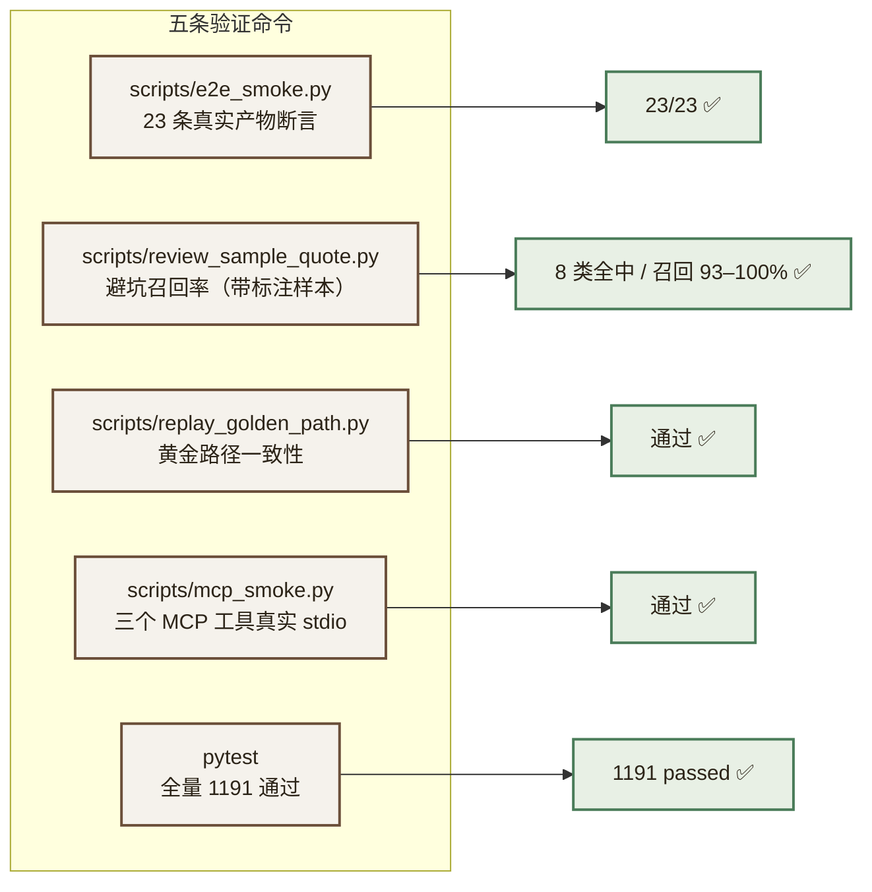

| 命令 | 验什么 | 结果 |
|---|---|---|
| `python scripts/e2e_smoke.py` | **23 条**对**真实产物**的断言，每条标了对应哪个 AC（清单条数由代码数出来：给 `phases` 时 23、不给时 22） | **23/23**（最近一次完整实测记录是 2026-09-26） |
| `python scripts/review_sample_quote.py` | 避坑审查在带标注样本上的召回率（判据 `match_keywords`，可审计） | **8 类全中 / 召回 93%–100%（两次复测）** |
| `python scripts/replay_golden_path.py` | 黄金路径连续重放一致性（AC-32） | 通过 |
| `python scripts/mcp_smoke.py` | 三个 MCP 工具走**真实 stdio 协议** | 通过 |
| `python -m pytest` | 全量自动化测试 | **1191 passed / 0 skipped** |

> ⚠️ **AC-36 那一条会自我区分"没测成"与"不达标"。** 它另起一个解析任务、
> 按秒轮询、把见过的阶段记下来 —— 而实测有过一次失败：那一次主链很慢
> （A-06 88 秒、fan-out 段 120 秒），观测任务在同一个本机模型服务上撞了
> 节点超时，只看到一个阶段 `['analyzing']`，清单当时报的是"AC-36 未通过"。
>
> 那是**测量失败**，不是 AC 失败 —— 把一次 API 抖动报成"某条验收不达标"，
> 正是本项目"不产出看起来合理的错误"那条纪律的反面。现在它重试一次；
> 两次都没跑完才报「**本次未能测量**」并说明原因，而不是判它不过。
>
> ⚠️ **全量测试里的 37 条落库/检查点用例需要 psycopg3 + psycopg_pool +
> langgraph-checkpoint-postgres 且 PostgreSQL 可达**，缺任一条件会**跳过**
> （变成 `1093 passed, 37 skipped`）。**不要把这 37 条跳过当成"无所谓"** ——
> 它们曾经一次都没真正跑过：本机环境缺 psycopg3、容器里没装 pytest，
> 而代码里还写着一个 **Python 3.12 才有的 `asyncio.run(loop_factory=...)`**
> （本项目与容器都是 3.11）。**两头都不执行，于是它们看起来是绿的。**
> 现已修正并实测 **37/37 通过**。

---


## 十五、风险登记册

> **本章是全文档最该被认真读的一章。** 项目一开始只有一句「超时熔断」，没有系统性风险登记。以下每项都写明**触发条件**与**应对预案**——出问题时照表执行，不临场发挥。

| ID | 风险 | 触发条件 | 影响 | 应对预案 | 残留风险 |
|---|---|---|---|---|---|
| **R-01** | AI 效果图显存溢出 | 生成时报 `CUDA out of memory` | 方案无图 | ① 降分辨率至 448×448 ② 卸载 ControlNet ③ **直接返回矢量图**，`degraded=true` | 低（有兜底） |
| **R-02** | 首次加载超时 | 冷启动 20–40s 超过请求超时 | 用户等不到图 | 后端进程启动时**预热模型**；请求侧超时设 60s；进度条走 SSE | 低 |
| **R-03** | 内存不足 OOM（容器被杀） | 宿主可用内存 < 1GB，出现 `exit(137)` | 服务中断 | ① compose 设 `mem_limit` ② 上跑前 `docker system prune` ③ **Reranker 用完即停** ④ 监控 `/system/health` | **中**（本机已多次发生） |
| **R-04** | DeepSeek 限流 / 涨价 / 断服 | HTTP 429 / 5xx / 响应变慢 | 解析与方案生成失败 | **已修正**：不再是"精度下降的降级"，而是**能力降档**——解析只出房间名（`degraded_basic`），诊断/方案/预算等文本类任务可正常降级到 `qwen2.5:3b`。**额度耗尽时全站转本地模式**并在 UI 显著提示 | 中（视觉能力大幅受限，但结果不再编造） |
| **R-05** | Token 成本超预算 | 埋点显示单次调用成本超阈值 | 不可持续使用 | ① 语义缓存命中率优化 ② 方案生成改流式分批 ③ 截断超长上下文 | 低 |
| **R-06** | 模型下载失败 | hf-mirror 限速或失效 | M5 阻塞 | 切换 ModelScope 源；模型权重放 E: 盘并**做校验和归档**，避免重复下载 | 低 |
| **R-07** | 户型图识别准确率不达标 | 标注集召回 < 85% | AC-02 不通过 | ① few-shot 提示词优化 ② 要求上传更清晰的图 ③ 提供**手动修正房间框**的兜底交互 | **中**（模型能力边界） |
| **R-08** | 局部替换（Inpainting）做不出来 | M7 结束时仍无法在 3.5GB 内稳定运行 | AC-10 不通过 | **整体降级为路线图**，文档与演示中明确标注"规划中"。**不要为它延期整个项目** | 高（已预判） |
| **R-09** | 全友产品数据不可得 | 无公开结构化价格接口 | AC-18 覆盖率不达标 | 构造演示种子数据并**显著标注为演示数据**；面试中说明取数方案 | **中** |
| **R-10** | 矢量图效果不佳，演示说服力弱 | 评审反馈"这不算效果图" | 项目观感下降 | ① 矢量图做深：**伪 3D 等轴测**、材质贴图、光照示意 ② 用 AI 图做"风格示意"补充 ③ **主动说明技术取舍** | 中 |
| **R-11** | ~~出图显存超预算~~ | — | — | 🟢 **已消除**：M0 实测 10/10 张不 OOM，峰值 0.968GB（阈值 3.2GB）。根因是早期未考虑 `enable_model_cpu_offload()` | **已消除** |
| **R-18** | **出图跨种子不稳定** | 换用 LCM-LoRA 或调低 CFG 时复现 | 演示时出废图 | ① **LCM 默认关闭**，走标准采样 ② AC-38 抽检 5 个种子 ③ 演示用固定种子 + 预热确认 | **低**（已用确定性配置规避） |
| **R-19** | **对外过度承诺"效果图"** | UI/README/面试中出现"装修效果图"字样 | 实际交付的是 3D 户型渲染图，构成虚假宣传 | ① AC-39 文本检索 ② 三处措辞统一为「3D 户型渲染图」 ③ 主动说明任务边界 | **中**（措辞容易滑回去） |
| **R-12** | **AI 图几何漂移导致热区错位** | 几何一致性自检 IoU 普遍 < 0.70 | 热区误导用户 | ① 该图 `precision=none`，不放热区 ② 提示用户看矢量图 ③ 若普遍不达标，则 AI 图纯做风格示意 | 中 |
| **R-13** | **弱模型编造结构信息**（已发生） | 降级时输出越界 bbox、虚构墙体 | **用户基于错误信息做拆改决策** | ① `allow_degrade=False` 禁止全量解析自动降级 ② 降级只问房间名 ③ 质量闸门 ④ UI 水印 + 需人工复核 | **低**（已有四层防护） |
| **R-14** | **隐私开关失效**（**已实际发生并修复**） | `prefer_local=true` 但请求仍发往云端 | 隐私承诺违约 | ① `force_local` 在提供方选择层强制 ② AC-24 改为**运行时抓包**验证 ③ LLMClient 层加断言测试 | **低**（已修复且有测试护栏） |
| **R-15** | **Token 预估偏差过大** | `/system/metrics` 显示 variance 长期 > 100% | 成本失控预警失准 | ① M0 用真实账单标定单价与 token 估算公式 ② 偏差写入 metrics 供持续校准 | 低 |
| **R-16** | **降级结果流入下游产出零值垃圾** | 携带降级 `layout_id` 触发方案生成 | **返回一个 ¥0 的预算且不报错**，用户会当真 | ① `capabilities.py` 守卫在入口拦截 ② 前后端双重校验 ③ AC-34 专项验收 ④ 数据驱动而非 mode 驱动，完整模式缺数据同样拦 | **低**（已实现且有测试） |
| **R-17** | **IoU 指标本身无法判别** | M5 标定时发现可信组与不可信组 IoU 分布重叠 | 几何自检形同虚设 | ① **默认关闭该功能**，不依赖未标定阈值 ② 标定结论无论哪种都写死进代码 ③ 最保守方案：AI 图永久不放热区 | 低（默认即最保守） |

### 15.1 「诚实降级」原则（贯穿全文）

本项目的技术条件明确不满足初版设计的部分承诺。**处理方式只有一条：显式降级、显式标注、显式告知。**

- 对外（用户/评审）：UI 上可见的降级提示，不用"AI 生成"掩盖"矢量渲染"。
- 对内（代码/日志）：`degraded` 字段贯穿 API → 审计日志 → 前端，**可审计、可统计、可追溯**。
- 对文档（本文）：降级项一律标注 C 级与 ⚠️，并在 ADR 中写明依据。
| **R-20** | **方案生成超出 P95 目标**（2026-09-26 登记） | `/design/generate` 实测墙钟约 100s，而 2.3.1 的目标是 < 60s | 演示时等待偏长；目标未达成 | ① **不调低目标来"达标"** —— 目标写在文档里，超了就是超了。② 根因明确：A-06 是汇聚节点，串行约 39s 无影子可躲。③ 可行方向：把 A-06 的检索段并行化（已拆出 `retrieve_knowledge` 节点，实测 8.1s）、或对三套方案的审查并发发起。**均未实施** | 中（已量化，未消除） |
| **R-21** | **前端没有测试框架**（2026-09-26 登记） | 全仓无 vitest、无 `*.spec.ts` | 以「前端测试」为验证方式的验收项，其护栏实际落在别处 | ① 已用两类替代护栏：`tests/test_frontend_contract.py` 静态比对前端源码与后端 schema；前端 3D 逻辑经 `frontend/probe/` 数值探针（esbuild 打包后运行，判据独立于被测代码）。② **在验收表里逐条标注了这一点**，不假装前端有测试。③ 引入 vitest 是明确的下一步 | 中（已替代，未根治） |


## 十六、演进路线

### 16.1 已完成的阶段

项目按 M0–M9 十个里程碑推进。**M0 的定位是"把验证不可行假设的成本前移"** ——
在第 9 周才发现出图跑不动，代价是四周返工；在第 1 周发现，代价只是改一份文档。
这一条后来被证明是整个排期里最值钱的决定（见 ADR-01）。

| 阶段 | 交付物 | 对应验收 | 结果 |
|---|---|---|---|
| **M0 环境与可行性验证** | 4 容器 Compose、conda 环境、显存/延迟/成本三项基准实测、L0–L3 出图分级实测 | AC-16 / AC-22 | ✅ **这一阶段直接推翻了初版的出图方案** |
| M1 认证与权限 | 三角色登录 + RBAC + 额度限流 + 审计日志 + trace_id 中间件 | AC-01/12/13/14/30 | ✅ |
| M2 户型解析 | 多模态解析（质量预检 + 能力匹配降级 + 质量闸门）+ 五维诊断 + 接口异步化 | AC-02/03/17/24/25/26/27/29 | ✅ |
| M3 多 Agent 方案生成 | LangGraph 工作流 + 3 套方案 + 对比矩阵 + 规则引擎预算 | AC-04/05/18 | ✅ |
| M4 避坑审查与知识库 | RAG（嵌入式 Chroma）+ 避坑 Agent + 环保评估 | AC-06/20 | ✅ |
| M5 出图与热区 | VectorRenderer + 热区映射 + 3D 场景 | AC-07/09/21 | 🔶 矢量图与热区完成；**AI 出图路径经复测作废**（见 8.2 与 ADR-01） |
| M6 风格与画质打磨 | 风格支持矩阵、3D 表面色 | AC-39 | 🔶 **转为"3D 观感"** —— 表面色改由约束搜索生成（见 ADR-16） |
| M7 局部替换 | 框选 + 局部重绘 | AC-10 | 🔶 **重定性为「矢量图上换地面材质」**（原载体随 AC-08 作废） |
| M8 MCP 工具化 + 优雅停机 | 三个 MCP Server + lifespan 排空等待 | AC-11/31 | ✅ |
| M9 打磨与验收 | 端到端清单 + `/system/metrics` + Golden Path 重放 + 全量测试 | AC-15/19/23/32 | ✅ |

### 16.2 下一步

按价值排序：

| # | 事项 | 为什么排前面 |
|---|---|---|
| 1 | **降低方案生成墙钟**（当前约 100s，目标 < 60s） | A-06 是汇聚节点，串行约 39s 无影子可躲。检索段已拆成独立节点（实测 8.1s），下一步可对三套方案的审查并发发起 |
| 2 | **构建标注测试集，把识别准确率变成数字** | 「召回 ≥ 85%」目前无法判定 —— 没有标注集就没有分母 |
| 3 | **引入 vitest** | 前端目前无测试框架，这是验收表里唯一一处"名实不符"（见 R-21） |
| 4 | 用真实全友产品库替换演示数据 | 需要业务侧提供结构化价格接口 |
| 5 | 用户表落库 | 当前用户仍在 `seed_data/users.json` |
| 6 | 家具引入 mesh 与贴图 | 当前是体块；需要一套可用的家具模型库 |

### 16.3 接口冻结：M0 基准脚本与 Provider 的复用关系

**问题**：M0 的 `bench_image.py` 与 M5 的 `LocalSD15Provider` 如果各写一套 SD1.5 推理逻辑，
就是同一件事做两遍——而且两份实现会随调优逐渐分叉，M0 的结论再也迁移不到 M5。

**约定：M0 的基准建立在 `LocalSD15Provider` 的最小实现之上，M5 做增量扩展而非重写。**

```
backend/app/services/image/
├── base.py                # ImageProvider 抽象接口（M0 就定下来）
├── vector_renderer.py     # 矢量渲染（M5，纯 Pillow 零依赖）
├── local_sd15.py          # SD1.5 Provider
│     ├─ M0 实现：L0/L1 级别（SD1.5 + ControlNet @512 / @448）
│     │            不含 LoRA、不含 Inpainting、不做热区集成
│     │            目标 = 可跑通 + 可测显存
│     └─ M5 增量：L2/L3 降级分支、风格 LoRA、与 VectorRenderer 的协同
└── __init__.py            # get_image_provider() 工厂
```

**接口在 M0 就冻结**（`ImageProvider.generate(layout, style, level) -> ImageResult`），
这样 M0 实测出的「哪一级能跑通、峰值显存多少」可以直接变成 M5 的配置默认值，
而不是重新验证一遍。

> **关键区别**：M0 是**可行性验证**，M5 是**正式集成**。
> 两者共享核心推理逻辑，只是"完整性"不同。

### 16.4 明确不做 / 推迟的功能

| 功能 | 处理 | 原因 |
|---|---|---|
| **让 minicpm-v4.6 做完整户型结构解析** | 🔴 **曾计划 → 明确不做** | 实测产不出合法结构化 JSON：编造越界 bbox、虚构墙体、坏语法。改为「只问房间名」+ 质量闸门（见 11.2.1） |
| **AI 图上的精确物品热区** | 🔴 **曾计划 → 明确不做** | ControlNet 不保证几何对齐，漂移 5–15%；IoU < 0.70 时一律不放热区（见 ADR-10）。**维持原判** —— 虽然 AI 图质量已达标，但几何仍非精确对齐 |
| **LCM-LoRA 加速** | 🟡 **曾为核心设计 → 默认关闭** | 实测跨种子极不稳定（seed=7 出 3D 图、seed=42 出噪声图）。标准采样 12.2s 已满足 P95<25s，**用 4.5s 换确定性** |
| **"装修效果图"这一交付承诺** | 🔴 **明确不做** | 输入是俯视平面图，让 SD1.5 出人眼视角实景是任务错配，实测失败。交付物重新定义为「**3D 户型渲染图**」 |
| **本地 SDXL + ControlNet** | 🔴 **曾计划 → 明确不做** | 底模 fp16 6.9GB，实测可用显存仅 **3.22GB**，必须 CPU offload，实际分钟级，P95 目标无法达成 |
| **阿里云 wan2.5-t2i 云端出图** | 🔴 **曾计划 → 明确不做** | 本机无 DashScope key；且与「户型图不上传第三方」条款冲突 |
| **YOLOv8 生成图物品检测** | 🔴 **曾计划 → 明确不做** | COCO 80 类不含地板/墙纸/空调；自建标注数据集工作量超出项目周期 |
| **阿里云 Qwen3-VL 作为主模型** | 🟡 **保留代码插槽，当前不启用** | 无 key。拿到 key 后一行配置切换 |
| **自建 Reranker 容器** | 🔴 **曾计划 → 明确不做** | 单吃 2.2–2.5GB，与 Ollama 同存必然 OOM。复用已有 `my-rerank`，按需启停 |
| **并发 ≥ 50 QPS** | 🟡 **改为 10 QPS** | 7.63GB VM + 单机 Ollama 下的 50 QPS 不可验证，改标保守可测值 |
| **Python 3.13 运行时** | 🟡 **改为 3.11** | 3.13 环境无可用 CUDA torch |
| 全自动 3D 建模 | 路线图 | 技术复杂，4GB 显存不现实 |
| 自动生成施工图 | 路线图 | 需专业 CAD 引擎 |
| 对接真实 CRM/供应商系统 | 明确不做 | 无真实数据，做出来是假的 |
| 多用户 SaaS 计费 | 路线图 | 第一版聚焦全友家居内部使用 |
| 实时协作编辑 | 路线图 | 工程量大，非核心 |
| 视频生成 | 路线图 | 算力要求高 |
| **内网穿透（nps / frp / lanproxy）** | 🔴 **明确不做** | 需自备公网 IP 中转服务器；把跑着 PG/Redis/用户数据的开发机暴露公网，风险与价值不成比例。演示走现场 Golden Path（附录 C） |
| **视频生成（Wan2.1 / CogVideo / SkyReels / LongCat）** | 🔴 **明确不做** | 5B–14B 级模型，**4GB 显存一个都跑不了**；且非核心 |
| **大规模 clone 开源仓库** | 🔴 **明确不做** | github.com 实测直连 9.9s，clone 大仓库极慢；参考项目**只读不拉**，需要的设计思路手抄进本文档 |
| 商品爬虫 | 明确不做 | 合规风险，用搜索关键词跳转替代 |
| IK 中文分词器 | 路线图 | 当前用内置 ngram，IK 为明确升级项 |
| ELK 日志监控 | 明确不做 | 个人项目引入成本高于收益 |

---

---

## 附录 A：架构决策记录（ADR）

> 每条 ADR 都记录**决策、依据（实测）、替代方案、后果**。**没有实测依据的决策不进这里。**

### ADR-01：图像生成改用 SD1.5 + LCM-LoRA，保留矢量图兜底

- **状态**：⛔ **已作废**（随 AC-08）。原为已接受，后经 M0 实测推翻
- **🔴 最终结论（M0 基准实测后）**：
  本 ADR 的前两版都在**过度悲观**。实测结果：

  ```
  ✅ L0 级别（SD1.5 + ControlNet @512）直接跑通，无需任何降级
     连续 10/10 张不 OOM
     峰值显存 0.968GB  ← 阈值 3.2GB，用不到三成
     均耗时   12.23s   ← P95 目标 25s，不到一半
  ```

  三处推翻：

  | # | 曾被写进本文档 | 实测 |
  |---|---|---|
  | 1 | 「offload 会把单图耗时从秒级拖到分钟级」 | ❌ 错。模型级 offload **既省 3GB 显存又更快**（5.33s vs 6.58s）——全量上卡时分配器颠簸 |
  | 2 | 用 SD1.5 生成「室内效果图」 | ❌ 任务错配。输入是俯视平面图，正确产出是 **3D 等轴测户型渲染图** |
  | 3 | LCM-LoRA 4–8 步是必须的加速手段 | ❌ 跨种子极不稳定（seed=7 好、seed=42 坏）。**默认关闭**，改标准采样 20 步 |
  | 4 | 「很可能溢出，需 L0–L3 分级降级」 | ❌ L0 直接过，分级降级保留为**故障预案**而非日常路径 |

  **保留有效的部分**：矢量图常驻兜底（L3，0.00s）、全局串行锁、SSD15 分辨率上限 512。


- **实测 vs 理论对照**：

  | 项 | 理论值 | 实测值 | 偏差 |
  |---|---|---|---|
  | 可用显存 | 3.50 GiB | **3.22 GiB**（驱动口径） | **−8%**，理论值高估 |
  | CUDA context + cuDNN | **未计入** | 0.30–0.50 GiB | **漏项** |
  | diffusers 额外 buffer | **未计入** | 0.10–0.30 GiB | **漏项** |
  | SD1.5 方案总占用 | 3.46 GiB | **3.56–3.96 GiB** | 逼近或已超过可用 |
  | 结论 | "刚好卡满" | **大概率溢出** | 需 L0–L3 分级降级 |

  **方法论教训**：`torch.cuda.memory_allocated()` 只统计 PyTorch 缓存分配器，
  **看不到 CUDA context**（实测它显示 0MB）。显存预算必须用 `torch.cuda.mem_get_info()`
  或 `nvidia-smi` 从**驱动口径**读，否则会系统性低估。

- **补充决策**：为 M0 增加硬门槛 `bench_image.py`，按 L0→L3 逐级实测；
  **若 L2 都跑不稳，AI 出图整体降为路线图**，项目以矢量图 + 伪 3D 交付。这个判断必须在 M0 做掉。
- **背景**：初版规划 SDXL + ControlNet，目标 P95 < 30s。
- **实测依据**：可用显存 3.5GB；SDXL UNet fp16 约 6.9GB，加上 CLIP 与 VAE 需 CPU offload，实测同类硬件单图 60–180s。
- **决策**：改用 SD1.5（UNet 1.72GB）+ LCM-LoRA（4–8 步）+ ControlNet-sd15（0.72GB）@ 512×512，预估单图 2–5s。同时**新增 VectorRenderer 作为常驻兜底**。
- **替代方案**：① 云端 API — 无 key 且违反隐私条款，否决；② 继续 SDXL — 无法达成性能目标，否决；③ SD-Turbo — 基于 SD2.1，SD1.5 生态的 ControlNet 不可用，否决。
- **后果**：出图质量不如 SDXL；需额外实现矢量渲染器（约 2 天）。换来的是**图像链路 100% 可用**。

- **⚠️ 更正：依据引用不实**
  早期文档曾把 `SHAHID-AI-ROBOTICS/Stable-Diffusion-Setup` 与
  `codeaudit/stable-diffusion-low-vram` 列为本 ADR 的"低显存优化依据"。
  2026-09-22 逐条核实后发现：**前者是 A1111 webui README 的拷贝（无 SDXL-4GB 证据），
  后者是 2022 年的空壳仓库**。两条引用均不成立，已从第十章 移出。
  **本 ADR 的最终依据是附录 B的本机实测（驱动口径 3.22GB 可用显存），不依赖任何外部项目。**

### ADR-02：热区改由坐标映射生成，取消 YOLOv8

- **状态**：已接受
- **实测依据**：YOLOv8 通用权重基于 COCO 80 类，**不含地板、墙纸、空调**；开放词汇检测（GroundingDINO/OWL-ViT）额外需 1–2GB 显存，不可行。
- **决策**：热区坐标直接来自户型解析 JSON 的 room bbox，按 canvas 比例映射到效果图。矢量图路径精确（`precision=exact`），AI 图路径为房间级近似（`precision=room_level`）。
- **后果**：热区粒度从"具体家具"降为"房间/地面/墙面区域"；AI 图上热区为近似。**换来零额外模型、零显存占用、100% 稳定。**

### ADR-03：多模态主备对调

- **状态**：已接受
- **实测依据**：本机仅配置 DeepSeek key；现场验证 `deepseek-flash` 经 `/anthropic/v1/messages` 正确识别含文字示意图（320×240 → 240 input tokens）。本机无 DashScope key。
- **决策**：DeepSeek 主 → Ollama `minicpm-v4.6` 备 → `qwen2.5:3b` 兜底。Qwen3-VL 保留 provider 插槽不启用。
- **后果**：户型图解析需出网（已在安全条款中如实修订）；本地降级路径精度下降但可用。

### ADR-04：Docker 拓扑精简为 4 容器

- **状态**：已接受
- **实测依据**：`docker info` 显示 VM `MemTotal=8,189,022,208`（7.63GB）；本机 40+ 历史容器中多条 `exit(137)` OOM 记录。
- **决策**：仅保留 postgres / redis / backend / nginx；ChromaDB 改嵌入式；Ollama 走宿主机 11434；Reranker 复用 `my-rerank` 按需启停。
- **后果**：AC-16 从「6 服务」改为「4 服务」；失去 ChromaDB 的独立可扩展性（迁移 Milvus 时需改造，已在 5.3 预留 `chroma_id`）。

### ADR-05：后端运行时改用 Python 3.11（conda env `pytorch`）

- **状态**：已接受
- **实测依据**：`Anaconda3` base = Python 3.13.5，**torch 无 CUDA**；`envs/pytorch` = Python 3.11.15，torch 2.13.0+cu126，`cuda.is_available()=True`，且 langchain 1.3.17 / langgraph 1.2.11 / chromadb 1.5.9 / fastapi 0.141.1 齐备。
- **决策**：统一使用 pytorch env，补装 diffusers、psycopg2-binary、sqlalchemy、alembic、python-jose、passlib[bcrypt]、redis、python-multipart、langgraph-checkpoint-redis。
- **替代方案**：新建专用 env — 需重装 torch（约 3GB 下载），收益低于成本，否决。
- **后果**：技术栈文档中的 Python 版本修正为 3.11。

### ADR-06：模型与数据集统一落盘 E 盘，下载走镜像源

- **状态**：已接受
- **实测依据**：`huggingface.co` 直连超时（12s，code 000）；`hf-mirror.com` 200（2.5s）；`modelscope.cn` 302（0.46s）。磁盘 D: 仅剩 29GB（89% 占用），E: 剩 121GB。
- **决策**：设 `HF_ENDPOINT=https://hf-mirror.com`，备用 ModelScope；模型权重、Chroma 持久化目录、上传原图统一放 `E:/quanyou/`。
- **后果**：项目跨盘依赖 E: 盘可用性；需在部署手册中写明。

### ADR-07：预算数字由规则引擎计算，LLM 不得生成金额

- **状态**：已接受
- **背景**：LLM 算术不可靠，且错误是**静默的**——看起来合理的错误数字比明显崩溃更危险。
- **决策**：`calc_budget` 实现为纯函数（面积 × 单价 × 工艺系数 × 地区调整），LLM 仅负责文字组织与砍价话术。DB 中记录 `budget_computed_by`。
- **后果**：预算部分可单元测试；丧失"AI 智能估价"的叙事（但获得**可验证性**，这在面试中价值更高）。

### ADR-08：图像生成移出 LangGraph 并行分支，改串行后置

- **状态**：已接受
- **背景**：初版设计中效果图生成为 MCP 工具，可被 3 路方案分支并发调用。
- **决策**：图像节点移至 `fan_in_aggregate` **之后**，全局串行锁保护。
- **理由**：3 路并发 × 每路多张图，在 3.5GB 显存上必然 OOM。**串行 5 张图的用户感知，远好于并发崩溃。**
- **后果**：总耗时增加（3 张图约 +15s）；换取 AC-22（连续 10 张不 OOM）可达成。

---

### ADR-09：降级链改为「能力匹配」，本地弱模型只做它能做的事

- **状态**：已接受
- **背景**：早期设计假设本地 minicpm-v4.6 是"精度下降的降级"，可承接完整户型解析。
- **实测依据**（故意给一张只有 2 个矩形、无墙体/窗/尺寸标注的图）：

  | 观察项 | 结果 |
  |---|---|
  | JSON 合法性 | ❌ `"orientation": north` 值未加引号，解析失败 |
  | bbox | ❌ 返回 `[500,0,1000,500]`，图片只有 512×400，**坐标越界** |
  | 墙体 | ❌ 编造 `non_load_bearing`（图中无任何墙体信息） |
  | 指令遵循 | ❌ 明确禁止仍加 markdown 围栏 |
  | 房间名 | ✅ 读对（"Living room"/"Bedroom"） |

- **决策**：
  1. 全量解析设 `allow_degrade=False`，**禁止**自动降级——宁可显式失败，也不让弱模型硬编结构。
  2. 失败后走**能力匹配**的降级路径：只问房间名（`DegradedLayout` 只有 `rooms[].name`）。
  3. 加**质量闸门**：房间数 < 2 则整条链失败，不返回空壳。
  4. 降级结果的结构字段**一律留空**，由代码填充，不由模型推断。
- **替代方案**：直接让 minicpm 硬上（原设计）—— 否决，理由是它产出的是**看起来像结果的垃圾**，
  比失败更危险；用户会据此做拆改决策。
- **后果**：降级时用户拿不到面积/墙体，但拿到的东西**每个字都是真的**。
  这是"少给但给真的"优于"多给但掺假"的取舍。

### ADR-10：AI 图热区必须先过几何一致性自检

- **状态**：已接受
- **背景**：早期设计假设"ControlNet 保持几何结构，按 canvas 比例线性缩放"即可定位热区。
- **问题**：ControlNet 做的是**结构引导**而非**几何约束**，墙体边缘漂移 5–15% 是常态。
  若 AI 图整体偏移 8%，热区就会落到错误房间，用户悬停地板却被告知"这是主卧墙面"。
  **错误的精确比诚实的近似更伤信任。**
- **决策**：用 ControlNet 的 conditioning 图与生成图**各自转成边缘图后求 IoU**
  （先膨胀容忍 1–2px 抖动）。不达标则 `precision=none`，AI 图不放热区。
- **技术细节**：不能拿「房间 bbox（区域）」直接与「边缘检测（像素）」求 IoU——
  两者量纲不同，算出的数没有意义。必须两边都先转成边缘图。

- **⚠️ 修正：阈值不得预设，默认关闭**

  初版预设了 `0.70 / 0.85` 两个阈值，但**这两个数字没有任何实测依据**，而且大概率是错的：

  | 问题 | 说明 |
  |---|---|
  | conditioning 图是**干净的二值结构线** | 由 layout 渲染而来，无纹理、无光影、无噪点 |
  | 生成图的 Canny 结果**包含大量非结构边缘** | 材质纹理、光影过渡、笔触噪点都会被检出 |
  | 结果 | **即使几何完全对齐，两者边缘 IoU 也可能只有 0.4–0.6** |

  **这意味着 0.70 的阈值会让所有 AI 图都不显示热区**——不是"严格"，是"失效"。

  **决策：阈值不预设，默认关闭该功能。**

  ```
  IMAGE_HOTSPOT_ENABLED = false        # 默认：AI 图不放热区，全部热区走矢量图
  IMAGE_HOTSPOT_IOU_THRESHOLD = null   # 待 M5 实测标定后写明
  ```

  **M5 标定规程**（必须产出数据，不能凭感觉调）：

  1. 取 20 张不同风格的生成图，人工标注"热区是否可信"（是/否）
  2. 对每张计算边缘 IoU，记录数值
  3. 看 IoU 能否**区分**这两组——若可信组与不可信组的 IoU 分布几乎重合，
     说明**这个指标本身就无法判别**，那就直接放弃自动判定
  4. 三种可能的结论，任一都要写死在代码里并回填本节：

  | 结论 | 条件 | 处理 |
  |---|---|---|
  | A. 阈值可用 | 两组分布可分 | 取分界点作为阈值，启用功能 |
  | B. 阈值需下调 | 可信组 IoU 中位数约 0.55 | 阈值下调至中位数附近 |
  | C. 指标无效 | 两组分布重叠 | **放弃自动判定，AI 图永久不放热区** |

- **关键认知**：这条自检的目的**不是判断生成图质量，而是判断热区能不能被信任**。
  如果边缘 IoU 无法稳定区分这两种情况，就采用最保守策略——
  **AI 图只做风格示意，所有热区都在矢量图上**。
  这完全符合本文档反复强调的诚实原则：**宁可少给，不可给错。**
- **后果**：默认情况下 AI 图无热区，用户被引导到矢量图查看精确热区。
  这一默认行为**不依赖任何未标定的阈值**，因此现在就可以确定下来。

### ADR-11：长任务接口统一异步化

- **状态**：已接受
- **背景**：起初 `/layout/parse` 同步（P95 20s）、`/design/generate` 异步，风格不一致。
- **理由**：20s 已超出浏览器请求的舒适区；同步接口无法展示进度、无法优雅重试、网络抖动即前功尽弃。
- **决策**：`/layout/parse` 改为异步，返回 `task_id`，与 `/design/generate` 统一。
  前端 M2 用轮询，M8 可选升级 SSE。
- **替代方案**：保持同步 + SSE 推进度（评审方案 B）——演示效果更好但复杂度高，且两个接口仍不一致，否决。
- **后果**：前端需要轮询逻辑（约半天工作量）；换来接口一致性 + 未来加进度条/批量上传不改契约。

### ADR-12：隐私模式在「提供方选择层」强制，不在业务层声明

- **状态**：已接受
- **背景**：**这是本次编码阶段实际发生并修复的缺陷。**
  `prefer_local=true` 最初只改了提示词与 Schema，**提供方仍是 DeepSeek**，
  户型图照样发往 `api.deepseek.com` —— 隐私承诺被静默违反。
- **为什么测试没抓到**：单元测试用的 Fake 客户端只认识 schema，**不认识 provider 概念**。
  34 个测试全绿，缺陷却真实存在。
- **决策**：`LLMClient._chain(force_local=True)` 在**提供方选择的那一层**强制返回本地模型；
  并在 LLMClient 层补 4 条断言测试（直接断言"谁会收到这个请求"）。
- **后果**：AC-24 的验证方式从"代码审查"升级为**运行时抓包**——
  代码审查看不出这种问题，只有真打真系统、看真日志才能暴露。
- **推广原则**：**安全/隐私类约束必须在资源选择层强制，业务层的"表示一下"等于没有。**

### ADR-13：全链路 trace_id 与优雅停机

- **状态**：已接受
- **背景**：系统有 `/system/health` 与 `/system/metrics`，但没有请求级追踪；
  且长时间 LLM 调用 + 容器重启容易导致请求处理到一半被 kill。
- **决策**：
  1. 每个请求生成 `trace_id`，经 loguru `contextualize` 贯穿 API → Agent → LLM → 审计日志，
     并在响应信封与错误提示中返回前端。异步任务需把 `trace_id` 随 `task_id` 落库后取回重绑
     （异步上下文不会自动继承）。
  2. FastAPI 用 **`lifespan` 上下文管理器**实现优雅停机
     （**不用 `@app.on_event("shutdown")`——该 API 在 FastAPI 0.141 已废弃**）：
     收到 SIGTERM 后等待进行中任务完成（≤30s），再关闭 DB 连接池与 Redis 连接。
- **后果**：用户报障时贴一个 `trace_id` 即可定位整条链路；成本极低（一个中间件 + 日志绑定）。

---


### ADR-14：3D 家具摆放由规则计算，不调用模型

**状态**：已采纳（2026-09-24）

**背景**

3D 场景需要"这套方案摆了什么家具、摆在哪"。此前 `services/furniture/catalog.py`
（51 条目 + 三套风格配色 + 匹配器）写好也测过了，**生产代码零调用方**；
3D 场景里只有墙、门、地、顶、灯。

**决策**

坐标由 `services/furniture/placement.py` **按规则计算**，返回体经
`GET /layout/{id}/furniture` 暴露。

**图 11 · 3D 家具摆放规则**

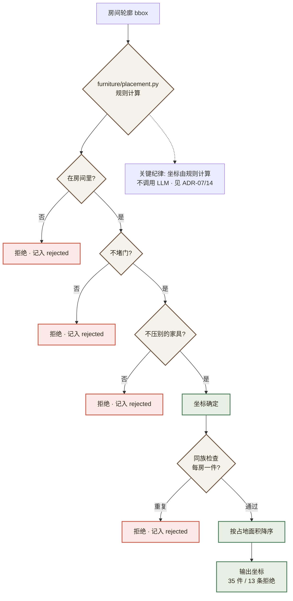

**依据**

一个坐标要站得住，必须**同时**满足三条：在房间里、不堵门、不压别的家具。
而这三条是**可计算的**。让模型给坐标，质量标准就只剩下"看起来合理" ——
那正是本项目一路在防的东西（见 3.1 禁止编造）。

这与 ADR-07（预算）、`services/environment.py`（环保结论）是同一条纪律的第三次应用。

**代价与已知边界**

有意取舍，全部写在 `placement.py` 的模块说明里：不做全局动线宽度、
不做非矩形房间（房间轮廓本就是 bbox 近似）、不做 L 形组合、不做观感。
家具是**体块，无 mesh 与贴图**。

一个具体表现：卫生间 1.9×1.1m 只摆得下淋浴房，马桶与浴室柜因"前方净空被占"被跳过 ——
**判据没错，是"大件优先"这条规则在极小房间里不合意**。要改需要目录里再加一个
"必要性"维度，那是另一个决定。

**实现中量出来的两处规则缺口**（都不是想出来的）：

| 现象 | 原因 | 处置 |
|---|---|---|
| 主卧摆了床尾凳与梳妆台，**没有床** | 排序键把 `need_wall=False` 排在前，理由是"不靠墙的是功能中心（床/沙发/餐桌）"—— 而**床尾凳也不靠墙** | 改成按占地面积降序 |
| 客厅摆了**三张沙发** | 沙发是三件大件里最大的，连着占满三个名额 | 目录补显式 `family` 字段，同族每房只摆一件。**不按 id 前缀猜** —— `dining_chair` 与 `dining_table` 前缀相同但不是同族 |

**结果**：摆下的从 24 件到 **35 件**，剩余的 13 条拒绝**全是真实的几何原因**
（不再有"房间满了"这种策略性拒绝）。`violations()` 一个字没放松 ——
摆不下仍然如实记进 `rejected`。

---

### ADR-15：LangGraph 检查点存储由 Redis 改为 PostgreSQL

**状态**：已采纳（2026-09-24）· **偏离原需求字面口径，已记录**

**背景**

原需求写的是「Redis 会话恢复」。而 `langgraph-checkpoint-redis` 依赖 **RediSearch**，
启动时要发 `FT.INFO`：

```
redisvl.exceptions.RedisSearchError: unknown command 'FT.INFO'
```

而架构钉死的 `redis:7-alpine` **没有任何模块**（`MODULE LIST` 为空）。

**决策**

改用同 Docker 网络里的 PostgreSQL 做检查点存储。**语义没有变** ——
"中断后状态可恢复"这条保证仍然成立。

**依据**

| 选项 | 代价 |
|---|---|
| 换 `redis/redis-stack-server` 镜像 | 镜像明显更重（含 RedisJSON + RediSearch），而本机 Docker VM 7.63 GiB 的余量本就紧张 |
| **改用旁边的 PostgreSQL** ✅ | 偏离需求字面口径 |

选定后者：`qy-postgres` 一直在跑、**完全空闲**（当时代码里一行都没读写过它），
用它做检查点等于白捡。

**顺带修掉一处命名空间冲突**

户型暂存用 `qy:task:layout:<id>`（STRING），与任务进度 `qy:task:<task_id>`（HASH）
**共用一个前缀**。平时相安无事，而启动接管要 `SCAN qy:task:*` ——
一头撞上 WRONGTYPE，整次恢复返回空。已给暂存改用独立常量。

**验证方式（不靠 mock）**

- `tests/test_checkpoint.py` 用 `os._exit()` **硬退起真崩溃**，两个进程接力把同一
  thread 跑完，并断言已落库的节点不重跑。
- 容器级实测：任务在飞 15s 时 `docker kill`（SIGKILL）→ `docker start` →
  日志出现「启动接管：发现 1 个未完成任务」→「从检查点续跑」→ 任务 `completed`、9 个房间。

---

### ADR-16：3D 表面色由约束搜索生成，不手工调

**状态**：已采纳（2026-09-26）

**背景**

3D 场景里六个材质角色（木/布艺/金属/石材/绿植/白）的颜色要满足两条约束：

1. 每个角色对 3D 地面 **≥ 2:1** 对比度 —— 能从地面里分出家具
2. 角色**两两之间** Lab ΔE **≥ 6.6** —— 彼此分得出

第一版是手工调的，**约束全过、画面一团黑**：六个角色里三个接近纯黑
（`metal #050506` 亮度 0.0015、`green 0.0072`、`wood 0.0135`）、一个接近纯白。
根因是**手工调参没有目标函数**。

**决策**

把约束写死成可复算的判定，用 `scripts/derive_surface_palette.py` 做约束下的搜索，
目标函数是"最大化最小的一对 ΔE"。

**图 12 · 3D 表面色约束搜索**

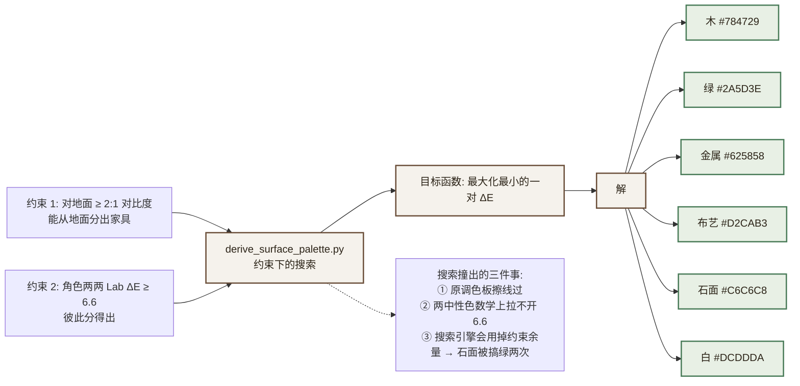

**搜索过程撞出的三件事（每件都比调色本身更有价值）**

**① 原调色板不只是"暗"，它还差一点就不合格。**
`fabric` 对地面 **2.02:1**（门槛 2.00）、`chinese` 的 `green↔metal` **ΔE 6.61**（门槛 6.6）
—— 都擦着线过。而两个接近纯黑之间的 ΔE 天然接近 0，所以那条 6.61
正是"暗到分不出来"的另一种表现。

**② 「石面中性 + 白中性」在现行地面下永远拉不开 6.6 —— 这条是算出来的。**
对地面 ≥2:1 把可用亮度从地面处劈成两半：

```
暗侧上限 = (F + 0.05)/2 − 0.05        亮侧下限 = 2(F + 0.05) − 0.05
```

F 越高，亮侧越窄。F=0.2775（modern）时亮侧只剩 **5.86** 的 ΔL\* 空间，
F=0.2933（nordic）只剩 **4.18**，而门槛是 6.6。
**两个中性色只能靠亮度差拉开 —— 差不够就是差不够。**
所以地面必须压暗，搜索从原值往下试、取第一个可行的。

**③ 约束留下的一点余量，搜索引擎一定会用掉 —— 石面被搞绿了两次。**
第一版「饱和度 ≤0.10 + 色相 30–220」搜出 `#C7D0C6`（淡绿白）；
第二版「饱和度 ≤0.06」还是 `#C8CEC8`。原因是 ΔE 里**色相也是分量**，
把饱和度顶到上限就能从"白"那里多抠一点色差。数值合格、语义全错。
最后卡到 **≤0.02** 才真正中性。

> **教训：想让某个性质成立，就得把它写成"没有余量"，
> 不能靠"上限松一点但它应该不会去顶"。**

**结果**

| 角色 | 现代简约 旧 → 新 | 相对亮度 |
|---|---|---|
| wood | `#271D11` → `#784729` | 0.0135 → 0.082 |
| green | `#0C170B` → `#2A5D3E` | 0.0072 → 0.073 |
| metal | `#050506` → `#625858` | 0.0015 → 0.095 |
| fabric | `#D6CCBC` → `#D2CAB3` | 0.611 → 0.578 |
| stone | `#DEDDD9` → `#C6C6C8` | 0.723 → 0.594 |
| white | `#FCFCFC` → `#DCDDDA` | 0.973 → 0.713 |

最挤的一对 ΔE：modern 8.46、nordic 6.82、chinese 11.97。
两条新用例都做过**变异验证**（把 `metal` 退回纯黑、把 `stone` 换成淡绿白，
各自让对应用例变红）。

---

### ADR-17：3D 漫游默认自由视角

**状态**：已采纳（2026-09-26）· 需求方决定

**背景**

对同一张演示图连跑 **6 次解析**：

| | 实测 |
|---|---|
| 房间数 | 9（6/6 一致） |
| 门数 | 7 / 5 / 6 / 6 / 6 / 6 |
| 判为「可贴地行走」 | **3/6** |
| 从出生点的可达率 | 44% / 56% / 33% / 44% / 33% / 44% —— **从未超过 56%** |

也就是说"打开就是自由视角"本来就是**常态**。而原来的界面把它当失败来措辞
（「自由视角（后端判定不可行走）」配告警色），相机还停在房间里的 1.6m 高处朝纵深看
—— 那个机位什么都看不出来。

**决策**

**开局一律自由视角**，不跟后端的 `walkable.mode` 走。

**图 13 · 3D 漫游模式**

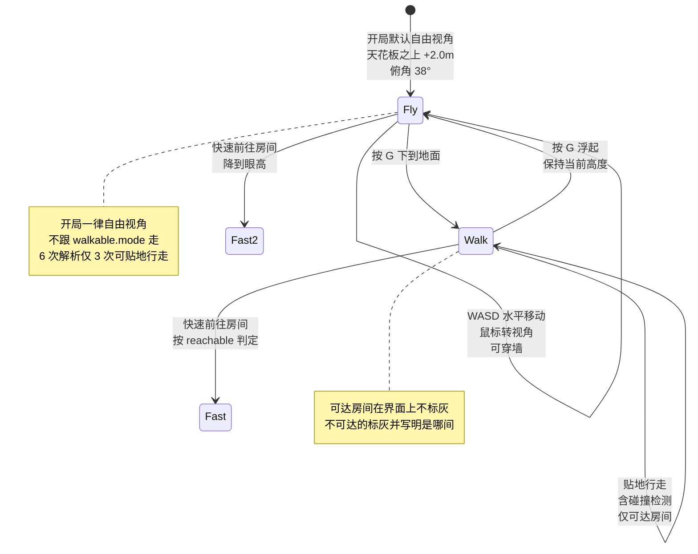

**落地（四件实事）**

| # | 改动 | 之前 |
|---|---|---|
| ① | 开局一律自由视角 | 可走路的户型开局是行走、不可走路的才是自由视角 —— **同一个演示两次打开是两种视角** |
| ② | 自由视角起点在**天花板之上俯视**（+2.0m、俯角 38°） | 停在房间里的 1.6m 平视 —— 看到的只有一面墙 |
| ③ | 措辞中性：「自由视角（俯瞰格局，可穿墙）」+「这个户型也能贴地行走」 | 「自由视角（后端判定不可行走）」，配告警色 |
| ④ | 「快速前往」按模式判定可点性 | 一律按 `reachable` 置灰加删除线 —— 而自由视角是穿墙的，**每间房都到得了** |

另补三处一致性：按 `R` 重生回到**当前模式各自的起点**；「快速前往房间」在自由视角下
**降到眼高**（不然是停在空中看房间）；切回自由视角**保持当前高度**不瞬移
（从房间里按 `G` 的人想要的是"浮起来越过墙看看"，弹到屋顶之上很突兀）。

**⚠️ 差点漏掉的：界面说自由视角、`rig` 里还在行走**

第一版只改了 `SceneViewer` 的 `mode.value = 'fly'`，**没给 `rig` 传起始模式** ——
而 `rig` 是从后端的 `data.mode` 推自己的模式的。于是：

```
UI 显示        自由视角（俯瞰格局）        ← 改到的
rig 实际       colliding = true、眼高、平视  ← 没改到的
```

两个后果：画面是**一扇门贴在眼前**（而界面写着"俯瞰格局"）；而且**第一下按 G 什么也不会发生**
（UI 从 fly 翻到 walk，rig 本来就在 walk）。

**是在截图里看出来的，不是想出来的** —— 单看代码两处都"对"。
修法是把起始模式做成构造参数，并加两条探针用例：「startMode 覆盖 walkable.mode」与反向覆盖。

**探针顺带抓到我自己的两处错**

默认俯角设成 38° 之后，原来的 WASD 探针先红了：

```
[fly] 朝向 0° 按 W 前进：点积 0.788
```

而 `0.788 = cos(38°)`。探针拿 `getWorldDirection()` 当基准，而那条视线现在带着俯仰角；
移动却是**水平的**。**所以是探针的判据错了，不是代码错了。**
修法两条：基准向量先去掉 y 分量再比方向；并**新增一条不变量** ——
"自由视角下低头之后按 WASD，垂直位移必须为 0"。

写这条新用例时又踩了一次自己的坑：拿 `camera.position.y` 前后比较来确认"真的低头了"，
而 `look()` **只改角度、不移动相机** —— 自检恒等，用例报的是"look() 没有让相机低头"。
改成看**视线方向**才对。

> （这一条留着：用例里写自检是对的，但**自检本身也会写错**。）

---

## 附录 B：本机环境基线

> 本章全部数据由 2026-09-22 现场采集，命令可复现。**这是本项目全部技术决策的唯一依据。**

### B.1 硬件实测

| 项目 | 实测值 | 对项目的影响 |
|---|---|---|
| CPU | Intel i7-11800H，8 核 16 线程 | 充足。Docker VM 独占 16 CPU |
| 物理内存 | **15.74 GiB**（16,905,969,664 B） | ⚠️ 偏紧。采集时**仅剩 3.28 GiB 可用**（Docker Desktop + 桌面应用已占 12GB+） |
| GPU | **NVIDIA RTX 3050 Laptop，4096 MiB**，驱动 576.83，CUDA 12.9 | ⚠️ 采集时已被桌面进程占用 277 MiB，**实际可用 ≈ 3.5 GiB** |
| 磁盘 C: | 89 GB 可用 / 323 GB | 项目代码放这里 |
| 磁盘 D: | **29 GB 可用 / 260 GB（89% 已用）** | ⚠️ 不要再往 D: 放模型 |
| 磁盘 E: | **121 GB 可用 / 352 GB** | ✅ **模型与数据集统一落盘至此** |
| 磁盘 F: | 84 GB 可用 / 301 GB | 备用 |
| 磁盘 G: | 34 GB 可用 / 176 GB | 备用 |

**显存账（决定图像方案）**

最初那份显存账是**理论推算**，且有一处方法论错误。实测校正如次：

```
── 实测（驱动口径）──────────────────────────────────
总量                                    4.00 GiB
桌面进程已占用                          -0.78 GiB
────────────────────────────────────────────────
实际可用                                3.22 GiB   ← 理论推算写的是 3.50，高估了 0.28
```

```
── SD1.5 方案占用（理论 → 实测修正）───────────────────
UNet fp16 1.72 + CLIP 0.25 + VAE 0.17 + ControlNet 0.72   2.86 GiB
512×512 中间激活（开 slicing 后）                         0.30 GiB
CUDA context + cuDNN workspace（理论推算漏算）          0.30~0.50 GiB  ← 关键遗漏
diffusers 管线额外 buffer                                 0.10~0.30 GiB
────────────────────────────────────────────────────────────────────
合计                                                    3.56~3.96 GiB
对比可用                                                3.22 GiB
```

**结论：理论推算的「刚好卡满 3.46GB」是乐观估计，实际大概率溢出。**

> **🟢 后续更新：上表的推算已被实测取代，且结论相反。**
> M0 基准实测（10/10 张，含 ControlNet @512）= **峰值 0.968GB，均耗时 12.23s**。
> 差异的来源是 `enable_model_cpu_offload()`——上表的 2.86GB 是**权重全量驻留显存**的算法，
> 而 offload 后任一时刻只有当前模块在卡上，实际占用降到 1GB 以内。
> 详见 ADR-01。
> **下表的分级降级预案仍然保留，但定位从「日常路径」改为「故障预案」。**

> ⚠️ 方法论提示：`torch.cuda.memory_allocated()` **看不到** CUDA context 开销
> （实测它只报 PyTorch 缓存分配器的量，会显示 0MB），真实占用必须用
> `torch.cuda.mem_get_info()` 或 `nvidia-smi` 从**驱动口径**读。
> 理论账正是因为在只算 PyTorch 口径，才漏掉了 context 这一块。

**图像生成分级降级预案（顺序不可颠倒）—— 已定位为故障预案**：

| 级别 | 措施 | 预估节省 | 代价 |
|---|---|---|---|
| L0 | SD1.5 + ControlNet @512，全部 slicing 开启 | — | 期望状态 |
| L1 | 分辨率降至 **448×448** | 激活 −25% | 出图略糊 |
| L2 | **卸载 ControlNet**，仅用提示词引导 | −0.72 GiB | **丧失结构一致性 → 该图必须关闭热区**（联动 ADR-10） |
| L3 | **只出矢量图** | 全部 | 无 AI 效果图，但功能完整 |

> **不得在 M5 才发现这个问题。** M0 的出图基准（`bench_image.py`）是本项目的**放行硬门槛**，
> 详见 7.1 的 M0 通过标准。

### B.2 软件实测

| 组件 | 实测 | 状态 |
|---|---|---|
| Python（Anaconda base） | **3.13.5** | ❌ ML 依赖生态不稳，`torch` 无 CUDA |
| Python（conda env `pytorch`） | **3.11.15** | ✅ **本项目唯一后端环境** |
| torch | **2.13.0+cu126**，`cuda.is_available() == True`，已识别 RTX 3050 | ✅ |
| transformers / sentence-transformers | 5.16.1 / 6.0.0 | ✅ |
| langchain / langgraph | **1.3.17 / 1.2.11** | ✅ 版本很新，注意 API 与旧教程差异大 |
| chromadb | 1.5.9 | ✅ 支持嵌入式 `PersistentClient`，**无需独立容器** |
| fastapi / uvicorn | 0.141.1 / 0.52.4 | ✅ |
| **diffusers** | **未安装** | ❌ 需补装（SD1.5 依赖） |
| **psycopg2-binary** | **未安装** | ❌ 需补装 |
| Docker / Compose | 29.7.2 / v5.5.1 | ✅ |
| **Docker VM** | **CPU=16，MemTotal = 8,189,022,208 B = 7.63 GiB** | ⚠️ **硬上限** |
| Node / npm | v24.16.0 / 11.13.0 | ✅ |
| Git | 2.53.0.windows.3 | ✅ |
| Ollama | **0.32.6**，服务已在 `:11434` 运行 | ✅ |

### B.3 本地 Ollama 模型（已就绪，无需下载）

| 模型 | 规格 | 用途 | 验证 |
|---|---|---|---|
| `minicpm-v4.6:latest` | 752M + 548M CLIP 投影，1.6 GB | **多模态兜底** | ✅ `capabilities: vision, tools, thinking` |
| `qwen2.5:3b` | 1.9 GB | 文本兜底 | ✅ 就绪 |
| `quentinz/bge-large-zh-v1.5` | 324M，1024 维，F16 | **Embedding** | ✅ 现场调用 `/api/embed` 返回 1024 维向量 |
| `qwen2.5:1.5b` / `deepseek-r1:1.5b` | 986MB / 1.1GB | 备用 | — |

> Ollama 模型实际存储于 `OLLAMA_MODELS=D:\AI\ollama_models`。（`E:\OllamaModels` 是空目录，非实际路径。）

### B.4 本机已存在、可直接复用的 Docker 镜像

**M0 无需联网拉镜像**：

| 镜像 | 用途 |
|---|---|
| `postgres:15-alpine` | ✅ 就绪 |
| `redis:7-alpine` | ✅ 就绪 |
| `chromadb/chroma:latest` | 备用（**推荐改用嵌入式，不启容器**） |
| `nginx:alpine` | 前端静态托管 + 反代 |
| `python:3.11-slim` | 后端镜像基础层，**与 pytorch env 大版本一致** |

### B.5 端口占用实测

| 端口 | 占用者 | 冲突风险 |
|---|---|---|
| `3306` | 本机原生 MySQL 8.0 服务 | 本项目用 PG，**无冲突** |
| `11434` | Ollama（宿主机） | **复用，不重复部署** |
| `5432` / `6379` / `80` | 空闲 | ✅ 可用 |

> ⚠️ 本机 Docker 内已有 **40+ 个历史容器**（ragstar / zhirongxi / thundersearch / zft2 / stock-agent 等），多数处于 Exited 状态，其中**多条 `exit(137)` = OOM 被内核击杀**。**M0 第一步必须先清理历史容器**，否则 7.63GB 预算无法保障。

### B.6 网络可达性实测

| 目标 | 结果 | 结论 |
|---|---|---|
| `huggingface.co` | **超时 (000, 12.0s)** | ❌ **直连不通，禁止硬编码 HF 下载** |
| `hf-mirror.com` | 200 (2.5s) | ✅ 需设 `HF_ENDPOINT=https://hf-mirror.com` |
| `modelscope.cn` | 302 (0.46s) | ✅ 国内替代源 |
| `pypi.tuna.tsinghua.edu.cn` | 301 (0.24s) | ✅ 但 **pip 未配置镜像**，需补 |
| `api.deepseek.com` | 401 (0.23s) | ✅ 可达（401 = 需鉴权，正常） |
| `dashscope.aliyuncs.com` | 404 (0.32s) | 可达，但**本机无 key** |
| npm registry | `registry.npmmirror.com` | ✅ 已配置 |

### B.7 大模型凭证与能力实测

| 项 | 实测 |
|---|---|
| 可用凭证 | `DEEPSEEK_API_KEY`（环境变量已配置） |
| Base URL | `https://api.deepseek.com/anthropic`（另有 OpenAI 兼容的 `https://api.deepseek.com/v1`） |
| 可用模型 ID | `deepseek-flash`、`deepseek-v4-pro`（`/models` 返回，仅此两个） |
| **多模态实测** | ✅ **已现场验证**：向 `/anthropic/v1/messages` 发送 320×240 含文字的户型示意图，模型正确识别出「2 个矩形，文字为 LIVING / BED」 |
| **Token 计量** | 单张 320×240 图 = **240 input tokens**；单次调用合计 389 tokens |
| DashScope / 百炼 | ❌ **无 key**，Qwen3-VL 与 wan2.5 均不可用 |

> 📌 **Token 单价须在 M0 实测确认**，本文档不引用未经核实的价目数字。「单次分析 < ¥0.5」这一目标保留，但改由埋点实测数据判定。

---

## 附录 C：黄金演示路径（Golden Path）

> **这条路径上的每一步都必须 100% 可复现。**
> 面试时对方说"跑一下看看"，就按这条路径走，**不即兴发挥**。

### C.1 路径定义

```
① 上传预置的 89㎡ 三室两厅户型图（scripts/fixtures/demo_89sqm.png）
   └─ 该图已通过质量预检，且在标注集内，识别结果稳定
        ↓
② 解析（约 15–20s，异步任务 + 进度显示）
   └─ 展示：置信度、不确定项、safety_notice（承重墙提示）
        ↓
③ 3 套方案并行生成（约 45s，进度条）
   └─ 方案 A 现代简约·经济 / 方案 B 北欧·中档 / 方案 C 中式·高端
        ↓
④ 双轨出图展示
   ├─ 矢量图（必出，< 3s）—— 热区精确
   └─ AI 效果图（尽力，< 25s，带 degraded 状态提示）
        ↓
⑤ 悬停查看价格
   ├─ 矢量图：2 个精确热区（exact）
   └─ AI 图：3 个房间级热区（room_level）或 0 个（IoU 不达标时）
        ↓
⑥ 导出对比报告（Markdown / PDF）
```

### C.2 演示前检查清单（严格版）

> 在 4GB 显存的机器上，**显存占用是生死攸关的**。以下按顺序执行，任一项不过就不开始演示。

```bash
# ── 建议在演示前 5 分钟执行 ──────────────────────────────
1. docker compose ps                    # 4 容器全部 healthy
2. nvidia-smi                           # 显存占用 < 500MB（仅为桌面进程）
                                        # 若 > 1GB，说明有残留进程，先排查
3. ollama ps                            # 确认没有其他模型驻留显存
4. 关闭浏览器多余标签页 / 其他 AI 应用 / 本地大模型工具
                                        # 这些都会抢显存，4GB 机器上尤其致命
5. scripts/warmup.py                    # ★ 预热：提前加载 SD1.5 到显存
6. scripts/replay_golden_path.py        # ★ 全链路预跑，确认无回归
```

> ⚠️ 第 6 步那个脚本**此前不存在**（2026-09-24 补上，AC-32 落点）。
> 它跑 3 次方案链并逐字段比对一致性，A 类字段要求**完全相等**。
> 与第 5 步的 `warmup.py` 是两个不同的东西：warmup 管"模型在不在显存里"，
> 它管"跑出来的东西和准备时一不一样"。

**`scripts/warmup.py` 是必须的，不是可选的。**

SD1.5 冷启动需要 20–40s 从磁盘加载权重。如果跳过预热，演示时**第一次出图要干等 40 秒**——
这 40 秒的沉默比任何技术缺陷都尴尬。预热脚本把模型常驻显存，后续出图直接进推理。

```python
# scripts/warmup.py 要点
warmup 内容 = [
    ("SD1.5 管线", lambda: provider.ensure_loaded()),        # 权重上卡
    ("Ollama 兜底模型", lambda: ollama_preload("minicpm-v4.6")),
    ("DeepSeek 连通性", lambda: ping_deepseek()),
    ("PostgreSQL / Redis", lambda: check_datastores()),
]
# 预热完成后打印显存占用，确认仍 < 3.2GB
```

### C.3 演示用图必须是固定的那一张

**`演示素材/户型图/03-三室两厅-98平.png` —— 98㎡ 三室两厅，已通过质量预检。**

> ⚠️ **本节原先写的是 `scripts/fixtures/demo_89sqm.png`，那个文件与那个目录都不存在**
> （2026-09-24 核对时发现）。实际可用的演示图是 `演示素材/户型图/` 下由
> `scripts/make_demo_floorplans.py` 生成的三张（45 / 78 / 98 ㎡），
> 本项目的房子是**合成的**，不是全友官网实拍（版权约束，见 `.gitignore`）。
> 这里改成指向真实素材，而不是反过来造一张 89㎡ 的图去凑文档 ——
> 错的是这一行，不是素材。

这不是偷懒，是**控制变量**：
- 该图经过多次实测，识别结果稳定（房间数、置信度波动小）
- 它能走通完整链路（面积、墙体、门窗齐全 → 所有操作 `allowed`）
- 它不会被质量预检拦下

**若面试官要求换一张随机图**，正确的回应是：

> "随机图的识别结果可能不稳定，这是模型能力的边界。
> 我们通过三层来兜底：上传前的质量预检、解析时的置信度与不确定项标注、
> 以及解析后的业务连续性守卫。您可以试一下，
> 如果识别质量不够，系统会明确告诉您哪些操作不能用，而不是给您一个错的预算。"

**然后当场演示这个降级路径本身——它比成功路径更有说服力。**

### C.4 现场故障应对（照表执行，不临场发挥）

| 故障 | 现象 | 应对 |
|---|---|---|
| DeepSeek 不可用 | 解析超时 | 正常展示降级路径——**这本身就是一个演示点**，讲"我们如何保证不编造" |
| AI 出图失败 | 无效果图 | 正常展示矢量图——**讲"兜底设计"和"诚实降级"** |
| 显存 OOM | 容器重启 | 切 `IMAGE_PROVIDER=vector` 重启，只讲矢量链路 |
| 网络完全不可用 | 什么都调不通 | 切本地模式（`prefer_local=true`），演示本地降级路径 |

> **关键心态**：这三条"故障应对"每一条都是**加分项而非减分项**——
> 能把失败路径讲清楚，比只会演示成功路径更能证明架构能力。
> **前提是：这些降级路径必须真的能跑通，且你亲手验证过。**


## 附录 D：环境准备清单（可直接执行）

```bash
# ── 0. 清理历史容器（释放 7.63GB VM 预算，前置必做） ──
docker rm $(docker ps -aq) 2>/dev/null
docker system prune -f

# ── 1. 模型与数据落盘 E 盘 ──
mkdir -p /e/quanyou/{models,data,uploads,logs}

# ── 2. 环境变量（写入项目 .env） ──
cat > .env <<'EOF'
HF_ENDPOINT=https://hf-mirror.com
HF_HOME=E:/quanyou/models/hf
OLLAMA_HOST=http://localhost:11434
DEEPSEEK_BASE_URL=https://api.deepseek.com
DEEPSEEK_API_KEY=<从系统环境变量继承，勿硬编码>
LLM_PROVIDER=deepseek
VISION_PROVIDER=deepseek
VISION_FALLBACK=ollama:minicpm-v4.6
EMBEDDING_MODEL=quentinz/bge-large-zh-v1.5:latest
EMBEDDING_DIM=1024
RERANK_URL=http://localhost:9999        # 留空则关闭 rerank
CHROMA_PATH=E:/quanyou/data/chroma
DATABASE_URL=postgresql+psycopg2://qy:qy@localhost:5432/quanyou
REDIS_URL=redis://localhost:6379/0
IMAGE_PROVIDER=vector                   # vector | local_sd15
SD15_MODEL_PATH=E:/quanyou/models/sd15
EOF

# ── 3. 补装 Python 依赖（pytorch env） ──
PY="D:/AI damoxing/Anaconda3/envs/pytorch/python.exe"
$PY -m pip install -i https://pypi.tuna.tsinghua.edu.cn/simple \
    diffusers psycopg2-binary sqlalchemy alembic \
    "python-jose[cryptography]" "passlib[bcrypt]" redis \
    python-multipart pydantic-settings openai \
    langgraph-checkpoint-redis langchain-community

# ── 4. 验证基准（M0 的核心产出） ──
$PY scripts/bench_vision.py     # 户型解析 P95 + 降级链验证
$PY scripts/bench_image.py      # L0–L3 分级出图 + 峰值显存（AC-22 依据）
$PY scripts/bench_tokens.py     # Token 成本与预估偏差（标定单价）
```

**M0 通过标准（5 条全绿才进 M1）**：

| # | 标准 | 对应验收 | 不通过的后果 |
|---|---|---|---|
| 1 | `docker compose ps` → **4 个服务全部 `healthy`** | AC-16 | 阻塞 M1 |
| 2 | `bench_image.py`：**至少 L2 级别连续 10 张不 OOM，峰值显存 < 3.2GB**（驱动口径） | AC-22 | **AI 出图整体降为路线图**，项目以矢量图交付 |
| 3 | `bench_vision.py`：户型解析 P95 < 20s | AC-23 | 调整 detail_level 或降分辨率策略 |
| 4 | **降级链验证**：拔网线/清空 key 后，解析正确进入 `degraded_basic` 且 `walls` 等结构字段为空数组 | AC-17/25/26 | 阻塞 M2（降级是 M2 的交付物） |
| 5 | **隐私验证**：`prefer_local=true` 时**抓包确认无请求发往 `api.deepseek.com`** | AC-24 | **阻塞 M2**（隐私承诺不可打折） |

> **第 2 条是硬门槛，且必须在 M0 出结论。** 若 L2 都跑不稳，就当场把 M5–M6 的 AI 出图部分
> 划掉——宁可早砍，不可拖到第 9 周才发现。
>
> **第 5 条用的是抓包，不是代码审查。** 本次编码阶段实际发生过「`prefer_local` 仍发往云端」
> 的缺陷而 34 个单元测试全绿——代码审查对这类问题无效，只有真打真系统才能暴露。

---


## 附录 E：术语表

| 术语 | 含义 |
|---|---|
| RAG | Retrieval-Augmented Generation，检索增强生成 |
| LangChain / LangGraph | LLM 应用开发框架 / 状态图 Agent 编排框架 |
| MCP | Model Context Protocol，模型上下文协议 |
| fan-out / fan-in | 并行分发 / 汇总模式 |
| Inpainting | 图像局部重绘 |
| SD 1.5 / SDXL | Stable Diffusion 1.5 / XL，图像生成模型（本项目用 SD1.5） |
| LCM-LoRA | Latent Consistency Model LoRA，把采样步数从 20+ 降到 4–8 步的加速技术 |
| ControlNet | 控制图像生成结构的神经网络 |
| RBAC | Role-Based Access Control，基于角色的访问控制 |
| E0 级 | 甲醛释放量 ≤ 0.05mg/m³ 的环保板材等级 |
| ENF 级 | 甲醛释放量 ≤ 0.025mg/m³ 的无醛添加板材等级 |
| ADR | Architecture Decision Record，架构决策记录 |
| **degraded** | **本项目核心概念：降级标志，贯穿 API / 日志 / UI 三层的诚实性契约** |

---


## 附录 F：参考资源

- 全友家居官网：https://www.quanyou.com.cn/
- LangGraph 官方文档：https://langchain-ai.github.io/langgraph/
- LangChain 官方文档：https://python.langchain.com/
- MCP 协议规范：https://modelcontextprotocol.io/
- DeepSeek API 文档：https://platform.deepseek.com/api-docs/
- Ollama 官方文档：https://ollama.com/
- ChromaDB 官方文档：https://docs.trychroma.com/
- Redis 官方文档：https://redis.io/docs/
- BGE 模型：https://huggingface.co/BAAI/bge-large-zh-v1.5
- **HF 镜像（本机必需）**：https://hf-mirror.com
- **ModelScope（备用源）**：https://modelscope.cn

---


---

**文档结束**

> 本文档是项目的**唯一需求与设计来源**。全部技术结论以本机实测数据为依据，
> 实测命令与输出见第十章。历史上被推翻的设计（SDXL 出图 / 云端正模型 / 6 容器 /
> YOLOv8 检测 / AI 效果图路径）及其推翻理由，已按主题并入正文与附录 A 的 ADR，
> 不再保留逐版修订的流水账 —— **决策留痕，过程不占版面。**