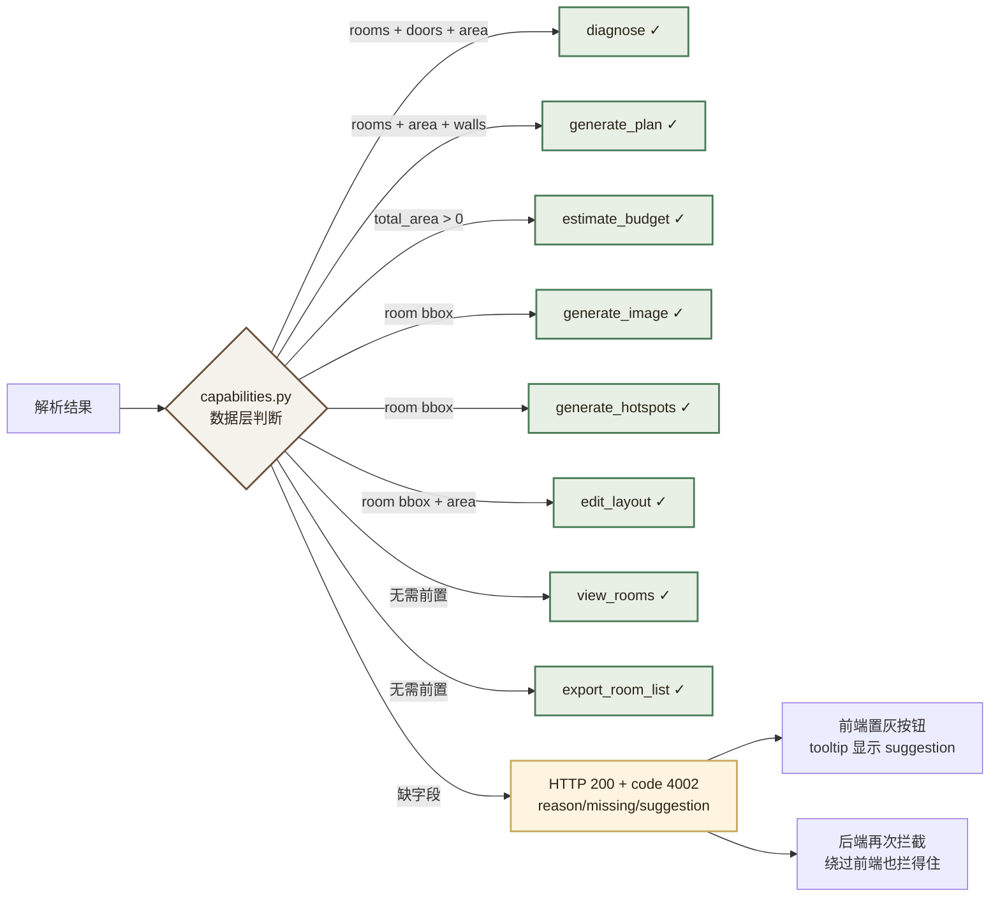
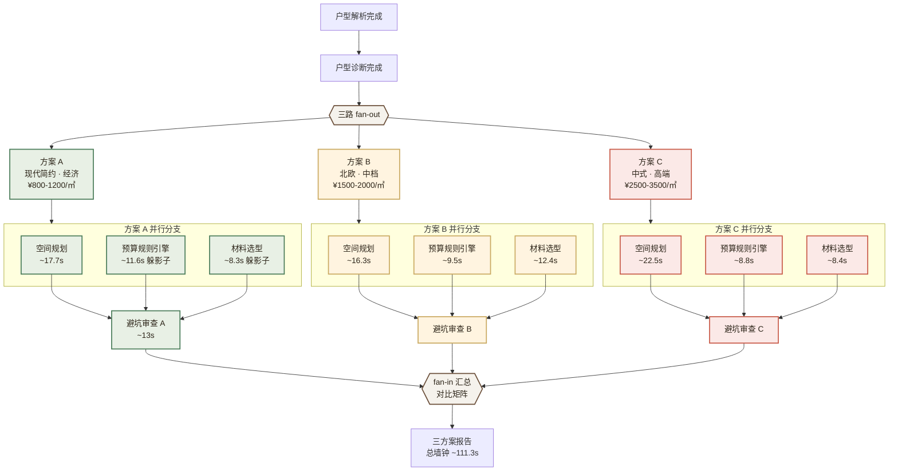
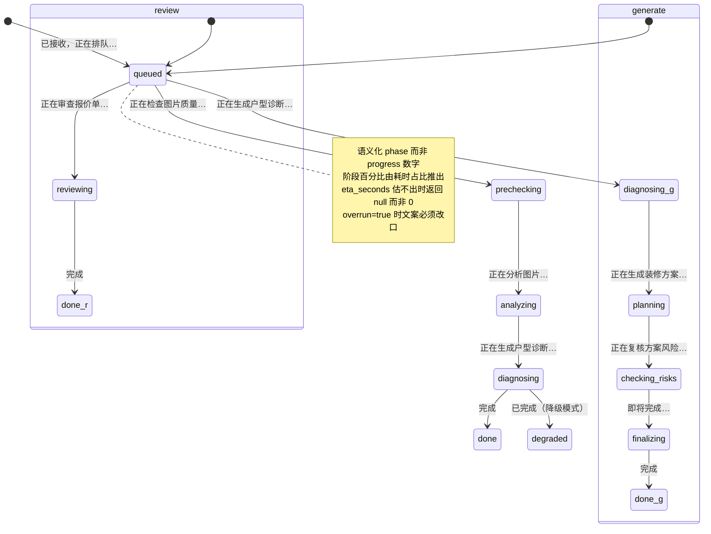
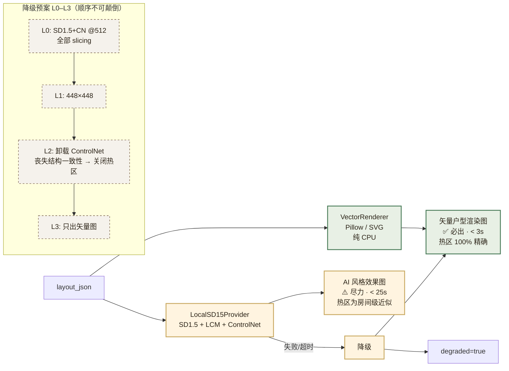

# 内江市全友家居 · 户型多模态装修推荐系统 — 需求文档 V2.2

| 文档属性 | 内容 |
|---|---|
| **项目名称** | 全友·智绘家 QuanYou Smart HomeCanvas |
| **所属企业** | 内江市全友家居 |
| **企业官网** | https://www.quanyou.com.cn/ |
| **文档版本** | **V2.2（可实现性校准版 · 两轮评审后修订）** |
| **修订历程** | V1.0（已废弃删除）→ V2.0 → V2.1 → V2.2，逐轮修订记录见下文「本次修订说明」 |
| **更新日期** | 2026-09-22 |
| **修订依据** | **本机环境实测数据（见第零章），非纸面推演** |
| **文档状态** | 需求已冻结 — 进入开发阶段 |
| **技术栈** | Windows 11 + Docker Desktop + **Python 3.11（pytorch env）** + FastAPI + Vue3 + TypeScript + LangChain + LangGraph + MCP + PostgreSQL 15 + Redis 7 + ChromaDB（嵌入式）+ Ollama |
| **硬件环境** | Dell i7-11800H **8C/16T** / RTX 3050 Laptop **4GB VRAM（可用 ≈3.5GB）** / **15.74GB RAM** / SSD |
| **开发环境** | VSCode + Claude 插件（`deepseek-flash[1m]` via `/anthropic`） |
| **适用场景** | 全友家居内部设计辅助工具 / AI 应用岗位面试王牌项目 |

> **V2.0 修订原则：可实现性 > 技术叙事完整性。**
> 凡是本机跑不动、没有 key、或实测性能不达标的设计，一律降级或改道，并在 [ADR 决策记录](#appendix-adr) 中写明依据。**宁可砍掉一个炫技点，不可留一个跑不通的承诺**——面试现场被要求"跑一下看看"时，跑得起来比说得漂亮重要得多。

---

## 本次修订说明（V1.0 → V2.2）

V1.0 是一份优秀的需求文档，但它的技术选型建立在纸面假设上。实测后，**7 处关键设计被证实不可行或方向错误**，本次逐一修正：

| # | V1.0 原设计 | 实测结论 | V2.0 修正 | 严重度 |
|---|---|---|---|---|
| 1 | 本地 SDXL + ControlNet，P95 < 30s | SDXL 底模 fp16 ≈ 6.9GB，可用显存 3.5GB，必须 CPU offload，实际分钟级 | 改 **本地 SD1.5 + LCM-LoRA**，P95 < 25s；**矢量渲图常驻兜底** | 🔴 阻断 |
| 2 | 云端 wan2.5-t2i 兜底 | **本机无任何 DashScope key**，且与"户型图不上传第三方"安全条款冲突 | 移除云端兜底，降为路线图 | 🔴 阻断 |
| 3 | YOLOv8 检测地板/墙纸/空调生成热区 | **COCO 80 类不含地板、墙纸、空调**；生成图上通用检测拿不到目标物品 | 热区改由**户型 JSON 坐标映射**生成，零检测模型 | 🔴 阻断 |
| 4 | Qwen3-VL 主 → DeepSeek-Vision 备 | **只有 DeepSeek key**；已现场验证 `deepseek-flash` 走 `/anthropic` 能直接读图 | 主备对调：**DeepSeek 主 → 本地 minicpm-v4.6 兜底** | 🔴 阻断 |
| 5 | Docker 6 服务全部 Healthy | **Docker VM 上限 7.63GB**；本机已有 40+ 容器、多条 `exit(137)` OOM 记录 | 改 **4 容器**；ChromaDB 内嵌；Ollama 走宿主机 | 🟠 严重 |
| 6 | Reranker bge-reranker-v2-m3 自建 | 单吃 2.2–2.5GB，与 Ollama 同存会 OOM | 复用已部署的 `my-rerank:9999`，**按需启停** | 🟠 严重 |
| 7 | Python 3.13 | 3.13 环境**无可用 CUDA torch**；带 torch+CUDA 的是 **pytorch env = Python 3.11.15** | 统一用 **pytorch env**，技术栈改为 3.11 | 🟠 严重 |
| 8 | AC-14「全流程 24/24 通过」 | 验收清单只有 **20** 条 | 修正为 **20/20** | 🟡 笔误 |

---

## 本次修订说明（V2.0 → V2.1 · 评审后修订）

V2.0 交付后经过一轮针对性评审与**代码实测验证**，又发现 5 处问题。其中两处是**实测推翻了 V2.0 自己的结论**，三处是 V2.0 未覆盖的空白。本版逐一修正。

### 一、实测推翻 V2.0 结论的（2 处）

| # | V2.0 的结论 | 实测结果 | V2.1 修正 | 严重度 |
|---|---|---|---|---|
| 9 | 显存「可用 3.50GB，SD1.5 占用 3.46GB，刚好卡满」 | **实测可用仅 3.22GB**（驱动口径），且 V2.0 漏算了 CUDA 上下文与 cuDNN workspace | 补「实测 vs 理论」对照；**为 M0 增加出图显存基准与 4 级降级预案** | 🔴 阻断 |
| 10 | 本地 minicpm-v4.6 是「精度下降的降级」 | **实测它根本产不出合法结构化户型**：编造越界 bbox（图仅 512×400 却给出 `[500,0,1000,500]`）、编造图中不存在的墙体、JSON 语法本身是坏的 | 降级链重构为**能力匹配**：全量解析**禁止**自动降级；改为「只问房间名」的最小任务 + **质量闸门** | 🔴 阻断 |

### 二、V2.0 未覆盖的空白（3 处）

| # | 问题 | V2.1 修正 | 严重度 |
|---|---|---|---|
| 11 | AI 图上的热区会偏：ControlNet **不保证**几何精确对齐，墙体边缘漂移 5–15% 是常态，此时热区会落在错误位置 | 增加**几何一致性自检**（IoU 阈值），不达标则 AI 图**不放热区**——诚实优于假装精确 | 🟠 严重 |
| 12 | `/layout/parse` 同步（P95 20s）与 `/design/generate` 异步风格不一致，20s 已超出浏览器请求的舒适区 | **统一为异步任务**（方案 A），前端轮询/SSE 取结果 | 🟠 严重 |
| 13 | 缺少请求级追踪、优雅停机、以及一条**固化的演示路径** | 补 `trace_id` 全链路、`lifespan` 优雅停机、**Golden Path 黄金演示路径** | 🟡 中等 |

### 三、编码阶段实测发现的一个严重缺陷（已修复）

| # | 缺陷 | 后果 | 修复 |
|---|---|---|---|
| 14 | **`prefer_local=true` 只改了提示词与 Schema，没改提供方** —— 户型图依然发往 `api.deepseek.com` | **隐私承诺被静默违反**。且单元测试全绿，因为 Fake 客户端不认识 provider 概念 | `LLMClient._chain(force_local=True)` 在**提供方选择层**强制；新增 4 条 LLMClient 层断言 |

> **第 14 条值得单独说明**，因为它是最好的反面教材：隐私保证如果只在业务逻辑层"表示一下"，而不在**资源选择的那一层**强制，就等于没有。这类缺陷单元测试抓不到——必须打真系统、看真日志。本版据此把 AC-24 的验证方式从"代码审查"改为**运行时抓包**。

### 四、评审提出、本次采纳的三点增强

| # | 增强 | 落点 |
|---|---|---|
| 15 | **户型图质量预检**：调用 LLM 前先查分辨率/模糊度/倾斜，不合格直接快速失败，不烧 Token | 2.2.1 + M2 |
| 16 | **Token 成本「预估 vs 实际」双列展示**，含偏差率 | 4.6 `/system/metrics` |
| 17 | **矢量图伪 3D 等轴测视图**：纯 CPU，让兜底图也具备演示价值 | 2.2.5 + M5 |

---

## 本次修订说明（V2.1 → V2.2 · 第二轮评审后修订）

第二轮评审聚焦「**降级之后会发生什么**」——V2.1 定义了降级结果长什么样，但没定义它能用来干什么。

### 一、业务连续性缺口（本轮最重要的一条）

| # | 问题 | V2.2 修正 | 严重度 |
|---|---|---|---|
| 18 | **`degraded_basic` 模式没有定义业务边界**。用户拿到 `total_area = 0.0` 的结果后，如果去触发方案生成：`calc_budget(area=0)` 会**返回一个 ¥0 的预算**——不报错、看起来正常、完全是垃圾 | 新增 `backend/app/core/capabilities.py` **业务连续性守卫**；解析结果内置 `capabilities` 报告；前后端双重拦截 | 🔴 严重 |

> **为什么这条比"文档没写"严重得多**：它不是缺一段说明，是一个**会静默产出错误数据的路径**。
> 一个 ¥0 的装修预算比"预算无法计算"糟糕得多——用户会把它当真，拿去和装修公司谈。
> 这与 ADR-07（预算数字必须由规则引擎算，不能由 LLM 想）是同一类问题：
> **凡是会产出看起来合理的错误数字的路径，都必须在入口堵死。**

### 二、阈值不能预设

| # | 问题 | V2.2 修正 | 严重度 |
|---|---|---|---|
| 19 | 几何一致性自检的 IoU 阈值（0.70 / 0.85）**是预设的，没有实测依据**。而 conditioning 边缘图与生成图 Canny 边缘图之间，即使几何完全对齐，IoU 也可能只有 0.4–0.6 —— **0.70 的阈值会让所有 AI 图都不显示热区** | 改为**默认关闭**（AI 图不放热区），阈值待 M5 实测标定；ADR-10 补标定规程 | 🟠 严重 |

### 三、避免重复实现

| # | 问题 | V2.2 修正 | 严重度 |
|---|---|---|---|
| 20 | M0 的 `bench_image.py` 与 M5 的 `LocalSD15Provider` 可能各写一套 SD1.5 推理逻辑 | 明确：**M0 的基准脚本建立在 `LocalSD15Provider` 的最小实现之上**，M5 增量扩展而非重写 | 🟡 中等 |

### 四、两个体验细节

| # | 问题 | V2.2 修正 | 落点 |
|---|---|---|---|
| 21 | 异步接口只返回 `progress` 数字，用户体验差且轮询频率无设计 | 增加语义化 **`phase`** 字段（"正在识别房间…" 而非 "60%"）+ 轮询节奏设计 | 2.2.4 / 4.4 |
| 22 | Golden Path 的演示前环境检查过于笼统；**缺少模型预热**，演示时首次出图要干等 20–40s 冷启动 | 扩充为 6 步检查清单 + `scripts/warmup.py`；明确 demo 图为固定图 | 附录 F |

### 五、开源项目清单逐条核实（V2.2 追加）

对 `开源项目链接.md` 用 GitHub API 逐条核实，发现 **2 条死链 + 3 条内容与描述不符**，
其中两条曾被 V2.0 引为 ADR-01 的依据。

| # | 问题 | V2.2 修正 | 严重度 |
|---|---|---|---|
| 23 | **`olk/architecture-pattern-mcp` 是软件架构 MCP**，与住宅装修无关（典型望文生义）；`SHAHID-AI-ROBOTICS/Stable-Diffusion-Setup` 实为 A1111 README 拷贝；`codeaudit/stable-diffusion-low-vram` 是 2022 年空壳仓库 | 三条**全部移出**；ADR-01 更正依据引用（改为纯本机实测） | 🟠 严重 |
| 24 | `zhuangxiu-skills` 实为 **38 个 Skill**（文档写 15、清单写 16）；内容含报价审核/预算计算器/合同审核/增项避雷，**正对 AC-05 与 AC-06** | **采纳度从「借鉴」升级为「主要知识库来源」** | 🟡 中等 |
| 25 | 文档附录 B 含 **2 条 404 死链**（`chattylabs/resplan`、`sceneview-tools/architecture-mcp`） | 修正为 `m-agour/ResPlan`、并移出错误的 architecture-mcp | 🟡 中等 |
| 26 | 清单含**内网穿透**与**视频生成**两个类别，均与本项目定位不符 | 见附录 B.4 与 B.5，**不纳入**并说明理由 | 🟡 中等 |

> **本轮的元教训**：V2.0 用「看着描述填」的方式引用开源项目，结果 ADR-01 引了两个
> 一个空壳、一个抄来的 README。**结论对不代表论证可以糊弄**——
> 依据必须逐条核实。自本版起，附录 B 所有条目均标注核实结果，未核实者不得列为依据。

---

## 本次修订说明（V2.2 → V2.3 · M0 出图基准实测后修订）

**M0 出图基准跑完了。结果推翻了 V2.0/V2.1 关于图像生成的全部三条结论。**

这是本项目第四次因实测而改道，也是反差最大的一次——**从「AI 出图可能要砍」变成「AI 出图是主力交付物」**。

### 一、显存：不是"不够"，是"用不到三成"

| 项 | V2.0/V2.1 判断 | **V2.3 实测** |
|---|---|---|
| 可用显存 | 3.22 GB | ✅ 一致（驱动口径） |
| SD1.5 方案占用 | 3.56–3.96GB，**"大概率溢出"** | **0.968GB 峰值**（含 ControlNet @512） |
| 结论 | AI 出图可能整体降为路线图 | ✅ **L0 级别直接跑通，无需任何降级** |

**根因：V2.1 断言「offload 会把单图耗时从秒级拖到分钟级」是错的。**

实测 `enable_model_cpu_offload()` 不但省 3GB 显存，**还更快**：

| 放置方式 | 加载后占用 | 出图峰值 | 单图耗时 |
|---|---|---|---|
| 全量上卡 `pipe.to("cuda")` | 3.63GB | **4.00GB / 空闲 0.00GB** | 6.58s |
| **模型级 offload** | **0.82GB** | **0.91GB / 空闲 3.09GB** | **5.33s** |

全量上卡时显存压力 100%，PyTorch 分配器在颠簸；offload 后每步只留当前模块在卡上，反而更顺。
**"offload 一定慢"是 SDXL 时代的经验，对 SD1.5@512 不成立。**

### 二、任务范围：不是"装修效果图"，是"3D 户型渲染图"

做了 4 组画质消融实验，结论明确：

| 任务 | 结果 |
|---|---|
| 室内实景效果图（人眼视角） | ❌ **任务错配**。输入是俯视平面图，ControlNet 忠实复刻其结构，输出要么是灰块要么是噪声纹理 |
| 俯视彩色户型渲染 | ❌ 直接复刻 conditioning 图，无信息增量 |
| **3D 等轴测户型渲染** | ✅ **成功**。与输入同为俯视视角，只需把平面"立起来"，正是 SD1.5 擅长的 |

> ⚠️ **措辞必须守住**：对外交付的是「**3D 户型渲染图**」，**不是「装修效果图」**。
> 这个差别不是文字游戏——前者我们能做，后者我们做不到。
> UI 文案、README、面试陈述三处都要一致，否则就是过度承诺。

**附带收益**：这比附录 F「建议 3」里手写 Pillow 伪 3D 等轴测的方案**好得多**，该建议可以降为"AI 图失败时的兜底"。

### 三、采样器：LCM-LoRA 默认关闭 —— 因为它不稳定

V2.0/V2.1 全程围绕 LCM-LoRA（4–8 步）设计。实测发现：

| 采样器 | 单图耗时 | **跨种子稳定性** |
|---|---|---|
| LCM-LoRA（6–10 步，CFG 2.5） | 7.7s | ❌ **同一提示词，seed=7 出正确的 3D 等轴测图，seed=42 退化成平面噪声图** |
| **标准 SD1.5（20 步，CFG 7.0）** | **12.2s** | ✅ **cross-seed 稳定** |

**用 4.5 秒换确定性，这笔账很清楚——演示不能赌运气。**
12.2s 仍在 P95 < 25s 的目标内。LCM-LoRA 保留为可选开关（`SD15_USE_LCM`），默认关闭。

### 四、验收项调整

| 项 | 原值 | **V2.3** | 依据 |
|---|---|---|---|
| AC-08 效果图生成 | 分辨率 ≥512，P95 < 25s，**标记 C ⚠️** | **P95 < 25s 实测 12.23s，可行性升为 A** | 10/10 张不 OOM |
| AC-22 显存安全 | 峰值 < 3.2GB | **不变**（实测 0.968GB，用不到三成） | 驱动口径 |
| AC-08 名称 | 效果图 | **改为「3D 户型渲染图」** | 任务范围修正 |

### 五、M0 通过标准复核

| # | 标准 | 结果 |
|---|---|---|
| 1 | 4 容器 Healthy | 待 M0 收尾（模型侧已通过） |
| 2 | 出图连续 10 张不 OOM，峰值 < 3.2GB | ✅ **10/10，0.968GB** |
| 3 | 户型解析 P95 < 20s | ✅ 实测 6.1s |
| 4 | 降级链验证 | ✅ 已验（34→66 测试覆盖） |
| 5 | 隐私抓包验证 | ✅ 已验（并借此抓到真实缺陷） |

> **M0 的图像结论：保留 AI 出图，且它从「尽力而为」升级为「主要交付物」。**
> 附录 F 的 Golden Path 中，双轨出图的两条腿现在都站得住。
>
> ⚠️ **这条结论已被 2026-09-23 的复测推翻**，见下一节。

---

## 本次修订说明（V2.3 → V2.4 · 开发中期校准）

V2.3 之后项目进入了较长一段实际开发。本节把**已实测确认与原文档不符**的地方
一次性校准，并把**需要人工决策**的开放项单列出来。

> ⚠️ 本节的写法是**追加**而不是改写上文 —— 这个项目的价值之一就是
> 「记录自己推翻假设的过程」（见 README 首节）。原结论保留，此处标注推翻理由。

### 一、决策反转：M1 认证与权限，从「主动跳过」改为「要做」

| | 原决定（V2.0 起） | 现决定（2026-09-23） |
|---|---|---|
| M1 认证 | **主动跳过** —— 单机演示系统不对外暴露，前端「用户管理」页如实标注"未实现" | **要做** —— 面试演示需要真实的多角色登录与按角色的功能可见性 |
| 依据 | 减少不可控面 | 演示价值：面试官会对照验收清单看（AC-01 是清单第一条） |
| 影响面 | — | **AC-01 与 AC-13 必须一起做**：额度限流要按用户身份算，没有用户就没有配额的主体 |

`AC-01` 与 `AC-13` 当前均为未实现（`AC-13` 的零件已在
`core/redis_client.py` 写好，但**生产代码零调用**）。两者的耦合点见
`对话交接.md` 的说明：**没有认证，所有请求"视为同一用户"**，
所以额度限流在 AC-01 落地前无处可挂。

### 二、已实测确认完成、但原文档未反映的

| AC | 内容 | 证据 |
|---|---|---|
| **AC-16** | Docker Compose 4 服务全部 Healthy | `docker-compose.yml` + `deploy/` 三文件已入库；2026-09-23 实测 `docker compose ps` → 4/4 healthy；宿主侧四个端口全绑 `127.0.0.1`（同时满足 AC-37） |
| **AC-07 / AC-09 / AC-21** | 矢量图 / 物品热区 / 全友价格与官网链接 | `backend/app/services/render/`（svg / projection / hotspots / geo_check 四模块）+ 两个 HTTP 接口 + 前端 `PlanViewer`；63 个测试覆盖。**README 的「未开始」一节曾把它列为未做，属过期** |

### 三、结论被推翻的：AI 出图路径

V2.3 的结论是「保留 AI 出图，并升级为主要交付物」。**2026-09-23 复测推翻了它**：
显存与耗时确实达标（10/10 不 OOM、0.968GB、12.23s），但**产出与命名不符** ——
是**俯视家具平面图**，不是「3D 等轴测户型渲染图」。四组对照实验定位到根因是
结构性的（`controlnet_sd15_canny` 会逐边复刻俯视条件图的结构）。

据此 `AC-08` 与 `AC-38`（跨种子稳定性）**一并作废**，交付物定义收窄为
「3D 户型渲染图」。当前 `IMAGE_PROVIDER=vector`，工作流内无任何图像节点。

### 四、AC-31 优雅停机：口径冲突已决策（2026-09-23）

**原冲突**（保留，因为推翻过程本身有价值）：

| 出处 | 口径 |
|---|---|
| 本需求文档 | 「等待进行中任务完成（≤30s）后退出，**无任务被硬杀**」 |
| `backend/app/api/tasks.py` 的注释（引用 ADR-13） | 「要求**能取消**」—— 实现是 `handle.cancel()` + 10s 等待 |

**排查中发现的三个事实**（实测，不是推断）：

1. **原文的指标本身无解。** 生成任务实测约 95s > 30s，30s 到点时必然没跑完，
   于是只剩「硬杀」（违反后半句）或「继续等」（违反前半句）两条路。
   **这条验收对最长的那个任务没有可满足的读法。**
2. **`docker-compose.yml` 未设 `stop_grace_period`** → Docker 默认 10s 后 SIGKILL。
   当前代码的 `shutdown(timeout=10.0)` 与它**恰好相等**；若只把代码改成等 30s，
   Docker 会在第 10 秒硬杀 —— **等待根本没机会发生，且发生的是"硬杀"**。
3. **被取消的任务在 Redis 里永远停在 `processing`**（`tasks.py` 的
   `CancelledError` 分支只改内存、未调 `_write`），而 `status()` **优先读 Redis**。
   实测轮询接口返回 `{'status': 'processing', 'phase_text': '正在分析图片…'}` ——
   即 `main.py` 停机注释里声称要避免的那件事，它自己没有防住。

**决策：取消权收归用户，停机不再主动打断任何任务。**

| 项 | 决定 |
|---|---|
| 谁可以取消 | **只有用户本人**（新增 `POST /task/{id}/cancel` + 进度区「中断」按钮）。停机**不再**调用 `handle.cancel()` |
| 停机行为 | 停止接新任务 → **不打断**，等在飞任务自然结束，上限 **150s**（覆盖实测最坏值 95s 并留余量，与 `LLM_TIMEOUT_SECONDS=120` 同源） |
| 超期处理 | 到上限仍未结束 → **写入终态记录后退出**。这不是替用户做决定，是进程退出前的记账义务 |
| 中断的沉没成本 | 已计额度**不退**，但**确认框必须提前写明**（`consume_quota` 在建任务之前执行，token 此时已产生） |
| 进度呈现 | 进度条保持**粗粒度**（只回答"到哪一步了"）+ **ETA 单独一行文字**，基于 `trace[].elapsed_ms` 实测基线。<br>**不采用时间驱动插值** —— 一个会自己爬但和实际脱节的进度条，正是本项目最忌讳的「看起来合理的错误」。<br>ETA 硬约束：分 3 档不精确到秒（解析实测方差 33–48s）；实际超出预估时文案必须改口，**绝不停在 99%** |

**AC-31 重写为可判定的写法**：

> 收到 SIGTERM 后不再接新任务；在飞任务在 150s 内跑完则正常交付；
> 超期的被显式记录停机原因后退出；**进程退出前不允许存在 `processing` 的悬挂记录**。
> 验收：`docker restart` 打断一个在飞解析任务 → 该任务最终状态为 `completed`；
> 轮询接口读到的状态与内存一致（防第 3 条事实复现）。

⚠️ 配套改动（缺一则本项不成立）：`docker-compose.yml` 给 `qy-backend` 加
`stop_grace_period: 180s`（必须 **>** 150s + 收尾时间，否则第 2 条事实的硬杀照样发生）。

**落地顺序**：修事实 3 的 Redis 写入 → 新增取消接口（含 `TaskRecord.user_id`，
否则登录上线后任何人凭 task_id 就能取消别人的任务）→ 改停机为排空等待 →
前端 ETA 与「中断」按钮。**开工前不动代码**这条约束至此解除。

> **✅ 2026-09-24 已按上述顺序全部落地**，逐条对应：
>
> | 项 | 落在哪 | 怎么验证的 |
> |---|---|---|
> | 修事实 3 | `api/tasks.py` 的 `CancelledError` 分支补写 Redis；新增 `TaskManager._finalize` 统一记终态 | `test_中断之后轮询读到的是终态`（变异验证：两边都不写则红） |
> | 取消接口 | `POST /task/{id}/cancel` + `TaskRecord.user_id` + `TaskNotOwned` | `TestCancelTask` 8 条；归属校验做了变异验证 |
> | 停机排空 | `TaskManager.shutdown(timeout=150)` → `SHUTDOWN_DRAIN_SECONDS`；`main.py` 显式传入 | `test_停机等任务自然跑完并正常交付`（断言方向由"被取消"改成"跑完"） |
> | 配套 | `docker-compose.yml` 的 `stop_grace_period: 180s` | ⚠️ **未做容器级验证**（本机走 uvicorn 直跑那条路径验收），仅确认配置已加 |
> | 前端 ETA | `core/progress.py` + `PhaseProgress` + `useTaskPolling` | 逐张轮播实测（见 2.2.4 的 V2.4 修订） |
> | 中断按钮 | `TaskCancelButton.vue`（按钮 + 确认框），进度区 `#actions` 插槽 | CDP 端到端：登录 → 打开在飞任务 → 点中断 → 确认 → 进度区与页头都说「已中断」，后端 `cancelled=true` 且 `phase` 停在断点 |
>
> 两处**实现时才发现、文档原先没写的**决定：
>
> 1. **中断在数据上仍是 `status="failed"`**，另给一个 `cancelled` 布尔。
>    `status` 是前端轮询的**控制流通道**（"completed / failed 就停"），
>    而 `cancelled` 是**措辞通道** —— 用户自己按的按钮不该被报成"失败"。
>    加一个新状态会让控制流在每个消费点各改一遍，收益不成比例。
> 2. **`_finalize` 绝不覆盖已交付的结果**。用户点中断到请求执行之间任务可能
>    刚好跑完，此时把 `completed` 改成 `failed` 就是毁掉一份已经算出来的方案。
> 3. **`phase` 停在断点上**（失败/中断都不写 `done`）—— 进度条要停在真正
>    断掉的位置，而且 `done` 的文案是"完成"，大红叉配"完成"是踩过的坑。

### 五、其余状态

- **AC-11（MCP 工具层）**：`mcp_servers/` 只有 `parse_house_layout`。
  本文档点名的 `calc_budget` / `render_layout_svg` **两个 Server 均不存在**。
  通道本身可用（`core/mcp_client.py`），但该条验收未达成。
- **AC-14（审计日志）**：写 JSON 审计文件的分支存在于 `core/logger.py`，
  但**全项目无一处以 `log_dir` 调用 `setup_logging`** —— 该分支从未被激活，
  审计文件从不产生。另：登录事件依赖 AC-01，可查询依赖数据库落库（两者都未做）。
- **AC-19（自由选项组合）**：✅ **已实现**（2026-09-24）。风格/档位/业主需求本就可调，
  本轮补上**材料偏好**（排除品类 / 排除品牌 / 指定偏好品牌）。三件值得单记的事：
  - **`quanyou_priority` 曾经是个死开关。** 前端有复选框、API 与 state 都接了线，
    **但没有任何 Agent 读它** —— 全友加分与 AC-18 兜底永远无条件执行，
    界面在承诺一个后端不认的选项。根因是接线漏在 fan-out 那一跳：
    `_fan_out_plans` 的 `shared` 里没有它，分支内 `state.get()` 恒为 None。
    **类型系统看不见 dict payload，运行起来也不报错**。
    现已接上，并补了一条回归测试 —— 该测试是**变异验证过的**：
    把这两行从 `shared` 里删掉，测试必须红（第一版没有这条，删掉后 31 条全绿）。
  - **`preferred_brands` 的加分方向改过一次。** 初版定 1.0 < 全友的 1.5，
    推理是"平台规则赢过用户倾向"；写完测试发现那样一来用户偏好**永远翻不过全友**，
    又是一个死开关。改为 2.0 > 1.5，分层才对：排序层让明确的用户偏好
    压过平台的默认倾向，底线层由 AC-18 的 60% 代码兜底守。
  - **AC-18 的门槛成色按档位不同**（见 AC-18 行的实测）：高端档随机就过线。
  - 另：**前端目前没有任何测试框架**（无 vitest、无 `*.spec.ts`），
    因此本文档中所有以「前端测试」为验证方式的条目，其实际护栏都落在后端 ——
    AC-19 也不例外（`tests/test_frontend_contract.py` 静态比对前端源码与后端 schema）。
- **AC-28（几何一致性自检）**：实现与测试齐全，但**生产代码零调用方**；
  且它检查的对象（AI 生成图）已随 AC-08 作废 —— **该条需要重新定性**：
  是随 AC-08 一并放弃，还是保留为「待 AI 图路径复活」。

### 九、3D 漫游与「方案生成」模块（2026-09-24 需求方现场反馈）

需求方在同一轮里提了六件事。**四件是 bug，一件是结构要求，一件是流程澄清。**
逐条记下来，因为其中一条（DB 列名）是本轮最有价值的发现。

#### 9.1 四个 bug 的根因都是"同一个量有两个算法"

| 需求方原话 | 根因 | 证据 |
|---|---|---|
| 「wasd 出现混乱，按住 a 甚至可能是往右走」 | `planToEngine` 把图纸 y 映射到 −z，所以世界位移 `(dx,dz)` 对应图纸位移 `(dx,−dz)`。**那个负号只写在行走分支里**，自由视角分支直接 `py += dz` | 探针 72 个用例：只翻自由视角分支 → **24 个失败**，且失败的全是 fly |
| 「门的位置和平面图对不上，可能会出现一个根本不应该存在的门立在墙边」 | `DoorEdge.position` 用的是解析给的**原始中心**，而 `hinge`/`along` 来自**投影到墙上** —— 同一个"门在哪"有两个互相矛盾的值，实测差 **0.48~0.60m**。3D 里的门楣按 `position` 摆 → 飘在离墙半米处 | `scripts/inspect_layout.py` 打印的投影表；修复后 `position` 离墙 **0.000m** |
| 「两个门贴的很近时按 f 会响应不是自己想要的门」 | "距离最近"是**对称量** —— 人站在两扇门之间时它无法表达"我想要哪一扇" | 同时发现**重复门**：同一扇门被读了两次，投影到同一面墙、都连通「餐厅↔卫生间」、相距 **1.11m** |
| 「启动飞行模式时天花板自动变透明」 | 天花板不是一个独立分组，无法整体隐藏 | 修复后 `d2-fly-topdown.png` 能俯瞰整个户型 |

**关于重复门的去重阈值**：取 **1.2m = 2 × 实测位置误差（0.6m）**。
依据是"两个投影点相距小于测量误差本身时，没有依据说它们是两扇门"。
⚠️ 第一版取的是"一个门宽 0.9m"，**漏掉了 1.11m 那个真实重复** —— 是量出来
才发现的，不是想出来的。

**新增的诊断工具**：`scripts/inspect_layout.py` 把一份解析结果摊开看
（房间 / 门 / 墙 / **每个门洞离墙多远**）。上面四个问题里有两个是把它打出来
才看见的 —— 光看 3D 画布量不出来。

#### 9.2 「家具没有全部放入」：先量，再决定要不要听建议

需求方的判断是「太过于在意真实的尺寸」，建议「等比例放大」无家具的 3D 模型。

**这条建议不能照做，理由是算术**：把房子放大 k 倍、家具不动，等价于把家具
缩小 k 倍；两者一起放大则什么都不变。它唯一的效果是让家具与房间失去比例 ——
而户型尺寸是可信的（实测主卧 3.99×3.10m，图纸标注 4.0×3.2m）。改完之后
小地图的绿点、门的位置、界面上的面积会**全部**与图纸对不上。

量出来的真实原因是四个，**没有一个是"房间太小"**：

| # | 原因 | 实测 |
|---|---|---|
| ① | 平铺件（地毯/地台）被当成障碍：儿童房里地毯铺正中、衣柜靠墙，本体不重叠，但衣柜的**前方净空**伸进地毯范围 → 报「前方净空被别人占了」。**一间卧室因为一张地毯丢了衣柜** | 地毯厚 0.02m，人不绕开它、是走在上面 |
| ② | 靠墙家具**只试墙中点**。卫生间净空 2.49×1.70m，淋浴房放南墙正中之后放不下第二件 —— 而现实里 1.9×1.1 的卫生间放得下「淋浴+马桶+洗手台」，做法是**靠角摆** | 卫生间 1 件 → **4 件** |
| ③ | 每间房「最多 3 件」是我**拍**的数字。同样 3 件放在 4.7㎡ 卫生间和 18㎡ 客厅是两回事。把件数上限提到无限，多出来的 7 件**全挤在儿童房**（地毯/单人椅/斗柜/办公椅/书柜/搁板/衣帽架），主卧只从 3 件到 4 件 | 换成"家具占地 ≤ 房间内轮廓 45%"（0.45 是**设计选择**，附 0.35/0.45/0.6 三档实测差别） |
| ④ | 「同一件家具只摆一次」按 id 一刀切：主卧先摆占了床头柜，次卧就只剩床 → 实测次卧**只摆下 1 件**。第二版"用过的排后面"**还是错的**：床排在一堆小件之后，儿童房摆下的 8 件是「地毯+斗柜+书柜+搁板+绿植+垃圾桶+壁灯+床头柜」——**没有床** | 改成按**族**判：同族里还有没用过的就淘汰用过的，整族都用过了才允许复用 |

另有两处数据/排序缺口：**儿童房一个字都没出现在任何条目的 `rooms` 里**
（于是只能退到"不限房间"的大杂烩里挑家具）；**地毯 2.4×1.6=3.84㎡ 比双人床
3.6㎡ 还大**，按占地排序时排在床前面。

**结果：摆下的从 24 件到 35 件**，而且剩下的 13 条拒绝**全是真实的几何原因**
（不再有"房间满了"这种策略性拒绝）。

`violations()` 一个字没放松：摆不下仍然如实记进 `rejected`。

#### 9.3 ⚠️ 本轮最有价值的发现：一个"看起来很合理的错误"

勾了「三选一」进 3D，页面上一间空房子，配一句红字：

> 取不到家具数据（3D 仍可浏览）：找不到方案 plan_modern_economy（户型 …）。
> 可能是还没生成过、或数据库暂时不可用 —— 此时不会退回默认摆放，
> 因为那会让你以为这套 3D 是按你选的方案摆的。

**而方案就在库里。** 根因：`repository.load_plan` 的 SELECT 里写了
`budget` 这一列，而 `design_plans` **没有这一列**（真正的列是
`total_budget_min` / `total_budget_max` / `breakdown` / `budget_computed_by`，
下面几行 pop 的正是它们）。容器日志原文：

```
[db] 查询 失败（连续 1 次，30s 内不再重试）：UndefinedColumn:
column "budget" does not exist
```

它之所以变成一个"看起来很合理的错误"，是因为链路上每一环都在**按自己的契约
正确工作**：psycopg 抛错 → `pool.fetch_all` 返回 None（它的契约就是"失败返回
None"）→ `load_plan` 的 `if not rows: return None` → 接口回 4004，文案里
列了两种可能。**没有栈、没有 5xx、没有红色，而那句话语气笃定、位置合理。**

**雪上加霜**：连接池的熔断让这一次坏查询把整个持久化层停了 30 秒，
审计落库跟着停。**一个列名的错，代价远不止一次查询。**

处置三件：修列清单；把"库不通"与"确实没有"用 `pool.is_available()` **分开说**
（原来那句把两种可能一起列，当真正原因是第三种时它在把水搅浑）；加
`tests/test_db_sql_columns.py` —— 把迁移 DDL 解析成 `{表: {列}}`，与
`repository.py` 里出现在**列位置**的标识符逐个比对。两个变异都被抓住
（把 `budget` 加回去 → 报 `[SELECT] design_plans.budget`；把 `SET` 里的
`risks` 拼成 `riskz` → 报 `[SET] design_plans.riskz`）。

**同类的错这是第二次**（上一次是 001 迁移漏了 `space_plan`）。两次的共同点是
「清单是照着**已有的表**写的，不是照着**要落的字段**写的」。

**顺带抓到的第二处**：后端文案里的 Markdown 也会字面渲染成星号。那句 4004 里
写着 `此时**不会退回默认摆放**` —— 我是在 3D 页面的家具报错条上**看见**那四个
星号的。前端那侧已有契约测试守着，但**后端没人管**，而 `ApiError` /
`issues` / `notes` / `warnings` / 家具 `reason` 这五处的原文都会原样显示在
界面上。修掉 3 处，并加 `tests/test_user_facing_text.py` 扫后端所有用户可见
文案。

#### 9.4 「方案生成」拆成三个子页；空房子与含家具分成两个 3D

需求方要求「采用和「户型解析」一样的子目录形式，对功能进行细分
（**不要为了做子目录而做子目录，每个目录模块要保证不空洞**）」。拆分的判据
因此是"这一页能不能独立回答一个问题"：

| 路由 | 回答 | 体量 |
|---|---|---|
| `/generate` | 要生成什么？（户型、风格×档位、需求、材料偏好） | 表单 ~700px |
| `/generate/plans` | 三套各是什么、差在哪、我选哪套 | 三张卡 ~900px |
| `/generate/walkthrough` | 选定那套走进去是什么样（含家具） | 3D 画布 74vh |

平铺一页超过 3000px —— 与 `/parse` 当初拆分的动因完全一样；**功能性前提也
继承**：生成要跑 90 秒以上，而 `useTaskPolling` 是"谁卸载谁停轮询"，所以轮询
由父路由组件持有（`GenerateView.vue` 在及其全部子路由下始终挂载），表单状态
也放在会话里（切页不丢）。

**「解析完后打开的 3D 是错的」这条是实打实的 bug**：`SceneViewer` 原来
**无条件**拉家具并画上，于是"解析结果"看起来已经带了装修，用户分不清看到的
是**户型**还是**方案**。现在按 `planId` 门控（见 `SceneViewer` 的 props 说明）：

| 页面 | 参数 | 行为 |
|---|---|---|
| `/parse/walkthrough` | 只给 `layoutId` | 空房子，**连家具接口都不请求** |
| `/generate/walkthrough` | `layoutId` + `planId` | **同一份户型几何** + 这套方案的家具 |

**"不是从 0 重新生成"这条落在代码上就是同一个 `layout_id`**：两页向
`/layout/{同一个 id}/walkable` 拿几何 —— 同一份数据、同一个接口（后端有
缓存），家具走 `/layout/{id}/furniture?plan_id=…`，它返回的坐标与 `walkable`
**同一套场景坐标系**（后端在响应的 `notes` 里写明了）。前端不做第二次建模。

**「三选一」也从一个空动作变成真的步骤**：原来 `selectPlan` 只弹一句
"已选定（演示环境未落库）"，什么也没发生。现在它决定 3D 里摆哪套家具，
必须记下来（会话 + `sessionStorage`，键带 `layout_id` —— 换个户型就该重选）。
**没选定就不渲染 3D**，而是说清缺的是哪一步 —— 直接画一间空房子会让用户以为
看到的是"选定那套"。

#### 9.5 数值探针：`frontend/probe/`

前端没有测试框架（本文档多处记过这条限制），而**按键方向这类 bug 只在"跑起来
动起来"之后才有表现**：静态检查看不见（两边枚举都对，错的是**符号**）、
类型全对（全是 `number`）、后端没有这层几何、人工看也不一定看得见（自由视角
是穿墙的，没有"撞墙"这种外部反馈）。

所以加了 `frontend/probe/rig_wasd.ts` + `probe/run.mjs`（esbuild 打包后跑），
由 `tests/test_frontend_3d_probe.py` 调用。**判据独立于被测代码**：用
`THREE.Object3D.getWorldDirection()`（three 自己从相机矩阵算）做基准，断言
"按 W 之后位移方向与相机自身前方一致" —— 用 `rig.ts` 里那两行 `-Math.sin(yaw)`
做基准等于自己验自己。

覆盖 8 个朝向 × 4 个方向 × 2 个模式 = 64，加上升降与"行走模式不该升降"共 72。

#### 9.6 仍然悬着的事

- **AC-06 还是没到**（`e2e_smoke` 里唯一未过项，识别 ≥5 类风险，实测 5/4/4）。
- **演示图的可行走性**：6 次解析只有 3 次判定"可贴地行走"（见 §八）。
  这是"演示允许多大的不确定性"这个决定的一部分，**尚未定**。
- **3D 观感**：这一轮修完之后家具看得见了（家具颜色与地面 ≥2:1），但
  `modern` 那套表面色里 `wood = #271D11`、`metal = #050506` 在全景俯瞰下
  **偏黑**。比"看不见"好，但要不要整体调亮一档，需要需求方看一眼再定。
  → **2026-09-26 已处理，见 §十。**

### 十、AC-06 与 3D 表面色（2026-09-26）

这一轮清掉了 §九.6 里悬着的两件事，**都是先量后改**，而且两次都发现
"原来那个判据/做法本身有问题"，不只是数值要调。

#### 10.1 AC-06：清单量错了对象；提示词确实该改

`e2e_smoke` 里唯一未过的就是 AC-06 的「识别 ≥5 类风险」。查下去发现两件事，
**两件都是真的，不互相排斥**：

**① 那条清单量的是"模式二"，而 AC-06 的判定对象是"模式一"。**
A-06 有两个模式（见 `risk_reviewer.py` 文件头）：模式一审查**用户给的报价单**，
代码注释直接写着「AC-06 主战场」；模式二审查**系统自己生成的方案**。
而 `sample_quotes/quote_01_economy.expected.json` 的 `_meta` 也写着
「没有带标注的样本，就无法判断模型是识别了 5 条还是编了 5 条」——
判定对象一直是那份埋了 14 条已知问题、带答案的样本。

量在对的地方（`scripts/review_sample_quote.py`）：

    ✓ 识别 ≥5 类   8 类      ✓ 召回率 ≥50%  93%（13/14）      ✓ 误报 0 条

**② 但模式二自己也不该只"按印象报几条"。**
文档里已经写着下一步该做什么 ——「改提示词（显式要求穷举风险类型），
而不是重试到一次好看的结果」。改法刻意不是"给我 5 类"（那是凑数），
改的是**过程**：拿着 8 类逐类问一遍"这份材料里有没有这样的问题"，
有的报、没有不报；并把「不要无中生有」写成**优先于**这条。

**三个指标一起量，才说明不是凑数：**

| | 样本 | 类型数 | ≥5 类 | 条数均值 | 无出处均值 |
|---|---|---|---|---|---|
| 改前 | 6 | `[4,4,4,5,5,4]` | **33%** | 6.5 | 1.8（28%） |
| 改后 | 9 | `[6,5,5,5,5,5,5,6,6]` | **100%** | **6.3** | 2.0（32%） |

⚠️ **条数与"无出处条数"是"有没有在凑数"的判据** —— 凑数会同时抬高这两项。
实测条数**没涨反略降**：同样那 6 条发现，现在分布在 5-6 个类型上，
而不是以前挤在 4 个类型里。**是分类更准，不是编得更多。**

回头验了模式一没被弄坏：重跑仍是 8 类 / 召回 93% / 误报 0 → 通过。

新增 `scripts/measure_ac06_plan_review.py` 把模式二的分布**可复现地**量出来
（跑 N 轮生成，每轮 3 套各一次 A-06，记三个指标）。有它才能回答
"AC-06 该拿哪条路判定"，而不是靠一句"我觉得量错了"。

#### 10.2 3D 表面色：从"手工调 7 轮"改成"约束下搜"

上一轮的表面色是手工调的，数值上满足当时那两条约束（对地面 ≥2:1、
ΔE ≥6.6），但**约束全过、画面一团黑** —— 六个角色里三个接近纯黑
（`metal #050506` 亮度 0.0015、`green 0.0072`、`wood 0.0135`）、
一个接近纯白（`white 0.9734`）。根因是手工调参**没有目标函数**。

新增 `scripts/derive_surface_palette.py`：四条约束写死、可复算，目标函数是
"最大化最小的一对 ΔE"。搜索过程撞出三件事，**每件都比调色本身更有价值**：

**① 原调色板不只是"暗"，它还差一点就不合格。**
`fabric` 对地面 **2.02:1**（门槛 2.00）、`chinese` 的 `green↔metal`
**ΔE 6.61**（门槛 6.6）—— 都擦着线过。而两个接近纯黑之间的 ΔE 天然接近 0，
所以那条 6.61 正是"暗到分不出来"的另一种表现。

**② 「石面中性 + 白中性」在现行地面下**永远**拉不开 6.6 —— 这条是算出来的。**
对地面 ≥2:1 把可用亮度从地面处劈成两半：

    暗侧上限 = (F + 0.05)/2 − 0.05        亮侧下限 = 2(F + 0.05) − 0.05

F 越高，亮侧越窄。F=0.2775（modern）时亮侧只剩 **5.86** 的 ΔL* 空间，
F=0.2933（nordic）只剩 **4.18**，而门槛是 6.6。两个中性色只能靠亮度差拉开
——**差不够就是差不够**。所以地面必须压暗，搜索从原值往下试、
取第一个可行的（0.2775→0.257、0.2933→0.273，chinese 不变）。

**③ 「约束留下的一点余量，搜索引擎一定会用掉」—— 石面被搞绿了两次。**
  - 第一版「饱和度 ≤0.10 + 色相 30~220」→ 搜出 `#C7D0C6`（H=114°，**淡绿白**）
  - 第二版「饱和度 ≤0.06 + 色相不限」→ 还是 `#C8CEC8`（H=120°）

  原因是 ΔE 里**色相也是分量**：把饱和度顶到上限就能从"白"那里多抠一点色差。
  数值合格、语义全错。最后卡到 ≤0.02 才真正中性。
  **教训：想让某个性质成立，就得把它写成"没有余量"，不能靠"上限松一点
  但它应该不会去顶"。**

结果（对比图 `logs/p2-fly-topdown.png` 与旧 `logs/d2-fly-topdown.png`）：

| role | modern 旧 → 新 | 相对亮度 |
|---|---|---|
| wood | `#271D11` → `#784729` | 0.0135 → 0.082 |
| green | `#0C170B` → `#2A5D3E` | 0.0072 → 0.073 |
| metal | `#050506` → `#625858` | 0.0015 → 0.095 |
| fabric | `#D6CCBC` → `#D2CAB3` | 0.611 → 0.578 |
| stone | `#DEDDD9` → `#C6C6C8` | 0.723 → 0.594 |
| white | `#FCFCFC` → `#DCDDDA` | 0.973 → 0.713 |

最挤的一对 ΔE：modern 8.46、nordic 6.82、chinese 11.97。俯瞰时家具现在
读得出材质（木色柜体、灰色金属、浅色布艺/石面），不再是地上的黑洞。

两条新用例都做过变异验证（把 `metal` 退回纯黑 / 把 `stone` 换成淡绿白，
各自让对应用例变红）。

---

## 零、环境实测基线

> 本章全部数据由 2026-09-22 现场采集，命令可复现。**这是 V2.0 全部技术决策的唯一依据。**

### 0.1 硬件实测

| 项目 | 实测值 | 对项目的影响 |
|---|---|---|
| CPU | Intel i7-11800H，8 核 16 线程 | 充足。Docker VM 独占 16 CPU |
| 物理内存 | **15.74 GiB**（16,905,969,664 B） | ⚠️ 偏紧。采集时**仅剩 3.28 GiB 可用**（Docker Desktop + 桌面应用已占 12GB+） |
| GPU | **NVIDIA RTX 3050 Laptop，4096 MiB**，驱动 576.83，CUDA 12.9 | ⚠️ 采集时已被桌面进程占用 277 MiB，**实际可用 ≈ 3.5 GiB** |
| 磁盘 C: | 89 GB 可用 / 323 GB | 项目代码放这里 |
| 磁盘 D: | **29 GB 可用 / 260 GB（89% 已用）** | ⚠️ 不要再往 D: 放模型 |
| 磁盘 E: | **121 GB 可用 / 352 GB** | ✅ **模型与数据集统一落盘至此** |
| 磁盘 F: | 84 GB 可用 / 301 GB | 备用 |
| 磁盘 G: | 34 GB 可用 / 176 GB | 备用 |

**显存账（决定图像方案）— V2.1 用实测数字重算**

V2.0 的原账是**理论推算**，且有一处方法论错误。实测校正如次：

```
── 实测（驱动口径，V2.1 新增）──────────────────────────
总量                                    4.00 GiB
桌面进程已占用                          -0.78 GiB
────────────────────────────────────────────────
实际可用                                3.22 GiB   ← V2.0 写的是 3.50，高估了 0.28
```

```
── SD1.5 方案占用（理论 → 实测修正）───────────────────
UNet fp16 1.72 + CLIP 0.25 + VAE 0.17 + ControlNet 0.72   2.86 GiB
512×512 中间激活（开 slicing 后）                         0.30 GiB
CUDA context + cuDNN workspace（V2.0 漏算）             0.30~0.50 GiB  ← 关键遗漏
diffusers 管线额外 buffer                                 0.10~0.30 GiB
────────────────────────────────────────────────────────────────────
合计                                                    3.56~3.96 GiB
对比可用                                                3.22 GiB
```

**结论：V2.0 的「刚好卡满 3.46GB」是乐观估计，实际大概率溢出。**

> **🟢 V2.3 更新：上表的推算已被实测取代，且结论相反。**
> M0 基准实测（10/10 张，含 ControlNet @512）= **峰值 0.968GB，均耗时 12.23s**。
> 差异的来源是 `enable_model_cpu_offload()`——上表的 2.86GB 是**权重全量驻留显存**的算法，
> 而 offload 后任一时刻只有当前模块在卡上，实际占用降到 1GB 以内。
> 详见 ADR-01 与「V2.2 → V2.3 修订说明」。
> **下表的分级降级预案仍然保留，但定位从「日常路径」改为「故障预案」。**

> ⚠️ 方法论提示：`torch.cuda.memory_allocated()` **看不到** CUDA context 开销
> （实测它只报 PyTorch 缓存分配器的量，会显示 0MB），真实占用必须用
> `torch.cuda.mem_get_info()` 或 `nvidia-smi` 从**驱动口径**读。
> V2.0 的账正是因为只在 PyTorch 口径里算，才漏掉了 context 这一块。

**图像生成分级降级预案（顺序不可颠倒）—— V2.3 起定位为故障预案**：

| 级别 | 措施 | 预估节省 | 代价 |
|---|---|---|---|
| L0 | SD1.5 + ControlNet @512，全部 slicing 开启 | — | 期望状态 |
| L1 | 分辨率降至 **448×448** | 激活 −25% | 出图略糊 |
| L2 | **卸载 ControlNet**，仅用提示词引导 | −0.72 GiB | **丧失结构一致性 → 该图必须关闭热区**（联动 ADR-10） |
| L3 | **只出矢量图** | 全部 | 无 AI 效果图，但功能完整 |

> **不得在 M5 才发现这个问题。** M0 的出图基准（`bench_image.py`）是本项目的**放行硬门槛**，
> 详见 7.1 的 M0 通过标准。

### 0.2 软件实测

| 组件 | 实测 | 状态 |
|---|---|---|
| Python（Anaconda base） | **3.13.5** | ❌ ML 依赖生态不稳，`torch` 无 CUDA |
| Python（conda env `pytorch`） | **3.11.15** | ✅ **本项目唯一后端环境** |
| torch | **2.13.0+cu126**，`cuda.is_available() == True`，已识别 RTX 3050 | ✅ |
| transformers / sentence-transformers | 5.16.1 / 6.0.0 | ✅ |
| langchain / langgraph | **1.3.17 / 1.2.11** | ✅ 版本很新，注意 API 与旧教程差异大 |
| chromadb | 1.5.9 | ✅ 支持嵌入式 `PersistentClient`，**无需独立容器** |
| fastapi / uvicorn | 0.141.1 / 0.52.4 | ✅ |
| **diffusers** | **未安装** | ❌ 需补装（SD1.5 依赖） |
| **psycopg2-binary** | **未安装** | ❌ 需补装 |
| Docker / Compose | 29.7.2 / v5.5.1 | ✅ |
| **Docker VM** | **CPU=16，MemTotal = 8,189,022,208 B = 7.63 GiB** | ⚠️ **硬上限** |
| Node / npm | v24.16.0 / 11.13.0 | ✅ |
| Git | 2.53.0.windows.3 | ✅ |
| Ollama | **0.32.6**，服务已在 `:11434` 运行 | ✅ |

### 0.3 本地 Ollama 模型（已就绪，无需下载）

| 模型 | 规格 | 用途 | 验证 |
|---|---|---|---|
| `minicpm-v4.6:latest` | 752M + 548M CLIP 投影，1.6 GB | **多模态兜底** | ✅ `capabilities: vision, tools, thinking` |
| `qwen2.5:3b` | 1.9 GB | 文本兜底 | ✅ 与 V1.0 规划一致 |
| `quentinz/bge-large-zh-v1.5` | 324M，1024 维，F16 | **Embedding** | ✅ 现场调用 `/api/embed` 返回 1024 维向量 |
| `qwen2.5:1.5b` / `deepseek-r1:1.5b` | 986MB / 1.1GB | 备用 | — |

> Ollama 模型实际存储于 `OLLAMA_MODELS=D:\AI\ollama_models`。（`E:\OllamaModels` 是空目录，非实际路径。）

### 0.4 本机已存在、可直接复用的 Docker 镜像

**M0 无需联网拉镜像**：

| 镜像 | 用途 |
|---|---|
| `postgres:15-alpine` | ✅ 与 V1.0 规划版本一致 |
| `redis:7-alpine` | ✅ 与 V1.0 规划版本一致 |
| `chromadb/chroma:latest` | 备用（**推荐改用嵌入式，不启容器**） |
| `nginx:alpine` | 前端静态托管 + 反代 |
| `python:3.11-slim` | 后端镜像基础层，**与 pytorch env 大版本一致** |

### 0.5 端口占用实测

| 端口 | 占用者 | 冲突风险 |
|---|---|---|
| `3306` | 本机原生 MySQL 8.0 服务 | 本项目用 PG，**无冲突** |
| `11434` | Ollama（宿主机） | **复用，不重复部署** |
| `5432` / `6379` / `80` | 空闲 | ✅ 可用 |

> ⚠️ 本机 Docker 内已有 **40+ 个历史容器**（ragstar / zhirongxi / thundersearch / zft2 / stock-agent 等），多数处于 Exited 状态，其中**多条 `exit(137)` = OOM 被内核击杀**。**M0 第一步必须先清理历史容器**，否则 7.63GB 预算无法保障。

### 0.6 网络可达性实测

| 目标 | 结果 | 结论 |
|---|---|---|
| `huggingface.co` | **超时 (000, 12.0s)** | ❌ **直连不通，禁止硬编码 HF 下载** |
| `hf-mirror.com` | 200 (2.5s) | ✅ 需设 `HF_ENDPOINT=https://hf-mirror.com` |
| `modelscope.cn` | 302 (0.46s) | ✅ 国内替代源 |
| `pypi.tuna.tsinghua.edu.cn` | 301 (0.24s) | ✅ 但 **pip 未配置镜像**，需补 |
| `api.deepseek.com` | 401 (0.23s) | ✅ 可达（401 = 需鉴权，正常） |
| `dashscope.aliyuncs.com` | 404 (0.32s) | 可达，但**本机无 key** |
| npm registry | `registry.npmmirror.com` | ✅ 已配置 |

### 0.7 大模型凭证与能力实测

| 项 | 实测 |
|---|---|
| 可用凭证 | `DEEPSEEK_API_KEY`（环境变量已配置） |
| Base URL | `https://api.deepseek.com/anthropic`（另有 OpenAI 兼容的 `https://api.deepseek.com/v1`） |
| 可用模型 ID | `deepseek-flash`、`deepseek-v4-pro`（`/models` 返回，仅此两个） |
| **多模态实测** | ✅ **已现场验证**：向 `/anthropic/v1/messages` 发送 320×240 含文字的户型示意图，模型正确识别出「2 个矩形，文字为 LIVING / BED」 |
| **Token 计量** | 单张 320×240 图 = **240 input tokens**；单次调用合计 389 tokens |
| DashScope / 百炼 | ❌ **无 key**，Qwen3-VL 与 wan2.5 均不可用 |

> 📌 **Token 单价须在 M0 实测确认**，本文档不引用未经核实的价目数字。V1.0 的「单次分析 < ¥0.5」目标保留，但改为由埋点实测数据判定。

---

## 阅读约定

| 标记 | 含义 |
|---|---|
| ☑ | 已实现并验证——有代码、有自动化测试或已实测 |
| ① | 部分/降级实现——主体可用，**已写明降级点与局限** |
| ⚠️ | **可行性风险项**——有明确的失败可能，已在 [第八章风险登记册](#八风险登记册) 登记 |
| ○ | 下一阶段 / 明确不做——**并写明为什么不做** |

**可行性分级（本次新增，V2.0 核心）**：

| 级别 | 定义 |
|---|---|
| **A · 已验证可用** | 依赖已在本机就绪，M0 当天可跑通 |
| **B · 依赖已就绪，工作量风险** | 技术路线确定，只是写代码的工程量 |
| **C · 已降级，功能打折扣** | 原方案不可行，用替代方案兜住，**效果不如原设计** |
| **D · 不做 / 路线图** | 本机条件不满足，或与合规/隐私条款冲突 |

---

## 卷首语：一个关于"装修决策"的真实困境

2025年秋，内江市民李先生拿到新房户型图后，面对89㎡的三室两厅陷入了长达两个月的决策焦虑。他先后咨询了3家装修公司，拿到了3份报价差距高达12万元的方案；在社交平台收藏了200+篇装修笔记，却依然不确定"承重墙能不能拆""预算到底该花在哪里""这个报价单有没有坑"。最终他凭感觉签了合同，施工过程中遭遇了4次增项，总支出超出初始预算47%。

这并非个案。中国建筑装饰协会数据显示，2025年全国家装市场规模突破5.2万亿元，但超过68%的业主在装修后表示"预算超支"或"效果不及预期"。核心痛点集中在：**户型诊断缺乏专业工具、装修方案对比困难、报价单审查无从下手、材料价格信息不透明**。

全友家居的使命是"创造美好家居生活"，致力于为每一位用户提供一站式绿色、健康和个性化的家居生活解决方案，始终坚持"绿色全友，温馨世界"的品牌理念。本项目正是全友家居对这一现实问题的回应：**用户上传一张户型图，系统自动完成户型诊断、多套方案生成、预算估算、避坑审查，并生成可交互的效果图——鼠标悬停即可查看每件物品的价格和购买链接。**

我们的核心理念是：**让用户可以可视化地看到装修图最后的成果样子，了解装修时的坑点、易踩坑的地方；给用户装修方案的多种选择，让用户可以大胆说出自己心里所想和预期；让用户能知道每个产品的具体价格情况、不同产品适用环境的情况。不是让用户被企业牵着走，而是可以心安理得地认同方案、认同企业、认同该项目。** 把装修决策从"凭感觉"升级为"有据可依"，这是全友家居作为行业领军品牌的责任与担当。

> **V2.0 补记**：这个理念的落地顺序被本次修订调整了。与其先追"AI 出图惊艳"，不如先把**诊断、对比、报价审查**这三件真正解决痛点、且在本机 100% 跑得通的事做到扎实——它们才是"让用户心安理得认同方案"的支点。效果图是加分项，不是承重墙。

---

## 一、项目概述

### 1.1 项目背景

#### 1.1.1 行业痛点分析

| 痛点维度 | 具体表现 | 影响程度 |
|---|---|---|
| 户型诊断难 | 业主看不懂户型图，无法判断采光、通风、动线、承重墙等关键信息 | 严重 |
| 方案对比困难 | 不同装修公司报价差异巨大，方案无法量化对比 | 严重 |
| 预算超支普遍 | 68%的业主遭遇预算超支，平均超支幅度35%-50% | 严重 |
| 报价单审查门槛高 | 增项、漏项、单价异常等隐蔽风险非专业人士难以识别 | 严重 |
| 材料价格不透明 | 同一材料在不同渠道价差可达2-3倍，业主缺乏基准参考 | 中等 |
| 效果图与实物脱节 | 装修公司效果图与实际落地差异大，缺乏可验证的参考 | 中等 |
| 用户表达受限 | 业主不敢说出真实需求和预算预期，被动接受企业推荐 | 严重 |

#### 1.1.2 全友家居 · 痛点 → 能力映射（V2.0 重排，按可行性排序）

**V2.0 排序原则：可行性 A/B 级的痛点优先落地，C/D 级明确标注预期落差。** 三列改为「解决方案 / 可行性级别 / 状态」。

| 痛点 | 对应解决方案 | 全友品牌结合 | 可行性 | 状态 |
|---|---|---|---|---|
| 户型诊断难 | 户型图多模态解析 + 户型诊断报告 | "免费量尺、免费设计、免费出图"线上化 | **A** | ○ |
| 方案对比困难 | 多 Agent 并行方案生成 + 方案对比表 | "一站式绿色、健康和个性化"方案选择 | **A** | ○ |
| 预算超支普遍 | 预算造价 Agent + 分项报价表 | 全屋定制衣柜投影价 800–1200 元/㎡，价格透明 | **A** | ○ |
| 报价单审查门槛高 | 避坑反方 Agent + 合同/报价单审查 | "幸福服务365"服务品牌的信任延伸 | **A** | ○ |
| 用户表达受限 | 自由选项组合 + 预算档位自主选择 | "创造美好家居生活"使命的落地 | **A** | ○ |
| 材料价格不透明 | 材料价格映射表 + 电商搜索跳转 | "成品+定制"全屋设计理念的数字化体现 | **B** | ○ |
| 效果图与实物脱节 | **矢量户型渲染图 + AI 效果图（SD1.5）双轨** + 物品热区交互 | "让用户看到装修后的真实效果" | **C** ⚠️ | ○ |

> **V2.0 的诚实声明**：最后一行从"效果图生成"降级为"矢量渲染 + AI 增强"。本机 4GB 显存做不出商用品级的写实效果图。**矢量图是确定可交付的**（100% 与户型一致、热区精确），**AI 图是尽力而为的增强**。这个落差必须在演示与面试中主动说明，不能等对方发现了再解释。

### 1.2 项目定位与目标

**项目定位**：面向全友家居设计师与 C 端业主的**多模态智能装修决策辅助平台**，核心差异化在于：

1. **多模态户型理解**：上传户型图即可获得结构化诊断，无需手动录入尺寸。 **(A)**
2. **多 Agent 并行研判**：空间规划、预算造价、材料选型、避坑审查四个专业 Agent 并行工作，而非单一 LLM 串行输出。 **(A)**
3. **可交互热区**：鼠标悬停即可查看物品的价格和购买链接。 **(C — 热区来源改为坐标映射，非目标检测)**
4. **RAG 防幻觉**：所有装修规范、材料价格、避坑建议均可溯源到知识库原文。 **(B)**
5. **全友品牌融合**：全友产品库、服务标准、绿色理念贯穿系统全流程。 **(B — 产品数据需自建)**
6. ~~效果图与实物的一致性~~ **(C — 降级为矢量渲染，AI 图仅作风格示意)**

**项目目标与达成路径（V2.0 重定基线）**：

| 目标维度 | V1.0 目标 | **V2.0 目标（实测校准）** | 修订理由 |
|---|---|---|---|
| 功能 | 户型解析 + 3 套方案 + 预算 + 避坑 | **同上，保持不变** | 全部 A 级可行 |
| 户型解析 P95 | < 15s | **< 20s** | 实测单图 240 tokens，含网络往返与 JSON 解析，15s 偏乐观 |
| 方案生成 P95 | < 60s | **< 60s** | 3 路并行 + 4 Agent，主要受 DeepSeek 并发限流约束，保留 |
| 效果图 P95 | < 30s（本地） | **AI 图 < 25s；矢量图 < 3s** | 矢量图作为兜底，即使 AI 图超时也绝不拖垮主流程 |
| 热区悬停响应 | < 200ms | **< 200ms** | 纯前端查表，达标无压力 |
| API 响应 P95 | < 2s | **< 2s**（排除 LLM 调用） | 保留 |
| 准确性 | 房间识别召回 ≥ 85% | **≥ 85%** | 保留，需 M2 用标注集实测 |
| **单次分析成本** | **< ¥0.5** | **由 M0 埋点实测后冻结** | 单价未核实，不写死数字 |
| **并发** | ≥ 50 QPS | **≥ 10 QPS（单实例）** | ⚠️ 7.63GB VM + 单机 Ollama 下 50 QPS 是空头支票，改为可验证的保守值 |
| 品牌 | 全友产品推荐准确率 ≥ 90% | **≥ 90%** | 保留（人工抽检） |

> **修订说明**：V1.0 的「并发 ≥ 50 QPS」自己也标注了"未压测"。V2.0 直接改为可验证的 10 QPS——**写一个能被证伪的数字，比写一个漂亮但永远不测的数字更有价值**。

---

## 二、需求分析

### 2.1 业务需求清单（PO 级需求 · V2.0 增加可行性列）

| 编号 | 需求名称 | 用户故事 | 验收标准 | 可行性 | 状态 |
|---|---|---|---|---|---|
| PO-01 | 户型图多模态解析 | 作为业主，我上传户型图后希望系统自动识别房间、墙体、门窗 | 识别房间类型、墙体、门窗位置，输出结构化 JSON | **A** | ○ |
| PO-02 | 户型诊断报告 | 希望获得采光、通风、动线、面积利用率的诊断 | 输出 ≥ 5 个维度的评分与建议 | **A** | ○ |
| PO-03 | 多套装修方案生成 | 希望一次看到 3 套不同风格和预算的方案 | 3 套方案并行生成，含风格、预算区间、材料清单 | **A** | ○ |
| PO-04 | 预算报价估算 | 希望获得分项预算明细 | 输出水电/瓦工/木工/油漆/主材/辅材/管理费分项 | **A** | ○ |
| PO-05 | 避坑审查 | 希望系统识别报价单中的增项、漏项、单价异常 | 识别 ≥ 5 类常见风险，引用知识库来源 | **A** | ○ |
| PO-06 | 效果图生成 | 希望看到装修后的效果图 | **矢量渲染图（必出）+ AI 效果图（尽力）** | **C** ⚠️ | ○ |
| PO-07 | 物品热区交互 | 鼠标悬停在效果图上的物品时看到价格和购买链接 | 悬停显示品目、参考价、电商搜索跳转链接 | **C** ⚠️ | ○ |
| PO-08 | 局部替换 | 希望替换效果图中的地板、墙纸等元素 | 框选区域 + 输入新描述 → 局部重绘 | **C** ⚠️ | ○ |
| PO-09 | 三角色权限 | 作为管理员，希望区分 admin / designer / user 三级权限 | RBAC 三级权限，菜单与 API 按角色显隐 | **A** | ○ |
| PO-10 | 知识库管理 | 作为设计师，希望上传装修规范、避坑文档到知识库 | 上传 PDF/TXT → 自动分块 → 向量化 → 可检索 | **B** | ○ |
| PO-11 | 全友产品推荐 | 希望系统优先推荐全友家居的产品 | 方案中全友产品覆盖率 ≥ 60% | **B** ⚠️ | ○ |
| PO-12 | 自由选项组合 | 希望自由搭配风格、材料、布局、预算档 | 支持多维度选项勾选，实时生成组合方案 | **A** | ○ |
| PO-13 | 绿色环保评估 | 希望了解装修方案的环保等级 | 输出环保评分，标注甲醛/TVOC 风险 | **A** | ○ |

### 2.2 功能性需求详细说明

#### 2.2.1 户型图解析模块 【可行性 A】

**输入**：JPG / PNG / PDF / 扫描件
**输出**：结构化 `HouseLayoutState` JSON + 户型诊断报告

**解析内容**：房间识别、墙体识别（承重/非承重）、门窗识别、尺寸 OCR、朝向判断——**内容与 V1.0 完全一致，不变。**

**技术实现（V2.0 修正了主备顺序，V2.1 重写了降级语义）**：

| 优先级 | 模型 | 端点 | 实测状态 |
|---|---|---|---|
| **主** | **DeepSeek `deepseek-flash`** | `https://api.deepseek.com/v1`（OpenAI 兼容，已验证读图） | ✅ 实测 6.1s / 约 1400 prompt tokens |
| **降级** | **Ollama `minicpm-v4.6`** | `http://localhost:11434/v1` | ⚠️ **仅能读房间名，不能做结构解析**（见下） |
| 文本兜底 | Ollama `qwen2.5:3b` | 同上 | ✅ 纯文本推理（诊断、报告等非视觉环节） |
| 未启用 | 阿里云 Qwen3-VL | DashScope | ❌ 无 key，保留 provider 插槽 |

##### ⚠️ V2.1 关键修正：本地兜底的能力边界被 V2.0 高估了

V2.0 把 minicpm-v4.6 描述为「精度下降的降级」。**实测证明这是错的——它不是降级，是不可用。**

用一张**故意只有 2 个矩形、没有任何墙体粗细/窗/尺寸信息**的图做幻觉测试：

| 观察项 | 实测结果 |
|---|---|
| JSON 合法性 | ❌ 非法：`"orientation": north` 值未加引号，直接解析失败 |
| 房间 bbox | ❌ **编造且越界**：返回 `[500,0,1000,500]`，而图片只有 512×400 |
| 墙体 | ❌ 编造出 `non_load_bearing`（图中无任何墙体粗细信息） |
| 指令遵循 | ❌ 明确要求不加 markdown 围栏，仍然加了 |
| 房间名称 | ✅ 能读对（"Living room"、"Bedroom"） |

**这条结论直接改变了架构**：如果让 minicpm 拿着完整 Schema 硬上，用户在 DeepSeek 断服时
会拿到一坨**看起来像结果、连 JSON 都解析不了、坐标还越界**的编造数据。
这比"解析失败"危险得多——用户会基于错误的结构信息继续做决策。

##### V2.1 降级链设计：能力匹配 + 质量闸门

```
                    ┌──────────────────────────────────┐
   户型图 ─────────▶│ 主模型全量解析                    │
                    │ DeepSeek + LayoutSchema           │
                    │ 【allow_degrade = False】         │ ← 禁止自动降级
                    └──────────────┬───────────────────┘
                          成功 ────┴──── 失败（超时/429/5xx）
                          │                      │
                          ▼                      ▼
                   mode = "full"      ┌──────────────────────────┐
                   confidence 真实值   │ 降级路径：只问房间名       │
                                      │ minicpm + DegradedLayout  │
                                      │ 【force_local = True】    │ ← 云端绝不参与
                                      └──────────────┬───────────┘
                                                     ▼
                                      ┌──────────────────────────┐
                                      │ 质量闸门                  │
                                      │ 房间数 ≥ 2 且 JSON 合法   │
                                      └──────┬──────────────┬────┘
                                          通过 │              │ 不通过
                                             ▼              ▼
                              mode="degraded_basic"    整条链失败
                              结构字段全部留空          建议用户稍后重试
                              仅提供房间名参考          不返回低质量结果
```

**两条硬约束（均有测试覆盖）**：

1. **全量解析禁止自动降级**（`allow_degrade=False`）——宁可显式失败，也不让弱模型硬编结构。
2. **降级路径强制本地**（`force_local=True`）——降级路径按定义就是本地路径，
   必须在**提供方选择层**强制，不能只在业务层"表示一下"（见修订说明第 14 条的真实教训）。

**降级结果的字段约束（`mode = "degraded_basic"`）**：

| 字段 | 取值 | 说明 |
|---|---|---|
| `rooms[].name` | 模型读到的名称 | 唯一由模型产生的内容 |
| `rooms[].type` | 固定 `"other"` | **不由模型推断** |
| `rooms[].area` / `bbox` | 固定 `0.0` / `[]` | **不由模型推断** |
| `walls` / `doors` / `windows` / `dimensions` | 固定空数组 | **严禁模型填任何值** |
| `total_area` | 固定 `0.0` | — |
| `confidence` | 由模型给出 | 通常 0.3–0.5，偏低是诚实的 |
| `safety_notice` | 「**无法判断承重墙**，拆改前必须现场复核」 | 强制非空 |

**前端呈现要求（低置信度遮罩）**：
`mode = "degraded_basic"` 时，结果区必须叠加半透明水印 + 「需人工复核」标签，
**不得与完整解析结果以相同的视觉权重呈现**。

##### ⚠️ 降级模式的业务连续性边界（V2.2 新增 · 本轮最重要的补充）

**V2.1 定义了降级结果长什么样，却没定义它能用来干什么。这是一个数据完整性缺口。**

下游的 `calc_budget`、空间规划、户型诊断**全部依赖面积与墙体数据**。
若放任降级结果流入，会发生：

```
calc_budget(area=0, grade="economy")  →  {"total": 0, "breakdown": {...全 0...}}
```

**它不报错。它返回 HTTP 200。它是一个 ¥0 的装修预算，而用户会当真。**

这与 ADR-07 是同一类问题：**凡是会产出"看起来合理的错误数字"的路径，都必须在入口堵死。**

**解决方案：`backend/app/core/capabilities.py` 业务连续性守卫**

守卫在**数据层**判断（不是看 `mode` 字符串），依据字段里到底有没有可用数据：

| 操作 | 数据前置条件 | `degraded_basic` 下 |
|---|---|---|
| `view_rooms` 查看房间列表 | 无 | ✅ **允许** |
| `export_room_list` 导出房间名清单 | 无 | ✅ **允许** |
| `diagnose` 户型诊断 | 房间 + 门窗 + 面积 | ❌ 缺：门窗位置、房间面积 |
| `generate_plan` 方案生成 | 房间 + 面积 + 墙体 | ❌ 缺：房间面积、墙体信息 |
| `estimate_budget` 预算估算 | 套内总面积 | ❌ 缺：套内总面积 |
| `generate_image` 效果图生成 | 房间 bbox | ❌ 缺：房间在图中位置 |
| `generate_hotspots` 物品热区 | 房间 bbox | ❌ 缺：房间在图中位置 |
| `edit_layout` 局部替换 | 房间 bbox + 面积 | ❌ 缺：房间在图中位置、房间面积 |

**图 6 · 业务连续性守卫**



**三条实现约束**：

1. **前后端双重拦截**。前端置灰是体验，**后端必须返回 400 并附 `reason` / `missing` / `suggestion`**。
   只有前端拦截等于没有拦截——直接调 API 就绕过去了。
2. **数据驱动而非模式驱动**。判据是字段内容，不是 `mode` 字符串。
   这样即使某天完整模式也返回空面积（模型没估出来），守卫依然生效。
3. **拒绝时必须说清缺什么、怎么办**，不能只说"不允许"。
   `total_area` 为 0 但房间面积齐全时，会**回退到求和**——这是合理推导，不是编造。

**能力报告随解析结果一起返回**（见 4.2），前端不需要自己推断"现在能做什么"，后端直接告诉它。

> **这不是限制用户，是诚实地告诉用户当前能做什么。**
> UI 上明确显示「当前为降级模式，建议重新上传以获取完整解析」，
> 比让用户自己撞墙、或者更糟——拿到一个 ¥0 的预算——要好得多。

> **关键设计**：`degraded` 标志必须回传到 API、审计日志、前端 UI 三处。**静默降级 = 欺骗用户**，这是 AC-17 的核心。

##### 户型图质量预检（V2.1 新增，评审建议采纳）

在调用任何 LLM 之前先做本地预检，**快速失败好过慢速幻觉**，同时省 Token：

```python
def precheck_layout_image(img) -> PrecheckResult:
    """
    纯本地检查，零 Token 消耗。不通过则直接拒绝，不进 LLM。
    注意：不引入 opencv 依赖（本机未安装），用 Pillow 实现模糊度估计。
    """
    return PrecheckResult(
        resolution_ok = min(img.size) >= 256,      # < 256 直接拒绝
        resolution_warn = min(img.size) < 512,     # < 512 仅告警，不阻断
        blur_score = laplacian_variance(img),      # 用 Pillow 近似，阈值 < 100 判为偏模糊
        aspect_ratio_ok = 0.3 <= w/h <= 3.0,       # 极端长宽比通常不是户型图
        file_size_ok = size_bytes <= 10 * 1024**2,
    )
```

| 预检结果 | 处理 |
|---|---|
| 硬性不合格（分辨率 < 256 / 文件 > 10MB / 长宽比异常） | **拒绝**，提示"图片质量不足，建议重新拍摄或上传"，**不消耗 Token** |
| 软性告警（分辨率 256–512 / 偏模糊） | 放行，但把警告写入结果 `warnings`，并降低期望置信度 |
| 全部通过 | 正常解析 |

> **为什么不直接阻断低分辨率**：实测 320×240 的示意图也能被正确解析出房间。
> 硬性门槛设太严会误杀可用输入，因此只对"明显不可用"的输入快速失败。

**参考项目**：`heyangyi888-hyy/house-type-decoration3D`

#### 2.2.2 多 Agent 并行方案生成模块 【可行性 A】

**架构**：LangGraph 状态机，fan-out / fan-in 模式。**架构设计保持不变，仅执行细节调整。**

**图 7 · 多 Agent 并行方案生成**



户型解析完成后，fan-out 到 **3 条并行分支**：

| 方案 | 风格 | 预算档 | 适用人群 |
|---|---|---|---|
| 方案 A | 现代简约 | 经济（¥800-1200/㎡） | 首次置业、预算敏感 |
| 方案 B | 北欧/奶油风 | 中档（¥1500-2000/㎡） | 年轻家庭、品质追求 |
| 方案 C | 现代中式/侘寂 | 高端（¥2500-3500/㎡） | 改善型需求、品质优先 |

每条分支内部再 fan-out 到 4 个专业 Agent 并行：

| Agent | 职责 | 技术实现 | 可行性 |
|---|---|---|---|
| 空间规划 Agent | 动线优化、功能分区、收纳设计 | LangGraph 节点 + LLM | A |
| 预算造价 Agent | 按面积、项目、工艺估算 | **Python 规则引擎 + 价格表**（LLM 仅做文字包装） | A |
| 材料选型 Agent | 主材辅材推荐、品牌替代 | RAG + 全友产品知识库 | B |
| 避坑审查 Agent | 站在业主立场质疑报价，找增项/漏项/隐性收费 | 对抗式 Agent + 避坑知识库 | A |

> **V2.0 关键调整 — 预算造价 Agent 改以规则引擎为主导。**
> 让 LLM 直接算钱是本项目最隐蔽的可行性地雷：它会产生**看起来合理但算术错误**的数字，而这恰恰是本项目最不可原谅的错误——用户是拿它去和装修公司砍价的。
> **正确分工**：Python 按面积 × 单价 × 系数做确定性计算 → LLM 只负责把这些数字组织成人话、补充说明和砍价话术。**数字必须由代码算出来，不能由模型"想"出来。** 这也让预算部分的单元测试成为可能。

**Redis checkpointer**：每个节点状态写入 Redis，支持中断恢复（LangGraph 1.2.x 配合 `langgraph-checkpoint-redis`）。

#### 2.2.3 MCP 工具层 【可行性 B】

所有装修领域专业能力封装为标准化 MCP Server：

| MCP 工具 | 功能 | 参数 | 可行性 |
|---|---|---|---|
| `parse_house_layout` | 户型图结构化解析 | `image_url`, `detail_level` | A |
| `search_material_price` | 材料价格查询（全友优先） | `category`, `spec`, `brand` | A |
| `check_compliance` | 装修规范校验 | `layout_json`, `modification_plan` | B |
| `calc_budget` | 预算估算（**纯函数，无 LLM**） | `area`, `items`, `grade` | A |
| `search_cases` | 案例检索 | `style`, `budget_range`, `area` | B |
| `quanyou_product_search` | 全友产品查询 | `category`, `style`, `budget` | B |
| `render_layout_svg` | **矢量户型图渲染（V2.0 新增）** | `layout_json`, `theme`, `annotations` | A |

> **V2.0 变更**：`generate_effect_image` 从 MCP 工具表中**移除**。图像生成是重量级、有状态、GPU 独占的操作，不适合作为可被 Agent 自由调用的 MCP 工具（会导致并发调用打爆 3.5GB 显存）。改为由图像服务统一排队串行处理，MCP 层只暴露轻量的 `render_layout_svg`。

MCP Server 通过 stdio / HTTP 协议注册，LangGraph Agent 通过 Function Calling 调用。

**参考项目**：`architecture-mcp`、`buildwatch-mcp`、`soft-mcp-server`

#### 2.2.4 Redis 的四个角色 【可行性 A】

| 角色 | 说明 | 技术实现 |
|---|---|---|
| 会话状态 | LangGraph checkpointer 存储对话/方案状态 | `langgraph-checkpoint-redis` |
| 语义缓存 | 相似户型解析、材料查询复用 LLM 响应 | 向量相似度 + TTL |
| 额度限流 | 用户每日解析/生成次数原子计数 | `INCR` + `EXPIRE` |
| 任务进度 | 异步生成任务状态与进度，前端轮询 | Hash + TTL |

> **注意**：Redis 内存也会计入 7.63GB VM 预算，需设 `maxmemory 256mb` + `allkeys-lru` 策略，避免缓存无限增长。

##### 异步任务的进度模型：`phase` 而非 `progress`（V2.2 新增）

V2.1 只定义了 `progress: 0–100`。**但用户看到「60%」是不知道系统在干什么的。**
解析一个户型图要 15–20s，这中间让用户盯着一个数字干等，是很差的体验。

**改为语义化阶段字段**，每个节点完成时写入 Redis Hash。

> **🔴 V2.4 修订（2026-09-24）：本表按实际代码重写。**
>
> 原表列的是 `analyzing 15 → detecting_rooms 40 → extracting_dimensions 65
> → diagnosing 85` —— 一个"边解析边吐子阶段"的设计。**它从来没有被实现**：
> `detecting_rooms` / `extracting_dimensions` 没有任何代码产出过（A-01 是一次
> 调用返回整份户型），而 `diagnosing: 85` 用在方案生成链上是**错的** ——
> 方案链的第一个节点恰好就是 `diagnosing`，于是进度条一上来冲到 85%、
> 再倒回 `planning` 的 60%。用户看到进度先涨后退，从此不再相信它。
>
> 现在进度**按任务类型分开**（`core/progress.py`），且**不再手填百分比**：
> 每个阶段只声明期望耗时，百分比由耗时占比推出。两个数字不可能再漂移。

**三个任务类型各自的阶段序列**（`progress` 为进入该阶段时的百分比）：

| 链路 | 阶段序列（`phase` = 中文文案） |
|---|---|
| `parse`（4.2） | `queued` = 已接收，正在排队… → `prechecking` = 正在检查图片质量… → `analyzing` = 正在分析图片… → `diagnosing` = 正在生成户型诊断… |
| `generate`（4.3） | `queued` → `diagnosing` → `planning` = 正在生成装修方案… → `checking_risks` = 正在复核方案风险… → `finalizing` = 即将完成… |
| `review`（4.6） | `queued` → `reviewing` = 正在审查报价单… |

两条终态：`done` = 完成、`degraded` = 已完成（降级模式），均为 100%。

**图 8 · 异步任务进度模型**



> ⚠️ `reviewing` 与 `checking_risks` 由**同一个节点** `review_risks` 触发，
> 但文案必须分开：前者用户面前是一份报价单，后者用户面前是三套方案。
> 实测踩过：走报价单审查时界面全程显示"正在生成装修方案…"。

> **用户体验设计要点**：用户看到的是**「正在做什么」**，而不是「百分之多少」。
> 这个细节在演示时价值极高——它体现的是产品思维，而不只是工程实现。

**剩余时间（V2.4 新增）**：除了 `progress`，状态响应还带
`elapsed_seconds` / `eta_seconds` / `overrun`。实测用户反馈是
"我只看到已等待时间" —— 已用时间回答"我忍了多久"，剩余时间才回答
"我还要忍多久"。**估不出来时 `eta_seconds` 返回 `null` 而不是 0**：
模型被实际耗时追上时（`overrun=true`）继续报"预计还剩 3 秒"，
比不给数字更消耗信任。

**轮询节奏设计（避免打爆后端 / 更新不流畅的两难）**：

```
前端轮询策略：
  前 10 秒：每 1 秒一次   （解析前期阶段变化快，需要跟得上）
  10 秒后：每 2 秒一次     （进入长尾阶段，降低频率）
  60 秒后：每 5 秒一次     （接近超时，进一步降频）
  放弃时刻：max(120 秒, 后端估算 × 2)，提示超时并提供 trace_id
            ⚠️ V2.4 修订：原来写死 120 秒，而实测方案生成链要 122.9 秒 ——
            "轮询先放弃、结果两秒后才好"。现在期限由后端自己的估算来定
            （同一套阶段模型算出来的），乘 2 是留给模型标定偏慢的余量。

后端配合：
  - 状态响应带 Cache-Control: no-store（避免中间层缓存导致进度不更新）
  - 任务未完成时返回 200（不用 202，避免前端 axios 拦截器误判）
  - 已结束的任务结果在 Redis 中保留 1 小时（TTL），支持页面刷新后重新获取
```

#### 2.2.5 图像生成与局部替换 【可行性 A ✅ — V2.3 由 C 升级】

> **🟢 V2.3 状态变更：本模块从「最不可行」变成「已实测通过」。**
>
> M0 基准实测（`scripts/bench_image.py`）：
> ```
> ✅ L0 级别（SD1.5 + ControlNet @512）直接跑通，无需任何降级
>    连续 10/10 张不 OOM | 峰值显存 0.968GB（阈值 3.2GB）| 均耗时 12.23s（目标 25s）
> ```
>
> **三条已被推翻的旧判断**（详见 ADR-01 与修订说明）：
> 1. ~~offload 会把单图拖到分钟级~~ → 实测**既省 3GB 又更快**
> 2. ~~用 SD1.5 生成室内效果图~~ → 任务错配，正确形态是 **3D 等轴测户型渲染图**
> 3. ~~LCM-LoRA 4–8 步是必须的~~ → **跨种子不稳定，默认关闭**，改标准采样 20 步
>
> 下方 V2.0 时期的分级降级设计**保留为故障预案**，日常路径已不需要。

**这是 V1.0 最不可行、V2.0 改动最大的模块。**

**方案变更**：

| 维度 | V1.0 | **V2.0** | 理由 |
|---|---|---|---|
| 主方案 | SDXL + ControlNet | **SD 1.5 + LCM-LoRA + ControlNet(sd15)** | 显存 6.9GB → 2.9GB |
| 采样步数 | 20-30 步 | **4-8 步（LCM-LoRA）** | 3050 Laptop 算力约束 |
| 分辨率 | 512 / 768 | **512×512 固定** | 768 会溢出 3.5GB |
| 云端兜底 | 阿里云 wan2.5 | ❌ **移除** | 无 key + 隐私条款冲突 |
| **矢量兜底** | 无 | ✅ **新增，常驻可用** | 唯一 100% 可靠路径 |

**双轨设计（核心）**：

**图 9 · 图像生成双轨设计**



**ImageProvider 抽象层**（V1.0 的设计保留，扩展实现）：

| 实现 | 状态 | 说明 |
|---|---|---|
| `VectorRenderer` | ✅ 本期实现 | 纯 CPU，无依赖，永不失败 |
| `LocalSD15Provider` | ✅ 本期实现 | SD1.5 + LCM-LoRA + ControlNet |
| ~~`SDXLProvider`~~ | ○ 路线图 | 4GB 显存不满足，需外接 GPU 或云主机 |
| ~~`CloudAPIProvider`~~ | ○ 路线图 | 需 DashScope key + 隐私条款放行 |

**4GB 显存工程约束（必须全部满足）**：

```python
pipe.enable_attention_slicing()          # 必须
pipe.enable_vae_slicing()                # 必须
pipe.enable_vae_tiling()                 # 必须（512 已在边界）
torch_dtype = torch.float16              # 必须
# 不启用 enable_model_cpu_offload()：SD1.5 能全量上卡，offload 反而拖慢到不可用
# 串行执行：全局 asyncio.Lock 保护，禁止并发调图（会 OOM）
```

##### ⚠️ M0 出图基准是本模块的放行门槛（V2.1 新增）

V2.1 的显存重算（见 0.1）表明 **512px + ControlNet 大概率溢出**。因此在 M0 就必须把这件事测掉，
**不允许拖到 M5 才发现**。

`scripts/bench_image.py` 的产出不是"能不能出图"，而是**在哪个级别能稳住**：

```python
import torch

torch.cuda.empty_cache()
torch.cuda.reset_peak_memory_stats()

# 按 L0 → L3 逐级尝试，记录每级的峰值显存与单图耗时
for level in ("L0_sd15_cn_512", "L1_sd15_cn_448", "L2_sd15_no_cn_512", "L3_vector_only"):
    try:
        run_once(level)                       # 生成 1 张图
        torch.cuda.synchronize()
        peak = torch.cuda.max_memory_allocated() / 1024**3
        free, total = torch.cuda.mem_get_info()
        print(f"{level}: peak={peak:.2f}GB driver_free={free/1024**3:.2f}GB "
              f"elapsed={elapsed:.1f}s  {'PASS' if peak < 3.2 else 'FAIL'}")
    except torch.cuda.OutOfMemoryError:
        print(f"{level}: OOM")

# 最终断言：找到第一个稳定级别，且连续 10 张不 OOM（AC-22）
```

**M0 放行标准**：至少 L2 级别能连续出 10 张图不 OOM，峰值显存 < 3.2GB。
若只有 L3 通过，则**图像生成整体降为路线图**，本项目以矢量图交付——这仍然满足 AC-07。

> **为什么阈值定在 3.2GB 而不是 3.22GB**：留 0.5GB 以上余量给显存碎片与
> 其它进程波动。卡在边界上的方案在演示时最容易翻车。

##### 矢量图伪 3D 等轴测视图（V2.1 新增，评审建议采纳）

纯平面俯视图的演示说服力有限。M5 给矢量图增加一个等轴测视角：

- 用 Pillow 的 `Image.transform` 做 30° 斜切变换，把 2D 平面图拉成等轴测投影
- 房间墙体做简单挤出（按固定墙高生成侧立面）+ 基础明暗
- **纯 CPU，零显存依赖，目标 < 1s**

> **诚实说明工作量**：一次变换 + 挤出的"看起来像产品"需要额外 2–3 天。
> 收益是即使 AI 图完全失败，兜底交付物仍具备演示价值。
> 若 M5 时间紧张，**优先保 AC-07（矢量图必出），伪 3D 可降为路线图**。

**首次加载开销**：模型冷启动约 20–40s（从 E: 盘读盘）。**必须做进程常驻 + 预热**，不能在每次请求时加载。

**局部替换（Inpainting）【可行性 C，风险最高，排期最后】**：

1. 前端 Canvas 框选/涂抹要替换的区域
2. 生成 Mask 图像
3. 后端调用 SD1.5 Inpainting 管线（复用同一 UNet 架构，额外约 +1.8GB 显存）
4. 结果与原图融合

> ⚠️ **风险提示**：SD1.5 Inpainting 模型与基础模型**不能同时驻留** 3.5GB 显存。实现上需要**卸载重载**，单次耗时可能达 60s+。此项排入 M6，**若 M5 结束时显存实测紧张，直接降级为路线图**，不要为了它拖垮整个项目。

#### 2.2.6 物品热区交互 【可行性 C ⚠️ — 方案完全重做】

**V1.0 的错误**：用 YOLOv8 检测生成图中的地板、墙纸、空调。
**为什么不可行**：YOLOv8 通用权重基于 COCO 80 类，**其中没有"地板""墙纸"，甚至没有"空调"**。对 AI 生成图做开放词汇检测需要 GroundingDINO/OWL-ViT 类模型（又是 1-2GB 显存），且生成图的物体边界本身就不稳定。

**V2.0 方案：坐标映射，零检测模型。**

```
户型解析 JSON（已含每个房间的 bbox）
        │
        ├─▶ 矢量图路径：直接使用 room bbox，并按房间类型叠加物品热区
        │                 → 精确到具体物品（地板/墙面/天花区域可几何推导）
        │
        └─▶ AI 图路径：ControlNet 保持了几何结构，按 canvas 比例线性缩放
                          → 房间级近似区域 + 该类房间的标准物品清单
                          → hotspot.precision = "room_level"
```

**热区数据结构（V2.0 扩展）**：

```json
{
  "label": "客厅地面",
  "category": "floor",
  "bbox": [120, 400, 420, 480],
  "precision": "exact",
  "source": "vector_layer",
  "price_range": [89, 399],
  "unit": "元/㎡",
  "items": [
    {"brand": "全友", "name": "强化复合地板", "price": 129, "spec": "1210x165x12mm", "eco_level": "E0"},
    {"brand": "圣象", "name": "强化复合地板", "price": 99, "spec": "1210x165x12mm"}
  ],
  "search_url": "https://search.jd.com/Search?keyword=强化复合地板"
}
```

**新增必填字段**：

| 字段 | 取值 | 含义 |
|---|---|---|
| `precision` | `exact` / `room_level` | 热区精确度，**前端须以视觉样式区分**（如 room_level 用虚线框） |
| `source` | `vector_layer` / `layout_bbox_mapping` | 热区坐标来源，便于溯源 |

> **诚实性原则**：`room_level` 的热区悬停时，UI 必须显示"本区域整体参考价"，而不是假装精确到某一件家具。**用户可以接受近似，不能接受被骗。**

##### ⚠️ 几何一致性自检（V2.1 新增，评审建议采纳）

V2.0 的热区方案里有一处被低估的技术债：

> AI 图路径：ControlNet 保持了几何结构，按 canvas 比例线性缩放 → 房间级近似区域

**"按 canvas 比例线性缩放"只在 ControlNet 完美工作时成立。** 而 ControlNet 做的是**结构引导**，
不是**几何约束**——生成图相对输入户型图的墙体边缘漂移 5–15% 是常态。
若 AI 图把客厅整体画偏了 8%，热区就会落到错误的位置：用户悬停在"看起来像地板"的地方，
提示却说"这是主卧墙面"。**这种错误比没有热区更伤信任。**

**V2.1 增加几何一致性自检，不达标就不放热区**：

```python
def check_geometry_consistency(layout, generated_img) -> GeoCheck:
    """
    用 ControlNet 的 conditioning 图（由 layout 渲染而来）与生成图比对，
    估算几何漂移。两者都是边缘图，做二值化后求 IoU —— 这样 IoU 才有定义。

    注意：不能拿「房间 bbox（区域）」直接和「边缘检测结果（像素）」求 IoU，
    那两者量纲不同，算出来的数没有意义。必须两边都先转成边缘图再比。
    """
    edge_ref = render_edges_from_layout(layout)        # conditioning 侧
    edge_gen = canny(generated_img)                    # 生成图侧
    iou = binary_iou(dilate(edge_ref), dilate(edge_gen))   # 先膨胀容忍 1-2px 抖动

    if iou < 0.70:
        return GeoCheck(precision="none",
                        warning="AI 图与户型结构偏差较大，本图不提供热区，请参考矢量图")
    if iou < 0.85:
        return GeoCheck(precision="room_level",
                        warning="热区为房间级近似，仅供参考")
    return GeoCheck(precision="room_level")            # AI 图永远达不到 exact
```

**处置规则**：

| IoU | AI 图热区 | 说明 |
|---|---|---|
| ≥ 0.85 | `precision = room_level` | 正常展示房间级热区 |
| 0.70 – 0.85 | `precision = room_level` + 警告 | 展示但带提示文案 |
| **< 0.70** | **`precision = none`，不放热区** | 只展示矢量图热区 |

> **明确预期**：若 M5 实测 IoU 普遍低于 0.70，那就**只在矢量图上做热区，AI 图纯做风格示意**。
> 诚实优于假装精确——这与本文档反复强调的原则一致，也是 ADR-10 的决策依据。

**材料价格映射表**（JSON 格式，保持 V1.0 设计）：

```json
{
  "地板": {
    "keywords": ["实木地板", "复合地板", "强化地板"],
    "search_url": "https://search.jd.com/Search?keyword={keyword}",
    "price_range": [89, 399],
    "unit": "元/㎡",
    "quanyou_products": [
      {"name": "全友强化复合地板", "price": 129, "spec": "1210x165x12mm"}
    ]
  },
  "墙纸": {
    "keywords": ["环保墙纸", "无纺布墙纸"],
    "search_url": "https://search.jd.com/Search?keyword={keyword}",
    "price_range": [30, 150],
    "unit": "元/卷",
    "quanyou_products": [
      {"name": "全友环保无纺布墙纸", "price": 89, "spec": "0.53x10m"}
    ]
  }
}
```

#### 2.2.7 三角色权限模型 【可行性 A】

| 角色 | 权限范围 | 额度 |
|---|---|---|
| admin（超级管理员） | 全部功能 + 用户管理 + 系统监控 + 全友产品管理 | 不限量 |
| designer（设计师） | 户型解析 + 方案生成 + 知识库管理 + 数据分析 + 方案编辑/批注 + 全友产品推荐 | 不限量 |
| user（普通用户） | 户型解析 + 方案查看 + 预算估算 + 避坑审查 | 解析 5 次/日，生成 3 次/日 |

权限判定优先级：**超级管理员 > 设计师 > 普通用户 > 显式权限码**

#### 2.2.8 自由选项组合与方案生成 【可行性 A】

用户可自由勾选的维度：

| 维度 | 可选项 |
|---|---|
| 装修风格 | 现代简约 / 北欧 / 现代中式 / 奶油风 / 侘寂风 / 轻奢 |
| 预算档位 | 经济（¥800-1200/㎡）/ 中档（¥1500-2000/㎡）/ 高端（¥2500-3500/㎡） |
| 主材偏好 | 实木 / 复合 / 强化 / 瓷砖 / 大理石 |
| 功能需求 | 老人房 / 儿童房 / 宠物空间 / 智能家居 / 书房 / 衣帽间 |
| 环保等级 | E0 级 / ENF 级 / 无醛添加 |
| 全友产品优先 | 是 / 否 |

> **V2.0 补充**：风格维度从 3 个扩到 6 个，但 **AI 出图仅支持已下载 LoRA 的风格**。未训练 LoRA 的风格（如侘寂风）在 AI 图路径上会退化为基础模型 + 提示词，效果不稳定——**这类风格应默认返回矢量图**。风格与图像能力的支持矩阵必须在 M5 明确成文。

### 2.3 非功能性需求

#### 2.3.1 性能需求（V2.0 实测校准）

| 指标 | V1.0 目标 | **V2.0 目标** | 测量方法 | 校准依据 |
|---|---|---|---|---|
| 户型解析 P95 | < 15s | **< 20s** | 端到端计时 | 保守化，含降级重试 |
| 方案生成 P95 | < 60s | **< 60s** | 3 套方案并行完成 | 保留 |
| 矢量图渲染 | — | **< 3s** | 纯 CPU | **新增** |
| AI 效果图 P95 | < 30s | **< 25s** | 从请求到返回 | 4-8 步 LCM，512px |
| 热区悬停响应 | < 200ms | **< 200ms** | 前端 Performance API | 保留 |
| API 响应 P95 | < 2s | **< 2s** | 排除 LLM 调用的纯 API | 保留 |
| 并发支持 | ≥ 50 QPS | **≥ 10 QPS（单实例）** | 压测 | ⚠️ V1.0 自认"未压测"，改为可验证值 |
| **图像生成并发** | — | **1（严格串行）** | 全局锁 | **新增**，3.5GB 显存不允许并发 |

#### 2.3.2 安全需求

| 需求项 | 具体要求 | 实现说明 | V2.0 变更 |
|---|---|---|---|
| 认证 | JWT（HS256）+ 双令牌（access/refresh） | bcrypt 口令散列 | — |
| 授权 | RBAC 三级权限 + API 级权限校验 | 越权归属校验 | — |
| 登录防爆破 | Redis 失败锁定（连续失败 5 次锁定 30 分钟） | 原子计数 | — |
| 上传校验 | 扩展名 + MIME + 大小五重校验 | 防止恶意文件 | — |
| XSS 防护 | 前端高亮不拼接 HTML（使用纯函数切分） | Vue 默认转义 | — |
| 隐私保护 | 户型图仅本地存储，**不上传第三方** | **架构级约束，须在提供方选择层强制** | ⚠️ **V2.1 重写**：解析默认走 DeepSeek 云端，户型图必然离开本机。**条款修正为**：「默认模式下户型图会发送至云端模型服务商用于当次解析，不落盘至第三方；`prefer_local=true` 时**完全不离开本机**」。<br>⚠️ **实现强制点**：隐私开关必须在 `LLMClient._chain(force_local=True)` 这一层生效，业务层"表示一下"无效——**本次编码阶段已因此发生过实际违约**（见 ADR-12）。<br>验证方式：**运行时抓包**（AC-24），不是代码审查 |
| 审计日志 | 记录登录、解析、生成、导出等操作，保留 180 天 | PostgreSQL + 结构化日志 | **补充**：须记录 `model_used` 与 `degraded` 标志 |

#### 2.3.3 可扩展性需求

- **模型可插拔**：`LLM_PROVIDER` 环境变量切换 `deepseek` / `ollama` / `dashscope`（预留）。
- **图像生成可插拔**：`ImageProvider` 抽象层支持 `vector` / `local_sd15` / （路线图）`sdxl` / `cloud`。
- **数据源可扩展**：新增材料数据源只需实现适配器并注册。
- **MCP 工具热插拔**：新工具封装为 MCP Server 即可接入，无需修改 Agent 代码。

---

## 三、系统架构设计

### 3.1 整体架构（V2.0 部署拓扑重画）

```
┌──────────────────────────────────────────────────────────────┐
│  接入层                                                       │
│  Vue3 + TypeScript + Element Plus + Pinia + ECharts           │
│  Nginx 静态资源 + /api 反向代理 + SSE 转发                     │
└──────────────────────────┬───────────────────────────────────┘
                           │ /api/v1
┌──────────────────────────▼───────────────────────────────────┐
│  服务层（FastAPI，单进程异步）                                 │
│  ┌──────────┐ ┌──────────┐ ┌──────────┐ ┌──────────┐          │
│  │ auth.py  │ │layout.py │ │design.py │ │budget.py │          │
│  └──────────┘ └──────────┘ └──────────┘ └──────────┘          │
│  ┌──────────┐ ┌──────────┐ ┌──────────┐ ┌──────────┐          │
│  │material  │ │avoid_pit │ │quanyou   │ │ image.py │          │
│  │   .py    │ │   .py    │ │   .py    │ │ (串行锁) │          │
│  └──────────┘ └──────────┘ └──────────┘ └──────────┘          │
│  ┌──────────────────────────────────────────────────┐         │
│  │ MCP 工具中心（标准协议注册/发现/调用）             │         │
│  └──────────────────────────────────────────────────┘         │
└──────────────────────────┬───────────────────────────────────┘
                           │
┌──────────────────────────▼───────────────────────────────────┐
│  数据层                                                       │
│  PostgreSQL 15：用户/方案/预算/收藏/审计日志/全友产品          │
│  ChromaDB：**嵌入式 PersistentClient**（进程内，非容器）       │
│  Redis 7：会话状态/语义缓存/额度限流/任务进度                  │
│  本地文件：户型图原图 + 生成图（E: 盘，不进容器卷）            │
└──────────────────────────┬───────────────────────────────────┘
                           │
┌──────────────────────────▼───────────────────────────────────┐
│  模型层（可插拔 · V2.0 实际可用链路）                          │
│  多模态：DeepSeek deepseek-flash（主，已验证读图）             │
│          → Ollama minicpm-v4.6（备，本地）                    │
│          → Ollama qwen2.5:3b（兜底，纯文本）                  │
│          → [未启用] 阿里云 Qwen3-VL（无 key）                 │
│  文本  ：DeepSeek deepseek-flash / deepseek-v4-pro            │
│  Embedding：Ollama bge-large-zh-v1.5（1024 维，已验证）       │
│  Reranker ：复用本机 my-rerank:9999（**按需启停**）           │
│  图像生成：VectorRenderer（必出）→ SD1.5+LCM+ControlNet（增强）│
└──────────────────────────────────────────────────────────────┘
```

### 3.2 Docker Compose 拓扑（4 容器，非 6）

**V1.0 要求「6 服务全部 Healthy」在 7.63GB VM 下不可行。V2.0 精简为 4 容器。**

| # | 容器 | 镜像（**本地已存在**） | 内存预算 | 端口绑定（**V2.2 收紧**） |
|---|---|---|---|---|
| 1 | `qy-postgres` | `postgres:15-alpine` | ~80 MB | **`127.0.0.1:5432:5432`** |
| 2 | `qy-redis` | `redis:7-alpine` | ~30 MB | **`127.0.0.1:6379:6379`**，`maxmemory 256mb` |
| 3 | `qy-backend` | 基于 `python:3.11-slim` 构建 | ~600 MB | **`127.0.0.1:8000:8000`**（含 torch，故偏大） |
| 4 | `qy-nginx` | `nginx:alpine` | ~15 MB | **`127.0.0.1:80:80`** |

> ⚠️ **端口一律绑回环地址，不用 `0.0.0.0`。** 本项目存用户上传的户型图，
> 而 `ports: ["5432:5432"]`（教程里的常见写法）会把数据库暴露给整个局域网。
> 理由详见附录 B.6，验收项 AC-37。
| | **Docker 小计** | | **≈ 725 MB** | |
| 5 | Ollama | **宿主机原生（已在跑）** | ~1.5–2.0 GB | 不计入 Docker VM |
| 6 | my-rerank | **宿主机按需启停** | ~2.2–2.5 GB | 不计入 Docker VM，**用完即停** |
| | **系统总占用峰值** | | **≈ 5.5 GB** | 7.63GB VM + 宿主余量，**留出约 2GB 安全垫** |

**不在 Docker 里跑的组件（V1.0 计划的 6 服务中砍掉的）**：

- **ChromaDB** → 改为进程内 `chromadb.PersistentClient(path="E:/quanyou/data/chroma")`。省一个容器，省约 200MB，且省掉一次 HTTP 往返。
- **前端构建** → 在 CI/本地构建成静态产物，由 nginx 容器直接托管，不单独跑 node 容器。
- **Reranker** → 不新增容器，复用已部署的 `my-rerank`（即 bge-reranker-v2-m3），通过环境变量 `RERANK_URL` 开启/关闭。

**M0 前置动作**：`docker rm` 清理本机 40+ 历史容器后再启动，否则 7.63GB 预算无法保障。

### 3.3 LangGraph 状态图

**架构不变，补充降级与超时节点。**

**图 4 · LangGraph 全状态图**


\* **预算 Agent 为规则引擎节点**，不调用 LLM 生成数字。

**关键设计说明**：

- **并行 fan-out**：3 套方案同时启动，每套内部 4 Agent 并行。总耗时 = max(分支耗时)，而非 sum。
- **fan-in 汇总**：所有分支完成后统一收集，生成对比表。
- **超时熔断**：单 Agent 超 30s 自动跳过并标记，主流程不卡死。
- **条件路由**：根据预算档位跳过不适用的 Agent（如经济档跳过高端材料推荐）。
- **Redis checkpointer**：每节点状态写 Redis，支持中断恢复。
- **图像节点串行**：`render_images` 受全局锁保护，且位于 fan-in **之后**（不在并行分支内），避免 3 路并发打爆显存。**这是 V2.0 相对 V1.0 的关键结构调整。**

### 3.4 技术栈选型（V2.0 实测校准）

| 技术领域 | 选型方案 | 选型依据 | V2.0 变更 |
|---|---|---|---|
| 后端运行时 | **Python 3.11.15（conda env `pytorch`）** | 本机唯一带可用 CUDA torch 的环境 | 🔴 **3.13 → 3.11** |
| 后端框架 | FastAPI + Uvicorn | 异步高性能，自动 OpenAPI 文档 | — |
| 前端框架 | Vue3 + TypeScript + Element Plus | 企业级组件生态 | — |
| 状态管理 | Pinia | TS 类型推导好 | — |
| Agent 编排 | LangGraph 1.2.11 | 状态图工作流，原生 fan-out/fan-in | 已装 |
| RAG 框架 | LangChain 1.3.17 | 文档加载、检索链、Prompt 模板 | 已装，注意与 0.x API 差异 |
| 工具协议 | MCP SDK (Python) | 标准化工具注册/发现/调用 | — |
| 关系数据库 | PostgreSQL 15 | 强一致数据；镜像本地已有 | — |
| 向量数据库 | **ChromaDB 1.5.9（嵌入式）** | 轻量，省一个容器 | 🔴 **独立容器 → 嵌入式** |
| 缓存 | Redis 7 | 会话/缓存/限流/进度 | 镜像本地已有 |
| 多模态 LLM | **DeepSeek `deepseek-flash`（主）→ Ollama `minicpm-v4.6`（备）** | 唯一可用 key + 本地视觉兜底 | 🔴 **主备对调** |
| 文本 LLM | DeepSeek `deepseek-flash` / `deepseek-v4-pro` → Ollama `qwen2.5:3b` | 可插拔 | — |
| Embedding | **Ollama `bge-large-zh-v1.5`（1024 维）** | 本地已就绪，已验证 | 🟡 **改为 Ollama 提供** |
| Reranker | bge-reranker-v2-m3（**复用 `my-rerank:9999`，按需启停**） | 已部署，不自建 | 🔴 **自建 → 复用** |
| 图像生成 | **VectorRenderer（Pillow）+ SD1.5 + LCM-LoRA + ControlNet(sd15)** | 实测可用 3.22GB；需按 L0–L3 分级降级（见 0.1） | 🔴 **SDXL → SD1.5** |
| 模型下载源 | `HF_ENDPOINT=https://hf-mirror.com` 或 ModelScope | **huggingface.co 直连不通** | 🔴 **新增约束** |
| 容器编排 | Docker Compose v5.5.1 | Windows 11 一键启动 | — |

---

## 四、API 接口契约

所有接口统一前缀 `/api/v1`，统一响应信封 `{code, msg, data}`，`code = 0` 表示成功。**接口契约的权威来源是后端 OpenAPI 文档（`/openapi.json`，可视界面 `/docs`）。**

> **V2.1 新增：全链路 `trace_id`**
>
> 每个进入系统的请求生成一个 UUID `trace_id`，贯穿 **API 中间件 → Agent 节点 → LLM 调用 → 审计日志** 四层，
> 通过 loguru 的 `bind(trace_id=...)` 透传，并在**所有响应信封和所有错误提示中返回给前端**。
>
> 价值：用户报障时贴一个 `trace_id` 就能定位整条链路；面试中也体现工程完整度。成本极低（一个中间件 + 日志绑定）。
>
> ```python
> @app.middleware("http")
> async def trace_middleware(request, call_next):
>     trace_id = request.headers.get("X-Trace-Id") or str(uuid.uuid4())
>     with logger.contextualize(trace_id=trace_id):
>         response = await call_next(request)
>         response.headers["X-Trace-Id"] = trace_id
>         return response
> ```
>
> **长任务注意**：`/layout/parse`、`/design/generate` 改为异步后，`trace_id` 需随 `task_id` 一起
> 写入 `async_tasks` 表，后台任务从数据库取回并重新绑定上下文（异步上下文不会自动继承）。

### 4.1 认证接口

| 方法 | 路径 | 说明 |
|---|---|---|
| POST | `/auth/login` | 登录，返回 access + refresh token |
| POST | `/auth/register` | 注册（仅 admin 可创建用户） |
| POST | `/auth/refresh` | 刷新 access token |
| GET | `/auth/me` | 获取当前用户信息 |

### 4.2 户型解析接口（V2.1 改为异步）

> **⚠️ V2.1 变更：`/layout/parse` 从同步改为异步任务。**
>
> **理由**：解析 P95 目标 20s，已超出浏览器默认请求超时的舒适区。用户点了上传要干等 20 秒，
> 中途网络抖动就得重来，且无法展示进度。V2.0 让 `/layout/parse` 同步、`/design/generate` 异步，
> 两个接口风格还互相打架。
>
> **决策**：**统一为异步任务**（评审方案 A）。理由不只是"风格统一"——异步化后
> 未来要加"解析进度条"、重试、批量上传，都不需要再改接口契约。
> 前端用轮询（M2）/ SSE（M8 可选增强）获取进度。

**Endpoint**: `POST /api/v1/layout/parse` → 返回 `task_id`

**Request**：

```json
{
  "image_url": "https://...",
  "image_base64": "data:image/png;base64,...",
  "detail_level": "full",
  "prefer_local": false,
  "skip_precheck": false
}
```

| 字段 | 说明 |
|---|---|
| `prefer_local` | `true` 时**强制本地模型，户型图完全不出本机**（AC-24）。由 `LLMClient._chain(force_local=True)` 在提供方选择层强制，不是靠业务层"表示一下" |
| `skip_precheck` | `true` 时跳过本地质量预检直接进 LLM（调试用） |

**Response（立即返回）**：

```json
{
  "code": 0,
  "msg": "ok",
  "data": {
    "task_id": "task_20260922_001",
    "trace_id": "6f1c2a9e-3b47-4d18-9c05-8ae2f1b7d3c4",
    "status": "pending",
    "estimated_seconds": 12
  }
}
```

**预检未通过时的响应**（不创建任务，不消耗 Token）：

```json
{
  "code": 4001,
  "msg": "图片质量不足：分辨率过低（180×140）",
  "data": {
    "trace_id": "6f1c2a9e-...",
    "precheck": {
      "resolution_ok": false,
      "blur_score": 42.1,
      "suggestion": "建议重新拍摄或上传更清晰的户型图"
    }
  }
}
```

**任务完成后取结果**：`GET /api/v1/task/{task_id}/status`，`result` 字段见下方。

```json
{
  "code": 0,
  "msg": "ok",
  "data": {
    "layout_id": "layout_20260922_001",
    "rooms": [
      {"name": "客厅", "type": "living_room", "area": 28.5, "bbox": [120, 80, 420, 360]},
      {"name": "主卧", "type": "bedroom", "area": 16.2, "bbox": [440, 80, 680, 300]}
    ],
    "walls": [
      {"type": "load_bearing", "coords": [[100, 60], [700, 60]]},
      {"type": "non_load_bearing", "coords": [[100, 400], [700, 400]]}
    ],
    "doors": [{"position": [250, 380], "width": 0.9, "swing": "inward"}],
    "windows": [{"position": [600, 50], "width": 1.8, "orientation": "south"}],
    "dimensions": [{"label": "4200", "value": 4.2, "unit": "m"}],
    "diagnosis": {
      "lighting": {"score": 7.5, "issues": ["北侧卧室采光不足"]},
      "ventilation": {"score": 8.0, "issues": []},
      "circulation": {"score": 6.5, "issues": ["厨房到餐厅动线过长"]},
      "space_utilization": {"score": 7.0, "issues": ["玄关收纳空间不足"]},
      "green_score": {"score": 7.8, "issues": ["建议使用E0级板材"]}
    },
    "confidence": 0.87,
    "model_used": "deepseek-flash",
    "mode": "full",
    "degraded": false,
    "degrade_reason": null,
    "elapsed_ms": 8420,
    "precheck": {"resolution_ok": true, "resolution_warn": false, "blur_score": 412.7},
    "trace_id": "6f1c2a9e-3b47-4d18-9c05-8ae2f1b7d3c4"
  }
}
```

> **V2.0 新增**：`degraded`（是否降级）、`degrade_reason`（降级原因）、`elapsed_ms`（性能埋点，支撑 P95 验收）。
> **前端必须在 `degraded=true` 时显示可见提示。**
>
> **V2.1 新增**：`mode`、`precheck`、`trace_id`。
> `mode` 取值与前端行为强绑定，见下表。

**`mode` 字段与前端呈现约束（V2.1 新增）**：

| `mode` | 含义 | 字段完整度 | **前端必须做什么** |
|---|---|---|---|
| `full` | 主模型完整解析 | 房间/墙体/门窗/尺寸/面积齐全 | 正常展示 |
| `degraded_basic` | 本地兜底，只识别房间名 | **仅 `rooms[].name` 有效**，其余结构字段全空 | ① 加半透明水印 + 「需人工复核」标签<br>② 禁用所有依赖墙体/面积的后续操作<br>③ 显著展示 `safety_notice` |

**`degraded_basic` 模式的响应示例**：

```json
{
  "code": 0,
  "msg": "ok",
  "data": {
    "layout_id": "layout_20260922_002",
    "mode": "degraded_basic",
    "rooms": [
      {"name": "Living room", "type": "other", "area": 0.0, "bbox": [], "orientation": "unknown"}
    ],
    "walls": [], "doors": [], "windows": [], "dimensions": [],
    "total_area": 0.0,
    "confidence": 0.45,
    "model_used": "minicpm-v4.6:latest",
    "degraded": true,
    "degrade_reason": "云端主模型当前不可用，已自动降级为本地处理，仅提供房间名称参考",
    "warning": "本结果未经完整解析，无法判断承重墙。任何拆改前必须由具备资质的专业人员现场复核。",
    "uncertain_points": [
      "本次由本地兜底模型完成，仅能识别房间名称",
      "墙体、门窗、尺寸、面积均未识别，请勿据此做拆改或预算决策"
    ]
  }
}
```

> ⚠️ **架构约束**：`degraded_basic` 模式**只有房间名是真的**，其余字段是**刻意的空值**，
> 不是"没识别出来"。让弱模型去填这些字段，得到的只会是编造数据（实测见 2.2.1）。

**`capabilities` 字段（V2.2 新增）—— 每个解析结果都必须携带**

```json
{
  "layout_id": "layout_20260922_002",
  "mode": "degraded_basic",
  "rooms": [{"name": "Living room", "type": "other", "area": 0.0, "bbox": []}],
  "total_area": 0.0,
  "capabilities": {
    "mode": "degraded_basic",
    "reason": "当前为降级解析结果，仅房间名称可用",
    "operations": {
      "view_rooms":       {"allowed": true,  "reason": "", "missing": [], "suggestion": ""},
      "export_room_list": {"allowed": true,  "reason": "", "missing": [], "suggestion": ""},
      "estimate_budget":  {
        "allowed": false,
        "reason": "缺少套内总面积，无法执行该操作",
        "missing": ["套内总面积"],
        "suggestion": "当前结果缺少该操作所需的数据，建议重新上传更清晰的户型图以获取完整解析。"
      },
      "generate_plan": {"allowed": false, "reason": "缺少房间面积、墙体信息，无法执行该操作",
                        "missing": ["房间面积", "墙体信息"], "suggestion": "…"},
      "diagnose":      {"allowed": false, "reason": "缺少门窗位置、房间面积…", "missing": ["门窗位置", "房间面积"], "suggestion": "…"},
      "generate_image":     {"allowed": false, "reason": "缺少房间在图中位置…", "missing": ["房间在图中位置"], "suggestion": "…"},
      "generate_hotspots":  {"allowed": false, "reason": "缺少房间在图中位置…", "missing": ["房间在图中位置"], "suggestion": "…"},
      "edit_layout":        {"allowed": false, "reason": "缺少房间在图中位置、房间面积…", "missing": ["房间在图中位置", "房间面积"], "suggestion": "…"}
    }
  }
}
```

> **前端用法**：直接读 `capabilities.operations[op].allowed` 决定按钮是否置灰，
> `suggestion` 作为 tooltip 文案。**前端不需要自己写判断逻辑**——
> 判断逻辑放在后端，前端只负责展示，避免两端规则漂移。

**下游操作被拦截时的响应（V2.2 新增）**：

以 `POST /api/v1/design/generate` 携带降级 `layout_id` 为例：

```json
{
  "code": 4002,
  "msg": "缺少房间面积、墙体信息，无法生成方案",
  "data": {
    "trace_id": "6f1c2a9e-...",
    "operation": "generate_plan",
    "missing": ["房间面积", "墙体信息"],
    "suggestion": "当前结果缺少该操作所需的数据，建议重新上传更清晰的户型图以获取完整解析。"
  }
}
```

> **错误码约定**：`4001` = 图片质量预检不通过；`4002` = 操作所需数据缺失（业务连续性守卫拦截）。
> 二者都**不消耗 LLM Token**。

### 4.3 方案生成接口

**Endpoint**: `POST /api/v1/design/generate`

```json
{
  "layout_id": "layout_20260922_001",
  "styles": ["modern", "nordic", "chinese"],
  "budget_grades": ["economy", "medium", "high"],
  "quanyou_priority": true,
  "requirements": {
    "family_size": 3,
    "has_elderly": false,
    "has_children": true,
    "pets": false,
    "smart_home": true,
    "eco_level": "E0"
  }
}
```

**Response**（异步任务）：

```json
{
  "code": 0,
  "msg": "ok",
  "data": {
    "task_id": "task_20260922_001",
    "status": "processing",
    "estimated_seconds": 45
  }
}
```

### 4.4 任务状态查询接口

**Endpoint**: `GET /api/v1/task/{task_id}/status`

> **V2.2 变更**：新增 `phase` / `phase_text` / `trace_id` 三个字段。
> `phase` 是语义化阶段（`analyzing` / `detecting_rooms` / …），
> `phase_text` 是可直接展示给用户的中文文案（前端不必自己维护映射表）。
> 各阶段取值与轮询节奏设计见 2.2.4。
>
> 未完成任务同样返回 `code: 0` 与 HTTP 200，仅 `status` / `phase` / `progress` 不同——
> 用 HTTP 状态码表示"还没好"会让前端拦截器误判为错误。

```json
{
  "code": 0,
  "msg": "ok",
  "data": {
    "task_id": "task_20260922_001",
    "trace_id": "6f1c2a9e-3b47-4d18-9c05-8ae2f1b7d3c4",
    "status": "completed",
    "progress": 100,
    "phase": "done",
    "phase_text": "完成",
    "result": {
      "plans": [
        {
          "plan_id": "plan_a",
          "style": "现代简约",
          "budget_grade": "经济",
          "total_budget": {"min": 71200, "max": 106800, "unit": "CNY"},
          "budget_computed_by": "rule_engine_v1",
          "breakdown": {
            "水电改造": {"min": 8000, "max": 12000},
            "瓦工": {"min": 12000, "max": 18000},
            "木工": {"min": 15000, "max": 22000},
            "油漆": {"min": 6000, "max": 9000},
            "主材": {"min": 20000, "max": 30000},
            "辅材": {"min": 5000, "max": 8000},
            "管理费": {"min": 5200, "max": 7800}
          },
          "risks": [
            {"level": "high", "item": "水电改造单价高于市场均价 42%", "source": "知识库-报价审查-第3章"}
          ],
          "quanyou_products": [
            {"name": "全友定制衣柜", "price": 899, "unit": "元/㎡", "category": "全屋定制"},
            {"name": "全友布艺沙发", "price": 3299, "unit": "元/件", "category": "沙发"}
          ],
          "images": {
            "vector": {
              "url": "/static/img/plan_a_vector.png",
              "status": "ready",
              "elapsed_ms": 1200
            },
            "ai": {
              "url": "/static/img/plan_a_ai.png",
              "status": "ready",
              "provider": "local_sd15_lcm",
              "elapsed_ms": 18400,
              "degraded": false
            }
          },
          "hotspots": [
            {
              "label": "客厅地面",
              "category": "floor",
              "bbox": [120, 400, 420, 480],
              "precision": "exact",
              "source": "vector_layer",
              "price_range": [89, 399],
              "unit": "元/㎡",
              "search_url": "https://search.jd.com/Search?keyword=实木地板"
            }
          ]
        }
      ],
      "comparison": {
        "dimensions": ["风格", "预算区间", "材料档次", "风险项数量", "全友产品覆盖率", "绿色评分", "推荐指数"],
        "plans": ["..."]
      }
    }
  }
}
```

> **V2.0 结构变更**：
> 1. `effect_image_url`（单个字符串）→ `images: {vector, ai}`（双轨结构）。**`vector.status` 必须恒为 `ready`**——这是兜底承诺的接口级体现。
> 2. `hotspots[]` 每条新增 `precision` / `source` / `category`。
> 3. `breakdown` 旁新增 `budget_computed_by`，标明数字来自规则引擎版本。

### 4.5 材料价格查询接口

**Endpoint**: `GET /api/v1/material/price?category=floor&spec=实木&brand=大自然&quanyou_first=true`

```json
{
  "code": 0,
  "msg": "ok",
  "data": {
    "category": "地板",
    "quanyou_recommended": [
      {"brand": "全友", "spec": "强化复合地板 1210x165x12mm", "price_range": [89, 159], "unit": "元/㎡", "search_url": "https://www.quanyou.com.cn/search?keyword=强化地板"}
    ],
    "items": [
      {"brand": "大自然", "spec": "实木地板 910x125x18mm", "price_range": [299, 499], "unit": "元/㎡", "search_url": "https://search.jd.com/Search?keyword=大自然实木地板"},
      {"brand": "圣象", "spec": "强化复合地板 1210x165x12mm", "price_range": [89, 159], "unit": "元/㎡", "search_url": "https://search.jd.com/Search?keyword=圣象强化地板"}
    ]
  }
}
```

### 4.6 其他接口

| 方法 | 路径 | 说明 |
|---|---|---|
| POST | `/api/v1/avoid-pit/review` | 报价单/合同审查 |
| GET | `/api/v1/knowledge/list` | 知识库文档列表 |
| POST | `/api/v1/knowledge/upload` | 上传知识库文档 |
| GET | `/api/v1/dashboard/stats` | 工作台统计 |
| GET | `/api/v1/users` | 用户列表（admin） |
| PUT | `/api/v1/users/{id}/role` | 角色分配（admin） |
| GET | `/api/v1/notifications` | 通知列表 |
| GET | `/api/v1/quanyou/products` | 全友产品列表 |
| GET | `/api/v1/quanyou/products/recommend` | 全友产品推荐 |
| **GET** | **`/api/v1/system/health`** | **V2.0 新增**：返回各依赖（PG/Redis/DeepSeek/Ollama/GPU/显存）健康状态与 `degraded` 汇总，供前端顶部状态条使用 |
| **GET** | **`/api/v1/system/metrics`** | **V2.0 新增**：P95 延迟、Token 消耗、显存占用，直接支撑性能验收 |

**`/system/metrics` 的 Token 成本「预估 vs 实际」结构（V2.1 增强）**：

> 评审建议采纳。只报"实际花了多少"体现不出成本控制意识；**报出"预估偏差率"才能**——
> 它说明系统在调用前对成本有预期，且能自我校准。

```json
{
  "code": 0,
  "msg": "ok",
  "data": {
    "vision_call": {
      "estimated_tokens": 240,
      "actual_tokens": 389,
      "estimated_cost_cny": 0.0012,
      "actual_cost_cny": 0.0019,
      "variance": "+62%",
      "samples": 128
    },
    "text_call": { "...": "同结构" },
    "by_mode": {
      "full":           {"count": 121, "avg_tokens": 1420, "avg_cost_cny": 0.0021},
      "degraded_basic": {"count": 7,   "avg_tokens": 356,  "avg_cost_cny": 0.0000}
    },
    "gpu": {
      "peak_vram_gb": 3.14,
      "level_in_use": "L1_sd15_cn_448",
      "oom_count_24h": 0
    },
    "latency_p95": {"parse": 18.4, "design": 52.1, "vector_image": 1.2, "ai_image": 21.7}
  }
}
```

**预估值的产生方式**：调用前按 `图片像素数 → 视觉 token 数` 的经验公式估算（M0 基准实测标定），
`estimated_cost_cny` 用配置里的单价计算。**单价必须在 M0 用真实账单校准后写入配置，不写死在代码里。**

**其中几个关键指标的用途**：

| 指标 | 支撑的验收项 | 面试价值 |
|---|---|---|
| `variance` 偏差率 | 成本控制 | 体现"会算账"，而非"跑通了" |
| `by_mode.degraded_basic.count` | AC-17 降级可观测 | 能量化"降级发生了多少次" |
| `gpu.level_in_use` | AC-22 显存安全 | 直接对应 L0–L3 分级降级策略 |
| `latency_p95.*` | AC-23 性能基线 | 各环节耗时分解 |

---

## 五、数据模型

**数据库统一为 PostgreSQL 15。V2.0 仅列变更部分，未列出者与 V1.0 一致。**

### 5.1 用户与权限

```sql
CREATE TABLE users (
    id SERIAL PRIMARY KEY,
    username VARCHAR(64) NOT NULL UNIQUE,
    email VARCHAR(128) NOT NULL UNIQUE,
    password_hash VARCHAR(256) NOT NULL,
    role VARCHAR(20) NOT NULL DEFAULT 'user',  -- admin / designer / user
    avatar VARCHAR(256),
    is_active BOOLEAN DEFAULT TRUE,
    created_at TIMESTAMP DEFAULT NOW(),
    updated_at TIMESTAMP DEFAULT NOW()
);

CREATE TABLE role_permissions (
    id SERIAL PRIMARY KEY,
    role VARCHAR(20) NOT NULL,
    permission_code VARCHAR(64) NOT NULL,
    UNIQUE(role, permission_code)
);
```

### 5.2 户型与方案（V2.0 变更）

```sql
CREATE TABLE house_layouts (
    id VARCHAR(64) PRIMARY KEY,               -- layout_20260922_001
    user_id INTEGER REFERENCES users(id),
    original_image_url VARCHAR(512) NOT NULL,
    parsed_data JSONB,
    diagnosis_data JSONB,
    confidence FLOAT,
    model_used VARCHAR(32),
    -- 降级可见性（AC-17：降级必须在 API / 审计 / 界面三处可见）
    degraded BOOLEAN DEFAULT FALSE,
    degrade_reason VARCHAR(128),
    parse_elapsed_ms INTEGER,
    created_at TIMESTAMP DEFAULT NOW()
);

CREATE TABLE design_plans (
    id VARCHAR(64) PRIMARY KEY,
    layout_id VARCHAR(64) REFERENCES house_layouts(id),
    style VARCHAR(32) NOT NULL,
    budget_grade VARCHAR(16) NOT NULL,
    total_budget_min DECIMAL(12,2),
    total_budget_max DECIMAL(12,2),
    breakdown JSONB,
    -- V2.0 新增：标明预算数字来源，规则引擎版本可追溯
    budget_computed_by VARCHAR(32) DEFAULT 'rule_engine_v1',
    risks JSONB,
    quanyou_products JSONB,
    -- V2.0 变更：单字段拆为双轨
    effect_image_url VARCHAR(512),             -- 保留：AI 效果图（可为空）
    vector_image_url VARCHAR(512),             -- 新增：矢量图（必非空）
    image_provider VARCHAR(32),                -- vector / local_sd15_lcm / (roadmap) sdxl
    image_degraded BOOLEAN DEFAULT FALSE,      -- AI 图失败降级到矢量图
    image_elapsed_ms INTEGER,
    hotspots JSONB,
    status VARCHAR(16) DEFAULT 'processing',
    created_at TIMESTAMP DEFAULT NOW()
);

CREATE TABLE plan_comparisons (
    id SERIAL PRIMARY KEY,
    layout_id VARCHAR(64) REFERENCES house_layouts(id),
    plan_ids JSONB,
    comparison_data JSONB,
    created_at TIMESTAMP DEFAULT NOW()
);
```

### 5.3 材料与知识库

表结构与 V1.0 一致（`material_price_map` / `quanyou_products` / `knowledge_documents` / `knowledge_chunks`）。

> **V2.0 补充说明**：`knowledge_chunks.chroma_id` 仍保留——虽然 ChromaDB 改为嵌入式，但持久化目录在 E: 盘，元数据与向量分离存储的架构不变，便于日后迁移 Milvus。
>
> **数据来源声明**：全友产品价格库**无真实数据源**，M3 阶段须以公开官网信息 + 行业均价构造**标注为演示数据**的种子集（`seed_data/quanyou_products.sql`）。**严禁在文档或 UI 中把演示数据表述为真实报价。**

### 5.4 任务与审计（V2.0 变更）

```sql
CREATE TABLE async_tasks (
    id VARCHAR(64) PRIMARY KEY,
    user_id INTEGER REFERENCES users(id),
    task_type VARCHAR(32) NOT NULL,
    status VARCHAR(16) DEFAULT 'pending',
    progress INTEGER DEFAULT 0,
    result JSONB,
    error_message TEXT,
    -- V2.0 新增：区分"完成"与"降级完成"
    degraded BOOLEAN DEFAULT FALSE,
    created_at TIMESTAMP DEFAULT NOW(),
    completed_at TIMESTAMP
);

CREATE TABLE audit_logs (
    id SERIAL PRIMARY KEY,
    user_id INTEGER REFERENCES users(id),
    action VARCHAR(64) NOT NULL,
    resource_type VARCHAR(32),
    resource_id VARCHAR(64),
    input_hash VARCHAR(64),
    output_hash VARCHAR(64),
    model_used VARCHAR(32),
    -- V2.0 新增：降级审计是 AC-16 的验证依据
    degraded BOOLEAN DEFAULT FALSE,
    degrade_reason VARCHAR(128),
    token_usage JSONB,
    latency_ms INTEGER,
    ip_address VARCHAR(45),
    created_at TIMESTAMP DEFAULT NOW()
);

CREATE TABLE notifications (
    id SERIAL PRIMARY KEY,
    user_id INTEGER REFERENCES users(id),
    title VARCHAR(256) NOT NULL,
    content TEXT,
    type VARCHAR(32),
    is_read BOOLEAN DEFAULT FALSE,
    created_at TIMESTAMP DEFAULT NOW()
);
```

---

## 六、验收清单（V2.0 校准）

| 编号 | 验收项 | 验收标准 | 验证方式 | 可行性 | 状态 |
|---|---|---|---|---|---|
| AC-01 | 三角色登录 | admin / designer / user 分别登录成功，菜单按角色显隐 | 自动化测试 | A | ☐ **ⓘ 决策已反转，见 V2.4 修订说明** |
| AC-02 | 户型图上传与解析 | 上传测试户型图，返回结构化 JSON，房间识别 ≥ 4 个 | 标注测试集 | A | ☐ |
| AC-03 | 户型诊断报告 | 输出 ≥ 5 个维度的评分与建议 | 断言检查 | A | ☐ |
| AC-04 | 多方案并行生成 | 3 套方案同时生成，每套含风格/预算/材料/风险 | 端到端测试 | A | ☐ |
| AC-05 | 预算分项明细 | 输出 ≥ 7 个分项，总价区间合理，**且由规则引擎计算（非 LLM 生成）** | 单测 + 对比人工估价 | A | ☐ |
| AC-06 | 避坑审查 | 识别 ≥ 5 类风险，引用知识库来源 | 测试用例 | A | 🔶 **部分达成**：引用与溯源这半边是好的（实测 20 条结论里 15 条带出处；无出处的被如实写进 `data_gaps`；编造的编号会被剔除并记录）；但「≥5 类风险」这半边**不达标**。<br>⚠️ **2026-09-24 扩样后（n=4 次真实运行 × 3 套方案 = 12 个样本）**，各套方案的 `distinct_type_count` 实测是：<br>　e2e 冒烟 `[5, 4, 4]`｜重放第 1 次 `[4, 4, 5]`｜第 2 次 `[5, 5, 6]`｜第 3 次 `[4, 3, 5]`<br>即 **12 个样本里 6 个达到 ≥5 类（50%）**，观测区间 **3~6 类**，只有一次三套全部达标。<br>结论：**这条不是"偶发差一类"，是判据本身与当前提示词不匹配** —— A-06 实际产出 3~6 类，要求**每套都 ≥5** 落在这个分布的上半区。要达标需要改提示词（显式要求穷举风险类型），而不是重试到一次好看的结果；重试正好是 AC-32 要防的那种"稳定地碰运气"。已进 e2e 清单与重放清单 || AC-07 | **矢量图渲染** | **任何户型都能渲出 512×512 以上的矢量图，< 3s** | 自动化测试 | **A** | ☐ |
| AC-08 | **AI 3D 户型渲染图** | **生成 3D 等轴测户型渲染图，≥512×512，P95 < 25s**。**实测 12.23s ✅** | 计时断言 + 人工检查 | **A**（V2.3 由 C 升级） | ☐ |
| AC-09 | **物品热区** | **悬停显示价格和购买链接，响应 < 200ms；`precision` 字段正确传递并正确渲染** | 前端测试 | **C** ⚠️ | ☐ |
| AC-10 | 局部替换 | 框选地板 → 输入"深色胡桃木" → 局部重绘成功 | 人工验证 | **C** ⚠️ | ☐ |
| AC-11 | MCP 工具调用 | 通过 MCP 协议调用 `calc_budget` 与 `render_layout_svg` 成功 | 集成测试 | B | ☐ |
| AC-12 | Redis 会话恢复 | 中断后重新连接，LangGraph 状态恢复 | 自动化测试 | A | ☐ |
| AC-13 | 额度限流 | 普通用户超过额度后拒绝，设计师/管理员豁免 | 自动化测试 | A | ☐ **ⓘ 零件已备、未接线；依赖 AC-01，见 V2.4** |
| AC-14 | 审计日志 | 记录登录、解析、生成操作，**含 `degraded` 字段**，可查询 | 数据库查询 | A | ☐ |
| AC-15 | 端到端验收 | 全流程 **20/20** 通过 | pytest e2e | — | 🔶 **已成清单、实测 21/22**（2026-09-24）。`scripts/e2e_smoke.py` 跑完会逐条打印 **22 条对真实产物的断言**（每条标了对应哪个 AC），不是「没报错就算过」。唯一未过的是 AC-06 的「识别 ≥5 类风险」—— 三套方案分别是 **5/4/4 类**。⚠️ n=1，一次运行不足以刻画它有多稳 |
| AC-16 | **Docker Compose 启动** | **4 服务全部 Healthy**（V1.0 为 6 服务） | `docker compose ps` | **A** | ☐ |
| AC-17 | **降级容错** | 主模型不可用时自动切换备模型/兜底，**且降级状态在 API、审计日志、前端 UI 三处均可见** | 故障注入测试 | **A** | ☐ |
| AC-18 | 全友产品推荐 | 方案中全友产品覆盖率 ≥ 60% | 人工抽检 | B ⚠️ | 🔶 **达成，但门槛成色按档位不同**（2026-09-24 实测）。覆盖率由代码算、不达标由代码兜底替换，`quanyou_met` 随方案上报。<br>⚠️ **实测推翻了原注释里的一句断言**：原文写「目录里全友占 50%，随机选过不了 60% 的线」。按档位分开量之后：economy **59.5%**、medium **52.4%**（都过不了，门槛真的在起作用），而 high **66.7% —— 随机就过线**。原因是高端档有 3 个品类（涂料/洁具/灯具）在目录里只有一件全友商品、没有竞品。<br>含义：**AC-18 的代码兜底对高端档那套方案是空转的**，"AC-18 通过"这个结论真正被考验的是经济档与中档。数字钉在 `tests/test_material_filters.py::TestSeedDataShape` 里；要补强应当给高端档补竞品，而不是改断言。 |
| AC-19 | 自由选项组合 | 用户勾选风格/材料/预算后实时生成方案 | 前端测试 | A | 🔶 **语义收窄后达成**（2026-09-24）。风格/档位/业主要求原本就可调；本轮补上**材料偏好**：可排除品类、排除品牌、指定偏好品牌（`excluded_categories` / `excluded_brands` / `preferred_brands`，见 `services/material/filters.py`）。<br>⚠️ **刻意不做「逐件勾选商品」**：AC-18 的全友覆盖率是**系统**的验收指标，用户把竞品挑满会让它变成一句空话 —— 系统要么违约、要么无视用户选择。所以分工是"用户表达偏好与排除，系统负责在剩下的池子里满足 AC-18"。<br>⚠️ **「实时生成」仍是异步**：这条链路上挂着 ETA、中断、检查点续跑（AC-31 / AC-12），改成同步会把三样一起作废。勾选后重新提交即可。<br>⚠️ 校验在**请求期**做：排除到候选池为空、排除全友、同一品牌既排除又优先 —— 一律 4001 并说明如何修，且**不消耗额度**（有测试读 Redis 原始计数断言这一点）。 |
| AC-20 | 绿色环保评估 | 输出环保评分，标注甲醛/TVOC 风险 | 断言检查 | A | ☐ |
| AC-21 | 全友产品价格展示 | 悬停显示全友产品价格和官网链接 | 前端测试 | B | ☐ |
| **AC-22** | **显存安全** | **连续生成 10 张图不出现 OOM；显存峰值 < 3.2GB**。**实测 10/10，峰值 0.968GB ✅** | `torch.cuda.mem_get_info()` **驱动口径**断言 | **A** | ☐ |
| **AC-38** | **出图跨种子稳定** | **同一提示词下，5 个不同种子产出的图均为 3D 等轴测形态，无平面噪声图** | 人工抽检 5 张 | **A** | ☐ |
| **AC-39** | **措辞一致性** | **UI 文案、README、API 字段中不出现「装修效果图」，统一为「3D 户型渲染图」** | 文本检索 | **A** | ☐ |
| **AC-23** | **性能基线** | **`/system/metrics` 输出的各项 P95 与第 2.3.1 节目标一致** | 埋点统计 | **A** | ☐ |
| **AC-24** | **隐私降级开关** | **`prefer_local=true` 时，抓包确认户型图未离开本机** | **运行时网络抓包**（V2.1 由"代码审查"升级） | **A** | ☐ |
| **AC-25** | **降级质量闸门** | **降级结果只含房间名，`walls`/`doors`/`windows`/`dimensions` 必须为空数组；房间数 < 2 时整条链失败而非返回空壳** | 单元测试 + 故障注入 | **A** | ☐ |
| **AC-26** | **全量解析禁止自动降级** | **主模型失败时，不得让本地小模型使用完整 LayoutSchema**（防编造越界 bbox 与虚构墙体） | 单元测试（断言 `allow_degrade=False`） | **A** | ☐ |
| **AC-27** | **图片质量预检** | **不合格图片在进入 LLM 前被拒绝，Token 消耗为 0** | 单测 + Token 埋点断言 | **A** | ☐ |
| **AC-28** | **几何一致性自检** | **IoU < 0.70 时 AI 图不输出热区（`precision=none`）** | 计算断言 | **C** ⚠️ | ☐ |
| **AC-29** | **接口风格一致** | **`/layout/parse` 与 `/design/generate` 均为异步任务接口，均返回 `task_id`** | 契约测试 | **A** | ☐ |
| **AC-30** | **全链路 trace_id** | **同一请求在 API 响应、审计日志、LLM 调用日志中 `trace_id` 一致** | 日志关联查询 | **A** | ☐ |
| **AC-31** | **优雅停机** | **收到 SIGTERM 后不再接新任务；在飞任务 150s 内跑完则正常交付，超期者显式记录停机原因后退出；退出前不允许存在 `processing` 悬挂记录。取消权归用户本人（`POST /task/{id}/cancel`）** | 容器重启测试 + 轮询接口一致性断言 | **A** | ☐ **ⓘ 口径已重写，见 V2.4 修订说明第四节** |
| **AC-32** | **Golden Path 可复现** | **黄金演示路径连续 3 次执行，结果一致性 ≥ 95%** | 脚本化重放 | **A** | ☑ **已实现**（2026-09-24）：`scripts/replay_golden_path.py` + `core/consistency.py`，固定输入为 `scripts/fixtures/golden_layout.json`（一份真实解析产物的存档）。<br>⚠️ **原文缺一个定义：比什么。** LLM 输出不是确定性的，把它算进分母就是拿不确定性凑一个好看的数字。所以结果切成三层，**分母只取第一层**：<br>　**A 类·确定性**（预算金额/分项/plan_id 集合/对比表行序，纯函数算的）—— **要求 100% 逐字段相等**。需求写的 95% 是给"含 LLM 输出"的口径，本脚本把 LLM 输出挪进 B/C 两类，所以门槛反而应当**更严**：一个金额对不上就是错了，没有"95% 对"这种状态。<br>　**B 类·结构不变量**（风险类型在枚举内、材料 id 都在目录里、环境结论不带浓度）—— 要求每次成立，**不计入分母**（它只有真假、没有比率）。<br>　**C 类·漂移**（风险条数、文本长度）—— 只记录，不判失败。<br>⚠️ **固定的是解析产物而不是那张图**：视觉解析是这条链上唯一的不可复现来源（实测同一张图两次解析，墙体数是 **7 与 8**）。从图片开始重放，"结果不一致"就永远说不清是下游有 bug 还是这次图读得不一样。解析自己的漂移由 `--reparse` 单独量。 |
| **AC-33** | **降级结果的业务边界** | **`degraded_basic` 下：预算/方案/诊断/出图**全部被拒（HTTP 400 + `missing` 说明）**，仅查看与导出可用** | 契约测试（参数化覆盖 8 个操作） | **A** | ☐ |
| **AC-34** | **不允许静默产出零值结果** | **携带降级 `layout_id` 调用 `/design/generate` 必须返回 400，绝不返回 `total_budget = 0` 的方案** | 集成测试 | **A** | ☐ |
| **AC-35** | **AI 图热区默认关闭** | **`IMAGE_HOTSPOT_ENABLED=false` 时 AI 图无热区，且不依赖任何未标定阈值** | 配置断言 + 前端检查 | **A** | ☐ |
| **AC-36** | **语义化进度** | **`/task/{id}/status` 返回的 `phase` 在任务执行中至少经历 3 个不同取值，`phase_text` 非空** | 集成测试 | **A** | ☐ |
| **AC-37** | **无公网暴露** | **所有容器端口绑定 `127.0.0.1`；`netstat` 确认无服务监听 `0.0.0.0`；CORS 白名单不含 `*`** | 启动后端口扫描 + 配置断言 | **A** | ☐ |

> **V2.0 说明**：
> - AC-14 的「24/24」笔误已修正为 **20/20**；同时新增 AC-22/23/24 三项本机条件专属的验收，总数变为 **24 项**。
> - 原 AC-11「通过 MCP 调用材料价格查询」改为 `calc_budget` + `render_layout_svg`——前者验证 MCP 通道，后者是 V2.0 新增的必出能力。
> - AC-08/09/10 标记 ⚠️：**这三项是允许"最大化努力后仍降级"的**。降级本身不算失败，**静默降级才算失败**。
>
> **V2.1 新增 8 项（AC-25 ~ AC-32），总计 32 项。** 说明：
> - **AC-22 阈值收紧**：3.5GB → **3.2GB**，且改用**驱动口径**读取。V2.0 用
>   `torch.cuda.max_memory_allocated()` 是错的——实测它根本看不到 CUDA context 开销（会显示 0MB）。
> - **AC-24 验证方式升级**：V2.0 写的"代码审查"抓不到实际缺陷。本次编码阶段就真的发生过
>   `prefer_local` 仍然把图发往云端的事故，**只有运行时抓包才能发现**。
> - **AC-25/26 是新增的防编造门槛**：这两项直接对应 2.2.1 的实测结论——弱模型编造的结构信息
>   比"解析失败"更危险，因此把"不编造"从原则变成了**可执行的验收项**。
> - **AC-29/30/31 是工程质量项**：单项都不难，但一起构成"企业级"与"玩具"的分界线。
> - **AC-32 是演示保障**：把 Golden Path（附录 F）固化成可重放脚本，避免面试现场即兴发挥翻车。

---

## 七、路线图（V2.0 重排）

### 7.1 里程碑规划

**重排原则**：把"验证不可行假设"的成本前移到 M0，避免在第 9 周才发现 SDXL 跑不动。

| 阶段 | 周期 | 交付物 | 验收标准 | V2.0 变更 |
|---|---|---|---|---|
| **M0: 环境与可行性验证** | 第 1 周 | 清理历史容器、4 容器 Compose、conda 环境补齐、**显存/延迟/成本三项基准实测**、**L0–L3 出图分级实测** | AC-16 + **基准报告** + **AC-22 显存门槛** | 🔴 **大幅加重**：<br>① 垂直切片（解析→矢量图→热区）<br>② **出图分级基准是硬门槛，不过就重排 M5–M6** |
| M1: 认证与权限 | 第 2 周 | 三角色登录 + RBAC + 额度限流 + 审计日志 + **trace_id 中间件** | AC-01/12/13/14/**30** | 🟡 trace_id 提前到 M1（越早铺越省事） |
| M2: 户型解析 | 第 3-4 周 | 多模态解析（**质量预检 + 能力匹配降级 + 质量闸门**）+ 户型诊断 + `/system/health` + **`/layout/parse` 异步化** | AC-02/03/17/24/**25/26/27/29** | 🟠 降级语义重写；接口改异步；预检提前 |
| M3: 多 Agent 方案生成 | 第 5-6 周 | LangGraph 工作流 + 3 套方案 + 对比表 + **规则引擎预算** | AC-04/05/18 | 预算改规则引擎 |
| M4: 避坑审查与知识库 | 第 7-8 周 | RAG（嵌入式 Chroma）+ 避坑 Agent + 规范校验 + 环保评估 | AC-06/20 | Chroma 改嵌入式 |
| M5: 出图与热区 | 第 9-10 周 | **VectorRenderer + SD1.5 Provider 集成 + 热区映射**。M0 已验证 L0 可直接跑通 | AC-07/08/09/21/22/**28/38** | 🟢 **V2.3：AI 图从"尽力"升为"必过"**，M0 已实测通过 |
| M6: 风格与画质打磨 | 第 11 周 | 6 种风格的提示词调优、跨种子稳定性抽检、批量出图 | AC-08/**38/39** | 🟢 **V2.3：不再是"做不出来就砍"，而是画质优化** |
| M7: 局部替换 | 第 12 周 | Inpainting + Canvas 交互（**显存充裕，风险已降低**） | AC-10 | 🟡 V2.3：更新模型为 SD1.5 Inpainting，显存不再是瓶颈 |
| M8: MCP 工具化 + 优雅停机 | 第 13 周 | MCP Server 封装 + 工具注册与发现 + **lifespan 优雅停机** | AC-11/**31** | 🟡 并入优雅停机 |
| M9: 打磨与验收 | 第 14-15 周 | 端到端测试 + `/system/metrics`（含预估偏差）+ **Golden Path 脚本** + 部署手册 + 测试报告 | AC-15/19/23/**32** | 增加性能基线与**可重放演示路径** |

> **总周期 14 周 → 15 周**。增加的一周花在 M0 的可行性验证和 M5 的双轨实现上——**这一周能避免后期 4 周的返工**。
>
> **M0 的决策权（V2.1 明确）**：M0 结束时若 L0–L3 分级实测显示 **L2 都跑不稳**，
> 则 M5–M6 的 AI 出图部分**整体降为路线图**，项目以「矢量图 + 伪 3D」交付。
> 这个决策必须在 M0 就做掉，**不占用 M5 的时间**——否则 M5 会被拖成第二个 M0。

#### M0 基准脚本与 M5 Provider 的复用关系（V2.2 明确）

**问题**：M0 的 `bench_image.py` 与 M5 的 `LocalSD15Provider` 如果各写一套 SD1.5 推理逻辑，
就是同一件事做两遍——而且两份实现会随调优逐渐分叉，M0 的结论再也迁移不到 M5。

**约定：M0 的基准建立在 `LocalSD15Provider` 的最小实现之上，M5 做增量扩展而非重写。**

```
backend/app/services/image/
├── base.py                # ImageProvider 抽象接口（M0 就定下来）
├── vector_renderer.py     # 矢量渲染（M5，纯 Pillow 零依赖）
├── local_sd15.py          # SD1.5 Provider
│     ├─ M0 实现：L0/L1 级别（SD1.5 + ControlNet @512 / @448）
│     │            不含 LoRA、不含 Inpainting、不做热区集成
│     │            目标 = 可跑通 + 可测显存
│     └─ M5 增量：L2/L3 降级分支、风格 LoRA、与 VectorRenderer 的协同
└── __init__.py            # get_image_provider() 工厂
```

**接口在 M0 就冻结**（`ImageProvider.generate(layout, style, level) -> ImageResult`），
这样 M0 实测出的「哪一级能跑通、峰值显存多少」可以直接变成 M5 的配置默认值，
而不是重新验证一遍。

> **关键区别**：M0 是**可行性验证**，M5 是**正式集成**。
> 两者共享核心推理逻辑，只是"完整性"不同。

### 7.2 明确不做 / 推迟的功能（V2.0 新增 5 条）

| 功能 | 处理 | 原因 |
|---|---|---|
| **让 minicpm-v4.6 做完整户型结构解析** | 🔴 **V2.0 曾计划 → V2.1 明确不做** | 实测产不出合法结构化 JSON：编造越界 bbox、虚构墙体、坏语法。改为「只问房间名」+ 质量闸门（见 2.2.1） |
| **AI 图上的精确物品热区** | 🔴 **V2.0 曾计划 → V2.1 明确不做** | ControlNet 不保证几何对齐，漂移 5–15%；IoU < 0.70 时一律不放热区（见 ADR-10）。**V2.3 维持**——虽然 AI 图质量已达标，但几何仍非精确对齐 |
| **LCM-LoRA 加速** | 🟡 **V2.2 曾为核心设计 → V2.3 默认关闭** | 实测跨种子极不稳定（seed=7 出 3D 图、seed=42 出噪声图）。标准采样 12.2s 已满足 P95<25s，**用 4.5s 换确定性** |
| **"装修效果图"这一交付承诺** | 🔴 **V2.3 明确不做** | 输入是俯视平面图，让 SD1.5 出人眼视角实景是任务错配，实测失败。交付物重新定义为「**3D 户型渲染图**」 |
| **本地 SDXL + ControlNet** | 🔴 **V1.0 计划 → V2.0 明确不做** | 底模 fp16 6.9GB，实测可用显存仅 **3.22GB**，必须 CPU offload，实际分钟级，P95 目标无法达成 |
| **阿里云 wan2.5-t2i 云端出图** | 🔴 **V1.0 计划 → V2.0 明确不做** | 本机无 DashScope key；且与「户型图不上传第三方」条款冲突 |
| **YOLOv8 生成图物品检测** | 🔴 **V1.0 计划 → V2.0 明确不做** | COCO 80 类不含地板/墙纸/空调；自建标注数据集工作量超出项目周期 |
| **阿里云 Qwen3-VL 作为主模型** | 🟡 **保留代码插槽，当前不启用** | 无 key。拿到 key 后一行配置切换 |
| **自建 Reranker 容器** | 🔴 **V1.0 计划 → V2.0 明确不做** | 单吃 2.2–2.5GB，与 Ollama 同存必然 OOM。复用已有 `my-rerank`，按需启停 |
| **并发 ≥ 50 QPS** | 🟡 **改为 10 QPS** | 7.63GB VM + 单机 Ollama 下的 50 QPS 不可验证，改标保守可测值 |
| **Python 3.13 运行时** | 🟡 **改为 3.11** | 3.13 环境无可用 CUDA torch |
| 全自动 3D 建模 | 路线图 | 技术复杂，4GB 显存不现实 |
| 自动生成施工图 | 路线图 | 需专业 CAD 引擎 |
| 对接真实 CRM/供应商系统 | 明确不做 | 无真实数据，做出来是假的 |
| 多用户 SaaS 计费 | 路线图 | 第一版聚焦全友家居内部使用 |
| 实时协作编辑 | 路线图 | 工程量大，非核心 |
| 视频生成 | 路线图 | 算力要求高 |
| **内网穿透（nps / frp / lanproxy）** | 🔴 **V2.2 明确不做** | 需自备公网 IP 中转服务器；把跑着 PG/Redis/用户数据的开发机暴露公网，风险与价值不成比例。演示走现场 Golden Path（附录 F） |
| **视频生成（Wan2.1 / CogVideo / SkyReels / LongCat）** | 🔴 **V2.2 明确不做** | 5B–14B 级模型，**4GB 显存一个都跑不了**；且非核心 |
| **大规模 clone 开源仓库** | 🔴 **V2.2 明确不做** | github.com 实测直连 9.9s，clone 大仓库极慢；参考项目**只读不拉**，需要的设计思路手抄进本文档 |
| 商品爬虫 | 明确不做 | 合规风险，用搜索关键词跳转替代 |
| IK 中文分词器 | 路线图 | 当前用内置 ngram，IK 为明确升级项 |
| ELK 日志监控 | 明确不做 | 个人项目引入成本高于收益 |

---

## 八、风险登记册（V2.0 新增）

> **本章是 V2.0 相对 V1.0 最有价值的新增内容。** V1.0 只有一句「超时熔断」，没有系统性风险登记。以下每项都写明**触发条件**与**应对预案**——出问题时照表执行，不临场发挥。

| ID | 风险 | 触发条件 | 影响 | 应对预案 | 残留风险 |
|---|---|---|---|---|---|
| **R-01** | AI 效果图显存溢出 | 生成时报 `CUDA out of memory` | 方案无图 | ① 降分辨率至 448×448 ② 卸载 ControlNet ③ **直接返回矢量图**，`degraded=true` | 低（有兜底） |
| **R-02** | 首次加载超时 | 冷启动 20–40s 超过请求超时 | 用户等不到图 | 后端进程启动时**预热模型**；请求侧超时设 60s；进度条走 SSE | 低 |
| **R-03** | 内存不足 OOM（容器被杀） | 宿主可用内存 < 1GB，出现 `exit(137)` | 服务中断 | ① compose 设 `mem_limit` ② 上跑前 `docker system prune` ③ **Reranker 用完即停** ④ 监控 `/system/health` | **中**（本机已多次发生） |
| **R-04** | DeepSeek 限流 / 涨价 / 断服 | HTTP 429 / 5xx / 响应变慢 | 解析与方案生成失败 | **V2.1 修正**：不再是"精度下降的降级"，而是**能力降档**——解析只出房间名（`degraded_basic`），诊断/方案/预算等文本类任务可正常降级到 `qwen2.5:3b`。**额度耗尽时全站转本地模式**并在 UI 显著提示 | 中（视觉能力大幅受限，但结果不再编造） |
| **R-05** | Token 成本超预算 | 埋点显示单次调用成本超阈值 | 不可持续使用 | ① 语义缓存命中率优化 ② 方案生成改流式分批 ③ 截断超长上下文 | 低 |
| **R-06** | 模型下载失败 | hf-mirror 限速或失效 | M5 阻塞 | 切换 ModelScope 源；模型权重放 E: 盘并**做校验和归档**，避免重复下载 | 低 |
| **R-07** | 户型图识别准确率不达标 | 标注集召回 < 85% | AC-02 不通过 | ① few-shot 提示词优化 ② 要求上传更清晰的图 ③ 提供**手动修正房间框**的兜底交互 | **中**（模型能力边界） |
| **R-08** | 局部替换（Inpainting）做不出来 | M7 结束时仍无法在 3.5GB 内稳定运行 | AC-10 不通过 | **整体降级为路线图**，文档与演示中明确标注"规划中"。**不要为它延期整个项目** | 高（已预判） |
| **R-09** | 全友产品数据不可得 | 无公开结构化价格接口 | AC-18 覆盖率不达标 | 构造演示种子数据并**显著标注为演示数据**；面试中说明取数方案 | **中** |
| **R-10** | 矢量图效果不佳，演示说服力弱 | 评审反馈"这不算效果图" | 项目观感下降 | ① 矢量图做深：**伪 3D 等轴测**、材质贴图、光照示意 ② 用 AI 图做"风格示意"补充 ③ **主动说明技术取舍** | 中 |
| **R-11** | ~~出图显存超预算~~ | — | — | 🟢 **V2.3 已消除**：M0 实测 10/10 张不 OOM，峰值 0.968GB（阈值 3.2GB）。根因是 V2.1 未考虑 `enable_model_cpu_offload()` | **已消除** |
| **R-18** | **出图跨种子不稳定**（V2.3 新增） | 换用 LCM-LoRA 或调低 CFG 时复现 | 演示时出废图 | ① **LCM 默认关闭**，走标准采样 ② AC-38 抽检 5 个种子 ③ 演示用固定种子 + 预热确认 | **低**（已用确定性配置规避） |
| **R-19** | **对外过度承诺"效果图"**（V2.3 新增） | UI/README/面试中出现"装修效果图"字样 | 实际交付的是 3D 户型渲染图，构成虚假宣传 | ① AC-39 文本检索 ② 三处措辞统一为「3D 户型渲染图」 ③ 主动说明任务边界 | **中**（措辞容易滑回去） |
| **R-12** | **AI 图几何漂移导致热区错位**（V2.1 新增） | 几何一致性自检 IoU 普遍 < 0.70 | 热区误导用户 | ① 该图 `precision=none`，不放热区 ② 提示用户看矢量图 ③ 若普遍不达标，则 AI 图纯做风格示意 | 中 |
| **R-13** | **弱模型编造结构信息**（V2.1 新增，已发生） | 降级时输出越界 bbox、虚构墙体 | **用户基于错误信息做拆改决策** | ① `allow_degrade=False` 禁止全量解析自动降级 ② 降级只问房间名 ③ 质量闸门 ④ UI 水印 + 需人工复核 | **低**（已有四层防护） |
| **R-14** | **隐私开关失效**（V2.1 新增，**已实际发生并修复**） | `prefer_local=true` 但请求仍发往云端 | 隐私承诺违约 | ① `force_local` 在提供方选择层强制 ② AC-24 改为**运行时抓包**验证 ③ LLMClient 层加断言测试 | **低**（已修复且有测试护栏） |
| **R-15** | **Token 预估偏差过大**（V2.1 新增） | `/system/metrics` 显示 variance 长期 > 100% | 成本失控预警失准 | ① M0 用真实账单标定单价与 token 估算公式 ② 偏差写入 metrics 供持续校准 | 低 |
| **R-16** | **降级结果流入下游产出零值垃圾**（V2.2 新增） | 携带降级 `layout_id` 触发方案生成 | **返回一个 ¥0 的预算且不报错**，用户会当真 | ① `capabilities.py` 守卫在入口拦截 ② 前后端双重校验 ③ AC-34 专项验收 ④ 数据驱动而非 mode 驱动，完整模式缺数据同样拦 | **低**（已实现且有测试） |
| **R-17** | **IoU 指标本身无法判别**（V2.2 新增） | M5 标定时发现可信组与不可信组 IoU 分布重叠 | 几何自检形同虚设 | ① **默认关闭该功能**，不依赖未标定阈值 ② 标定结论无论哪种都写死进代码 ③ 最保守方案：AI 图永久不放热区 | 低（默认即最保守） |

### 8.1 「诚实降级」原则（贯穿全文）

本项目的技术条件明确不满足 V1.0 的部分承诺。**处理方式只有一条：显式降级、显式标注、显式告知。**

- 对外（用户/评审）：UI 上可见的降级提示，不用"AI 生成"掩盖"矢量渲染"。
- 对内（代码/日志）：`degraded` 字段贯穿 API → 审计日志 → 前端，**可审计、可统计、可追溯**。
- 对文档（本文）：降级项一律标注 C 级与 ⚠️，并在 ADR 中写明依据。

**一个能在 4GB 笔记本上稳定跑通、且诚实说明每处取舍的项目，比一个声称什么都能做、一问就崩的项目更有说服力。** 这本身就是最好的架构能力证明。

---

<a id="appendix-adr"></a>
## 附录 A：架构决策记录（ADR）

> 每条 ADR 都记录**决策、依据（实测）、替代方案、后果**。**没有实测依据的决策不进这里。**

### ADR-01：图像生成改用 SD1.5 + LCM-LoRA，保留矢量图兜底

- **状态**：已接受，但**结论在 V2.3 被 M0 实测大幅修正**
- **🔴 V2.3 最终结论（M0 基准实测后）**：
  本 ADR 的前两版都在**过度悲观**。实测结果：

  ```
  ✅ L0 级别（SD1.5 + ControlNet @512）直接跑通，无需任何降级
     连续 10/10 张不 OOM
     峰值显存 0.968GB  ← 阈值 3.2GB，用不到三成
     均耗时   12.23s   ← P95 目标 25s，不到一半
  ```

  三处推翻，完整论述见开头的「V2.2 → V2.3 修订说明」：

  | # | 曾被写进本文档 | 实测 |
  |---|---|---|
  | 1 | 「offload 会把单图耗时从秒级拖到分钟级」 | ❌ 错。模型级 offload **既省 3GB 显存又更快**（5.33s vs 6.58s）——全量上卡时分配器颠簸 |
  | 2 | 用 SD1.5 生成「室内效果图」 | ❌ 任务错配。输入是俯视平面图，正确产出是 **3D 等轴测户型渲染图** |
  | 3 | LCM-LoRA 4–8 步是必须的加速手段 | ❌ 跨种子极不稳定（seed=7 好、seed=42 坏）。**默认关闭**，改标准采样 20 步 |
  | 4 | 「很可能溢出，需 L0–L3 分级降级」 | ❌ L0 直接过，分级降级保留为**故障预案**而非日常路径 |

  **保留有效的部分**：矢量图常驻兜底（L3，0.00s）、全局串行锁、SSD15 分辨率上限 512。


- **V2.1 实测 vs 理论对照**：

  | 项 | V2.0 理论值 | V2.1 实测值 | 偏差 |
  |---|---|---|---|
  | 可用显存 | 3.50 GiB | **3.22 GiB**（驱动口径） | **−8%**，V2.0 高估 |
  | CUDA context + cuDNN | **未计入** | 0.30–0.50 GiB | **漏项** |
  | diffusers 额外 buffer | **未计入** | 0.10–0.30 GiB | **漏项** |
  | SD1.5 方案总占用 | 3.46 GiB | **3.56–3.96 GiB** | 逼近或已超过可用 |
  | 结论 | "刚好卡满" | **大概率溢出** | 需 L0–L3 分级降级 |

  **方法论教训**：`torch.cuda.memory_allocated()` 只统计 PyTorch 缓存分配器，
  **看不到 CUDA context**（实测它显示 0MB）。显存预算必须用 `torch.cuda.mem_get_info()`
  或 `nvidia-smi` 从**驱动口径**读，否则会系统性低估。

- **V2.1 补充决策**：为 M0 增加硬门槛 `bench_image.py`，按 L0→L3 逐级实测；
  **若 L2 都跑不稳，AI 出图整体降为路线图**，项目以矢量图 + 伪 3D 交付。这个判断必须在 M0 做掉。
- **背景**：V1.0 规划 SDXL + ControlNet，目标 P95 < 30s。
- **实测依据**：可用显存 3.5GB；SDXL UNet fp16 约 6.9GB，加上 CLIP 与 VAE 需 CPU offload，实测同类硬件单图 60–180s。
- **决策**：改用 SD1.5（UNet 1.72GB）+ LCM-LoRA（4–8 步）+ ControlNet-sd15（0.72GB）@ 512×512，预估单图 2–5s。同时**新增 VectorRenderer 作为常驻兜底**。
- **替代方案**：① 云端 API — 无 key 且违反隐私条款，否决；② 继续 SDXL — 无法达成性能目标，否决；③ SD-Turbo — 基于 SD2.1，SD1.5 生态的 ControlNet 不可用，否决。
- **后果**：出图质量不如 SDXL；需额外实现矢量渲染器（约 2 天）。换来的是**图像链路 100% 可用**。

- **⚠️ V2.2 更正：依据引用不实**
  V2.0/V2.1 曾把 `SHAHID-AI-ROBOTICS/Stable-Diffusion-Setup` 与
  `codeaudit/stable-diffusion-low-vram` 列为本 ADR 的"低显存优化依据"。
  2026-09-22 逐条核实后发现：**前者是 A1111 webui README 的拷贝（无 SDXL-4GB 证据），
  后者是 2022 年的空壳仓库**。两条引用均不成立，已从附录 B 移出。
  **本 ADR 的最终依据是第零章的本机实测（驱动口径 3.22GB 可用显存），不依赖任何外部项目。**

### ADR-02：热区改由坐标映射生成，取消 YOLOv8

- **状态**：已接受
- **实测依据**：YOLOv8 通用权重基于 COCO 80 类，**不含地板、墙纸、空调**；开放词汇检测（GroundingDINO/OWL-ViT）额外需 1–2GB 显存，不可行。
- **决策**：热区坐标直接来自户型解析 JSON 的 room bbox，按 canvas 比例映射到效果图。矢量图路径精确（`precision=exact`），AI 图路径为房间级近似（`precision=room_level`）。
- **后果**：热区粒度从"具体家具"降为"房间/地面/墙面区域"；AI 图上热区为近似。**换来零额外模型、零显存占用、100% 稳定。**

### ADR-03：多模态主备对调

- **状态**：已接受
- **实测依据**：本机仅配置 DeepSeek key；现场验证 `deepseek-flash` 经 `/anthropic/v1/messages` 正确识别含文字示意图（320×240 → 240 input tokens）。本机无 DashScope key。
- **决策**：DeepSeek 主 → Ollama `minicpm-v4.6` 备 → `qwen2.5:3b` 兜底。Qwen3-VL 保留 provider 插槽不启用。
- **后果**：户型图解析需出网（已在安全条款中如实修订）；本地降级路径精度下降但可用。

### ADR-04：Docker 拓扑精简为 4 容器

- **状态**：已接受
- **实测依据**：`docker info` 显示 VM `MemTotal=8,189,022,208`（7.63GB）；本机 40+ 历史容器中多条 `exit(137)` OOM 记录。
- **决策**：仅保留 postgres / redis / backend / nginx；ChromaDB 改嵌入式；Ollama 走宿主机 11434；Reranker 复用 `my-rerank` 按需启停。
- **后果**：AC-16 从「6 服务」改为「4 服务」；失去 ChromaDB 的独立可扩展性（迁移 Milvus 时需改造，已在 5.3 预留 `chroma_id`）。

### ADR-05：后端运行时改用 Python 3.11（conda env `pytorch`）

- **状态**：已接受
- **实测依据**：`Anaconda3` base = Python 3.13.5，**torch 无 CUDA**；`envs/pytorch` = Python 3.11.15，torch 2.13.0+cu126，`cuda.is_available()=True`，且 langchain 1.3.17 / langgraph 1.2.11 / chromadb 1.5.9 / fastapi 0.141.1 齐备。
- **决策**：统一使用 pytorch env，补装 diffusers、psycopg2-binary、sqlalchemy、alembic、python-jose、passlib[bcrypt]、redis、python-multipart、langgraph-checkpoint-redis。
- **替代方案**：新建专用 env — 需重装 torch（约 3GB 下载），收益低于成本，否决。
- **后果**：技术栈文档中的 Python 版本修正为 3.11。

### ADR-06：模型与数据集统一落盘 E 盘，下载走镜像源

- **状态**：已接受
- **实测依据**：`huggingface.co` 直连超时（12s，code 000）；`hf-mirror.com` 200（2.5s）；`modelscope.cn` 302（0.46s）。磁盘 D: 仅剩 29GB（89% 占用），E: 剩 121GB。
- **决策**：设 `HF_ENDPOINT=https://hf-mirror.com`，备用 ModelScope；模型权重、Chroma 持久化目录、上传原图统一放 `E:/quanyou/`。
- **后果**：项目跨盘依赖 E: 盘可用性；需在部署手册中写明。

### ADR-07：预算数字由规则引擎计算，LLM 不得生成金额

- **状态**：已接受
- **背景**：LLM 算术不可靠，且错误是**静默的**——看起来合理的错误数字比明显崩溃更危险。
- **决策**：`calc_budget` 实现为纯函数（面积 × 单价 × 工艺系数 × 地区调整），LLM 仅负责文字组织与砍价话术。DB 中记录 `budget_computed_by`。
- **后果**：预算部分可单元测试；丧失"AI 智能估价"的叙事（但获得**可验证性**，这在面试中价值更高）。

### ADR-08：图像生成移出 LangGraph 并行分支，改串行后置

- **状态**：已接受
- **背景**：V1.0 中效果图生成为 MCP 工具，可被 3 路方案分支并发调用。
- **决策**：图像节点移至 `fan_in_aggregate` **之后**，全局串行锁保护。
- **理由**：3 路并发 × 每路多张图，在 3.5GB 显存上必然 OOM。**串行 5 张图的用户感知，远好于并发崩溃。**
- **后果**：总耗时增加（3 张图约 +15s）；换取 AC-22（连续 10 张不 OOM）可达成。

---

### ADR-09：降级链改为「能力匹配」，本地弱模型只做它能做的事（V2.1 新增）

- **状态**：已接受
- **背景**：V2.0 假设本地 minicpm-v4.6 是"精度下降的降级"，可承接完整户型解析。
- **实测依据**（故意给一张只有 2 个矩形、无墙体/窗/尺寸标注的图）：

  | 观察项 | 结果 |
  |---|---|
  | JSON 合法性 | ❌ `"orientation": north` 值未加引号，解析失败 |
  | bbox | ❌ 返回 `[500,0,1000,500]`，图片只有 512×400，**坐标越界** |
  | 墙体 | ❌ 编造 `non_load_bearing`（图中无任何墙体信息） |
  | 指令遵循 | ❌ 明确禁止仍加 markdown 围栏 |
  | 房间名 | ✅ 读对（"Living room"/"Bedroom"） |

- **决策**：
  1. 全量解析设 `allow_degrade=False`，**禁止**自动降级——宁可显式失败，也不让弱模型硬编结构。
  2. 失败后走**能力匹配**的降级路径：只问房间名（`DegradedLayout` 只有 `rooms[].name`）。
  3. 加**质量闸门**：房间数 < 2 则整条链失败，不返回空壳。
  4. 降级结果的结构字段**一律留空**，由代码填充，不由模型推断。
- **替代方案**：直接让 minicpm 硬上（V2.0 方案）——否决，理由是它产出的是**看起来像结果的垃圾**，
  比失败更危险；用户会据此做拆改决策。
- **后果**：降级时用户拿不到面积/墙体，但拿到的东西**每个字都是真的**。
  这是"少给但给真的"优于"多给但掺假"的取舍。

### ADR-10：AI 图热区必须先过几何一致性自检（V2.1 新增）

- **状态**：已接受
- **背景**：V2.0 假设"ControlNet 保持几何结构，按 canvas 比例线性缩放"即可定位热区。
- **问题**：ControlNet 做的是**结构引导**而非**几何约束**，墙体边缘漂移 5–15% 是常态。
  若 AI 图整体偏移 8%，热区就会落到错误房间，用户悬停地板却被告知"这是主卧墙面"。
  **错误的精确比诚实的近似更伤信任。**
- **决策**：用 ControlNet 的 conditioning 图与生成图**各自转成边缘图后求 IoU**
  （先膨胀容忍 1–2px 抖动）。不达标则 `precision=none`，AI 图不放热区。
- **技术细节**：不能拿「房间 bbox（区域）」直接与「边缘检测（像素）」求 IoU——
  两者量纲不同，算出的数没有意义。必须两边都先转成边缘图。

- **⚠️ V2.2 修正：阈值不得预设，默认关闭**

  V2.1 预设了 `0.70 / 0.85` 两个阈值，但**这两个数字没有任何实测依据**，而且大概率是错的：

  | 问题 | 说明 |
  |---|---|
  | conditioning 图是**干净的二值结构线** | 由 layout 渲染而来，无纹理、无光影、无噪点 |
  | 生成图的 Canny 结果**包含大量非结构边缘** | 材质纹理、光影过渡、笔触噪点都会被检出 |
  | 结果 | **即使几何完全对齐，两者边缘 IoU 也可能只有 0.4–0.6** |

  **这意味着 0.70 的阈值会让所有 AI 图都不显示热区**——不是"严格"，是"失效"。

  **V2.2 决策：阈值不预设，默认关闭该功能。**

  ```
  IMAGE_HOTSPOT_ENABLED = false        # 默认：AI 图不放热区，全部热区走矢量图
  IMAGE_HOTSPOT_IOU_THRESHOLD = null   # 待 M5 实测标定后写明
  ```

  **M5 标定规程**（必须产出数据，不能凭感觉调）：

  1. 取 20 张不同风格的生成图，人工标注"热区是否可信"（是/否）
  2. 对每张计算边缘 IoU，记录数值
  3. 看 IoU 能否**区分**这两组——若可信组与不可信组的 IoU 分布几乎重合，
     说明**这个指标本身就无法判别**，那就直接放弃自动判定
  4. 三种可能的结论，任一都要写死在代码里并回填本节：

  | 结论 | 条件 | 处理 |
  |---|---|---|
  | A. 阈值可用 | 两组分布可分 | 取分界点作为阈值，启用功能 |
  | B. 阈值需下调 | 可信组 IoU 中位数约 0.55 | 阈值下调至中位数附近 |
  | C. 指标无效 | 两组分布重叠 | **放弃自动判定，AI 图永久不放热区** |

- **关键认知**：这条自检的目的**不是判断生成图质量，而是判断热区能不能被信任**。
  如果边缘 IoU 无法稳定区分这两种情况，就采用最保守策略——
  **AI 图只做风格示意，所有热区都在矢量图上**。
  这完全符合本文档反复强调的诚实原则：**宁可少给，不可给错。**
- **后果**：默认情况下 AI 图无热区，用户被引导到矢量图查看精确热区。
  这一默认行为**不依赖任何未标定的阈值**，因此现在就可以确定下来。

### ADR-11：长任务接口统一异步化（V2.1 新增）

- **状态**：已接受
- **背景**：V2.0 中 `/layout/parse` 同步（P95 20s），`/design/generate` 异步，风格不一致。
- **理由**：20s 已超出浏览器请求的舒适区；同步接口无法展示进度、无法优雅重试、网络抖动即前功尽弃。
- **决策**：`/layout/parse` 改为异步，返回 `task_id`，与 `/design/generate` 统一。
  前端 M2 用轮询，M8 可选升级 SSE。
- **替代方案**：保持同步 + SSE 推进度（评审方案 B）——演示效果更好但复杂度高，且两个接口仍不一致，否决。
- **后果**：前端需要轮询逻辑（约半天工作量）；换来接口一致性 + 未来加进度条/批量上传不改契约。

### ADR-12：隐私模式在「提供方选择层」强制，不在业务层声明（V2.1 新增）

- **状态**：已接受
- **背景**：**这是本次编码阶段实际发生并修复的缺陷。**
  `prefer_local=true` 最初只改了提示词与 Schema，**提供方仍是 DeepSeek**，
  户型图照样发往 `api.deepseek.com` —— 隐私承诺被静默违反。
- **为什么测试没抓到**：单元测试用的 Fake 客户端只认识 schema，**不认识 provider 概念**。
  34 个测试全绿，缺陷却真实存在。
- **决策**：`LLMClient._chain(force_local=True)` 在**提供方选择的那一层**强制返回本地模型；
  并在 LLMClient 层补 4 条断言测试（直接断言"谁会收到这个请求"）。
- **后果**：AC-24 的验证方式从"代码审查"升级为**运行时抓包**——
  代码审查看不出这种问题，只有真打真系统、看真日志才能暴露。
- **推广原则**：**安全/隐私类约束必须在资源选择层强制，业务层的"表示一下"等于没有。**

### ADR-13：全链路 trace_id 与优雅停机（V2.1 新增）

- **状态**：已接受
- **背景**：系统有 `/system/health` 与 `/system/metrics`，但没有请求级追踪；
  且长时间 LLM 调用 + 容器重启容易导致请求处理到一半被 kill。
- **决策**：
  1. 每个请求生成 `trace_id`，经 loguru `contextualize` 贯穿 API → Agent → LLM → 审计日志，
     并在响应信封与错误提示中返回前端。异步任务需把 `trace_id` 随 `task_id` 落库后取回重绑
     （异步上下文不会自动继承）。
  2. FastAPI 用 **`lifespan` 上下文管理器**实现优雅停机
     （**不用 `@app.on_event("shutdown")`——该 API 在 FastAPI 0.141 已废弃**）：
     收到 SIGTERM 后等待进行中任务完成（≤30s），再关闭 DB 连接池与 Redis 连接。
- **后果**：用户报障时贴一个 `trace_id` 即可定位整条链路；成本极低（一个中间件 + 日志绑定）。

---

## 附录 B：开源项目与功能映射（V2.2 逐条核实后重写）

> **V2.2 说明**：本表在 V2.0/V2.1 中是"看着描述填的"，**没有逐条验证过**。
> 2026-09-22 用 GitHub API 逐条核实后，发现 **2 条死链、3 条内容与描述不符**。
> 下表为核实后的结果，**引用依据一律以本机实测为准，不采信未经验证的二手描述**。

### B.1 本项目实际采纳（已核实）

| 项目 | 对应功能 | 采纳度 | 核实结果 | 链接 |
|---|---|---|---|---|
| **zhuangxiu-skills** | **避坑审查 / 报价审核 / 预算** | ✅ **主要知识库来源**（V2.2 升级） | 实际 **38 个 Skill**（非文档写的 15、非清单写的 16），66 star，2026-09 仍活跃。含「装修报价审核」「装修预算计算器」「装修合同审核」「装修增项避雷」「装修方案诊断」「装修环保避坑」——**直接覆盖 AC-05 与 AC-06** | https://github.com/zx029w/zhuangxiu-skills |
| **ResPlan** | 演示户型库 / 测试集 | ✅ 演示数据来源 | **17,000 个矢量图户型**，17 star，2026-07 更新。代码库 285MB，**数据集本体在 Kaggle**（见 B.3） | https://github.com/m-agour/ResPlan |
| buildwatch-mcp | 材料价格 MCP | ✅ 接口设计参考 | 存在 | https://github.com/jeletor/buildwatch-mcp |
| house-type-decoration3D | 效果图生成 | ① 仅参考 FastAPI 接口设计与 ControlNet 集成思路 | 存在。技术栈 SDXL + YOLOv8，**本机跑不通** | https://github.com/heyangyi888-hyy/house-type-decoration3D |

### B.2 经核实后**不采纳**（V2.2 新增，含纠正记录）

| 项目 | 清单/文档声称 | **核实结果** | 处置 |
|---|---|---|---|
| `olk/architecture-pattern-mcp` | 「40 种架构模式 MCP Server」 | ❌ **是软件架构**：README 明确写 "provides architecture design expertise to **AI coding agents**"，产出 API contracts / data models / 事件契约，评的是可维护性/可扩展性。**与住宅建筑装修毫无关系** | 🔴 **移出**。典型望文生义——见到 "architecture" 就当建筑师 |
| `SHAHID-AI-ROBOTICS/Stable-Diffusion-Setup` | 「SDXL 4GB 显存部署」 | ❌ 正文是 **AUTOMATIC1111 webui 的 README 原文**，`language: CSS`、0 star、2025-03 后未更新。其中 "4GB video card support" 是 **SD1.5 时代**的说明，**无任何 SDXL-4GB 的可复现证据** | 🔴 **移出**。曾被引为 ADR-01 依据，属引用不实 |
| `codeaudit/stable-diffusion-low-vram` | 「SD 低显存优化」 | ❌ **空壳仓库**：description=None、language=None、0 star、最后更新 **2022-09-04** | 🔴 **移出**。同样曾被引为 ADR-01 依据 |
| `soft-mcp-server` | 「软装预算 MCP」 | 预算部分已被 ADR-07（规则引擎算钱）替代 | ① 仅思路参考 |
| JCCDB | 「预算参考」 | 存在，但日本建筑成本数据，**币种/工法/地区均不匹配** | ① 仅方法论参考，**不参与数值校准** |
| Automated-Subspace-Matching | 「户型识别」 | 存在，需自行训练 | ○ 路线图 |
| `sceneview-tools/architecture-mcp` | V2.0 文档中列为 MCP 参考 | ❌ **404 死链** | 🔴 已从文档移除 |
| `chattylabs/resplan` | V2.0 文档中列为 ResPlan 地址 | ❌ **404 死链** | 🔴 正确地址为 `m-agour/ResPlan` |

> **教训记录**：V2.0 的 ADR-01 把后两个空壳仓库列为"低显存优化依据"。
> ADR-01 的**结论本身没错**（本机实测 3.22GB 可用显存，SDXL 装不下），
> 但**依据引用不成立**——等于用两个不存在的来源支撑一个正确的结论。
> 这是很坏的习惯：结论对了不代表论证过程可以糊弄。
> 本版起，**本表所有条目均标注核实结果，未核实的不得列为依据**。

### B.3 数据集与外部资源

| 资源 | 用途 | 体积/注意 |
|---|---|---|
| ResPlan Kaggle | 户型数据集（含连通图） | ⚠️ **解压后可能数十 GB**。E 盘现有 121GB，**只取子集**：M2 演示用 20 张、测试集 50 张足够 |
| ResPlan HF | 同上镜像 | 同上 |

### B.4 不纳入本项目的类别（V2.2 新增，见第九节注意事项）

| 类别 | 项目 | 不纳入原因 |
|---|---|---|
| **内网穿透** | nps / frp / lanproxy | 🔴 **V2.2 明确不做**。决策已定：**本项目全部演示在本地完成，不做任何公网暴露**。需求不存在，故不引入依赖、不保留备选。详见 B.6 |
| **视频生成** | LongCat-Video / SkyReels-V3 / Wan2.1 / CogVideo | 🔴 **4GB 显存一个都跑不了**（这些是 5B–14B 级模型）。且本文档 7.2 已明确「视频生成 → 路线图」。**列在此处只会制造"我可以做"的错觉** |

### B.5 原清单「注意事项」的逐条落实（V2.2）

原 `开源项目链接.md` 第九节列了 4 条注意事项。逐条对照本机配置核实如下：

| 原清单注意事项 | 本机核实 | 落实为 |
|---|---|---|
| ① 不要直接 clone 大量仓库到项目里 | ✅ **github.com 直连实测 200 但耗时 9.9s**，clone 大仓库确实很慢 | 写进 7.2；参考项目只读不 clone，需要用到的设计思路手抄进本文档 |
| ② ResPlan 解压后可能数十 GB，建议只取子集 | ✅ **E 盘 121GB 可用，D 盘仅 29GB**。全量下载会吃掉可观空间 | **M2 只取 20 张演示图 + 50 张测试集**，从 Kaggle 按需取，不整包下载 |
| ③ house-type-decoration3D 的 SDXL+YOLOv8 在 4GB 跑不通，仅参考接口设计 | ✅ 与本机实测一致（3.22GB 可用显存） | 已在 2.2.5 / ADR-01 体现；采纳度标为「① 仅参考思路」 |
| ④ MCP 相关项目建议先跑通一个完整 Quickstart | ⚠️ **原清单推荐的 `olk/architecture-pattern-mcp` 与装修无关**（见 B.2） | 改为**先跑通本项目自己的 `parse_house_layout`**（已可运行，见 `mcp_servers/`），再参考 `buildwatch-mcp` 的接口设计 |

### B.6 本地部署约束（V2.2 新增 · 由「全部本地演示」决策推导）

**决策：本项目全部演示在本地完成，不做任何形式的公网暴露。**

这条决策不只是"不用内网穿透"，它还**推导出一组具体的部署约束**——
这些约束现在就要写进配置，而不是等到某天发现服务在裸奔：

| 约束 | 具体做法 | 理由 |
|---|---|---|
| **端口绑定回环** | docker-compose 端口一律写 `127.0.0.1:5432:5432`，**不用 `0.0.0.0`** | 默认的 `0.0.0.0` 会把 PostgreSQL/Redis 暴露给同一 WiFi 下的任何设备 |
| **CORS 白名单** | 只允许 `http://localhost:5173`、`http://127.0.0.1:5173`、`http://localhost:80` | 不用 `allow_origins=["*"]` |
| **不引入反向代理隧道** | 无 nginx 公网入口、无 frp/nps/ngrok | 见 3.1 |
| **上传文件不落公网** | 图片存 `E:/quanyou/uploads`，仅本机文件系统 | 与 2.3.2 隐私条款一致 |
| **Docker 端口不冲突** | 启动前 `netstat` 核对 3306（本机 MySQL）、11434（Ollama）已被占用 | 见第零章 0.5 节 |

```yaml
# docker-compose.yml 片段 —— 注意 127.0.0.1 前缀
services:
  qy-postgres:
    ports: ["127.0.0.1:5432:5432"]     # ✅ 仅本机可访问
    # ports: ["5432:5432"]             # ❌ 等价于 0.0.0.0，局域网可见
  qy-redis:
    ports: ["127.0.0.1:6379:6379"]
  qy-backend:
    ports: ["127.0.0.1:8000:8000"]
  qy-nginx:
    ports: ["127.0.0.1:80:80"]
```

> **为什么值得单独写一节**：`ports: ["5432:5432"]` 是绝大多数教程的写法，
> 而它会把数据库暴露到整个局域网。本项目存的是**用户上传的户型图**（隐私数据），
> 这条一旦写错，隐私条款（2.3.2）在实现层就破了。
> 这与 ADR-12 是同一个道理：**安全约束必须在资源暴露的那一层强制，不能只写在文档里。**

---

## 附录 C：术语表

| 术语 | 含义 |
|---|---|
| RAG | Retrieval-Augmented Generation，检索增强生成 |
| LangChain / LangGraph | LLM 应用开发框架 / 状态图 Agent 编排框架 |
| MCP | Model Context Protocol，模型上下文协议 |
| fan-out / fan-in | 并行分发 / 汇总模式 |
| Inpainting | 图像局部重绘 |
| SD 1.5 / SDXL | Stable Diffusion 1.5 / XL，图像生成模型（本项目用 SD1.5） |
| LCM-LoRA | Latent Consistency Model LoRA，把采样步数从 20+ 降到 4–8 步的加速技术 |
| ControlNet | 控制图像生成结构的神经网络 |
| RBAC | Role-Based Access Control，基于角色的访问控制 |
| E0 级 | 甲醛释放量 ≤ 0.05mg/m³ 的环保板材等级 |
| ENF 级 | 甲醛释放量 ≤ 0.025mg/m³ 的无醛添加板材等级 |
| ADR | Architecture Decision Record，架构决策记录 |
| **degraded** | **本项目核心概念：降级标志，贯穿 API / 日志 / UI 三层的诚实性契约** |

---

## 附录 D：参考资源

- 全友家居官网：https://www.quanyou.com.cn/
- LangGraph 官方文档：https://langchain-ai.github.io/langgraph/
- LangChain 官方文档：https://python.langchain.com/
- MCP 协议规范：https://modelcontextprotocol.io/
- DeepSeek API 文档：https://platform.deepseek.com/api-docs/
- Ollama 官方文档：https://ollama.com/
- ChromaDB 官方文档：https://docs.trychroma.com/
- Redis 官方文档：https://redis.io/docs/
- BGE 模型：https://huggingface.co/BAAI/bge-large-zh-v1.5
- **HF 镜像（本机必需）**：https://hf-mirror.com
- **ModelScope（备用源）**：https://modelscope.cn

---

## 附录 E：M0 环境准备清单（可直接执行）

```bash
# ── 0. 清理历史容器（释放 7.63GB VM 预算，前置必做） ──
docker rm $(docker ps -aq) 2>/dev/null
docker system prune -f

# ── 1. 模型与数据落盘 E 盘 ──
mkdir -p /e/quanyou/{models,data,uploads,logs}

# ── 2. 环境变量（写入项目 .env） ──
cat > .env <<'EOF'
HF_ENDPOINT=https://hf-mirror.com
HF_HOME=E:/quanyou/models/hf
OLLAMA_HOST=http://localhost:11434
DEEPSEEK_BASE_URL=https://api.deepseek.com
DEEPSEEK_API_KEY=<从系统环境变量继承，勿硬编码>
LLM_PROVIDER=deepseek
VISION_PROVIDER=deepseek
VISION_FALLBACK=ollama:minicpm-v4.6
EMBEDDING_MODEL=quentinz/bge-large-zh-v1.5:latest
EMBEDDING_DIM=1024
RERANK_URL=http://localhost:9999        # 留空则关闭 rerank
CHROMA_PATH=E:/quanyou/data/chroma
DATABASE_URL=postgresql+psycopg2://qy:qy@localhost:5432/quanyou
REDIS_URL=redis://localhost:6379/0
IMAGE_PROVIDER=vector                   # vector | local_sd15
SD15_MODEL_PATH=E:/quanyou/models/sd15
EOF

# ── 3. 补装 Python 依赖（pytorch env） ──
PY="D:/AI damoxing/Anaconda3/envs/pytorch/python.exe"
$PY -m pip install -i https://pypi.tuna.tsinghua.edu.cn/simple \
    diffusers psycopg2-binary sqlalchemy alembic \
    "python-jose[cryptography]" "passlib[bcrypt]" redis \
    python-multipart pydantic-settings openai \
    langgraph-checkpoint-redis langchain-community

# ── 4. 验证基准（M0 的核心产出） ──
$PY scripts/bench_vision.py     # 户型解析 P95 + 降级链验证
$PY scripts/bench_image.py      # L0–L3 分级出图 + 峰值显存（AC-22 依据）
$PY scripts/bench_tokens.py     # Token 成本与预估偏差（标定单价）
```

**M0 通过标准（V2.1 从 3 条扩为 5 条，全绿才进 M1）**：

| # | 标准 | 对应验收 | 不通过的后果 |
|---|---|---|---|
| 1 | `docker compose ps` → **4 个服务全部 `healthy`** | AC-16 | 阻塞 M1 |
| 2 | `bench_image.py`：**至少 L2 级别连续 10 张不 OOM，峰值显存 < 3.2GB**（驱动口径） | AC-22 | **AI 出图整体降为路线图**，项目以矢量图交付 |
| 3 | `bench_vision.py`：户型解析 P95 < 20s | AC-23 | 调整 detail_level 或降分辨率策略 |
| 4 | **降级链验证**：拔网线/清空 key 后，解析正确进入 `degraded_basic` 且 `walls` 等结构字段为空数组 | AC-17/25/26 | 阻塞 M2（降级是 M2 的交付物） |
| 5 | **隐私验证**：`prefer_local=true` 时**抓包确认无请求发往 `api.deepseek.com`** | AC-24 | **阻塞 M2**（隐私承诺不可打折） |

> **第 2 条是硬门槛，且必须在 M0 出结论。** 若 L2 都跑不稳，就当场把 M5–M6 的 AI 出图部分
> 划掉——宁可早砍，不可拖到第 9 周才发现。
>
> **第 5 条用的是抓包，不是代码审查。** 本次编码阶段实际发生过「`prefer_local` 仍发往云端」
> 的缺陷而 34 个单元测试全绿——代码审查对这类问题无效，只有真打真系统才能暴露。

---

## 附录 F：Golden Path —— 黄金演示路径（V2.1 新增）

> **这条路径上的每一步都必须 100% 可复现。**
> 面试时对方说"跑一下看看"，就按这条路径走，**不即兴发挥**。

### F.1 路径定义

```
① 上传预置的 89㎡ 三室两厅户型图（scripts/fixtures/demo_89sqm.png）
   └─ 该图已通过质量预检，且在标注集内，识别结果稳定
        ↓
② 解析（约 15–20s，异步任务 + 进度显示）
   └─ 展示：置信度、不确定项、safety_notice（承重墙提示）
        ↓
③ 3 套方案并行生成（约 45s，进度条）
   └─ 方案 A 现代简约·经济 / 方案 B 北欧·中档 / 方案 C 中式·高端
        ↓
④ 双轨出图展示
   ├─ 矢量图（必出，< 3s）—— 热区精确
   └─ AI 效果图（尽力，< 25s，带 degraded 状态提示）
        ↓
⑤ 悬停查看价格
   ├─ 矢量图：2 个精确热区（exact）
   └─ AI 图：3 个房间级热区（room_level）或 0 个（IoU 不达标时）
        ↓
⑥ 导出对比报告（Markdown / PDF）
```

### F.2 演示前检查清单（V2.2 扩充为严格版本）

> 在 4GB 显存的机器上，**显存占用是生死攸关的**。以下按顺序执行，任一项不过就不开始演示。

```bash
# ── 建议在演示前 5 分钟执行 ──────────────────────────────
1. docker compose ps                    # 4 容器全部 healthy
2. nvidia-smi                           # 显存占用 < 500MB（仅为桌面进程）
                                        # 若 > 1GB，说明有残留进程，先排查
3. ollama ps                            # 确认没有其他模型驻留显存
4. 关闭浏览器多余标签页 / 其他 AI 应用 / 本地大模型工具
                                        # 这些都会抢显存，4GB 机器上尤其致命
5. scripts/warmup.py                    # ★ 预热：提前加载 SD1.5 到显存
6. scripts/replay_golden_path.py        # ★ 全链路预跑，确认无回归
```

> ⚠️ 第 6 步那个脚本**此前不存在**（2026-09-24 补上，AC-32 落点）。
> 它跑 3 次方案链并逐字段比对一致性，A 类字段要求**完全相等**。
> 与第 5 步的 `warmup.py` 是两个不同的东西：warmup 管"模型在不在显存里"，
> 它管"跑出来的东西和准备时一不一样"。

**`scripts/warmup.py` 是必须的，不是可选的。**

SD1.5 冷启动需要 20–40s 从磁盘加载权重。如果跳过预热，演示时**第一次出图要干等 40 秒**——
这 40 秒的沉默比任何技术缺陷都尴尬。预热脚本把模型常驻显存，后续出图直接进推理。

```python
# scripts/warmup.py 要点
warmup 内容 = [
    ("SD1.5 管线", lambda: provider.ensure_loaded()),        # 权重上卡
    ("Ollama 兜底模型", lambda: ollama_preload("minicpm-v4.6")),
    ("DeepSeek 连通性", lambda: ping_deepseek()),
    ("PostgreSQL / Redis", lambda: check_datastores()),
]
# 预热完成后打印显存占用，确认仍 < 3.2GB
```

### F.3 演示用图必须是固定的那一张

**`演示素材/户型图/03-三室两厅-98平.png` —— 98㎡ 三室两厅，已通过质量预检。**

> ⚠️ **本节原先写的是 `scripts/fixtures/demo_89sqm.png`，那个文件与那个目录都不存在**
> （2026-09-24 核对时发现）。实际可用的演示图是 `演示素材/户型图/` 下由
> `scripts/make_demo_floorplans.py` 生成的三张（45 / 78 / 98 ㎡），
> 本项目的房子是**合成的**，不是全友官网实拍（版权约束，见 `.gitignore`）。
> 这里改成指向真实素材，而不是反过来造一张 89㎡ 的图去凑文档 ——
> 错的是这一行，不是素材。

这不是偷懒，是**控制变量**：
- 该图经过多次实测，识别结果稳定（房间数、置信度波动小）
- 它能走通完整链路（面积、墙体、门窗齐全 → 所有操作 `allowed`）
- 它不会被质量预检拦下

**若面试官要求换一张随机图**，正确的回应是：

> "随机图的识别结果可能不稳定，这是模型能力的边界。
> 我们通过三层来兜底：上传前的质量预检、解析时的置信度与不确定项标注、
> 以及解析后的业务连续性守卫。您可以试一下，
> 如果识别质量不够，系统会明确告诉您哪些操作不能用，而不是给您一个错的预算。"

**然后当场演示这个降级路径本身——它比成功路径更有说服力。**

### F.4 现场故障应对（照表执行，不临场发挥）

| 故障 | 现象 | 应对 |
|---|---|---|
| DeepSeek 不可用 | 解析超时 | 正常展示降级路径——**这本身就是一个演示点**，讲"我们如何保证不编造" |
| AI 出图失败 | 无效果图 | 正常展示矢量图——**讲"兜底设计"和"诚实降级"** |
| 显存 OOM | 容器重启 | 切 `IMAGE_PROVIDER=vector` 重启，只讲矢量链路 |
| 网络完全不可用 | 什么都调不通 | 切本地模式（`prefer_local=true`），演示本地降级路径 |

> **关键心态**：这三条"故障应对"每一条都是**加分项而非减分项**——
> 能把失败路径讲清楚，比只会演示成功路径更能证明架构能力。
> **前提是：这些降级路径必须真的能跑通，且你亲手验证过。**

---

**文档结束 · V2.0 · 2026-09-22**

> 本版本的全部技术决策均以本机实测数据为依据，实测命令与输出见第零章。
> 本文档是项目的**唯一需求来源**。历史版本（V1.0）已删除——
> 其中被推翻的设计（SDXL / Qwen3-VL 主模型 / 6 容器 / YOLOv8）与其推翻理由，
> 已全部记录在本文「本次修订说明」的三张表中，不再保留原文以避免误导。
