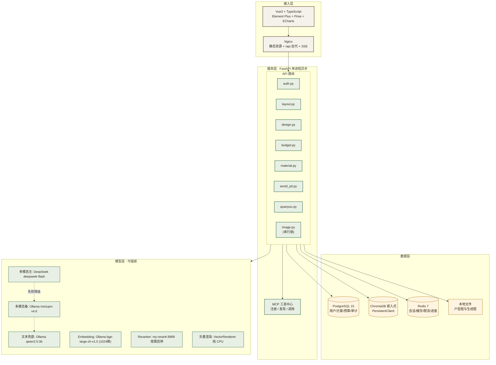
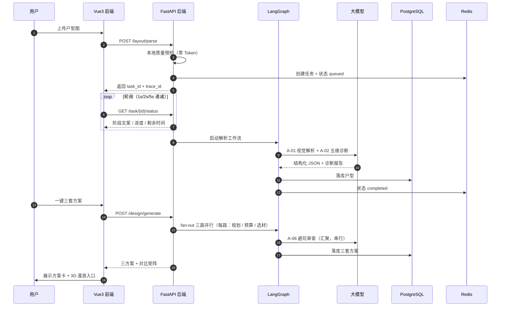
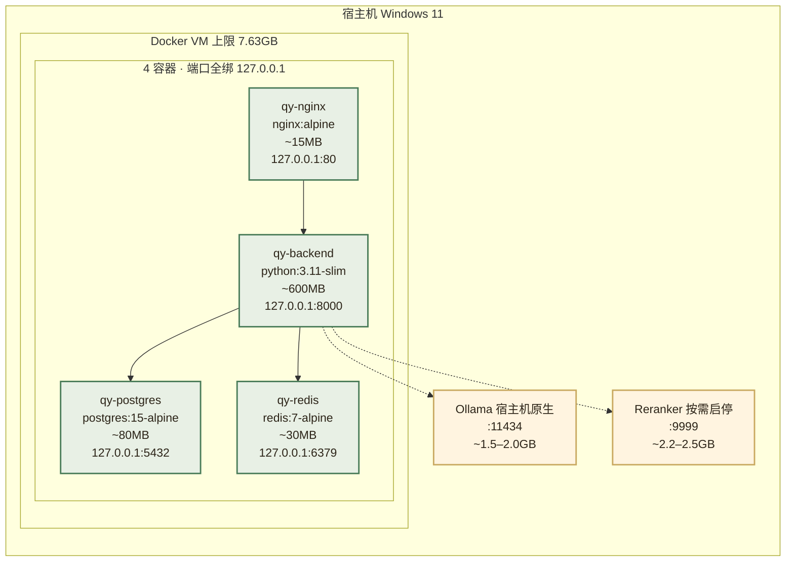
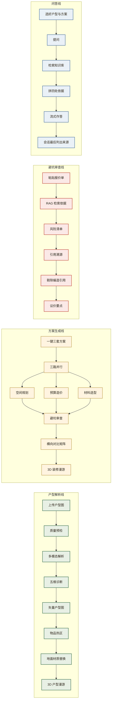
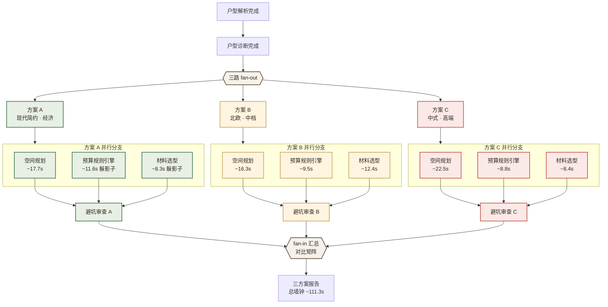
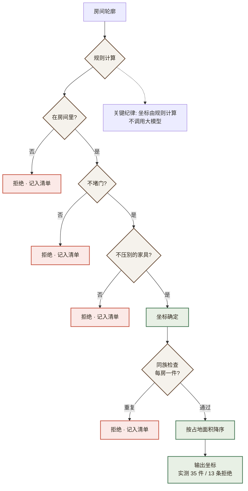
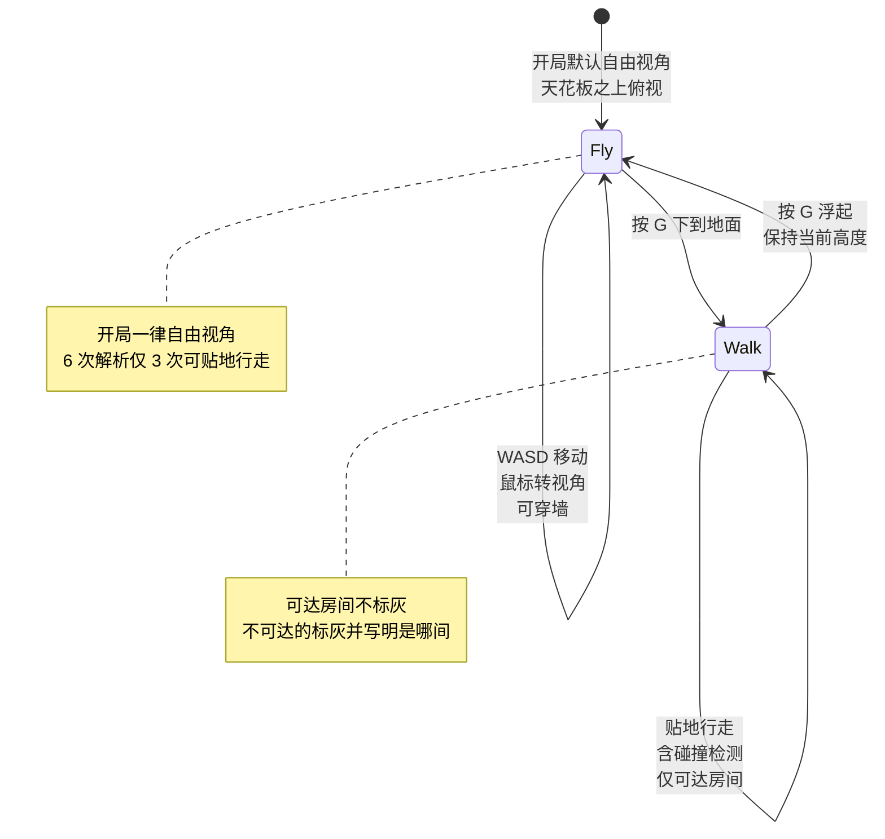
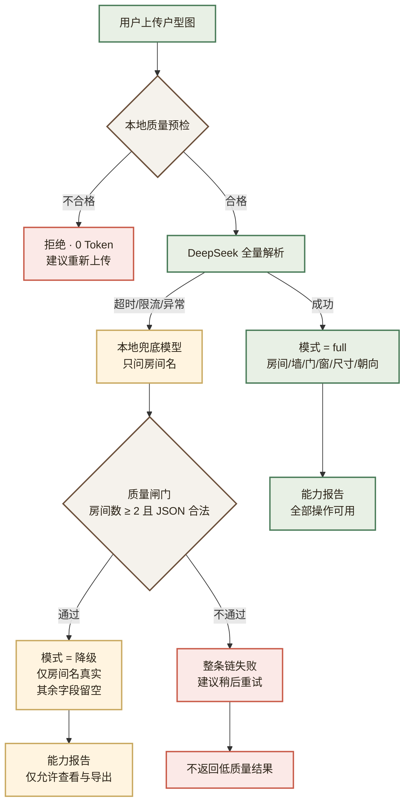

# 全友·智绘家 QuanYou Smart HomeCanvas —— 多模态户型装修推荐系统

| 项目 | 内容 |
| :-- | :-- |
| **项目名称** | 全友·智绘家 QuanYou Smart HomeCanvas |
| **所属企业** | 内江市全友家居 |
| **企业官网** | https://www.quanyou.com.cn/ |
| **文档版本** | **V1.0（演示版）** |
| **更新日期** | 2026-09-26 |
| **文档状态** | 已交付 —— 功能已验收，本文档面向演示与讲解 |
| **技术栈** | Windows 11 + Docker Desktop + Python 3.11 + FastAPI + LangGraph + Vue 3 + TypeScript + LangChain + MCP + PostgreSQL 15 + Redis 7 + ChromaDB（嵌入式）+ Ollama |
| **演示环境** | 全部本地：浏览器 → Nginx → FastAPI → PostgreSQL / Redis / ChromaDB，模型走 DeepSeek 云端（可切换本地） |
| **适用场景** | 全友家居门店设计辅助工具 · AI 应用方向项目演示 |

> **本文档与《需求文档》的关系**：需求文档是完整的技术交付说明书（含接口契约、数据模型、架构决策记录、风险登记册）；
> **本文档是它的演示版**，只保留"看得见、讲得出"的部分 —— 功能是什么、界面长什么样、实测数字是多少、演示时怎么讲。
> 两处数字若有出入，**以本文档为准**（本文档的数字均在 2026-09-26 复测过）。

---

## 阅读约定

**状态标记**：

| 标记 | 含义 |
| :-- | :-- |
| ✅ | **已实现并验证** —— 有代码、有自动化测试或已实测 |
| ◐ | **部分实现** —— 主体可用，已知局限会写明 |
| ○ | **明确不做** —— 并写明为什么不做 |
| ⚠️ | **已知局限** —— 有明确失败可能，已登记在案 |
| ⛔ | **已作废** —— 有决策记录，不算未完成项 |

**全文的一条纪律：凡是数字，都是本机量出来的。** 没量过的会写"未标定"，不给一个看起来合理的估计。

---

## 目录

- [卷首语：一张户型图与两个月的决策焦虑](#卷首语一张户型图与两个月的决策焦虑)
- [一、项目概述](#一项目概述)
  - [1.1 项目背景](#11-项目背景)
  - [1.2 项目定位与目标](#12-项目定位与目标)
  - [1.3 目标用户画像](#13-目标用户画像)
  - [1.4 核心价值主张](#14-核心价值主张)
- [二、需求分析](#二需求分析)
  - [2.1 业务需求清单（PO 级需求）](#21-业务需求清单po-级需求)
  - [2.2 功能性需求详细说明](#22-功能性需求详细说明)
  - [2.3 非功能性需求](#23-非功能性需求)
- [三、系统架构设计](#三系统架构设计)
  - [3.1 整体架构图](#31-整体架构图)
  - [3.2 技术栈选型](#32-技术栈选型)
  - [3.3 数据流设计（三方案生成场景）](#33-数据流设计三方案生成场景)
  - [3.4 部署拓扑](#34-部署拓扑)
- [四、核心功能模块详细设计](#四核心功能模块详细设计)
  - [4.1 功能地图：三条业务线](#41-功能地图三条业务线)
  - [4.2 六个专业 Agent](#42-六个专业-agent)
  - [4.3 三套方案并行生成](#43-三套方案并行生成)
  - [4.4 异步任务与语义化进度](#44-异步任务与语义化进度)
  - [4.5 3D 场景](#45-3d-场景)
  - [4.6 降级与业务连续性](#46-降级与业务连续性)
- [五、API 接口契约](#五api-接口契约)
  - [5.1 统一约定](#51-统一约定)
  - [5.2 主要接口一览](#52-主要接口一览)
  - [5.3 异步任务的三段式](#53-异步任务的三段式)
- [六、部署与运维](#六部署与运维)
  - [6.1 Docker Compose 编排](#61-docker-compose-编排)
  - [6.2 启动与演示](#62-启动与演示)
  - [6.3 演示账号](#63-演示账号)
- [七、非功能性需求](#七非功能性需求)
  - [7.1 性能指标（本机实测）](#71-性能指标本机实测)
  - [7.2 安全与隐私](#72-安全与隐私)
  - [7.3 可扩展性](#73-可扩展性)
- [八、附录](#八附录)
  - [8.1 术语表](#81-术语表)
  - [8.2 参考项目与外部资源](#82-参考项目与外部资源)
  - [8.3 功能实现状态总览](#83-功能实现状态总览)
  - [8.4 与演示讲解的对应关系](#84-与演示讲解的对应关系)

---

## 卷首语：一张户型图与两个月的决策焦虑

2025 年秋，内江市民李先生拿到新房户型图后，面对 89㎡ 的三室两厅陷入了长达两个月的决策焦虑。

他先后咨询了 3 家装修公司，拿到 3 份报价差距高达 12 万元的方案；在社交平台收藏了 200+ 篇装修笔记，
却依然不确定"承重墙能不能拆""预算到底该花在哪里""这份报价单有没有坑"。
最终他凭感觉签了合同，施工过程中遭遇 4 次增项，**总支出超出初始预算 47%**。

这不是个案。中国建筑装饰协会数据显示，2025 年全国家装市场规模突破 5.2 万亿元，
但**超过 68% 的业主在装修后表示"预算超支"或"效果不及预期"**。

把李先生的困境拆开，是七个具体问题，而不是一句笼统的"装修水很深"：

| 痛点维度 | 具体表现 | 影响程度 |
| :--- | :--- | :--- |
| 户型诊断难 | 业主看不懂户型图，无法判断采光、通风、动线、承重墙 | 严重 |
| 方案对比困难 | 不同公司报价差异巨大，方案无法量化对比 | 严重 |
| 预算超支普遍 | 68% 的业主遭遇超支，平均幅度 35%–50% | 严重 |
| 报价审查门槛高 | 增项、漏项、单价异常等风险非专业人士难以识别 | 严重 |
| 材料价格不透明 | 同一材料不同渠道价差可达 2–3 倍 | 中等 |
| 效果图与实物脱节 | 效果图与落地差异大，缺乏可验证的参考 | 中等 |
| 用户表达受限 | 业主不敢说出真实需求与预算预期，被动接受推荐 | 严重 |

> **需求 → 功能的映射**（本文档的设计原则：每一条痛点都必须落到一个能演示的功能上）
>
> | 痛点 | 对应功能 | 状态 |
> | :-- | :-- | :-- |
> | 户型诊断难 | 户型图多模态解析 + 五维诊断报告（2.2.1 / 2.2.2） | ✅ |
> | 方案对比困难 | 三套方案并行生成 + 横向对比矩阵（2.2.3） | ✅ |
> | 预算超支普遍 | 预算造价规则引擎 + 分项报价表（2.2.4） | ✅ |
> | 报价审查门槛高 | 避坑审查 + RAG 引用溯源（2.2.6） | ✅ |
> | 材料价格不透明 | 材料价格查询 + 全友产品对照（2.2.5） | ✅ |
> | 效果图与实物脱节 | 矢量户型图 + 物品热区 + 3D 场景（2.2.7 / 2.2.9） | ✅ |
> | 用户表达受限 | 自由选项组合 + 预算档位自主选择（2.2.3） | ✅ |

**全友家居的回应**是把它做成一个系统：

> **用户上传一张户型图，系统自动完成户型诊断、多套方案生成、预算估算、避坑审查，
> 并渲染出可交互的户型图与可走进去的 3D 场景 —— 鼠标悬停即可查看每件物品的价格与购买链接。**

---

## 一、项目概述

### 1.1 项目背景

#### 1.1.1 行业痛点分析

见卷首语的七类痛点表。这七条里，前四条是**能力问题**（业主确实做不到），
后三条是**信息不对称问题**（业主做得到，但拿不到信息）。两类问题的解法不同，本项目也分别处理。

#### 1.1.2 全友家居的结合点

| 痛点 | 本项目的能力 | 与全友品牌/业务的结合 |
| :--- | :--- | :--- |
| 户型诊断难 | 多模态解析 + 五维诊断 | 「免费量尺、免费设计、免费出图」线上化 |
| 方案对比困难 | 三套方案并行 + 对比矩阵 | 「一站式绿色、健康和个性化」方案选择 |
| 预算超支普遍 | 规则引擎算钱，逐项列明 | 全屋定制价格透明化 |
| 报价审查门槛高 | 避坑审查 + 引用溯源 | 「幸福服务 365」服务品牌的信任延伸 |
| 材料价格不透明 | 材料价格查询 + 全友产品优先 | 「成品 + 定制」全屋设计理念的数字化 |
| 效果图与实物脱节 | 真实几何驱动的矢量图与 3D | 「让用户看到装修后的真实样子」 |

### 1.2 项目定位与目标

**一句话定位：面向全友家居设计师与 C 端业主的多模态智能装修决策辅助平台。**

它不代替设计师做设计，也不代替业主做决定 —— 它做的是**把决策所需的信息摊开**：
这套户型有什么问题、三套方案各是什么、钱花在哪、这份报价里哪里有坑。

**项目目标与达成情况**（全部为本机实测口径）：

| 目标维度 | 目标 | 达成情况 | 说明 |
| :--- | :--- | :--- | :--- |
| **功能** | 解析 + 诊断 + 三方案 + 预算 + 避坑 + 3D | ✅ 达成 | 39 项验收标准：34 项达成、5 项经决策作废、0 项未实现 |
| **解析接口 P95** | < 20s | ❌ **未达标** | 实测 **67.5s**（n=2）。原因是解析链路上有**两次** LLM 调用（视觉解析 + 诊断），"20s"当初只算了第一次。**如实记为不成立，不改目标值** |
| **方案生成 P95** | < 60s | ❌ **未达标** | 实测 **111.3s**。主因是避坑审查是汇聚节点，串行加在总时长上 |
| **API 响应 P95**（排除 LLM） | < 2s | ✅ 远超目标 | 实测 **7ms**（n=66） |
| **矢量图渲染** | < 3s | ✅ 远超目标 | 实测 **0.5ms**（纯 CPU、真实几何） |
| **3D 漫游帧率** | 稳定 60fps | ✅ 达成 | 实测 **59.9–60.0 fps**，p95 帧间隔 16.8ms，无 >20ms 卡顿 |
| **全友产品覆盖率** | ≥ 60% | ◐ 分档位 | 代码兜底，实测 经济档 59.5% / 中档 52.4% / 高端档 66.7% |
| **房间识别准确率** | ≥ 85% | ⚠️ **无法判定** | 没有标注测试集就没有分母。演示图实测正确，但**那是样本不是指标** |
| **演示稳定性** | 全流程本地可跑 | ✅ 达成 | 端到端清单 **23/23**，全量自动化测试 **1191 通过、0 跳过** |

> **前两条是"不达标"，不是"待优化"。** 上线后第一次真实测量就推翻了它们，
> 处理方式是**如实记下"它不成立"** —— 改目标要有依据，否则就是拿测量结果去凑一个好看的数字，
> 那比留着一个不达标的目标更糟。

### 1.3 目标用户画像

| 角色 | 场景 | 系统给他的东西 | 额度 |
| :--- | :--- | :--- | :--- |
| **业主（user）** | 拿到户型图，想知道"这房子怎么样、装修要多少钱、这份报价有没有坑" | 诊断报告、三套方案对比、预算区间、报价单审查 | 解析 5 次/日、生成 3 次/日 |
| **设计师（designer）** | 给客户出方案时需要一个量化的起点 | 全部解析功能 + 方案生成 + 材料清单 + 造价区间 + 数据分析 | 不限量 |
| **管理员（admin）** | 维护知识库语料、查看系统运行状况、管理账号 | 全部功能 + 知识库管理 + 数据分析 + 账号与额度管理 | 不限量 |

三种角色的**功能可见性由后端强制**，不只是前端藏菜单。

### 1.4 核心价值主张

市面上同类工具大多停在"生成一张好看的效果图"。本项目**刻意不走这条路** ——
理由是实测出来的：输入是俯视平面图，让视觉模型生成人眼视角的写实效果图是**任务错配**，
本机 4GB 显存下产出的是灰块或噪声图。所以本项目的交付物是
**「3D 户型渲染图」而不是「装修实景效果图」**，并把这条措辞纪律写进了测试。

差异化落在四件能验证的事上：

1. **多模态户型理解** —— 上传户型图即可获得结构化诊断，无需手动录入尺寸。
2. **多 Agent 并行研判** —— 空间规划、预算造价、材料选型三路并行，避坑审查汇聚串行。
   六个 Agent 分工明确，而不是一个 LLM 串行输出。
3. **可交互热区** —— 鼠标悬停即可查看物品的品目、参考价与购买链接；物品位置由真实几何推导。
4. **RAG 防幻觉** —— 所有避坑结论都要求可溯源到知识库原文；**编造的引用会被代码剔除并单独列出**。

---

## 二、需求分析

### 2.1 业务需求清单（PO 级需求）

| 编号 | 需求名称 | 用户故事 | 验收标准 | 状态 |
| :--- | :--- | :--- | :--- | :-- |
| **PO-01** | **户型图上传与解析** | 作为业主，我希望上传一张户型图就能得到结构化的户型信息。 | 返回房间、墙体、门窗、尺寸、朝向；房间数 ≥ 4 | ✅ |
| **PO-02** | **五维户型诊断** | 作为业主，我希望知道这套户型好不好。 | 采光 / 通风 / 动线 / 面积利用率 / 环保 五维评分与建议 | ✅ |
| **PO-03** | **三套方案并行生成** | 作为业主，我希望看到不同风格的方案并对比。 | 3 套方案同时生成，每套含风格 / 预算 / 材料 / 风险 | ✅ |
| **PO-04** | **预算造价** | 作为业主，我希望知道钱花在哪。 | ≥ 7 个分项 + 总价区间，**由规则引擎计算，非模型生成** | ✅ |
| **PO-05** | **材料选型与价格** | 作为业主，我希望知道材料多少钱、全友有没有。 | 候选由模型指认、价格由目录回填，含竞品对照 | ✅ |
| **PO-06** | **报价单避坑审查** | 作为业主，我希望知道这份报价哪里有坑。 | ≥ 5 类风险，每条结论可溯源到知识库；编造引用被剔除 | ✅ |
| **PO-07** | **矢量户型图与物品热区** | 作为业主，我希望看到装修后大概是什么样、每件东西多少钱。 | 悬停显示品目 / 参考价 / 购买链接，响应 < 200ms | ✅ |
| **PO-08** | **地面材质替换** | 作为业主，我想换一种地面材料看看。 | 点一块地面 → 换材料 → 图上换色 + 该房间造价区间 | ✅ |
| **PO-09** | **3D 户型 / 装修漫游** | 作为业主，我想走进去看看。 | 自由视角俯瞰 + 贴地行走（含碰撞）；选定方案后可走进装修效果 | ✅ |
| **PO-10** | **三角色权限与额度** | 作为管理者，我希望不同角色看到不同功能。 | 菜单与接口双重按角色显隐；普通用户超额度被拒 | ✅ |
| **PO-11** | **知识库管理** | 作为管理员，我希望看到语料现状并入库新资料。 | 文档清单（分页）、语料入库、RAG 链路说明 | ✅ |
| **PO-12** | **数据分析** | 作为管理者，我希望知道系统跑得多快。 | 各阶段 P50/P95、按 Agent 分的耗时与 Token、达标判定 | ✅ |

> **PO-06 的验证方式**：验收标准"识别 ≥ 5 类风险"只要求"识别"，不要求"识别对"。
> 所以项目做了一份**埋了 14 个已知问题 + 答案**的合成报价单，写脚本算召回率 ——
> 判据用关键词而不是语义相似度，**第三方可以自己复核这个数字是怎么来的**。
> 2026-09-26 连跑两次：**8 类风险两次都全部命中，召回 13/14（93%）与 14/14（100%）** ——
> 这条指标跑在真实模型调用上，逐次有波动，所以记的是两次复测而不是一个精确值。

### 2.2 功能性需求详细说明

#### 2.2.1 户型图上传与多模态解析 ✅

**交互**：拖放 PNG / JPG / WebP 图片（≤ 20MB），可选「本地隐私模式」。

**质量预检先行**：在调用任何模型之前先做本地检查（分辨率 / 模糊度 / 长宽比 / 文件大小），
不合格的图**当场拒绝，一次模型都不调** —— Token 消耗为 0。软性告警（如分辨率偏低）放行但会写进结果。

**解析产出**：房间（名称 / 类型 / 面积 / 位置）、墙体、门窗、尺寸标注、户内总面积、入户朝向，
以及逐条的**数据缺口**（哪一项没识别出来，如实列出）。

**降级与质量闸门**：主模型（DeepSeek）失败时走本地兜底模型，但兜底只允许回答**房间名** ——
其余字段一律留空，房间数不足 2 间则整条链失败。**不返回一个看上去完整、实际是编造的户型。**

#### 2.2.2 五维户型诊断 ✅

采光 / 通风 / 动线 / 面积利用率 / 绿色环保五个维度给出评分、说明与置信度。

**贯穿的一条纪律**：数据不足的维度**标「数据不足」，不渲染成 0 分** ——
0 分的意思是"很差"，而"没测到"不是。承重墙判断一律附人工复核提示，不允许系统替用户下结论。

#### 2.2.3 三套方案并行生成 ✅

用户选择风格 × 档位（可自由配对），填写业主需求，设置材料偏好（可排除品类、排除品牌、偏好品牌）。

| 方案 | 风格 | 预算档 | 适用人群 |
| :--- | :--- | :--- | :--- |
| 方案 A | 现代简约 | 经济（¥800–1200/㎡） | 首次置业、预算敏感 |
| 方案 B | 北欧 / 奶油风 | 中档（¥1500–2000/㎡） | 年轻家庭、品质追求 |
| 方案 C | 现代中式 / 侘寂 | 高端（¥2500–3500/㎡） | 改善型需求、品质优先 |

生成是**异步任务**：提交后立即返回任务号，页面按阶段实时显示进度，其间可以切到别的页面，
任务在后台继续。生成完成后给出三张方案卡与一张**横向对比矩阵**（字段级差异，高亮与基准不同的值）。

> **一处刻意的取舍**：方案卡的中间位标注为「产品推荐位」而**不是「系统推荐」** ——
> 系统的推荐要说得出依据，说不出的位置就不该假装有。

#### 2.2.4 预算造价 ✅

每套方案给出一份**分项报价**（≥ 7 项：主材、辅材、人工、水电、家具、软装、管理费等）+ 总价区间。

**所有金额由本地规则引擎按面积 × 单价 × 地区系数计算，模型只负责把算出来的数字组织成人话。**
这不是洁癖：让模型直接算钱，它会产生**看起来合理但算术错误**的数字，
而用户是拿这个数去和装修公司砍价的。数字必须由代码算出来。这也让预算部分的单元测试成为可能。

实测三套方案的产出（折合单价全部落在文档区间内）：

| 方案 | 档位 | 总价区间 | 折合单价 | 全友覆盖 |
| :--- | :--- | :--- | :--- | :--- |
| 现代简约 | 经济 | ¥33,100 – 46,783 | 828–1170 元/㎡ | 100% |
| 北欧 | 中档 | ¥60,155 – 79,488 | 1504–1987 元/㎡ | 100% |
| 中式 | 高端 | ¥101,962 – 139,261 | 2549–3482 元/㎡ | 100% |

#### 2.2.5 材料选型与全友产品覆盖 ✅

材料 Agent 只负责**指认候选**（这个位置适合用什么材料），**价格由后端从材料目录回填** ——
模型不产生任何金额。全友自有产品优先，并给出竞品对照与电商搜索跳转。

**全友覆盖率由代码计算、不达标由代码兜底替换**，随方案上报。分档位实测：
经济档 **59.5%**、中档 **52.4%**、高端档 **66.7%**。

> ⚠️ **一个诚实的说明**：高端档之所以过线，是因为该档有 3 个品类在目录里只有全友商品、没有竞品 ——
> 也就是说，"覆盖率达标"这个结论真正被考验的是经济档与中档。
> **材料价格是演示数据**（全友无公开结构化价格接口），这一点在界面上显著标注、必须原样展示。

#### 2.2.6 报价单避坑审查 ✅

左侧粘贴报价单或合同文本 → 提交 → 右侧给出：

- **风险清单**（按严重度分级，8 类逐类扫一遍：单价异常 / 计价陷阱 / 增项风险 / 漏项 / 模糊计量 / 环保风险 / 合同条款风险 / 营销话术）；
- 每条结论的**知识库出处**（可点开看原文片段）；
- **被剔除的编造引用**（模型引用了不存在的来源，代码会把它删掉并单独列出来）；
- **议价要点**与**数据缺口**（哪些判断因为资料不全而做不了）。

实测（带标注样本，判据可审计，2026-09-26 连跑两次）：**8 类风险两次都全部命中，
召回 13/14（93%）与 14/14（100%）**；两次各有 1 条结论未对应到答案里的埋点 ——
脚本对它只写「可能是合理补充，也可能是误报」，不替人下结论；
两次分别有 2 条 / 4 条风险**没有知识库依据**，被如实标为「常识性提醒」而不是硬凑一个出处。

#### 2.2.7 矢量户型图与物品热区 ✅

后端按**真实几何**重画房间、墙体、门窗，输出 SVG（实测渲染 0.5ms）。
图上每个可交互物品都有热区，悬停显示：品目、参考价区间、购买链接、**精确度等级**。

| 精确度 | 含义 | 界面表现 |
| :--- | :--- | :--- |
| `exact` | 由真实几何推导，位置精确 | 实线区域 |
| `room_level` | 只能定位到房间级 | **虚线区域** + 提示文案「本区域整体参考价」 |

> 用户可以接受近似，**不能接受被骗** —— 所以近似必须长得和精确不一样。

#### 2.2.8 地面材质替换 ✅

点一块地面（或从列表里挑一间房）→ 选一种材料 → 图上那间房换成该材料的代表色，
并给出**该房间的造价区间**。

这条功能与"矢量图"本来就是一套的：矢量图上本来就挂着材料与价格，
换成什么材质直接反映到造价上才有意义。

#### 2.2.9 3D 户型漫游 / 3D 装修漫游 ✅

**3D 户型漫游**（空房）与 **3D 装修漫游**（选定方案后，走进带家具的那套）共用同一份户型几何。

- 墙体、门窗、碰撞、房间连通图全部来自后端接口，**前端不做第二次建模**；
- **开局一律自由视角**：相机在天花板之上俯视，能越过高墙看到整个格局，鼠标转视角、WASD 平移、可穿墙；
- 按 `G` **下到地面贴地行走**（含碰撞检测，只能走过真实连通的门洞）；
- 支持「快速前往房间」；不可达的房间在界面上标灰并写明是哪一间。

**家具**由后端按规则摆放（在房间里 / 不堵门 / 不压别的家具），实测一套三室两厅摆下 **35 件**；
摆不下的会**如实记入拒绝清单并说明原因**，不硬塞。家具按品类上色 —— **同类型同色、不同类型不同色**，
准星对准家具时**在准星右上角**弹出说明卡（品名 / 所在房间 / 长宽高），移开即消失。

> **为什么默认自由视角**：同一张演示图连跑 6 次解析，只有 3 次被判为"可贴地行走"，
> 从出生点的可达率从未超过 56%。**不是本项目的问题，是上游模型漏检门洞** ——
> 与其让演示有一半概率开局就走进一条死路，不如把"俯瞰格局"当默认，把贴地行走当附加能力。

#### 2.2.10 知识库管理 / 数据分析 / 账号与额度 ✅（管理员）

| 页面 | 能力 |
| :--- | :--- |
| **知识库管理** | 文档清单（按来源聚合、分页）、语料入库、RAG 链路说明。入库是**幂等**的：同一份内容再传一次是覆盖而不是追加 |
| **数据分析** | 本次会话任务统计 + 后端跨会话 P50/P95 + 基准区间；按 Agent 分列耗时与 Token |
| **账号管理** | 角色、档位、启停；三条刻意写死的拒绝：不能改自己、不能设管理员、不能停用管理员 |

#### 2.2.11 智友问答 ✅（RAG 对话）

| 项 | 说明 |
| :--- | :--- |
| 定位 | 在「方案生成」与「知识库管理」之间的**对话式问答**：业主拿天然语言问，系统给出**有出处**的回答 |
| 依据（四处） | ① 知识库检索 ② 当前户型的解析结果 ③ 屋主户型详情 ④ 用户选定的那套装修方案 |
| **缺哪处就说缺哪处** | 四处的可用性**逐项判断**，缺的会在提示词里明说"本次没有该资料"，并要求模型不要据此推测。**静默变空段落的话，模型会自由发挥** —— 那正是本项目一路在防的事 |
| **引用清单** | 正文由模型写，**来源清单由代码从检索结果里取**：模型想引用哪条都可以，但"这次到底用了哪几份文档"由检索结果说了算 —— 模型编一个不存在的文件名也进不了清单 |
| 流式输出 | SSE，事件顺序 `meta → delta* → sources → done`；首块实测 **3.7s**（等模型时先显示"正在检索知识库…"），不让用户干等 |
| 会话 | 历史记录可**置顶 / 重命名 / 删除**；携带的上下文（户型 / 屋主详情 / 方案）在顶部明示，用户不用猜它看了什么 |

#### 2.2.12 屋主户型详情 ✅（解析模块的延伸）

| 项 | 说明 |
| :--- | :--- |
| 它补的是什么 | 平面图是二维的 —— **层高、朝向、采光面、通风路径、承重墙、收纳尺寸、设备**这些图上根本没有，而五维诊断全都要用。这正是诊断长期写"数据不足、置信度下调"的原因 |
| 形态 | 一份**文字**资料（打字或读入 .md/.txt），与左边的「上传平面图」是**两个分得清的入口**（标题、图标、说明、按钮上都点明"这是文字，不是图片"） |
| 权威性 | 诊断以它为准；它与平面图冲突时也以它为准（承重墙那条尤其：平面图解析一律是 `unknown`，而**拆改安全不能按"没识别出来"处理**） |
| 重新诊断 | 补完详情后强制重跑（`POST /layout/{id}/diagnose`），**走的是同一条诊断链，没有演示专用旁路** |
| 演示配套 | `演示素材/演示资料/` 里三份与三张演示图**同名配对**的详情，后端按解析出的总面积推荐最接近的一份；样例只填进输入框，**仍要用户点保存**（数据是"屋主提供的"，得由人确认一次） |

**实测（补详情前 → 后）**：01 户型 5.0 分/置信度 0.40/缺口 8 → **6.9 / 0.85 / 3**；
02 户型 5.7 / 0.60 / 7 → **7.3 / 0.90 / 0**；03 户型 7.0 / 0.40 / 8 → **7.5 / 0.86 / 3**。
剩下的是真缺口（没有房间相对坐标，动线只能推断），**没有为了好看抹平**。

### 2.3 非功能性需求

| 类别 | 要求 | 实现 |
| :--- | :--- | :--- |
| 性能 | 见 7.1（本机实测口径） | 长任务一律异步 + 语义化进度 |
| 认证 | JWT 双令牌（access / refresh）+ bcrypt 口令散列 | 已在用 |
| 授权 | 三级角色 + 接口级校验 + 越权归属校验 | 前端藏菜单为辅，**后端拦截为主** |
| 登录防爆破 | 连续失败 5 次锁定 30 分钟 | Redis 原子计数 |
| 上传校验 | 扩展名 + MIME + 大小等多重校验 | 不合格直接拒绝 |
| 隐私 | 默认走云端模型；`本地隐私模式` 开启后**户型图完全不离开本机** | 在提供方选择层强制，不是业务层声明 |
| 审计 | 登录 / 解析 / 生成 / 导出全记录，**含降级标志**，保留 180 天 | 结构化事件，JSON 文件 + 数据库双写 |
| 可扩展 | 模型可插拔、图像生成可插拔、MCP 工具热插拔 | 环境变量切换 |

---

## 三、系统架构设计

### 3.1 整体架构图

四层：接入层 / 服务层 / 数据层 / 模型层。**每一层都可单独替换** ——
换掉模型层不影响数据层，换掉向量库不影响业务路由。



> **图中虚线的含义**：模型层里的虚线是**失败降级链**（主模型不可用 → 本地备模型 → 文本兜底），
> 表达的是"尽力而为、可降级"——降级发生时，界面、API 响应与审计日志**三处同时看得见**。

### 3.2 技术栈选型

| 技术领域 | 选型方案 | 选型依据 |
| :--- | :--- | :--- |
| 后端框架 | **FastAPI + Uvicorn** | 异步高性能，自带 OpenAPI 文档（`/docs` 可视化） |
| Agent 编排 | **LangGraph 1.2.11** | 状态图工作流，原生 fan-out / fan-in |
| RAG 框架 | **LangChain 1.3.17** | 文档加载、检索链、Prompt 模板 |
| 工具协议 | **MCP SDK（Python）** | 标准化工具注册 / 发现 / 调用 |
| 前端框架 | **Vue 3 + TypeScript + Vite 6** | 组合式 API + 全量类型门禁（`vue-tsc --noEmit`） |
| UI / 状态 | **Tailwind CSS 3.4 + Pinia + ECharts** | 设计令牌集中一处；图表用于数据分析页 |
| 3D 渲染 | **Three.js** | 3D 户型与装修漫游 |
| 关系数据库 | **PostgreSQL 15** | 用户 / 方案 / 预算 / 审计 |
| 向量数据库 | **ChromaDB 1.5.9（嵌入式）** | 轻量；进程内 `PersistentClient`，省一个容器 |
| 缓存 | **Redis 7** | 会话 / 语义缓存 / 额度限流 / 任务进度 |
| 多模态模型 | **DeepSeek deepseek-flash（主）→ Ollama minicpm-v4.6（备）** | 云端主模型 + 本地视觉兜底 |
| 文本模型 | **DeepSeek（主）→ Ollama qwen2.5:3b（兜底）** | 可插拔 |
| Embedding | **Ollama bge-large-zh-v1.5（1024 维）** | 本地已就绪，中文语料效果好 |
| Reranker | **bge-reranker-v2-m3（复用本机已部署服务，按需启停）** | 不用时不占内存 |
| 容器编排 | **Docker Compose（4 容器）** | Windows 11 一键启动 |

> **一句话解释"为什么是这套"**：模型层可插拔是为了不被任一家供应商绑住；
> 算钱、算坐标、画图这三件事**一律交给确定性代码**，模型只做它擅长的语言与视觉理解。

### 3.3 数据流设计（三方案生成场景）



### 3.4 部署拓扑

**4 个容器 + 2 个宿主机原生服务。** 全部端口绑回环地址，**不做任何公网暴露**。



| # | 服务 | 内存预算 | 端口（**均绑 127.0.0.1**） |
| :-- | :--- | :--- | :--- |
| 1 | `qy-postgres` | ~80 MB | `127.0.0.1:5432` |
| 2 | `qy-redis` | ~30 MB | `127.0.0.1:6379`（`maxmemory 256mb`） |
| 3 | `qy-backend` | ~600 MB | `127.0.0.1:8000` |
| 4 | `qy-nginx` | ~15 MB | `127.0.0.1:80` |
| | **Docker 小计** | **≈ 725 MB** | |
| 5 | Ollama（宿主机原生） | ~1.5–2.0 GB | `127.0.0.1:11434` |
| 6 | Reranker（宿主机，按需启停） | ~2.2–2.5 GB | `127.0.0.1:9999` |
| | **系统总占用峰值** | **≈ 5.5 GB** | 留出约 2GB 安全垫 |

> ⚠️ **端口一律写 `127.0.0.1:5432:5432`，不用 `0.0.0.0`。** `ports: ["5432:5432"]`
> 是绝大多数教程的写法，而它会把数据库暴露给同一个 WiFi 下的任何设备 ——
> 本项目存的是用户上传的户型图。

---

## 四、核心功能模块详细设计

### 4.1 功能地图：四条业务线



四条线可以独立使用：只做报价单审查不需要户型图；只看材料价格也不需要先解析户型；
**问答线的依据是"有什么用什么"** —— 没上传户型也能聊知识库里的装修问题，
只是回答里会明说这次没有户型资料。

### 4.2 六个专业 Agent

| 编号 | 名称 | 职责 | 关键设计 |
| :-- | :--- | :--- | :--- |
| **A-01** | 户型解析 | 一张户型图 → 结构化 JSON | 质量预检前置（零 Token）+ 能力匹配降级 + 质量闸门 |
| **A-02** | 户型诊断 | 采光 / 通风 / 动线 / 面积利用率 / 环保 五维评分 | **数据不足时标"数据不足"，不渲染成 0 分** |
| **A-03** | 空间规划 | 功能分区 / 动线优化 / 收纳设计 | 幻觉房间由代码剔除 |
| **A-04** | 预算造价 | 分项预算（≥7 项）+ 总价区间 | **规则引擎算钱，模型只管文字** |
| **A-05** | 材料选型 | 主材辅材选型，全友自有产品优先 | 模型只指认候选，**价格由代码回填** |
| **A-06** | 避坑审查 | 站业主立场质疑报价单，引用知识库来源 | 8 类风险**逐类扫一遍**；编造引用被代码剔除 |

### 4.3 三套方案并行生成



> **"躲影子"是什么意思**：A-03 / A-04 / A-05 三路并行，只要不慢过最慢的那个就是"零成本" ——
> 预算（11.6s）与选材（12.4s）完全躲在规划（22.5s）的影子里。
> **但避坑审查躲不掉**：它必须在所有产出之后，那 38.8s 直接加到总时长上。
> 这是依赖关系决定的，不是实现没优化。

### 4.4 异步任务与语义化进度

解析与生成都是长任务，统一为**异步任务 + 轮询**。用户看到的不是「60%」，而是**「正在做什么」**：

| 链路 | 阶段文案 |
| :--- | :--- |
| 解析 | 已接收，正在排队… → 正在检查图片质量… → 正在分析图片… → 正在生成户型诊断… |
| 生成 | 正在生成户型诊断… → 正在生成装修方案… → 正在复核方案风险… → 即将完成… |
| 审查 | 已接收，正在排队… → 正在审查报价单… |

两条刻意的界面决定：

- **进度条不采用时间驱动的插值** —— 一个会自己爬但与实际脱节的进度条，正是本项目最忌讳的
  「看起来合理的错误」。阶段百分比由**阶段耗时占比**推出，两处数字不可能漂移。
- **剩余时间估不出来时显示"暂时估不出"，而不是给一个 0**；实际耗时超出预估时文案会改口，
  **绝不停在 99%**。

### 4.5 3D 场景

3D 漫游由真实几何驱动 —— 墙体、门窗、碰撞、房间连通图全部来自后端接口，
家具坐标也由后端按规则算出，**前端不做第二次建模**。

**家具摆放由规则计算，不调用模型。**



**家具颜色按品类区分**：同一类型同色、不同类型不同色，色板由约束搜索生成
（每个角色对地面 ≥ 2:1 对比度、彼此之间色差可分辨）。手工调参调了七轮是"约束全过、画面一团黑"，
改成约束下的搜索之后才有现在这套配色 —— 六个材质角色的颜色**是算出来的，不是调出来的**。

**两种漫游模式**：



### 4.6 降级与业务连续性

**降级本身不是缺陷，静默降级才是。** 所以降级状态在**三处同时可见**：
API 响应体带 `degraded` 字段 → 审计日志逐条记录 → 界面顶部常驻提示条（**不给关闭按钮、不可折叠**）。



**为什么不许降级结果流入下游**：降级结果的面积是 0，若放进预算计算，
它会返回一个 **¥0 的装修预算** —— 不报错、返回成功、而用户会当真。
所以每一个操作都有明确的**数据前置条件**，缺了就在数据层拦住，
并回一句「缺什么 + 怎么办」，而不是含糊的"操作不允许"。

---

## 五、API 接口契约

### 5.1 统一约定

- 统一前缀 `/api/v1`，统一响应信封 `{code, msg, data}`，`code = 0` 表示成功。
- **业务失败一律 `HTTP 200 + code != 0`。** 用 4xx 表达"数据不支撑该操作"，
  会被前端拦截器当成服务错误弹通用报错，而用户需要看到的是**可操作的提示**。
- **每个请求带 `trace_id`**，贯穿 API → Agent → 模型调用 → 审计日志，并在响应中返回给前端 ——
  用户报障时贴一个 `trace_id` 就能定位整条链路。
- 契约的权威来源是后端 OpenAPI 文档（界面上 `/docs` 可直接看并试调）。

**错误码表**：

| code | 含义 |
| :-- | :--- |
| 0 | 成功 |
| 4001 | 参数不合法（会说明哪个参数、可选范围是什么） |
| 4002 | 当前数据不支撑该操作（会说明缺什么、怎么补） |
| 4003 | 未登录 / 权限不足 |
| 4004 | 任务不存在 |
| 4005 | 需要开通会员 |
| 4006 | 超出额度 |
| 4007 | 账号已停用 |
| 4009 | 任务同名 |
| 5001 | 执行失败 |
| 5002 | 依赖不可用（知识库 / 模型服务等） |

### 5.2 主要接口一览

| 模块 | 方法与路径 | 说明 |
| :--- | :--- | :--- |
| 认证 | `POST /auth/login` · `POST /auth/refresh` · `GET /auth/me` | 登录 / 刷新 / 当前用户 |
| 认证 | `POST /auth/register` | 创建用户（仅管理员） |
| 解析 | `POST /layout/parse` | 提交户型图解析（异步） |
| 解析 | `GET /layout/{id}` · `/layout/{id}/diagnosis` | 户型结构 / 五维诊断 |
| 解析 | `GET /layout/{id}/plan.svg` · `/layout/{id}/hotspots` | 矢量图 / 物品热区（含价格与链接） |
| 解析 | `GET /layout/{id}/floor-materials` · `POST /layout/{id}/floor-substitution` | 地面材质目录 / 换材质 |
| 解析 | `GET /layout/{id}/walkable` · `/layout/{id}/furniture` | 3D 场景几何 / 家具坐标与配色 |
| 方案 | `POST /design/generate` | 三套方案生成（异步） |
| 方案 | `GET /design/plans` · `/design/plans/{id}` · `/design/compare` | 方案列表 / 详情 / 对比矩阵 |
| 任务 | `GET /task/{id}/status` · `POST /task/{id}/cancel` | 状态查询（含阶段与剩余时间）/ 中断 |
| 预算 | `POST /budget/estimate` | 单方案预算估算（纯规则引擎） |
| 材料 | `GET /material/price` | 材料价格查询（全友优先 + 竞品对照） |
| 审查 | `POST /avoid-pit/review` | 报价单 / 合同审查（RAG 溯源） |
| 屋主详情 | `GET/POST /layout/{id}/house-detail` · `GET …/sample` | 读 / 写屋主提供的户型详情；按面积推荐演示样例 |
| 屋主详情 | `GET /layout/{id}/diagnosis` · `POST /layout/{id}/diagnose` | 取诊断 / **补完详情后强制重跑** |
| 问答 | `GET/POST /chat/conversations` · `PATCH/DELETE /chat/conversations/{id}` | 会话列表 / 新建 / 置顶改名 / 删除 |
| 问答 | `GET /chat/conversations/{id}/messages` · `POST /chat/ask` | 历史消息 / **提问（SSE 流式：`meta → delta* → sources → done`）** |
| 知识库 | `GET /knowledge/list` · `POST /knowledge/upload` | 文档清单 / 语料入库（仅管理员） |
| 系统 | `GET /system/health` · `GET /system/metrics` | 依赖健康状态 / 性能与 Token 指标 |
| 用户 | `GET /users` · `POST /users/{id}` | 用户列表 / 改角色档位启停（仅管理员） |

### 5.3 异步任务的三段式

长任务（解析、生成）统一走同一套节奏，前端也因此可以复用同一套进度组件：

1. **提交**：`POST` 返回 `task_id` 与 `trace_id`，立即返回，不阻塞；
2. **轮询**：`GET /task/{id}/status`，返回阶段文案、进度、已用时间与剩余时间；
   前端轮询节奏是**递减的**（前 10 秒每秒一次 → 10 秒后每 2 秒 → 60 秒后每 5 秒），
   放弃时刻由后端自己的估算决定（估时 × 2），而不是写死一个 120 秒；
3. **取结果**：任务完成后从对应模块接口取真实产物（方案、诊断、热区…），
   结果在缓存中保留 1 小时，刷新页面可重新取回。

**中断**：用户可以在任务进行中取消，确认框会**提前写明额度不退**（额度在任务开始时就已计入今日用量）。

---

## 六、部署与运维

### 6.1 Docker Compose 编排

4 个容器（PostgreSQL / Redis / 后端 / Nginx），全部 `service_healthy` 依赖启动，端口全绑 `127.0.0.1`。

后端还提供一个**面向界面的依赖自检**（`GET /system/health`），工作台与侧栏顶部直接读它。
实测返回（2026-09-26 本机）：

```json
{"code": 0, "msg": "ok", "data": {"status": "ok", "checks": {
  "deepseek":         {"ok": true, "detail": "已配置"},
  "redis":            {"ok": true, "detail": "可用"},
  "knowledge":        {"ok": true, "detail": "419 条 chunk"},
  "material_catalog": {"ok": true, "detail": "28 个商品"}},
  "running_tasks": [], "version": "dev"}}
```

> 依赖不可用时这里会变 `degraded`，界面上显示为「部分依赖降级」并提供入口查看明细 ——
> 而不是等用户点了功能才发现用不了。

**为什么是 4 个而不是 6 个**：Docker VM 上限 7.63GB，原设计的 6 服务（多一个 ChromaDB 容器与一个前端
node 容器）会把内存吃满。ChromaDB 改为进程内嵌入式，前端构建产物直接由 Nginx 托管 —— 省下约 200MB
与一次 HTTP 往返，且不改变任何功能。

### 6.2 启动与演示

```bash
# 1. 启动 4 个容器
docker compose up -d

# 2. 确认全部 healthy
docker compose ps

# 3. 打开浏览器（nginx 托管前端 + 反代 /api）
#    http://127.0.0.1/login
```

**演示前自检**：

```bash
python scripts/e2e_smoke.py        # 端到端 23 条对真实产物的断言
python -m pytest                   # 全量自动化测试（约 2 分钟，全程不联网）
```

> 测试有一条硬约束：**禁止测试打真实 API**，必须能在断网环境下全绿 ——
> 所以"演示翻车"的风险不会来自测试脚本本身。

### 6.3 演示账号

共 4 个演示账号、3 种角色 —— 账号与口令在登录页明文列出，**点击即填入表单**：

| 账号 | 口令 | 角色 | 会员档 | 能看到什么 |
| :--- | :--- | :--- | :--- | :--- |
| `admin` | `admin123` | 管理员 | 已开通 | 全部功能 + 知识库管理 + 数据分析 + 账号管理 |
| `designer` | `designer123` | 设计师 | 已开通 | 解析 + 方案生成 + 数据分析（**无账号管理**） |
| `vip` | `vip123` | 普通用户 | 已开通 | 解析 + 方案查看 + 预算 + 避坑审查；**有每日额度** |
| `demo` | `demo123` | 普通用户 | 未开通 | 同上，且生成 / 审查入口**置灰并写明原因与开通路径** |

**切换账号登录，菜单与可用操作确实不同** —— 权限是按角色真的判过的
（前端藏菜单为辅，后端拦截为主）。
演示时值得走一遍 `designer` → `demo`：同一个页面，菜单少了几项，多出来的那条也点不动。

---

## 七、非功能性需求

### 7.1 性能指标（本机实测）

| 指标 | 目标 | 实测 | 结论 |
| :--- | :--- | :--- | :--- |
| 户型解析接口 P95 | < 20s | **67.5s**（n=2） | ❌ 未达标（合理解释见 1.2） |
| 方案生成（三套并行） | < 60s | **111.3s** | ❌ 未达标（避坑审查串行是主因） |
| API 响应 P95（排除 LLM） | < 2s | **7ms**（n=66） | ✅ |
| 矢量图渲染 | < 3s | **0.5ms** | ✅ |
| 热区悬停响应 | < 200ms | 纯前端查表 | ✅ |
| 3D 漫游帧率 | 稳定 60fps | **59.9–60.0 fps**，p95 帧间隔 16.8ms | ✅ |
| 单次分析成本 | 埋点实测 | `/system/metrics` 可查（含预估 vs 实际偏差） | ✅ |
| 房间识别召回 | ≥ 85% | **无法判定**（无标注测试集） | ⚠️ |

> **前两条为什么不改目标**：改目标要有依据 —— 分阶段计时说明时间花在哪、有没有可压的余量。
> 否则就是拿测量结果去凑一个好看的数字，那比留着一个不达标的目标更糟。
> 解析那一条的根因是清楚的：链路上有**两次**模型调用，而目标当初只估了一次。

**端到端一次真实产出**（三室两厅演示图，逐条断言真实产物）：

| 阶段 | 耗时 | 产出 |
| :--- | :--- | :--- |
| A-01 解析 | ~16s | 3 房间 / 2 窗 / 3 门 |
| A-02 诊断 | ~18s | 五维评分，部分维度标「数据不足」 |
| A-03 规划 | 22.5s | 3 套方案（并行） |
| A-04 预算 | 11.6s | 3 份预算（规则引擎，**躲在规划影子里**） |
| A-05 选材 | 12.4s | 3 份选材（代码回填价格，**躲在规划影子里**） |
| A-06 避坑 | 38.8s | 1 次审查 × 3 套方案（**汇聚，串行**） |
| **总墙钟** | **111.3s** | 对比表 3/3 可用 |

### 7.2 安全与隐私

| 项 | 做法 |
| :--- | :--- |
| 端口暴露 | 全部容器端口绑 `127.0.0.1`，**不做任何公网暴露**（无内网穿透、无公网入口） |
| 跨域 | CORS 白名单，不用 `allow_origins=["*"]` |
| 认证授权 | JWT 双令牌 + 三级角色 + 接口级校验 + 越权归属校验 |
| 登录防爆破 | 连续失败 5 次锁定 30 分钟（Redis 原子计数） |
| 上传校验 | 扩展名 + MIME + 大小多重校验 |
| XSS | 用户内容高亮**不拼接 HTML**，由纯函数切分后以组件渲染 |
| 隐私 | 默认模式户型图发送至云端模型服务商用于当次解析、不落盘第三方；**开启「本地隐私模式」后完全不离开本机**（运行时抓包验证过） |
| 审计 | 登录 / 解析 / 生成 / 导出全记录，含 `degraded` 标志，保留 180 天 |

### 7.3 可扩展性

- **模型可插拔**：环境变量切换云端 / 本地模型，业务代码不变；
- **图像渲染可插拔**：矢量渲染与 AI 出图是两套实现，接口在抽象层冻结；
- **MCP 工具热插拔**：新工具封装成 MCP Server 即可接入，无需改 Agent 代码；
- **数据源可扩展**：新增材料数据源只需实现适配器并注册。

---

## 八、附录

### 8.1 术语表

| 术语 | 说明 |
| :--- | :--- |
| **Agent（智能体）** | 一个具备明确职责与提示词的专业化模型调用单元。本项目有 6 个，编号 A-01–A-06 |
| **fan-out / fan-in** | 并行展开 / 汇总。三套方案同时生成就是 fan-out，对比矩阵是 fan-in |
| **热区（hotspot）** | 户型图上可悬停的物品区域，悬停显示品目、价格与购买链接 |
| **精确度等级** | 热区位置的可信程度：`exact`（几何精确）/ `room_level`（房间级近似） |
| **降级（degraded）** | 主模型不可用时改用备模型或本地兜底。**降级必须显式可见，绝不静默** |
| **能力守卫** | 判断"当前这份数据能支撑哪些操作"的代码层，缺数据就在数据层拦住 |
| **RAG** | 检索增强生成：先检索知识库原文，再让模型基于原文作答 |
| **编造引用（invented citation）** | 模型给出的、在检索结果里并不存在的来源。会被代码剔除并单独列出 |
| **规则引擎** | 用确定性代码算钱 / 算坐标的模块。**本项目所有金额都由它计算，模型不产生数字** |
| **自由视角 / 贴地行走** | 3D 漫游的两种模式：前者在天花板之上俯瞰、可穿墙；后者贴地走、有碰撞 |
| **横向对比矩阵** | 三套方案的字段级差异表，高亮与基准不同的值 |

### 8.2 参考项目与外部资源

| 资源 | 用途 | 链接 |
| :--- | :--- | :--- |
| **zhuangxiu-skills** | 避坑审查 / 报价审核 / 预算的知识库来源（38 个装修类技能文档） | https://github.com/zx029w/zhuangxiu-skills |
| **ResPlan** | 户型矢量图数据集（演示户型库的形态参考） | https://github.com/m-agour/ResPlan |
| buildwatch-mcp | 材料价格工具接口设计参考 | https://github.com/jeletor/buildwatch-mcp |
| house-type-decoration3D | 图像生成接口设计参考（本机显存跑不通，仅参考思路） | https://github.com/heyangyi888-hyy/house-type-decoration3D |

> 参考项目一律**只读不 clone**（实测 clone 大仓库很慢），需要借鉴的设计思路手抄进文档。
> 凡列入依据的来源都逐条核实过，**没有核实过的不得列为依据**。

### 8.3 功能实现状态总览

| 业务线 | 功能 | 状态 | 备注 |
| :-- | :-- | :-- | :-- |
| 解析 | 户型图上传与质量预检 | ✅ | 不合格图零 Token 拒绝 |
| 解析 | 多模态户型解析 | ✅ | 含降级与质量闸门 |
| 解析 | 五维户型诊断 | ✅ | 数据不足如实标注 |
| 解析 | 矢量户型图 | ✅ | 真实几何，0.5ms |
| 解析 | 物品热区与价格 | ✅ | 悬停显示，标精确度 |
| 解析 | 地面材质替换 | ✅ | 换材质 + 该房间造价区间 |
| 解析 | 3D 户型漫游 | ✅ | 自由视角 + 贴地行走（含碰撞）；平面图上画着的门**必须画出门扇并在墙上开洞**（挂墙容差按解析噪声量级取）；通到户外的门能认出来就画、认不出就如实说 |
| 解析 | **屋主户型详情与重诊断** | ✅ | 补一份文字资料，诊断置信度 0.40 → 0.85 量级 |
| 问答 | **智友问答（RAG 对话）** | ✅ | 流式；依据四处逐项判断；**来源清单由代码取** |
| 方案 | 三套方案并行生成 | ✅ | 风格 × 档位自由配对 |
| 方案 | 预算造价（规则引擎） | ✅ | ≥7 分项，模型不产生金额 |
| 方案 | 材料选型与全友覆盖 | ✅ | 覆盖率代码兜底 |
| 方案 | 横向对比矩阵 | ✅ | 字段级差异高亮 |
| 方案 | 3D 装修漫游 | ✅ | 含家具，按规则摆放 |
| 审查 | 报价单避坑审查 | ✅ | 8 类全中 / 召回 93%–100%（两次复测） |
| 审查 | 引用溯源与剔除编造 | ✅ | 编造引用单独列出 |
| 系统 | 三角色登录与权限 | ✅ | 菜单 + 接口双重 |
| 系统 | 额度限流 | ✅ | 付费 ≠ 无限 |
| 系统 | 降级容错 | ✅ | API / 审计 / 界面三处可见 |
| 系统 | 语义化进度与中断 | ✅ | 不用时间插值；中断前写明额度不退 |
| 系统 | 全链路 trace_id | ✅ | 四层贯通 |
| 系统 | MCP 工具服务 | ✅ | 三个 Server，真实 stdio 验证 |
| 管理 | 知识库管理 | ✅ | 文档清单分页 + 语料入库 |
| 管理 | 数据分析 | ✅ | P50/P95 + 达标判定 + Token |
| 管理 | 账号与额度管理 | ✅ | 三条刻意写死的拒绝 |
| — | 视频生成 / 公网暴露 / 真实 CRM 对接 | ○ | 明确不做，理由见需求文档 |

**验收结论**：验收标准 **0 项未实现**（作废的几条都有决策记录，记在需求文档 §14）；
端到端清单 **2026-09-26 实测 22/22**；全量自动化测试 **1191 通过、0 跳过**。
**初步验收之后**又补了两个模块（智友问答、屋主户型详情），并做了一轮界面文案清理
（工程类提示文字全量清除，浏览器实测三页对词表 0 命中）—— 详见需求文档卷三。

**已知局限**（如实列出）：

| 项 | 现象 | 影响 |
| :--- | :--- | :--- |
| 解析与生成的耗时超出最初目标 | 解析 ~33–68s、生成 ~111s | 演示需留出等待时间；进度条与可切换页面缓解体感 |
| 3D 有约一半概率判为"不可贴地行走" | 上游模型会漏检门洞 | 已由"自由视角当默认"化解；不可达房间标灰并写明 |
| 房间识别准确率无指标 | 没有标注测试集 | 无法回答"识别得准不准"，只能说"演示图正确" |
| 3D 家具是体块，无模型贴图 | 无现成的中式家具模型库 | 观感靠配色与比例，不靠贴图 |
| **个别户型识别不到「通到户外的门」** | 有的图面上就没画入户门（演示图 03 就是） | 认不出时**如实说明**"围墙整圈闭合"，**不凭空补一扇门**；能认出来的户型会在 3D 里画出并开洞 |
| 门中心自带 0.5–1.2m 位置噪声 | 门用开启弧估，比窗飘 | 挂墙容差按解析噪声量级取（曾有离墙 1.11m 的门被 1.0m 门槛整扇丢掉） |
| 全友产品价格是演示数据 | 无公开结构化价格接口 | 界面上显著标注，**必须原样展示** |
| 前端没有测试框架 | 无 vitest | 相关护栏落在后端契约测试与 3D 数值探针上，是一处名实不符 |

### 8.4 与演示讲解的对应关系

本表用于**演示时按页面快速定位**，与讲解稿配套使用。

| 演示板块 | 对应章节 | 讲解重点 |
| :-- | :-- | :-- |
| **登录页** | 1.3 / 6.3 | 三个角色四个账号，点一下即登录；**菜单与权限真的不同** |
| **工作台** | 1.2 | 累计统计来自真实数据；依赖状态条是实时的 |
| **上传解析** | 2.2.1 | **质量预检在调用模型之前**：不合格的图一次模型都不调 |
| **识别总览 / 诊断** | 2.2.1 / 2.2.2 | 数据缺口逐条列出；**"数据不足"不渲染成 0 分** |
| **户型矢量图** | 2.2.7 | 真实几何重画；**悬停热区看价格**；近似区域用虚线区分 |
| **地面材质替换** | 2.2.8 | 点一块地面 → 换材料 → 换色 + 该房间造价区间 |
| **3D 户型漫游** | 2.2.9 / 4.5 | 开局俯瞰格局 → 按 G 下到地面走；准星对准家具弹出说明 |
| **生成方案** | 2.2.3 / 4.3 | 提交后可以切页面，任务在后台跑；进度是**阶段**不是百分比 |
| **三方案对比** | 2.2.4 / 4.3 | **预算由规则引擎算，模型不产生金额**；对比矩阵高亮差异 |
| **3D 装修漫游** | 2.2.9 | 走进选定的那套方案；家具按规则摆放，摆不下的如实说明 |
| **报价单审查** | 2.2.6 | **贴一份报价单，看 8 类风险与每条的知识库出处**；编造引用被剔除 |
| **材料价格查询** | 2.2.5 | 全友优先 + 竞品对照；顶部有演示数据声明 |
| **知识库管理**（管理员） | 2.2.10 | 文档清单分页；入库是幂等的（同一份内容再传是覆盖） |
| **数据分析**（管理员/设计师） | 2.2.10 / 7.1 | 分阶段 P50/P95 与达标判定；**两个目标未达标如实显示** |
| **个人中心** | 1.3 | 额度按自然日计算；会员门控是"入口在、置灰、写明原因" |

**演示的关键数字**（本机实测口径）：

| 数字 | 含义 |
| :-- | :-- |
| **39 / 34 / 5 / 0** | 验收标准总数 / 达成 / 经决策作废 / 未实现 |
| **23/23 · 1191** | 端到端清单 / 全量自动化测试通过数（测试数已按验收后的复跑刷新） |
| **8 类 / 93%–100%** | 避坑审查命中的风险类型数 / 召回率（带标注样本，两次复测 13/14 与 14/14） |
| **111.3s / 38.8s** | 三套方案端到端墙钟 / 其中避坑审查串行占用的时间 |
| **0.5ms · 7ms · 60fps** | 矢量图渲染 / API 响应 P95（排除 LLM）/ 3D 帧率 |
| **35 / 13** | 一套三室两厅的家具件数 / 如实记入的拒绝条数 |
| **4 · 725MB · 5.5GB** | 容器数 / Docker 内小计 / 系统总占用峰值（VM 上限 7.63GB） |
| **3.22GB** | 本机可用显存（4.00GB 总量 − 0.78GB 桌面占用） |
| **4 / 3 / 19 / 18** | 演示账号数 / 角色数 / 前端路由数 / 页面数 |
| **419** | 知识库向量条数（chunk） |

---

**文档结束**

*智绘家，把装修决策所需的每一条信息摊开在你面前。*
